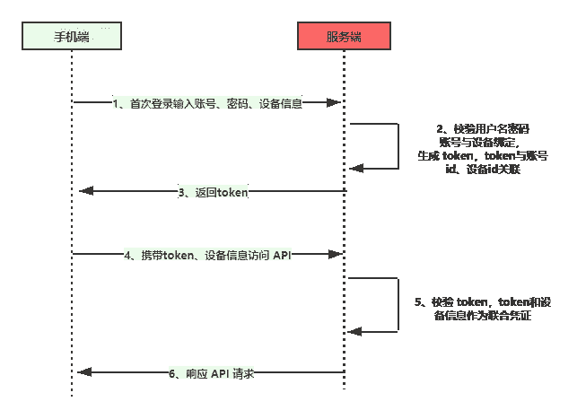
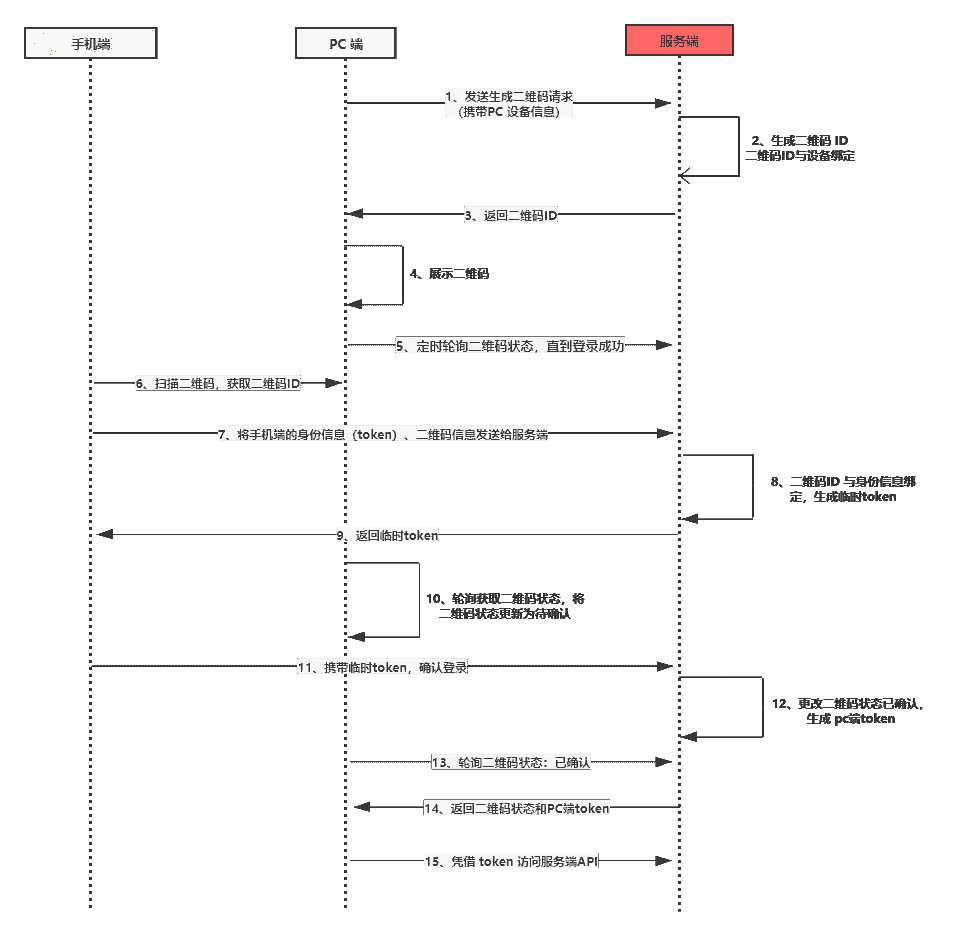
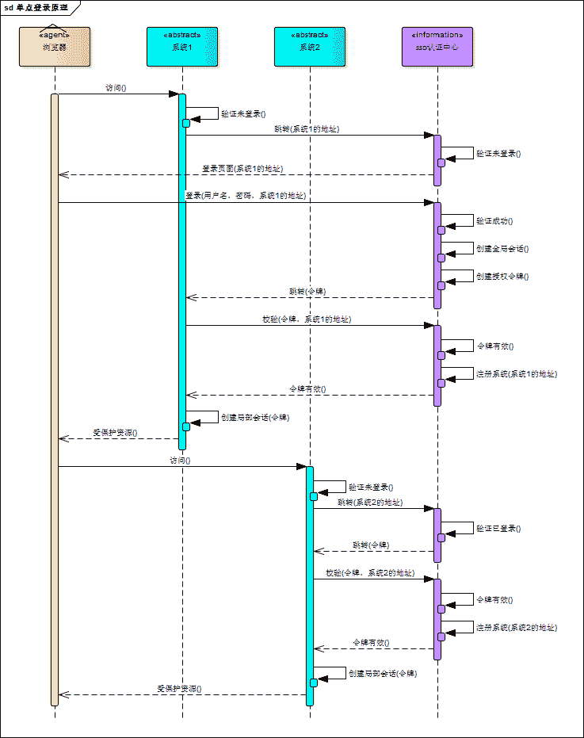
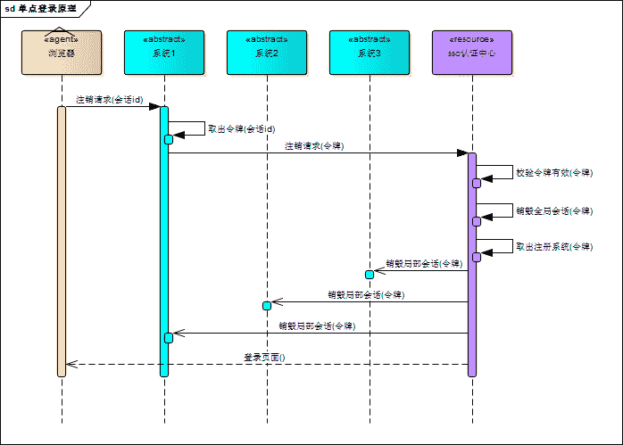
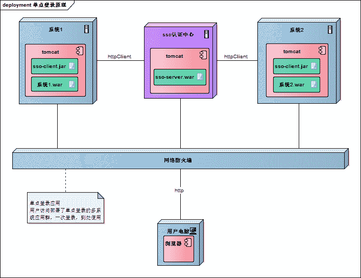

# 第九章 第 2 节 Java-场景应用-2

> 原文：[`www.nowcoder.com/tutorial/10070/bbc3a94312374d8bac30ded983b46835`](https://www.nowcoder.com/tutorial/10070/bbc3a94312374d8bac30ded983b46835)

#### 1.3 扫码登录流程

**参考答案**

什么是二维码？

> 二维码又称二维条码，常见的二维码为 QR Code，QR 全称 Quick Response，是一个近几年来移动设备上超流行的一种编码方式，它比传统的 Bar Code 条形码能存更多的信息，也能表示更多的数据类型。-- 百度百科

在商品上，一般都会有条形码，条形码也称为一维码，条形码只能表示一串数字。二维码要比条形码丰富很多，可以存储数字、字符串、图片、文件等，比如我们可以把 `www.nowcoder.com` 存储在二维码中，扫码二维码我们就可以获取到牛客网的地址。

移动端基于 token 的认证机制

在了解扫码登录原理之前，有必要先了解移动端基于 token 的认证机制，对理解扫码登录原理还是非常有帮助的。基于 token 的认证机制跟我们常用的账号密码认证方式有较大的不同，安全系数比账号密码要高，如果每次验证都传入账号密码，那么被劫持的概率就变大了。

基于 token 的认证机制流程图，如下图所示：

基于 token 的认证机制，只有在第一次使用需要输入账号密码，后续使用将不在输入账号密码。其实在登陆的时候不仅传入账号、密码，还传入了手机的设备信息。在服务端验证账号、密码正确后，服务端会做两件事。

1.  将账号与设备关联起来，在某种意义上，设备信息就代表着账号。
2.  生成一个 token 令牌，并且在 token 与账号、设备关联，类似于 key/value，token 作为 key ，账号、设备信息作为 value，持久化在磁盘上。

将 token 返回给移动端，移动端将 token 存入在本地，往后移动端都通过 token 访问服务端 API ，当然除了 token 之外，还需要携带设备信息，因为 token 可能会被劫持。带上设备信息之后，就算 token 被劫持也没有关系，因为设备信息是唯一的。

这就是基于 token 的认证机制，将账号密码换成了 token、设备信息，从而提高了安全系数，可别小看这个 token ，token 是身份凭证，在扫码登录的时候也会用到。

二维码扫码登录的原理

好了，知道了移动端基于 token 的认证机制后，接下来就进入我们的主题：二维码扫码登陆的原理。先上二维码扫码登录的流程图：

扫码登录可以分为三个阶段：待扫描、已扫描待确认、已确认。我们就来看看这三个阶段。

1.  带扫描阶段

    待扫描阶段也就是流程图中 1~5 阶段，即生成二维码阶段，这个阶段跟移动端没有关系，是 PC 端跟服务端的交互过程。

    首先 PC 端携带设备信息想服务端发起生成二维码请求，服务端会生成唯一的二维码 ID，你可以理解为 UUID，并且将 二维码 ID 跟 PC 设备信息关联起来，这跟移动端登录有点相似。

    PC 端接受到二维码 ID 之后，将二维码 ID 以二维码的形式展示，等待移动端扫码。此时在 PC 端会启动一个定时器，轮询查询二维码的状态。如果移动端未扫描的话，那么一段时间后二维码将会失效。

2.  已扫码待确认阶段

    流程图中第 6 ~ 10 阶段，我们在 PC 端登录微信时，手机扫码后，PC 端的二维码会变成已扫码，请在手机端确认。这个阶段是移动端跟服务端交互的过程。

    首先移动端扫描二维码，获取二维码 ID，然后将手机端登录的信息凭证（token）和 二维码 ID 作为参数发送给服务端，此时的手机一定是登录的，不存在没登录的情况。

    服务端接受请求后，会将 token 与二维码 ID 关联，为什么需要关联呢？你想想，我们使用微信时，移动端退出， PC 端是不是也需要退出，这个关联就有点把子作用了。然后会生成一个一次性 token，这个 token 会返回给移动端，一次性 token 用作确认时候的凭证。

然后 PC 端的定时器，会轮询到二维码的状态已经发生变化，会将 PC 端的二维码更新为已扫描，请确认。

3.  已确认

    流程图中的 第 11 ~ 15 步骤，这是扫码登录的最后阶段，移动端携带上一步骤中获取的临时 token ，确认登录，服务端校对完成后，会更新二维码状态，并且给 PC 端生成一个正式的 token ，后续 PC 端就是持有这个 token 访问服务端。

    PC 端的定时器，轮询到了二维码状态为登录状态，并且会获取到了生成的 token ，完成登录，后续访问都基于 token 完成。

    在服务器端会跟手机端一样，维护着 token 跟二维码、PC 设备信息、账号等信息。

#### 1.4 如何实现单点登录？

**参考答案**

单点登录全称 Single Sign On（以下简称 SSO），是指在多系统应用群中登录一个系统，便可在其他所有系统中得到授权而无需再次登录，包括单点登录与单点注销两部分。

登录

相比于单系统登录，sso 需要一个独立的认证中心，只有认证中心能接受用户的用户名密码等安全信息，其他系统不提供登录入口，只接受认证中心的间接授权。间接授权通过令牌实现，sso 认证中心验证用户的用户名密码没问题，创建授权令牌，在接下来的跳转过程中，授权令牌作为参数发送给各个子系统，子系统拿到令牌，即得到了授权，可以借此创建局部会话，局部会话登录方式与单系统的登录方式相同。这个过程，也就是单点登录的原理，用下图说明：

下面对上图简要描述：

1.  用户访问系统 1 的受保护资源，系统 1 发现用户未登录，跳转至 sso 认证中心，并将自己的地址作为参数；
2.  sso 认证中心发现用户未登录，将用户引导至登录页面；
3.  用户输入用户名密码提交登录申请；
4.  sso 认证中心校验用户信息，创建用户与 sso 认证中心之间的会话，称为全局会话，同时创建授权令牌；
5.  sso 认证中心带着令牌跳转会最初的请求地址（系统 1）；
6.  系统 1 拿到令牌，去 sso 认证中心校验令牌是否有效；
7.  sso 认证中心校验令牌，返回有效，注册系统 1；
8.  系统 1 使用该令牌创建与用户的会话，称为局部会话，返回受保护资源；
9.  用户访问系统 2 的受保护资源；
10.  系统 2 发现用户未登录，跳转至 sso 认证中心，并将自己的地址作为参数；
11.  sso 认证中心发现用户已登录，跳转回系统 2 的地址，并附上令牌；
12.  系统 2 拿到令牌，去 sso 认证中心校验令牌是否有效；
13.  sso 认证中心校验令牌，返回有效，注册系统 2；
14.  系统 2 使用该令牌创建与用户的局部会话，返回受保护资源。

用户登录成功之后，会与 sso 认证中心及各个子系统建立会话，用户与 sso 认证中心建立的会话称为全局会话，用户与各个子系统建立的会话称为局部会话，局部会话建立之后，用户访问子系统受保护资源将不再通过 sso 认证中心，全局会话与局部会话有如下约束关系：

*   局部会话存在，全局会话一定存在；
*   全局会话存在，局部会话不一定存在；
*   全局会话销毁，局部会话必须销毁。

注销

单点登录自然也要单点注销，在一个子系统中注销，所有子系统的会话都将被销毁，用下面的图来说明：

sso 认证中心一直监听全局会话的状态，一旦全局会话销毁，监听器将通知所有注册系统执行注销操作。下面对上图简要说明：

1.  用户向系统 1 发起注销请求；
2.  系统 1 根据用户与系统 1 建立的会话 id 拿到令牌，向 sso 认证中心发起注销请求；
3.  sso 认证中心校验令牌有效，销毁全局会话，同时取出所有用此令牌注册的系统地址；
4.  sso 认证中心向所有注册系统发起注销请求；
5.  各注册系统接收 sso 认证中心的注销请求，销毁局部会话；
6.  sso 认证中心引导用户至登录页面。

部署

单点登录涉及 sso 认证中心与众子系统，子系统与 sso 认证中心需要通信以交换令牌、校验令牌及发起注销请求，因而子系统必须集成 sso 的客户端，sso 认证中心则是 sso 服务端，整个单点登录过程实质是 sso 客户端与服务端通信的过程，用下图描述：

sso 认证中心与 sso 客户端通信方式有多种，这里以简单好用的 httpClient 为例，web service、rpc、restful api 都可以。