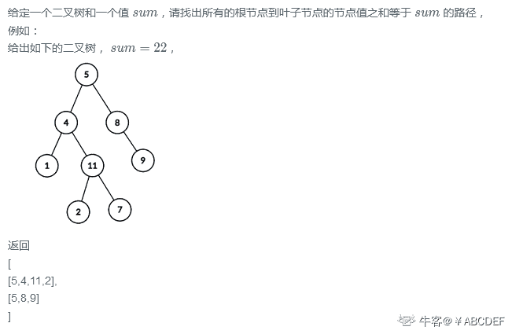
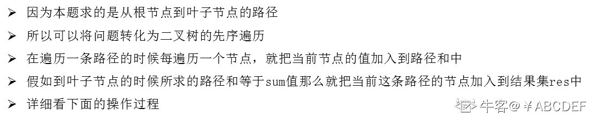
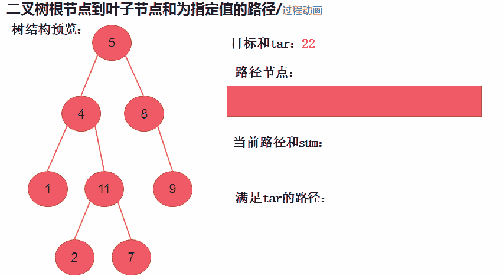

# 第十章 第 2 节 NC8:二叉树根节点到叶子节点和为指定值的路径

> 原文：[`www.nowcoder.com/tutorial/10070/f40677545e354e8fafc43c224bf1e61e`](https://www.nowcoder.com/tutorial/10070/f40677545e354e8fafc43c224bf1e61e)

### NC8:二叉树根节点到叶子节点和为指定值的路径

**- 题目描述：**


**- 题目链接：**
[`www.nowcoder.com/practice/840dd2dc4fbd4b2199cd48f2dadf930a?tpId=188&&tqId=36537&rp=1&ru=/activity/oj&qru=/ta/job-code-high-week/question-ranking`](https://www.nowcoder.com/practice/840dd2dc4fbd4b2199cd48f2dadf930a?tpId=188&&tqId=36537&rp=1&ru=/activity/oj&qru=/ta/job-code-high-week/question-ranking)

**- 设计思想：**

详细操作流程看下图:


**- 代码：**
c++版本:

```cpp
 /**
 * struct TreeNode {
 *    int val;
 *    struct TreeNode *left;
 *    struct TreeNode *right;
 * };
 */

class Solution {
public:
    /**
     * 
     * @param root TreeNode 类 
     * @param sum int 整型 
     * @return int 整型 vector<vector<>>
     */
     vector<vector<int>>res; //返回最终结果
     vector<int>tmp; //用于临时存储路径
     void dfs(TreeNode* root,int sum,int cnt){
         if(root == NULL) return; // 如果节点为空结束当前递归
         tmp.push_back(root->val); //将当前节点加入 tmp 数组
         cnt += root->val; //把当前节点加入到路径和中
         if(root->left == NULL && root->right == NULL){ //当递归到没有子树的时候就需要判断
             if(sum == cnt){ //如果当前节点的路径和等于 sum，那么就在 res 中插入 tmp
                 res.push_back(tmp);
             }
         }else{              
             dfs(root->left,sum,cnt); //递归左子树
             dfs(root->right,sum,cnt); //递归右子树
         }
         cnt -= tmp[tmp.size()-1]; 
         tmp.pop_back();

     }
    vector<vector<int> > pathSum(TreeNode* root, int sum) {
        // write code here
        dfs(root,sum,0); //开始类似先序的递归
        return res;    
    }
};

```

Java 版本：

```cpp
import java.util.*;

/*
 * public class TreeNode {
 *   int val = 0;
 *   TreeNode left = null;
 *   TreeNode right = null;
 * }
 */

public class Solution {
    /**
     * 
     * @param root TreeNode 类 
     * @param sum int 整型 
     * @return int 整型 ArrayList<ArrayList<>>
     */

    ArrayList<ArrayList<Integer>> res = new ArrayList<ArrayList<Integer>>(); //用于存储结果
    ArrayList<Integer> temp = new ArrayList<Integer>(); //用于存储路径

    public ArrayList<ArrayList<Integer>> pathSum (TreeNode root, int sum) {
        dfs(root,sum,0);
        return res;    
    }
    public void dfs(TreeNode root, int sum,int cnt) {
        if(root == null) return; // 如果节点为空结束当前递归
        temp.add(root.val); //将当前节点加入 tmp 数组
        cnt += root.val; //把当前节点加入到路径和中
        if(root.left == null && root.right == null){ //当递归到没有子树的时候就需要判断
            if(cnt == sum){ //如果当前节点的路径和等于 sum，那么就在 res 中插入 tmp
                res.add(new ArrayList<>(temp));
            }
        }else{
            dfs(root.left,sum,cnt); //递归左子树
            dfs(root.right,sum,cnt); //递归右子树
        }
        temp.remove(temp.size() - 1);

    }

}

```

Python 版本:

```cpp
# class TreeNode:
#     def __init__(self, x):
#         self.val = x
#         self.left = None
#         self.right = None

#
# 
# @param root TreeNode 类 
# @param sum int 整型 
# @return int 整型二维数组
#
class Solution:
    def pathSum(self , root , sum ):
        # write code here
        temp,res=[],[] 

        def dfs(root,sum,cnt):
            if not root: return #如果节点为空结束当前递归
            temp.append(root.val) #将当前节点加入 temp 数组
            cnt += root.val #把当前节点加入到路径和中
            if root.left == None and root.right == None: #当递归到没有子树的时候就需要判断
                if cnt == sum:res.append(temp[:]) #如果当前节点的路径和等于 sum，那么就在 res 中插入 tmp
            else:
                dfs(root.left,sum,cnt) #递归左子树
                dfs(root.right,sum,cnt) #递归右子树

            cnt -= temp[len(temp) - 1]
            temp.pop()

        dfs(root,sum,0)
        return res

```