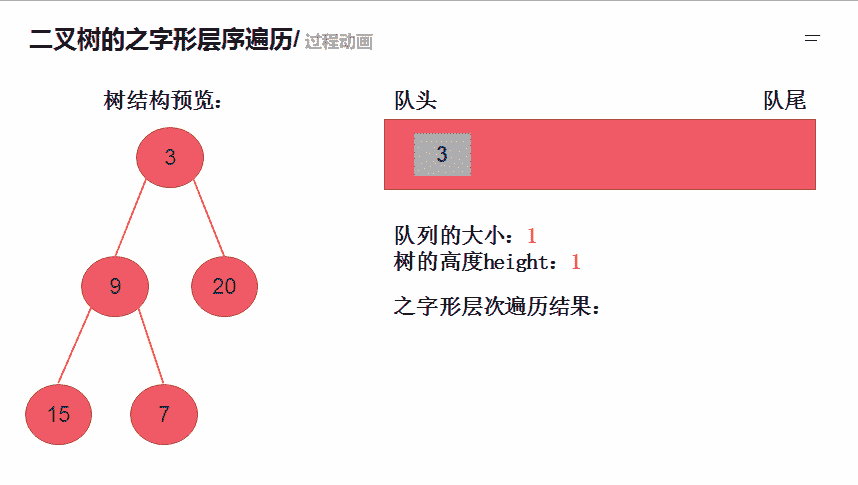

# 第十章 第 4 节 NC14 二叉树的之字形层序遍历

> 原文：[`www.nowcoder.com/tutorial/10070/a8de1cb5be19476996dda742cc03a075`](https://www.nowcoder.com/tutorial/10070/a8de1cb5be19476996dda742cc03a075)

### NC14 二叉树的之字形层序遍历

**- 题目描述：**


**- 题目链接：**
[`www.nowcoder.com/practice/47e1687126fa461e8a3aff8632aa5559?tpId=117&&tqId=34935&rp=1&ru=/ta/job-code-high&qru=/ta/job-code-high/question-ranking`](https://www.nowcoder.com/practice/47e1687126fa461e8a3aff8632aa5559?tpId=117&&tqId=34935&rp=1&ru=/ta/job-code-high&qru=/ta/job-code-high/question-ranking)

**- 设计思想：**


详细操作流程看下图


**- 代码：**
c++版本:

```cpp
 /**
 * struct TreeNode {
 *    int val;
 *    struct TreeNode *left;
 *    struct TreeNode *right;
 * };
 */

class Solution {
public:
    /**
     * 
     * @param root TreeNode 类 
     * @return int 整型 vector<vector<>>
     */
    vector<vector<int> > zigzagLevelOrder(TreeNode* root) {
        // write code here
        vector<vector<int> >res; //用于存储返回结果
        queue<TreeNode*> q; //创建队列用于存储节点
        if(root == NULL) return res; //当为空的时候直接返回
        int height = 1;  //用于处理之字形遍历，偶数就直接插入，偶数就插入 temp 头
        q.push(root); //插入节点
        while(!q.empty()){
            vector<int> temp; // 存储每一层的数字
            int n = q.size(); // 队列大小表示当前层数的元素个数
            for(int i = 0;i < n;i ++){
                TreeNode* node = q.front(); //取出队列的第一个元素
                q.pop();
                if(height % 2 == 0){
                    temp.insert(temp.begin(),node->val); // 如果层数是偶数就插入到头
                }else{
                    temp.push_back(node->val); //如果层数是奇数就直接放进去  
                }
                if(node->left != NULL) q.push(node->left);//如果左子树不为空就递归左子树
                if(node->right!= NULL) q.push(node->right);//如果右子树不为空就递归右子树

            }
            height ++; //高度++
            res.push_back(temp); //把这一层的节点插入到 res 中
        }
        return res;

    }
};

```

Java 版本：

```cpp
import java.util.*;

/*
 * public class TreeNode {
 *   int val = 0;
 *   TreeNode left = null;
 *   TreeNode right = null;
 * }
 */

public class Solution {
    /**
     * 
     * @param root TreeNode 类 
     * @return int 整型 ArrayList<ArrayList<>>
     */
    public ArrayList<ArrayList<Integer>> zigzagLevelOrder (TreeNode root) {
        // write code here
        ArrayList<ArrayList<Integer>> res = new ArrayList<ArrayList<Integer>>(); //用于存储返回结果
        Queue<TreeNode> q = new LinkedList<TreeNode>();//创建队列用于存储节点
        if(root == null){
            return res; //当为空的时候直接返回
        }
         int height = 1;//用于处理之字形遍历，奇数就直接插入，偶数就插入 temp 头
        q.add(root); //插入节点
        while(!q.isEmpty()){
            ArrayList<Integer> temp = new ArrayList<Integer>();// 存储每一层的数字
            int n = q.size();// 队列大小表示当前层数的元素个数
            for(int i = 0;i < n;i ++){
                TreeNode node = q.poll();//取出队列的第一个元素
                if(height % 2 == 0){
                      temp.add(0,node.val);// 如果层数是偶数就插入到头
                }else{
                    temp.add(node.val); //如果层数是奇数就直接放进去  
                }
                if (node.left != null)
                    q.add(node.left); //如果左子树不为空就递归左子树
                if (node.right != null)
                    q.add(node.right); //如果右子树不为空就递归右子树
            }
             height ++; //高度++
             res.add(new ArrayList<>(temp)); //把这一层的节点插入到 res 中
        }
        return res;

    }
}

```

Python 版本:

```cpp
import queue
# class TreeNode:
#     def __init__(self, x):
#         self.val = x
#         self.left = None
#         self.right = None

#
# 
# @param root TreeNode 类 
# @return int 整型二维数组
#
class Solution:
    def zigzagLevelOrder(self , root ):
        # write code here
        res = [] #用于返回最后的结果
        if not root:
            return res  #如果根节点为空就返回结果
        q = queue.Queue() #创建队列用于存储节点  
        q.put(root)
        height = 1 #用于处理之字形遍历，奇数就直接插入，偶数就插入 temp 头
        while q.qsize() >0:
            temp = [] #用于存储当前遍历这一层的节点
            n = q.qsize() # 队列大小表示当前层数的元素个数
            for i in range(n):
                node = q.get()#取出队列的第一个元素
                if height%2 == 0: 
                    temp.insert(0,node.val) # 如果层数是偶数就插入到头
                else:
                    temp.append(node.val) #如果层数是奇数就直接放进去 
                if node.left: 
                    q.put(node.left)#左孩子如果不为空就进队列
                if node.right:
                    q.put(node.right)#右孩子如果不为空就进队列
            res.append(temp) #将这一层的节点数里面据保存到 res
            height += 1 #高度++

        return res

```