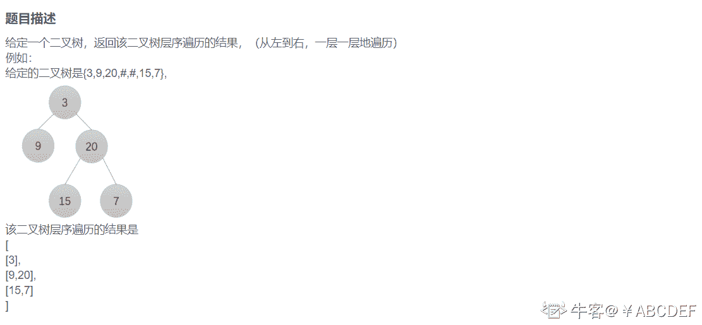
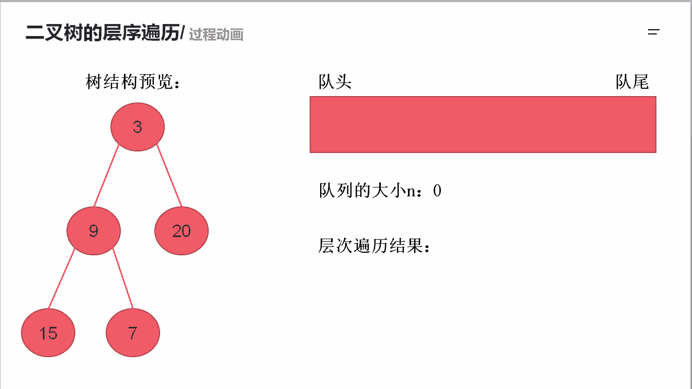

# 第十章 第 5 节 NC15 求二叉树的层序遍历

> 原文：[`www.nowcoder.com/tutorial/10070/94627e10265c4ffca093158540f72eca`](https://www.nowcoder.com/tutorial/10070/94627e10265c4ffca093158540f72eca)

### NC15 求二叉树的层序遍历

**1.题目描述：**


**2.题目链接：**
[`www.nowcoder.com/practice/04a5560e43e24e9db4595865dc9c63a3?tpId=188&&tqId=36551&rp=1&ru=/activity/oj&qru=/ta/job-code-high-week/question-ranking`](https://www.nowcoder.com/practice/04a5560e43e24e9db4595865dc9c63a3?tpId=188&&tqId=36551&rp=1&ru=/activity/oj&qru=/ta/job-code-high-week/question-ranking)

**3.设计思想：**
就像题目描述所说，从左到右，一层一层的遍历，即 BFS 遍历。
首先我们定义一个队列，然后将根节点入队，当队列不为空的时候，需要进行以下两个操作：1）求出当前队列的长度大小 len 。
2）取出队列前 len 个节点，每取出一个节点，就把对应节点的左右孩子入队（前提孩子不为空），然后重复这一过程直到队列为空后输出结果。
详细操作流程看下图


**4.代码：**
c++版本:

```cpp
    /**
 * struct TreeNode {
 *    int val;
 *    struct TreeNode *left;
 *    struct TreeNode *right;
 * };
 */

class Solution {
public:
    /**
     *
     * @param root TreeNode 类
     * @return int 整型 vector<vector<>>
     */
    vector<vector<int> > levelOrder(TreeNode* root) {
        vector<vector<int> >res;//用于返回最后的结果
        if(root == NULL) return res;//如果根节点为空就返回结果
        queue<TreeNode *>q;//用于存储每一层的节点
        q.push(root);
        while(!q.empty()){
            vector<int>temp;//用于存储当前遍历这一层的节点
            int n = q.size();
            for(int i = 0;i < n;i ++){
                TreeNode *node = q.front();//取出队列的第一个元素
                q.pop();
                temp.push_back(node->val);//将队头元素保存起来
                if(node->left != NULL) q.push(node->left);//左孩子如果不为空就进队列
                if(node->right != NULL) q.push(node->right);//右孩子如果不为空就进队列
            }
            res.push_back(temp);//将这一层的节点数里面据保存到 res
        }
        return res;
    }

};

```

Java 版本：

```cpp
import java.util.*;
public class Solution {
    /**
     *
     * @param root TreeNode 类
     * @return int 整型 ArrayList<ArrayList<>>
     */
    public ArrayList<ArrayList<Integer>> levelOrder (TreeNode root) {
        ArrayList<ArrayList<Integer>> res = new ArrayList();//用于返回最后的结果
        if(root == null) return res;//如果根节点为空就返回结果
        Queue<TreeNode> q = new LinkedList<TreeNode>();//用于存储每一层的节点
        q.add(root);
        while(!q.isEmpty()){
            int n = q.size();
            ArrayList<Integer> temp = new ArrayList<>();//用于存储当前遍历这一层的节点
            for(int i = 0;i < n;i ++){
                TreeNode node = q.poll();//取出队列的第一个元素
                temp.add(node.val);//将队头元素保存起来
                if(node.left != null) q.add(node.left);//左孩子如果不为空就进队列
                if(node.right != null) q.add(node.right);//右孩子如果不为空就进队列
            }
            res.add(temp);//将这一层的节点数里面据保存到 res
        }
        return res;
    }
}

```

Python 版本:

```cpp
import queue
class Solution:
    def levelOrder(self , root ):
        res = []#用于返回最后的结果
        if not root:
            return res#如果根节点为空就返回结果
        q = queue.Queue()#用于存储每一层的节点
        q.put(root)
        while q.qsize() >0:
            temp = []#用于存储当前遍历这一层的节点
            n = q.qsize()
            for i in range(n):
                node = q.get()#取出队列的第一个元素
                temp.append(node.val)#将队头元素保存起来
                if node.left:
                    q.put(node.left)#左孩子如果不为空就进队列
                if node.right:
                    q.put(node.right)#右孩子如果不为空就进队列
            res.append(temp)#将这一层的节点数里面据保存到 res

        return res

```