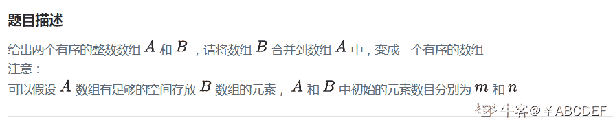
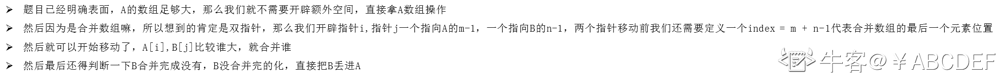
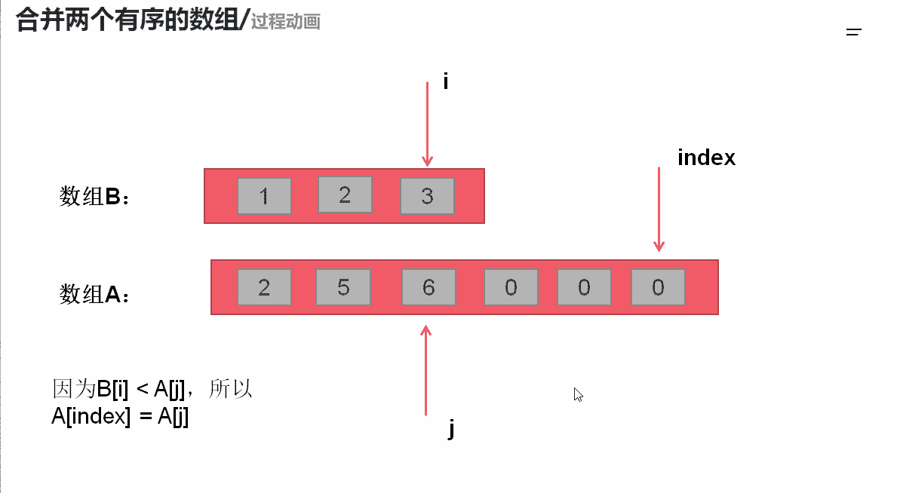

# 第十章 第 12 节 NC22 合并两个有序的数组

> 原文：[`www.nowcoder.com/tutorial/10070/62fc9c186b524c809975f12562171c75`](https://www.nowcoder.com/tutorial/10070/62fc9c186b524c809975f12562171c75)

### NC22 合并两个有序的数组

**- 1、题目描述：**

**- 2、题目链接：**
[`www.nowcoder.com/practice/89865d4375634fc484f3a24b7fe65665?tpId=117&&tqId=34943&rp=1&ru=/ta/job-code-high&qru=/ta/job-code-high/question-ranking`](https://www.nowcoder.com/practice/89865d4375634fc484f3a24b7fe65665?tpId=117&&tqId=34943&rp=1&ru=/ta/job-code-high&qru=/ta/job-code-high/question-ranking)
**-3、 设计思想：**

详细操作流程看下图：


**-5、代码：**
c++版本:

```cpp
class Solution {
public:
    void merge(int A[], int m, int B[], int n) {
        //因为题目明确说了 A 数组足够大，所以直接在 A 数组操作
        int i = m - 1;
        int j = n - 1;
        int index = m + n - 1;//AB 合并后最后一个元素所在位置
        while(i >= 0 && j>= 0)//AB 合并，谁大就先放谁
            A[index --] = A[i] > B[j] ? A[i --] : B[j --];
        while(j >= 0)//如果 B 没有遍历完，那么之间丢在 A 数组里面
            A[index--] = B[j --];
    }
};
```

Java 版本：

```cpp
public class Solution {
    public void merge(int A[], int m, int B[], int n) {
         //因为题目明确说了 A 数组足够大，所以直接在 A 数组操作
        int i = m - 1;
        int j = n - 1;
        int index = m + n - 1;//AB 合并后最后一个元素所在位置
        while(i >= 0 && j >= 0)//AB 合并，谁大就先放谁
            A[index --] = A[i] > B[j] ? A[i --] : B[j --];
        while(j >= 0)//如果 B 没有遍历完，那么之间丢在 A 数组里面
            A[index --] = B[j --];

    }
}
```

Python 版本:

```cpp
#
# 
# @param A int 整型一维数组 
# @param B int 整型一维数组 
# @return void
#
class Solution:
    def merge(self , A, m, B, n):
        # write code here
        #因为题目明确说了 A 数组足够大，所以直接在 A 数组操作
        i = m - 1
        j = n - 1
        index = m + n - 1#AB 合并后最后一个元素所在位置
        while i>= 0 and j >= 0:#AB 合并，谁大就先放谁
            if A[i] > B[j]:
                A[index] = A[i]
                index-=1
                i-=1
            else:
                A[index] = B[j]
                index-=1
                j-=1
        while j>= 0:
            A[index] = B[j]
            index -=1
            j -= 1

```