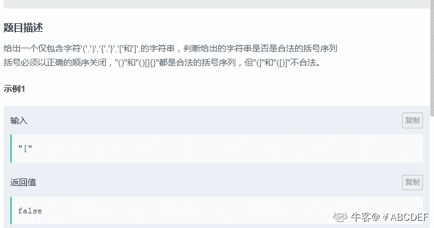
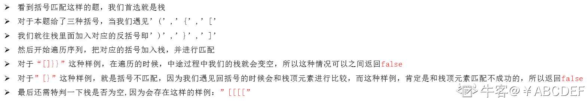
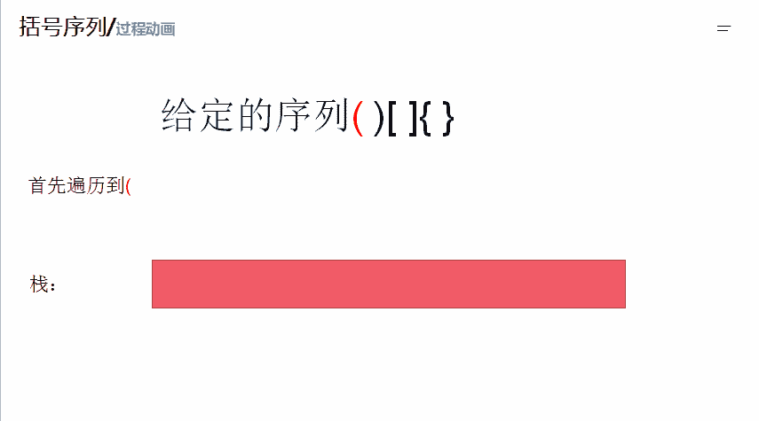

# 第十章 第 13 节 NC52 括号序列

> 原文：[`www.nowcoder.com/tutorial/10070/7d985f76cd0c49fc92c092293f398bba`](https://www.nowcoder.com/tutorial/10070/7d985f76cd0c49fc92c092293f398bba)

### NC52 括号序列

**- 1、题目描述：**


**- 2、题目链接：**
[`www.nowcoder.com/practice/37548e94a270412c8b9fb85643c8ccc2?tpId=194&&tqId=35784&rp=1&ru=/ta/job-code-high-client&qru=/ta/job-code-high-client/question-ranking`](https://www.nowcoder.com/practice/37548e94a270412c8b9fb85643c8ccc2?tpId=194&&tqId=35784&rp=1&ru=/ta/job-code-high-client&qru=/ta/job-code-high-client/question-ranking)

**-3、 设计思想：**

详细操作流程看下图：


**-5、代码：**
c++版本:

```cpp
class Solution {
public:
    /**
     * 
     * @param s string 字符串 
     * @return bool 布尔型
     */
    bool isValid(string s) {
        // write code here
        stack<char>st;//开一个栈
        for(int i = 0;i < s.size();i ++){//遍历字符，如果遇见左括号，那么就往栈加入对应的右括号
            if(s[i] == '('){
                st.push(')');
            }else if (s[i] == '{'){
                st.push('}');
            }else if(s[i] == '['){
                st.push(']');
            }else if(st.empty()){
                return false;//字符还没遍历完就出现栈为空就返回 false
            }else if(st.top() != s[i]){//栈顶元素和 c 不符合返回 false
                return false;
            }else{
                st.pop();
            }

        }
      return  st.empty();//用来判断这种情况'['
    }
};

```

Java 版本：

```cpp
import java.util.*;

public class Solution {
    /**
     * 
     * @param s string 字符串 
     * @return bool 布尔型
     */
    public boolean isValid (String s) {
        // write code here
        Stack<Character> st = new Stack<Character>();//开一个栈
        char []temp = s.toCharArray();///转化为字符数组便于操作
        for(char c: temp){//遍历字符，如果遇见左括号，那么就往栈加入对应的右括号
            if(c == '(') st.push(')');
            else if(c == '{') st.push('}');
            else if(c == '[') st.push(']');
            else if(st.isEmpty()) return false;//字符还没遍历完就出现栈为空就返回 false
            else if(st.pop()!= c) return false;//栈顶元素和 c 不符合返回 false
        }
        return st.isEmpty();//用来判断这种情况'['
    }
}
```

Python 版本:

```cpp
#
# 
# @param s string 字符串 
# @return bool 布尔型
#
class Stack(object):

    def __init__(self):
     # 创建空列表实现栈
        self.__list = []

    def is_empty(self):
    # 判断是否为空
        return self.__list == []
    def push(self,item):
    # 压栈，添加元素
        self.__list.append(item)

    def pop(self):
    # 弹栈，弹出最后压入栈的元素
        if self.is_empty():
            return 
        else:
            return self.__list.pop()

    def top(self): 
    # 取最后压入栈的元素
        if self.is_empty():
            return
        else:
            return self.__list[-1]

class Solution:
    def isValid(self , s ):
        # write code here
        st = Stack()#开一个栈
        for c in s: #遍历字符，如果遇见左括号，那么就往栈加入对应的右括号
            if c == '(':
                st.push(')')
            elif c == '{':
                st.push('}')
            elif c == '[':
                st.push(']')
            elif st.is_empty():#字符还没遍历完就出现栈为空就返回 false
                return False
            elif st.top()!= c:#栈顶元素和 c 不符合返回 false
                return False
            else:
                st.pop()
        return st.is_empty()#用来判断这种情况'['
```