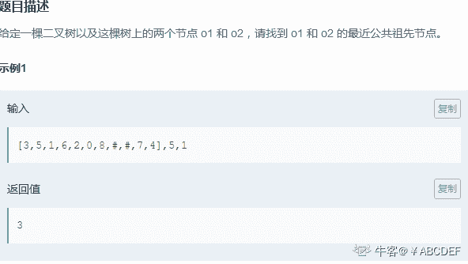
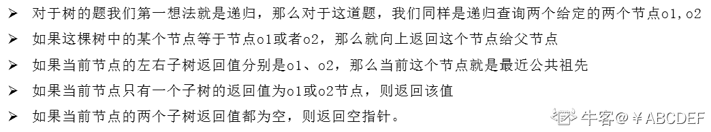
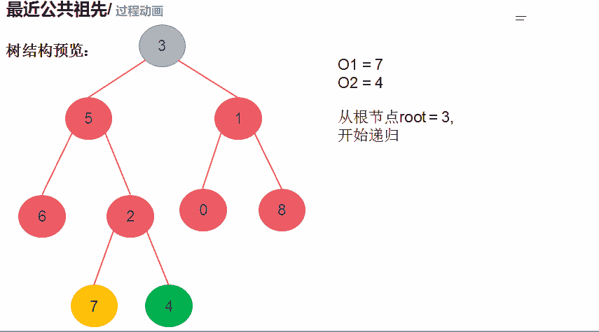

# 第十章 第 14 节 NC102 最近公共祖先

> 原文：[`www.nowcoder.com/tutorial/10070/3ff5194bed424bab9fbd5357804aa23c`](https://www.nowcoder.com/tutorial/10070/3ff5194bed424bab9fbd5357804aa23c)

### NC102 最近公共祖先

**- 1、题目描述：**


**- 2、题目链接：**
[`www.nowcoder.com/practice/e0cc33a83afe4530bcec46eba3325116?tpId=117&&tqId=35027&rp=1&ru=/ta/job-code-high&qru=/ta/job-code-high/question-ranking`](https://www.nowcoder.com/practice/e0cc33a83afe4530bcec46eba3325116?tpId=117&&tqId=35027&rp=1&ru=/ta/job-code-high&qru=/ta/job-code-high/question-ranking)

**-3、 设计思想：**

详细操作流程看下图：


**-5、代码：**
c++版本:

```cpp
 /**
 * struct TreeNode {
 *    int val;
 *    struct TreeNode *left;
 *    struct TreeNode *right;
 * };
 */

class Solution {
public:
    /**
     * 
     * @param root TreeNode 类 
     * @param o1 int 整型 
     * @param o2 int 整型 
     * @return int 整型
     */
    TreeNode* dfs(TreeNode* root,int o1,int o2){
        //如果当前节点为空，或者当前节点等于 o1 或者等于 o2 就返回值给父亲节点
        if(root == NULL || root->val == o1 || root->val == o2) return root;
        //递归遍历左子树
        TreeNode *left = dfs(root->left,o1,o2);
        //递归遍历右子树
        TreeNode *right = dfs(root->right,o1,o2);
        //如果 left、right 都不为空，那么代表 o1、o2 在 root 的两侧，所以 root 为他们的公共祖先
        if(left != NULL && right != NULL) return root;
        //如果 left、right 有一个为空，那么就返回不为空的哪一个
        return left != NULL? left : right;

    }
    int lowestCommonAncestor(TreeNode* root, int o1, int o2) {
       return dfs(root,o1,o2)->val;
    }
};

```

Java 版本：

```cpp
    import java.util.*;

    /*
     * public class TreeNode {
     *   int val = 0;
     *   TreeNode left = null;
     *   TreeNode right = null;
     * }
     */

    public class Solution {
        /**
         * 
         * @param root TreeNode 类 
         * @param o1 int 整型 
         * @param o2 int 整型 
         * @return int 整型
         */
        public TreeNode dfs(TreeNode root,int o1,int o2){
            //如果当前节点为空，或者当前节点等于 o1 或者等于 o2 就返回值给父亲节点
            if(root == null || root.val == o1 || root.val == o2){
                return root;
            }
            //递归遍历左子树
            TreeNode left = dfs(root.left,o1,o2);
            //递归遍历右子树
            TreeNode right = dfs(root.right,o1,o2);
            //如果 left、right 都不为空，那么代表 o1、o2 在 root 的两侧，所以 root 为他们的公共祖先
            if(left != null && right != null) return root;
            //如果 left、right 有一个为空，那么就返回不为空的那一个
            return left != null? left : right;
        }
        public int lowestCommonAncestor (TreeNode root, int o1, int o2) {
            // write code here
            return dfs(root,o1,o2).val;
        }
    }

```

Python 版本:

```cpp
class Solution:
    def dfs(self,root,o1,o2):
        #//如果当前节点为空，或者当前节点等于 o1 或者等于 o2 就返回值给父亲节点
        if not root : return root
        if root.val == o1 or root.val == o2:
            return root
        #//递归遍历左子树
        left = self.dfs(root.left,o1,o2)
        #//递归遍历右子树
        right = self.dfs(root.right,o1,o2)
        #/如果 left、right 都不为空，那么代表 o1、o2 在 root 的两侧，所以 root 为他们的公共祖先
        if left != None and right != None: return root
        #如果 left、right 有一个为空，那么就返回不为空的哪一个
        if left != None: return left
        if right != None: return right

    def lowestCommonAncestor(self , root , o1 , o2 ):
        return self.dfs(root,o1,o2).val

```