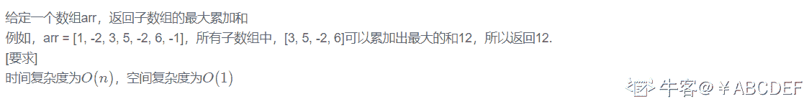
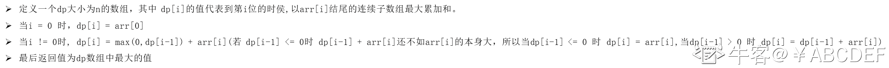
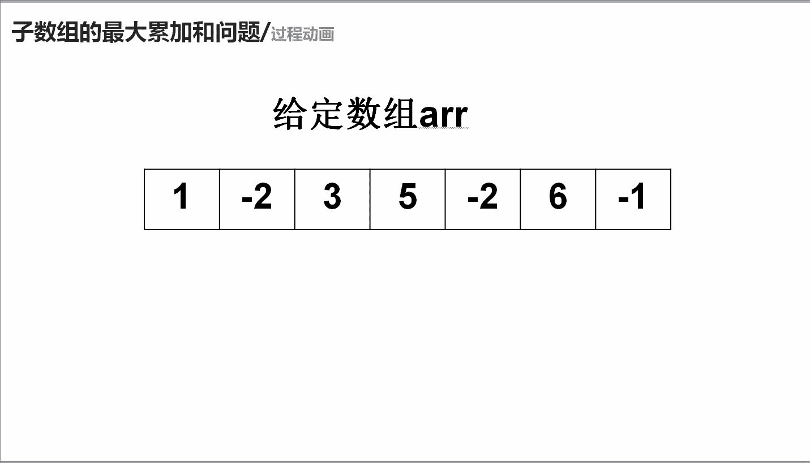

# 第十章 第 23 节 NC19 子数组的最大累加和问题

> 原文：[`www.nowcoder.com/tutorial/10070/90897207723746a49edd1a672c8275b3`](https://www.nowcoder.com/tutorial/10070/90897207723746a49edd1a672c8275b3)

### NC19 子数组的最大累加和问题

**- 1、题目描述：**


**- 2、题目链接：**

[`www.nowcoder.com/practice/554aa508dd5d4fefbf0f86e5fe953abd?tpId=117&&tqId=35068`](https://www.nowcoder.com/practice/554aa508dd5d4fefbf0f86e5fe953abd?tpId=117&&tqId=35068)
**-3、 设计思想：**

详细操作流程看下图：


**-5、代码：**
c++版本:

```cpp
 class Solution {
public:
    /**
     * max sum of the subarray
     * @param arr int 整型 vector the array
     * @return int 整型
     */
    int maxsumofSubarray(vector<int>& arr) {
        // write code here
        //dp[i]代表到第 i 位的时侯,以 arr[i]结尾的连续子数组最大累加和
        int dp[arr.size()];//开辟 dp
        dp[0] = arr[0];//初始化
        int res = arr[0];//保存最终的结果
        for(int i = 1;i < arr.size();i ++){
            dp[i] = max(0,dp[i-1]) + arr[i];//维护 dp[i]
            res = max(res,dp[i]);//每更新一个 dp 值就更新一下 res
        }
        return res;
    }
};

```

Java 版本：

```cpp
import java.util.*;

public class Solution {
    /**
     * max sum of the subarray
     * @param arr int 整型一维数组 the array
     * @return int 整型
     */
    public int maxsumofSubarray (int[] arr) {
        // write code here
        //dp[i]代表到第 i 位的时侯,以 arr[i]结尾的连续子数组最大累加和
        int []dp = new int[arr.length];//开辟 dp
        dp[0] = arr[0];//初始化
        int res = arr[0];//保存最终的结果
        for(int i = 1;i < arr.length;i ++){
            dp[i] = Math.max(0,dp[i-1]) + arr[i];//维护 dp[i]
            res = Math.max(res,dp[i]);//每更新一个 dp 值就更新一下 res
        }
        return res;

    }
}

```

Python 版本:

```cpp
#
# max sum of the subarray
# @param arr int 整型一维数组 the array
# @return int 整型
#
class Solution:
    def maxsumofSubarray(self , arr ):
        # write code here
        #dp[i]代表到第 i 位的时侯,以 arr[i]结尾的连续子数组最大累加和
        dp = [0] * len(arr)#开辟 dp
        res = arr[0]#保存最终的结果
        dp[0] = arr[0]#初始化
        for i in range(1,len(arr)):
            dp[i] = max(dp[i-1],0) + arr[i]#维护 dp[i]
            res = max(res,dp[i])#每更新一个 dp 值就更新一下 res
        return res

```