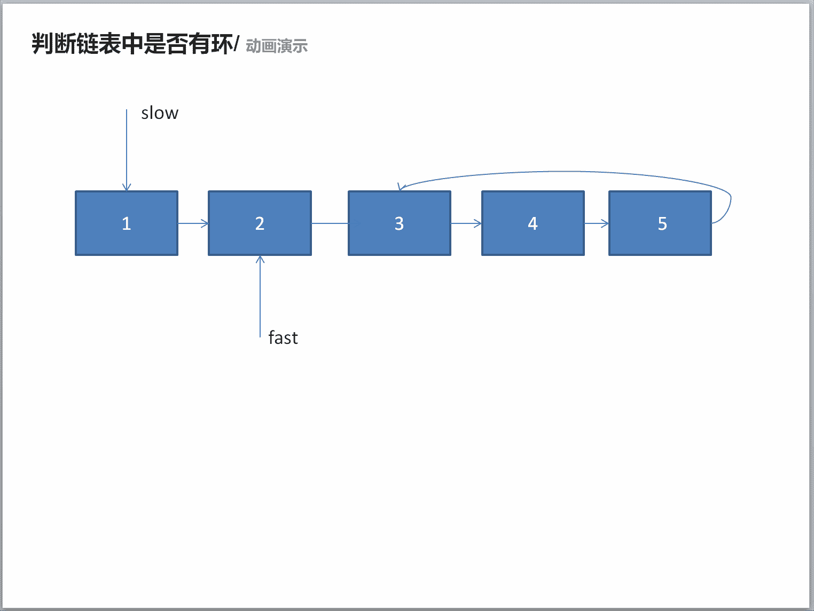

# 第十章 第 25 节 NC4 判断链表中是否有环(空间复杂度 o(1))

> 原文：[`www.nowcoder.com/tutorial/10070/a6e56bc4e78049d193f5ee577653b635`](https://www.nowcoder.com/tutorial/10070/a6e56bc4e78049d193f5ee577653b635)

### NC4 判断链表中是否有环(空间复杂度 o(1))

**- 1、题目描述：**


**- 2、题目链接：**

[`www.nowcoder.com/practice/650474f313294468a4ded3ce0f7898b9?tpId=117&&tqId=34925&rp=1&ru=/activity/oj&qru=/ta/job-code-high/question-ranking`](https://www.nowcoder.com/practice/650474f313294468a4ded3ce0f7898b9?tpId=117&&tqId=34925&rp=1&ru=/activity/oj&qru=/ta/job-code-high/question-ranking)
**-3、 设计思想：**

详细操作流程看下图：


**-5、代码：**
c++版本:

```cpp
/**
 * Definition for singly-linked list.
 * struct ListNode {
 *     int val;
 *     ListNode *next;
 *     ListNode(int x) : val(x), next(NULL) {}
 * };
 */
class Solution {
public:
    bool hasCycle(ListNode *head) {
        if(head == NULL || head->next == NULL) return false;
        ListNode* fast = head->next;//快指针
        ListNode *slow = head;//慢指针
        while(slow != fast){//快慢指针不相遇就要遍历
            if(fast == NULL || fast->next == NULL) return false;
            fast = fast->next->next;//快指针移动两格
            slow = slow->next;//慢指针移动一格
        }
        return true;

    }
};

```

Java 版本：

```cpp
/**
 * Definition for singly-linked list.
 * class ListNode {
 *     int val;
 *     ListNode next;
 *     ListNode(int x) {
 *         val = x;
 *         next = null;
 *     }
 * }
 */
public class Solution {
    public boolean hasCycle(ListNode head) {
        if (head == null || head.next == null) return false;
        ListNode fast = head.next;//快指针
        ListNode slow = head;//慢指针
        while(fast != slow){//快慢指针不相遇就要遍历
            if(fast == null || fast.next == null){
                return false;
            }
            fast = fast.next.next;//快指针移动两格
            slow = slow.next;//慢指针移动一格

        }
        return true;

    }
}
```

Python 版本:

```cpp
# class ListNode:
#     def __init__(self, x):
#         self.val = x
#         self.next = None

#
# 
# @param head ListNode 类 
# @return bool 布尔型
#
class Solution:
    def hasCycle(self , head ):
        # write code here
        if head == None or head.next == None:
            return False
        fast = head.next#快指针
        slow = head#慢指针
        while fast != slow:#快慢指针不相遇就要遍历
            if fast == None or fast.next == None:
                return False
            fast = fast.next.next#快指针移动两格 
            slow = slow.next#慢指针移动一格
        return True

```