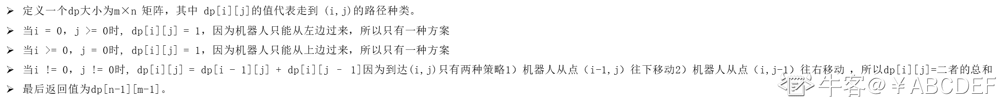

# 第十章 第 26 节 NC34 求路径

> 原文：[`www.nowcoder.com/tutorial/10070/3f544dd29dfe4216ab98e06d48678960`](https://www.nowcoder.com/tutorial/10070/3f544dd29dfe4216ab98e06d48678960)

### NC34 求路径

**- 1、题目描述：**


**- 2、题目链接：**
[`www.nowcoder.com/practice/166eaff8439d4cd898e3ba933fbc6358?tpId=188&&tqId=37383&rp=1&ru=/ta/job-code-high-week&qru=/ta/job-code-high-week/question-ranking`](https://www.nowcoder.com/practice/166eaff8439d4cd898e3ba933fbc6358?tpId=188&&tqId=37383&rp=1&ru=/ta/job-code-high-week&qru=/ta/job-code-high-week/question-ranking)

**-3、 设计思想：**

详细操作流程看下图：


**-5、代码：**
c++版本:

```cpp
 class Solution {
public:
    /**
     * 
     * @param m int 整型 
     * @param n int 整型 
     * @return int 整型
     */
    int uniquePaths(int m, int n) {
        // write code here
         int dp[110][110]={0};//定义一个 dp[i][j]代表走到 ij 位置有几种方案
         for(int i = 0 ;i < m;i++) dp[i][0] =  1;//因为只能从上面一个方向来，所以初始化为 1
         for(int j = 0 ;j < n;j++) dp[0][j] = 1;//因为只能从左面一个方向来，所以初始化为 1
         for(int i = 1 ;i < m;i++)
         {
             for(int j = 1;j < n;j ++){
                 //对于普遍位置 dp[i][j]就应该等于左边来和上边来的总和
                 dp[i][j] = dp[i-1][j]+dp[i][j-1];
             }
         }
        //返回右下角的值就是最终结果
         return dp[m - 1][n - 1];
    }
};

```

Java 版本：

```cpp
import java.util.*;

public class Solution {
    /**
     * 
     * @param m int 整型 
     * @param n int 整型 
     * @return int 整型
     */
    public int uniquePaths (int m, int n) {
        // write code here
        int [][]dp = new int [m][n];//定义一个 dp[i][j]代表走到 ij 位置有几种方案
        for(int i  = 0;i < m;i ++){
            dp[i][0] = 1;//因为只能从上面一个方向来，所以初始化为 1
        }
        for(int j = 0;j < n;j ++){
            dp[0][j] = 1;//因为只能从左面一个方向来，所以初始化为 1
        }
        for(int i = 1;i < m;i ++){
            for(int j = 1;j < n;j ++){
                //对于普遍位置 dp[i][j]就应该等于左边来和上边来的总和
                dp[i][j] = dp[i - 1][j] + dp[i][j - 1];
            }
        }
        //返回右下角的值就是最终结果
        return dp[m - 1][n - 1];
    }
}

```

Python 版本:

```cpp
#
# 
# @param m int 整型 
# @param n int 整型 
# @return int 整型
#
class Solution:
    def uniquePaths(self , m , n ):
        # write code here
        dp = [[0 for i in range(n)] for i in range(m)] #定义一个 dp[i][j]代表走到 ij 位置有几种方案
        for i in range(m):
            dp[i][0] = 1 #因为只能从上面一个方向来，所以初始化为 1
        for j in range(n): #因为只能从左面一个方向来，所以初始化为 1
            dp[0][j] = 1
        for i in range(1,m):
            for j in range(1,n):
                #对于普遍位置 dp[i][j]就应该等于左边来和上边来的总和
                dp[i][j] = dp[i-1][j] + dp[i][j-1]
        #返回右下角的值就是最终结果
        return dp[m-1][n-1]
```