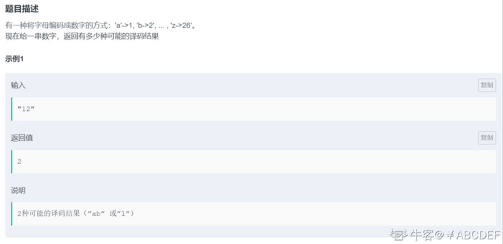
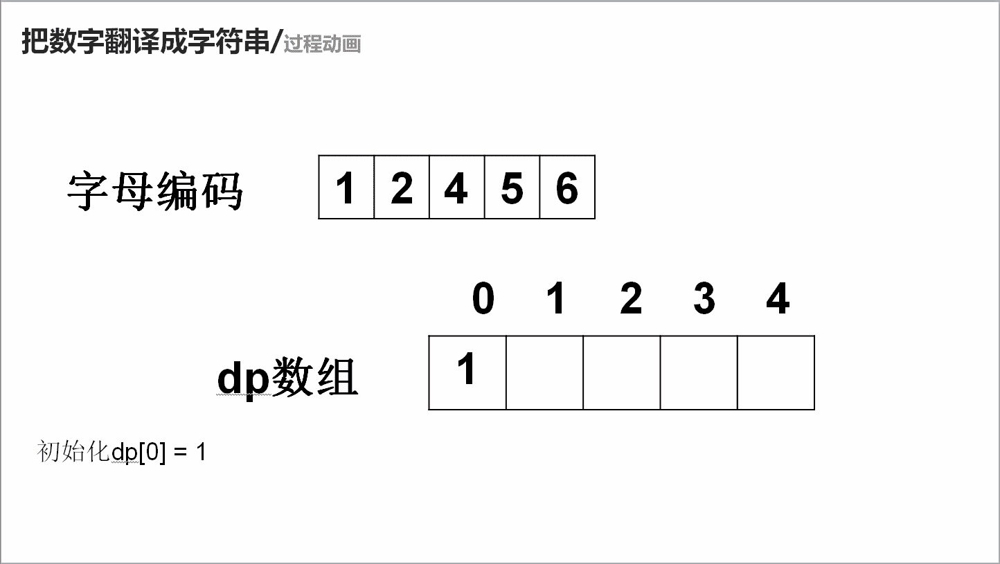

# 第十章 第 32 节 NC116 把数字翻译成字符串

> 原文：[`www.nowcoder.com/tutorial/10070/6364145d7eba491194ce667b3135c335`](https://www.nowcoder.com/tutorial/10070/6364145d7eba491194ce667b3135c335)

### NC116 把数字翻译成字符串

**- 1、题目描述：**


**- 2、题目链接：**
[`www.nowcoder.com/practice/046a55e6cd274cffb88fc32dba695668?tpId=117&&tqId=35041&rp=1&ru=/activity/oj&qru=/ta/job-code-high/question-ranking`](https://www.nowcoder.com/practice/046a55e6cd274cffb88fc32dba695668?tpId=117&&tqId=35041&rp=1&ru=/activity/oj&qru=/ta/job-code-high/question-ranking)

**-3、 设计思想：**

详细操作流程看下图：



**-5、代码：**
c++版本:

```cpp
 class Solution {
public:
    /**
     * 解码
     * @param nums string 字符串 数字串
     * @return int 整型
     */
    int solve(string nums) {
        // write code here
        if (nums[0] == '0') return 0;
        vector<int>dp(nums.size() + 10,0);//dp[i]的含义代表长度在 i 位置时有几种翻译办法
        dp[0] = 1;//在第 0 个字符的时候只有一个字母所以只有一种翻译办法
        for(int i = 1;i < nums.size();i ++){
            if(nums[i] == '0'){
                if(nums[i-1] == '1' || nums[i-1] == '2')
                {
                    if(i == 1) dp[i] = 1;//特判字符串长度为 2
                    else dp[i] = dp[i-2];//因为 10 20 这样的只有一种对应方案，所以此时 dp[i]取决于 dp[i-2]
                }
            }
            else if(nums[i - 1] == '1' || (nums[i - 1] == '2' && nums[i] >= '1' && nums[i] <= '6')){
                /*11-26 抛去 20 这样的组合
                但是当 i==1 的时候如 12 21 这样有两种方案
                当 i>1 时候 dp[i] 取决于 dp[i-1] 和 dp[i-2]的和
                */
                if(i == 1) dp[i] = 2;
                else dp[i] = dp[i-1] + dp[i-2];
            }else{
                //>=27 这样的组合
                dp[i] = dp[i-1];
            }

        }
        return dp[nums.size()-1];
    }
};

```

Java 版本：

```cpp
import java.util.*;

public class Solution {
    /**
     * 解码
     * @param nums string 字符串 数字串
     * @return int 整型
     */
    public int solve (String nums) {
        // write code here
        if(nums.charAt(0) == '0') return 0;
        int [] dp = new int[nums.length()];//dp[i]的含义代表长度在 i 位置时有几种翻译办法
        dp[0] = 1;//在第 0 个字符的时候只有一个字母所以只有一种翻译办法
        for(int i = 1;i < nums.length();i ++){
            if(nums.charAt(i) == '0'){
                if(nums.charAt(i-1) == '1' || nums.charAt(i-1) == '2'){
                    if(i == 1) dp[i] = 1;//特判字符串长度为 2
                    else dp[i] = dp[i-2];//因为 10 20 这样的只有一种对应方案，所以此时 dp[i]取决于 dp[i-2]
                }
            }else if(nums.charAt(i-1) == '1' || (nums.charAt(i-1) == '2' && nums.charAt(i) >= '1' && nums.charAt(i) <= '6')){
                /*11-26 抛去 20 这样的组合
                但是当 i==1 的时候如 12 21 这样有两种方案
                当 i>1 时候 dp[i] 取决于 dp[i-1] 和 dp[i-2]的和
                */
                if(i == 1) dp[i] = 2;
                else dp[i] = dp[i-1] + dp[i-2];

            }else{
                //>=27 这样的组合
                dp[i] = dp[i-1];
            }    
        }return dp[nums.length() - 1];
    }
}

```

Python 版本:

```cpp
#
# 解码
# @param nums string 字符串 数字串
# @return int 整型
#
class Solution:
    def solve(self , nums ):
        # write code here
        if nums[0] == '0':return 0
        dp=[0]*(len(nums)+10)#dp[i]的含义代表长度在 i 位置时有几种翻译办法
        dp[0] = 1 #在第 0 个字符的时候只有一个字母所以只有一种翻译办法
        for i in range(1,len(nums)):
            if nums[i] == '0':
                if nums[i-1] == '1' or nums[i-1] == '2':
                    if i == 1: dp[i] = 1#特判字符串长度为 2
                    else : dp[i] = dp[i-2]#因为 10 20 这样的只有一种对应方案，所以此时 dp[i]取决于 dp[i-2]
            elif nums[i-1] == '1' or  (nums[i-1] == '2' and nums[i] >= '1' and nums[i] <= '6'):
                '''11-26 抛去 20 这样的组合
                但是当 i==1 的时候如 12 21 这样有两种方案
                当 i>1 时候 dp[i] 取决于 dp[i-1] 和 dp[i-2]的和
                '''
                if i == 1: dp[i] = 2
                else: dp[i] = dp[i-1] + dp[i-2]
            else:
                #>=27 这样的组合
                dp[i] = dp[i-1]
        return dp[len(nums) - 1]

```