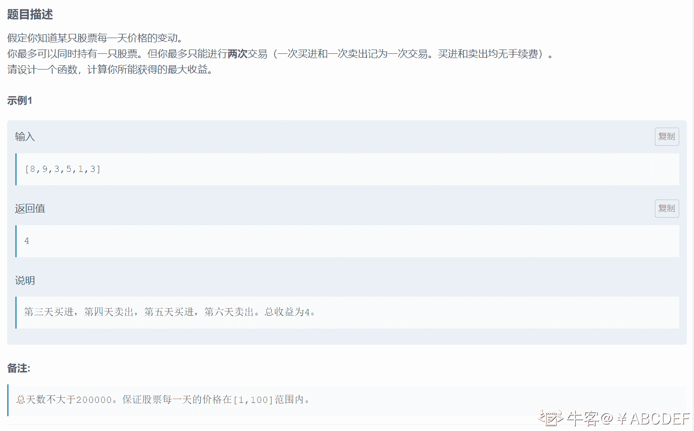
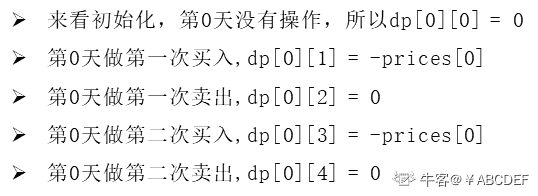
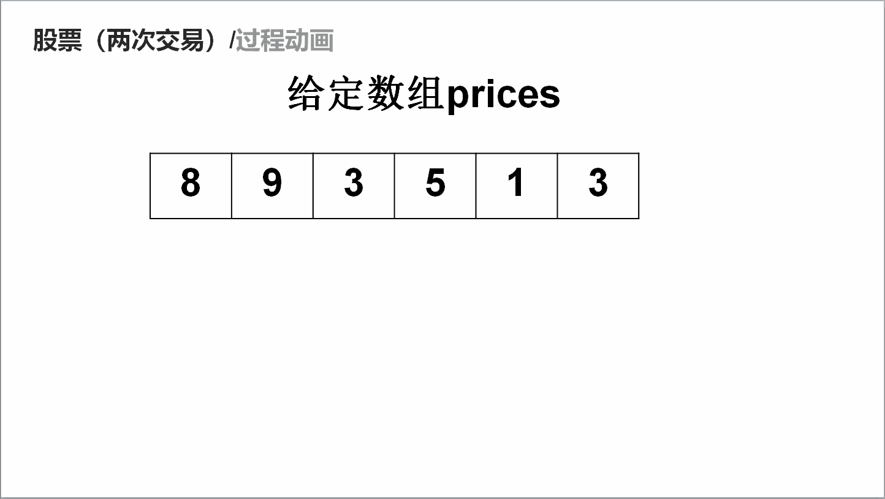

# 第十章 第 33 节 NC135 股票（两次交易）

> 原文：[`www.nowcoder.com/tutorial/10070/d662daf7e8ef4175b95572ceae43280f`](https://www.nowcoder.com/tutorial/10070/d662daf7e8ef4175b95572ceae43280f)

### NC135 股票（两次交易）

**- 1、题目描述：**


**- 2、题目链接：**
[`www.nowcoder.com/practice/4892d3ff304a4880b7a89ba01f48daf9?tpId=117&&tqId=35490&rp=1&ru=/ta/job-code-high&qru=/ta/job-code-high/question-ranking`](https://www.nowcoder.com/practice/4892d3ff304a4880b7a89ba01f48daf9?tpId=117&&tqId=35490&rp=1&ru=/ta/job-code-high&qru=/ta/job-code-high/question-ranking)

**-3、 设计思想：**



详细操作流程看下图：


**-5、代码：**
c++版本:

```cpp
class Solution {
public:
    /**
     * 代码中的类名、方法名、参数名已经指定，请勿修改，直接返回方法规定的值即可
     * 两次交易所能获得的最大收益
     * @param prices int 整型 vector 股票每一天的价格
     * @return int 整型
     */
    int maxProfit(vector<int>& prices) {
        // write code here
        if (prices.size() == 0) return 0;
        /*
        5 个状态：1）不操作 2）第一次购买 3）第一次卖出 4）第二次购买 5）第二次卖出
        dp[i][j]代表第 i 天状态为 j 时产生的最大收益
        */
        int dp[200005][5]={0};
        //初始化
        dp[0][1] = -prices[0];
        dp[0][3] = -prices[0];
        for (int i = 1; i < prices.size(); i++) {
            dp[i][0] = dp[i - 1][0];
            //其中 dp[i][1]有两个操作 1）第 i 天没有操作 2）第 i 天买入股票，所以此时最大收益，应该为这两个操作比大小
            dp[i][1] = max(dp[i - 1][1], dp[i - 1][0] - prices[i]);
            //其中 dp[i][2]有两个操作 1）第 i 天没有操作 2）第 i 天卖出股票，所以此时最大收益，应该为这两个操作比大小
            dp[i][2] = max(dp[i - 1][2], dp[i - 1][1] + prices[i]);
            //其中 dp[i][3]有两个操作 1）第 i 天没有操作 2）第 i 天买入股票，所以此时最大收益，应该为这两个操作比大小
            dp[i][3] = max(dp[i - 1][3], dp[i - 1][2] - prices[i]);
            //其中 dp[i][4]有两个操作 1）第 i 天没有操作 2）第 i 天卖出股票，所以此时最大收益，应该为这两个操作比大小
            dp[i][4] = max(dp[i - 1][4], dp[i - 1][3] + prices[i]);
        }
        return dp[prices.size() - 1][4];

    }
}; 

```

Java 版本：

```cpp
import java.util.*;

public class Solution {
    /**
     * 代码中的类名、方法名、参数名已经指定，请勿修改，直接返回方法规定的值即可
     * 两次交易所能获得的最大收益
     * @param prices int 整型一维数组 股票每一天的价格
     * @return int 整型
     */
    public int maxProfit (int[] prices) {
        // write code here
        if (prices.length == 0) return 0;
        /*
        5 个状态：1）不操作 2）第一次购买 3）第一次卖出 4）第二次购买 5）第二次卖出
        dp[i][j]代表第 i 天状态为 j 时产生的最大收益
        */
        int [][]dp = new int[prices.length][5];
        //初始化
        dp[0][1] = -prices[0];
        dp[0][3] = -prices[0];
        for (int i = 1; i < prices.length; i++) {
            dp[i][0] = dp[i - 1][0];
            //其中 dp[i][1]有两个操作 1）第 i 天没有操作 2）第 i 天买入股票，所以此时最大收益，应该为这两个操作比大小
            dp[i][1] = Math.max(dp[i - 1][1], dp[i - 1][0] - prices[i]);
            //其中 dp[i][2]有两个操作 1）第 i 天没有操作 2）第 i 天卖出股票，所以此时最大收益，应该为这两个操作比大小
            dp[i][2] = Math.max(dp[i - 1][2], dp[i - 1][1] + prices[i]);
            //其中 dp[i][3]有两个操作 1）第 i 天没有操作 2）第 i 天买入股票，所以此时最大收益，应该为这两个操作比大小
            dp[i][3] = Math.max(dp[i - 1][3], dp[i - 1][2] - prices[i]);
            //其中 dp[i][4]有两个操作 1）第 i 天没有操作 2）第 i 天卖出股票，所以此时最大收益，应该为这两个操作比大小
            dp[i][4] = Math.max(dp[i - 1][4], dp[i - 1][3] + prices[i]);
        }
        return dp[prices.length - 1][4];

    }
}

```

Python 版本:

```cpp
#
# 代码中的类名、方法名、参数名已经指定，请勿修改，直接返回方法规定的值即可
# 两次交易所能获得的最大收益
# @param prices int 整型一维数组 股票每一天的价格
# @return int 整型
#
class Solution:
    def maxProfit(self , prices ):
        # write code here
        n = len(prices)
        if n == 0:return 0
        '''
        5 个状态：1）不操作 2）第一次购买 3）第一次卖出 4）第二次购买 5）第二次卖出
        dp[i][j]代表第 i 天状态为 j 时产生的最大收益
        '''
        dp = [[0]*5 for i in range(n)]
        #初始化
        dp[0][1] = -prices[0];
        dp[0][3] = -prices[0];
        for i in range(1, n):
            dp[i][0] = dp[i-1][0]
            #其中 dp[i][1]有两个操作 1）第 i 天没有操作 2）第 i 天买入股票，所以此时最大收益，应该为这两个操作比大小
            dp[i][1] = max(dp[i - 1][1], dp[i - 1][0] - prices[i])
            #其中 dp[i][2]有两个操作 1）第 i 天没有操作 2）第 i 天卖出股票，所以此时最大收益，应该为这两个操作比大小
            dp[i][2] = max(dp[i - 1][2], dp[i - 1][1] + prices[i])
            #其中 dp[i][3]有两个操作 1）第 i 天没有操作 2）第 i 天买入股票，所以此时最大收益，应该为这两个操作比大小
            dp[i][3] = max(dp[i - 1][3], dp[i - 1][2] - prices[i])
            #其中 dp[i][4]有两个操作 1）第 i 天没有操作 2）第 i 天卖出股票，所以此时最大收益，应该为这两个操作比大小
            dp[i][4] = max(dp[i - 1][4], dp[i - 1][3] + prices[i])
        return dp[n - 1][4]
```