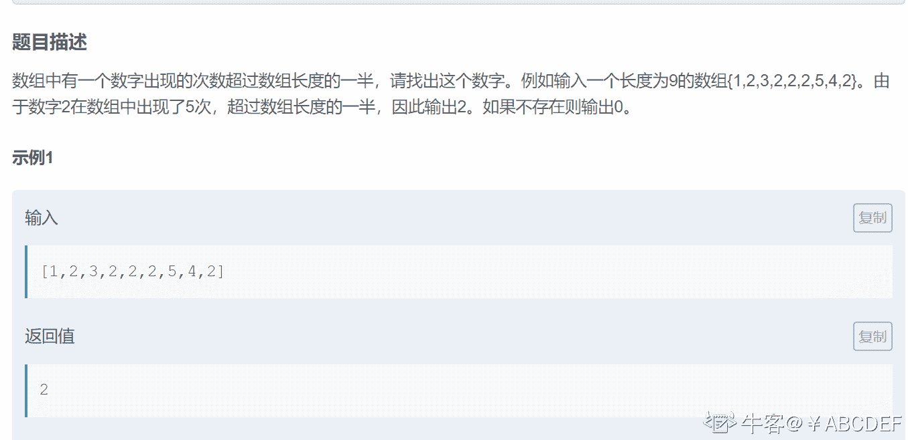
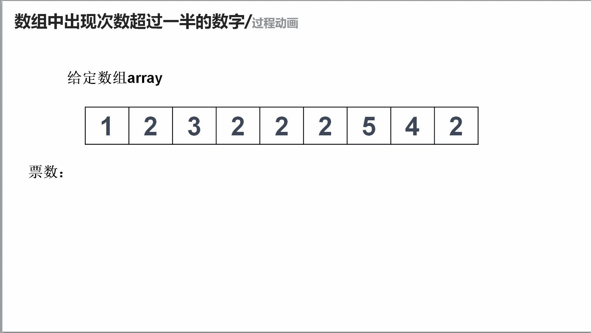

# 第十章 第 39 节 NC73 数组中出现次数超过一半的数字

> 原文：[`www.nowcoder.com/tutorial/10070/142ef43a7cdb4cf7ba3f769b844e1473`](https://www.nowcoder.com/tutorial/10070/142ef43a7cdb4cf7ba3f769b844e1473)

### NC73 数组中出现次数超过一半的数字

**- 1、题目描述：**


**- 2、题目链接：**
[`www.nowcoder.com/practice/e8a1b01a2df14cb2b228b30ee6a92163?tpId=117&tqId=37770&rp=1&ru=%2Factivity%2Foj&qru=%2Fta%2Fjob-code-high%2Fquestion-ranking&tab=answerKey`](https://www.nowcoder.com/practice/e8a1b01a2df14cb2b228b30ee6a92163?tpId=117&tqId=37770&rp=1&ru=%2Factivity%2Foj&qru=%2Fta%2Fjob-code-high%2Fquestion-ranking&tab=answerKey)

**-3、 设计思想：**

详细操作流程看下图：


**-5、代码：**
c++版本:

```cpp
 class Solution {
public:
    int MoreThanHalfNum_Solution(vector<int> numbers) {
        int cnt = 0;//票数
        int res = 0;//最终返回的结果
        for(int i = 0;i < numbers.size();i ++){
            if (cnt == 0) res = numbers[i];//如果票数为 0 就更新出现次数多的那个
            cnt += ((numbers[i] == res)? 1 : -1);
        }
        cnt = 0;
        for(int i = 0;i < numbers.size();i ++){//检查 res 出现的次是否超过了数组长度的一半
            if(res == numbers[i]) cnt ++;
            if(cnt > (numbers.size()/2)) return res;
        }
        return 0;
    }
};

```

Java 版本：

```cpp
public class Solution {
    public int MoreThanHalfNum_Solution(int [] array) {
        int cnt = 0;//票数
        int res = 0;//最终返回的结果
        for(int i = 0;i < array.length;i ++){
            if (cnt == 0) res = array[i];//如果票数为 0 就更新出现次数多的那个
            cnt += ((array[i] == res)? 1 : -1);
        }
        cnt = 0;
        for(int i = 0;i <array.length;i ++){//检查 res 出现的次是否超过了数组长度的一半
            if(res == array[i]) cnt ++;
            if(cnt > (array.length/2)) return res;
        }
        return 0;
    }
}
```

Python 版本:

```cpp
# -*- coding:utf-8 -*-
class Solution:
    def MoreThanHalfNum_Solution(self, numbers):
        # write code here
        res = 0#最终返回的结果
        cnt = 0#票数
        for i in range(len(numbers)):
            if cnt == 0:#如果票数为 0 就更新出现次数多的那个
                res = numbers[i]
            if res == numbers[i]:
                cnt += 1
            else:
                cnt -= 1
        cnt = 0        
        for i in range(len(numbers)):#检查 res 出现的次是否超过了数组长度的一半
            if res == numbers[i]:
                cnt += 1
            if cnt > (len(numbers)//2):
                return res
        return 0

```