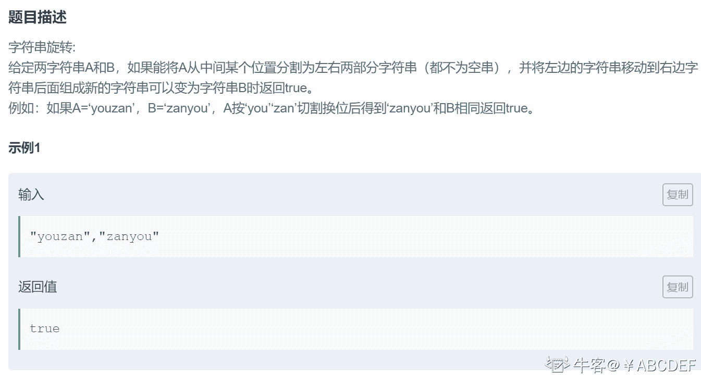
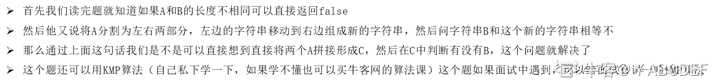

# 第十章 第 41 节 NC114 旋转字符串

> 原文：[`www.nowcoder.com/tutorial/10070/ce8088b4275d400b82e9530ab28fb3f6`](https://www.nowcoder.com/tutorial/10070/ce8088b4275d400b82e9530ab28fb3f6)

### NC114 旋转字符串

**- 1、题目描述：**


**- 2、题目链接：**
[`www.nowcoder.com/practice/80b6bb8797644c83bc50ac761b72981c?tpId=196&tqId=37172&rp=1&ru=%2Factivity%2Foj&qru=%2Fta%2Fjob-code-total%2Fquestion-ranking&tab=answerKey`](https://www.nowcoder.com/practice/80b6bb8797644c83bc50ac761b72981c?tpId=196&tqId=37172&rp=1&ru=%2Factivity%2Foj&qru=%2Fta%2Fjob-code-total%2Fquestion-ranking&tab=answerKey)

**-3、 设计思想：**



**-5、代码：**
c++版本:

```cpp
 class Solution {
public:
    /**
     * 旋转字符串
     * @param A string 字符串 
     * @param B string 字符串 
     * @return bool 布尔型
     */
    bool solve(string A, string B) {
        // write code here
        /*如果字符串的长度都不相同就直接返回 false
        如果长度相同，就让 A 字符串拼接自己然后在判断有没有 B 这个字符串
        */
        if(A.size() == B.size()){
            A += A;
            //string 中 find()返回值是字母在母串中的位置（下标记录），如果没有找到，
            //那么会返回一个特别的标记 npos。（返回值可以看成是一个 int 型的数）
            if(A.find(B) != A.npos)
                return true;
        }
        return false;
    }
};

```

Java 版本：

```cpp
import java.util.*;

public class Solution {
    /**
     * 旋转字符串
     * @param A string 字符串 
     * @param B string 字符串 
     * @return bool 布尔型
     */
    public boolean solve (String A, String B) {
        // write code here
        /*如果字符串的长度都不相同就直接返回 false
        如果长度相同，就让 A 字符串拼接自己然后在判断有没有 B 这个字符串
        */
        return A.length() == B.length() ? (A+A).contains(B) : false;
    }
}

```

Python 版本:

```cpp
#
# 旋转字符串
# @param A string 字符串 
# @param B string 字符串 
# @return bool 布尔型
#
class Solution:
    def solve(self , A , B ):
        # write code here
        '''如果字符串的长度都不相同就直接返回 false
        如果长度相同，就让 A 字符串拼接自己然后在判断有没有 B 这个字符串
        '''
        if len(A) == len(B):
            if B in (A+A):
                return True
        else:
            return False

```