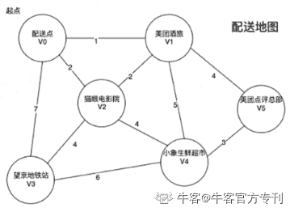

# 第三章 第 4 节 美团 2020 秋招笔试真题

> 原文：[`www.nowcoder.com/tutorial/10028/e87069f0aad34865b9934db06f22c022`](https://www.nowcoder.com/tutorial/10028/e87069f0aad34865b9934db06f22c022)

# 美团 2020 秋招笔试真题


### 1、LRU 缓存机制

【题目描述】设计和实现一个 LRU (最近最少使用) 缓存机制。它应该支持以下操作： 获取数据 get 和写入数据 put 。

获取数据 get(key)-如果密钥 (key)存在于缓存中，则获取密钥的值（总是正数），否则返回-1。

写入数据 put(key, value)-如果密钥不存在，则写入其数据值。当缓存容量达到上限时，它应该在写入新数据之前删除最近最少使用的数据值，从而为新的数据值留出空间。

**输入描述**

第一行输入缓存容量，包含一个整数 N，1≤N≤10。

接下来，每一行是一个 put 或者 get 的操作。

若输入一个 get+一个数字，则代表 get 操作和指定的 key；

若输入一个 put+两个数字，则代表 put 操作后面为 key 和 value，进行 put 操作。

读到文件结束

**输出描述**

输出多行，每一行两个数字表示缓存中的 key 和 value。按照访问时间或者插入时间，越早的越先输出。

**示例 1**

**输入**

```cpp
2
put 1 1
put 2 2
get 1
put 3 3
get 1
```

**输出**

```cpp
3 3
1 1
```

**【解题思路】**

根据题设要求实现两个操作，用 hash 表来维护数据。

**【参考代码】**

```cpp
#include <bits/stdc++.h>
using namespace std;
void get(int key, unordered_map<int, int> &hash, list<int> &l) {
    if (hash.find(key) == hash.end())
        return;
    for (auto it = l.begin(); it != l.end(); it++) {
        if (*it == key) {
            l.erase(it);
            break;
        }
    }
    l.push_back(key);
    // return hash[key];
}
void put(int key, int value, unordered_map<int, int> &hash, list<int> &l,
         int N) {
    if (hash.find(key) != hash.end()) {
        for (auto it = l.begin(); it != l.end(); it++) {
            if (*it == key) {
                l.erase(it);
                break;
            }
        }
    }
    l.push_back(key);
    hash[key] = value;
    if (l.size() > N) {
        hash.erase(*l.begin());
        l.pop_front();
    }
}
int main() {
    int N;
    cin >> N;
    unordered_map<int, int> hash;
    list<int> l;
    string s;
    int a, b;
    while (cin >> s) {
        if (s == "put") {
            cin >> a >> b;
            put(a, b, hash, l, N);
        } else if (s == "get") {
            cin >> a;
            get(a, hash, l);
        }
    }
    for (auto it = l.begin(); it != l.end(); it++) {
        cout << (*it) << " " << hash[(*it)] << endl;
    }
    return 0;
}
```

### 2、代金券组合

【题目描述】近期某商场由于周年庆，开启了“0 元购”活动。活动中，消费者可以通过组合手中的代金券，实现 0 元购买指定商品。

聪明的小团想要用算法来帮助他快速计算：对于指定价格的商品，使用代金券凑出其价格即可，但所使用的代金券总面额不可超过商品价格。由于代金券数量有限，使用较少的代金券张数则可以实现价值最大化，即最佳优惠。

假设现有 100 元的商品，而代金券有 50 元、30 元、20 元、5 元四种，则最佳优惠是两张 50 元面额的代金券；而如果现有 65 元的商品，则最佳优惠是两张 30 元代金券以及一张 5 元代金券。

请你帮助小团使用一段代码来实现代金券计算。

**输入描述**

多组输入输出，读到 s=0 时结束

输入可以有多个测试样例，每个测试由两行组成。

其中第一行包含一个整数 P，表示商品的价格，1≤P≤10000；输入 P 为 0 时表示结束。

第二行包含若干整数，使用空格分割。其中第一个整数 N（1≤N≤20）表示有多少种代金券，其后跟随 M 个整数，表示手中持有的代金券面额（1≤N≤1000），每种代金券数量不限。

**输出描述**

找到最少张数的代金券，使其面额恰好等于商品价格。输出所使用的代金券数量；

如果有多个最优解，只输出其中一种即可；

如果无解，则需输出“Impossible”。

**示例 1**

**输入**

```cpp
65
4 50 30 20 5
0
```

**输出**

```cpp
3
```

**【解题思路】**

经典背包问题，使用动态规划即可。

**【参考代码】**

```cpp
#include <iostream>
using namespace std;
int n, m, dp[100001], temp, a[20];
int main() {
    while (cin >> n) {
        for (int i = 0; i <= 100000; i++) {
            dp[i] = -1;
        }
        if (n == 0) {
            break;
        }
        cin >> m;
        for (int i = 0; i < m; i++) {
            cin >> temp;
            a[i] = temp;
            if (temp <= n) {
                dp[temp] = 1;
            }
        }
        for (int i = 0; i <= n; i++) {
            for (int j = 0; j < m; j++) {
                if (a[j] < i && dp[i - a[j]] != -1) {
                    if (dp[i] == -1) {
                        dp[i] = dp[i - a[j]] + 1;
                    } else {
                        dp[i] = min(dp[i], dp[i - a[j]] + 1);
                    }
                }
            }
        }
        if (dp[n] == -1) {
            cout << "Impossible" << endl;
        } else {
            cout << dp[n] << endl;
        }
    }
    return 0;
}
```

### 3、外卖小哥的保温箱

【题目描述】众所周知，美团外卖的口号是:“美团外卖,送啥都快”。身着黄色工作服的骑手作为外卖业务中商家和客户的重要纽带，在工作中，以快速送餐突出业务能力；工作之余，他们会通过玩智力游戏消遣闲暇时光，以反应速度彰显智慧，每位骑手拿出装有货物的保温箱，参赛选手需在最短的时间内用最少的保温箱将货物装好。 

我们把问题简单描述一下:

1 每个货物占用空间都一模一样 

2 外卖小哥保温箱的最大容量是不一样的,每个保温箱由两个值描述: 保温箱的最大容量 bi ,当前已有货物个数 a[i] ,(a[i]<=b[i]) 

3 货物转移的时候,不必一次性全部转移,每转移一件货物需要花费 1 秒的时间 

**输入描述**

第一行包含 n 个正整数(1<=n<=100)表示保温箱的数量

第二行有 n 个正整数 a[1],a[2],…,an

ai 表示第 i 个保温箱的已有货物个数

第三行有 n 个正整数 b[1],b[2],…,bn,bi 表示第 i 个保温箱的最大容量

显然,每一个 a[i]<=b[i]

**输出描述**

输出为两个整数 k 和 t, k 表示能容纳所有货物的保温箱的最少个数,t 表示将所有货物转移到这 k 个保温箱所花费的最少时间,单位为秒。

**示例 1**

**输入**

```cpp
4
3 3 4 3
4 7 6 5
```

**输出**

```cpp
2 6
```

说明

我们可以把第一个保温箱中的货物全部挪到第二个保温箱中,花费时间为 3 秒,此时第二个保温箱剩余容量为 1,然后把第四个保温箱中的货物转移一份到第二个保温箱中,转移最后两份到第三个保温箱中.总花费时间也是 3 秒,所以最少保温箱个数是 2,最少花费时间为 6 秒

**示例 2**

**输入**

```cpp
2
1 1
100 100
```

**输出**

```cpp
1 1
```

**示例 3**

**输入**

```cpp
5
10 30 5 6 24
10 41 7 8 24
```

**输出**

```cpp
3 11
```

**【参考代码】**

```cpp
#include <bits/stdc++.h>
using namespace std;

typedef long long ll;
typedef unsigned long long ull;

struct box {
    int size;
    int weight;
    bool operator<(const box &other) const {
        if (this->size != other.size)
            return this->size > other.size;
        return this->weight > other.weight;
    }
};
int n;
int maxWeight = 0;
vector<box> v;
vector<int> preSizeSum;
//选 k 个箱子，它们的容量总和不小于需要的总重量 totalWeight，并且使它们已有的重量和最大

int main(void) {
    scanf("%d", &n);
    v.resize(n);
    preSizeSum.resize(n + 1);
    int totalWeight = 0;
    for (int i = 0; i < n; ++i) {
        scanf("%d", &v[i].weight);
        totalWeight += v[i].weight;
    }
    for (int i = 0; i < n; ++i) {
        scanf("%d", &v[i].size);
    }
    vector<vector<int>> kdp(n, vector<int>(totalWeight + 1, 1e9));
    // kdp[i][j]:容量为 j 时，从[0...i]的 box 里选，需要的最少保温箱的数量
    vector<vector<int>> tdp(n, vector<int>(totalWeight + 1, 0));
    // tdp[i][j]:容量为 j 时，从[0...i]的 box 里选，保温箱数量最少时，已有的最大重量
    for (int i = 0; i < n; ++i) {
        kdp[i][0] = 0;
    }
    for (int j = 1; j <= totalWeight; ++j) {
        if (j <= v[0].size) {
            kdp[0][j] = 1;
            tdp[0][j] = v[0].weight;
        }
    }
    for (int i = 1; i < n; ++i) {
        for (int j = 1; j <= totalWeight; ++j) {
            kdp[i][j] = kdp[i - 1][j];
            tdp[i][j] = tdp[i - 1][j];
            if (j <= v[i].size) {
                kdp[i][j] = 1;
                if (kdp[i - 1][j] == 1)
                    tdp[i][j] = max(tdp[i - 1][j], v[i].weight);
                else
                    tdp[i][j] = v[i].weight;
            } else {
                kdp[i][j] = kdp[i - 1][j];
                tdp[i][j] = tdp[i - 1][j];
                if (kdp[i - 1][j - v[i].size] + 1 == kdp[i - 1][j]) {
                    tdp[i][j] = max(tdp[i - 1][j],
                                    tdp[i - 1][j - v[i].size] + v[i].weight);
                } else if (kdp[i - 1][j - v[i].size] + 1 < kdp[i - 1][j]) {
                    kdp[i][j] = kdp[i - 1][j - v[i].size] + 1;
                    tdp[i][j] = tdp[i - 1][j - v[i].size] + v[i].weight;
                }
            }
        }
    }
    int k = kdp[n - 1][totalWeight];
    int t = totalWeight - tdp[n - 1][totalWeight];
    printf("%d %d\n", k, t);
    return 0;
}
```

### 4、最短送餐路程计算

【题目描述】美团外卖是知名的外卖平台，现在有一名新入职的外卖小哥。请你给他写一段程序根据外卖地图和交通拥堵情况，告诉他从“配送点”V0，到各个目的地的最短配送距离。其中拥堵程度可以与路径参数直接相加，例如：V0 点拥堵，拥堵系数是 2，那么在地图上 V0 点的 3 条线路的参数都要加 2，由原来的 1、2、7 变为 3、4、9 再进行。  

路径规划计算。路径参数越大代表路程越长。

**输入描述**

输入数据只有一行，有三个 int 型参数，分别表示：目的地编号、拥堵节点编号和拥堵值。

例如：4 3 1，代表目的地是 V4，在 V3 节点有拥堵情况，拥堵系数是 1。

**输出描述**

输出一个数字表示有起点 V0 到终点的最短距离

**示例 1**

**输入**

```cpp
4 2 1
```

**输出**

```cpp
6
```

**示例 2**

**输入**

```cpp
5 4 1
```

**输出**

```cpp
5
```

**【解题思路】**

最短路问题，用 dijkstra 算法。

**【参考代码】**

```cpp
class Solution:
    '''
    输入：邻接矩阵，
    输出，源点 V0 到各点的最小距离
    '''

    def Dijkstr(self, graph, v0):
        # final 保存已经遍历过的点，d 保存最短路径
        n = len(graph)
        final, D = [0]*n, [0]*n
        for i in range(0, n):
            D[i] = graph[v0][i]
        D[v0] = 0
        final[v0] = 1
        for v in range(1, n):
            min = float("Inf")
            for w in range(0, n):
                if final[w] == 0 and D[w] < min:
                    k = w
                    min = D[w]
            final[k] = 1
            for w in range(0, n):
                if final[w] == 0 and min + graph[k][w] < D[w]:
                    D[w] = min + graph[k][w]
        return D

s = Solution()
aim, crowd, exp = map(int, input().split())

graph = [
    [0, 1, 2, 7, 9999, 9999],
    [1, 0, 2, 9999, 5, 4],
    [2, 2, 0, 4, 4, 9999],
    [7, 9999, 4, 0, 6, 9999],
    [9999, 5, 4, 6, 0, 3],
    [9999, 4, 9999, 9999, 3, 0]
]
for i in range(0, len(graph)):
    for j in range(0, len(graph)):
        if i == crowd&nbs***bsp;j == crowd:
            graph[i][j] += exp
print(s.Dijkstr(graph, 0)[aim])
```

### 5、美团骑手包裹区间分组

【题目描述】2110 年美团外卖火星第 3000 号配送站点有 26 名骑手，分别以大写字母 A-Z 命名，因此可以称呼这些骑手为黄家骑士特工 A，黄家骑士特工 B…黄家骑士特工 Z，某美团黑珍珠餐厅的外卖流水线上会顺序产出一组包裹，美团配送调度引擎已经将包裹分配到骑手，并在包裹上粘贴好骑手名称，如 RETTEBTAE 代表一组流水线包裹共 9 个，同时分配给了名字为 A B E R T 的 5 名骑手。请在不打乱流水线产出顺序的情况下，把这组包裹划分为尽可能多的片段，同一个骑手只会出现在其中的一个片段，返回一个表示每个包裹片段的长度的列表。

**输入描述**

输入数据只有一行，为一个字符串(不包含引号)，长度不超过 1000，只包含大写字母'A'到'Z'，字符之间无空格。

**输出描述**

输出每个分割成片段的包裹组的长度，每个长度之间通过空格隔开

**示例 1**

**输入**

```cpp
MPMPCPMCMDEFEGDEHINHKLIN
```

**输出**

```cpp
9 7 8
```

**说明**

划分结果为 MPMPCPMCM,DEFEGDE,HINHKLIN。

每个骑手最多出现在一个片段中。

像 MPMPCPMCMDEFEGDE,HINHKLIN 的划分是错误的，因为划分的片段数较少。

**【解题思路】**

滑动窗口，先判断当前字符的最后一个位置在哪，在不断的更新另一个指针使得开始指针与结尾指针满中间没有的元素在后面不会出现。

**【参考代码】**

```cpp
import java.util.*;

public class Main {
    public static void main(String[] args) {
        Scanner scanner = new Scanner(System.in);
        String s = scanner.nextLine();
        int i = 0, j = 0, len = s.length();
        while (j < len) {
            char c = s.charAt(j);
            int tail = s.lastIndexOf(c);
            int pre = j;
            i = j + 1;
            j = tail;
            while (i < j) {
                char inner = s.charAt(i);
                j = Math.max(j, s.lastIndexOf(inner));
                i++;
            }
            j++;
            System.out.print(j - pre + " ");
        }
    }
}

```