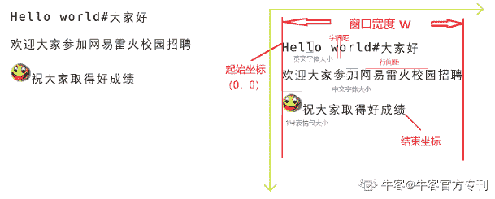

# 第三章 第 13 节 网易雷火 2020 秋招笔试真题

> 原文：[`www.nowcoder.com/tutorial/10028/6738241e29ad471abc7947ea76a38a51`](https://www.nowcoder.com/tutorial/10028/6738241e29ad471abc7947ea76a38a51)

## 网易雷火 2020 秋招笔试真题


### 1、模拟点击

【题目描述】本题需要让你模拟一下在 Windows 系统里窗口和鼠标点击的操作，具体如下：
1.屏幕分辨率为 3840*2160，左上角坐标为(0, 0)， 右下角坐标为(3839, 2159)
2.窗口是一个矩形的形状，由左上角坐标(X, Y)，和宽高(W, H)，四个数字来定位。左上角坐标为(X, Y)、右下角坐标为(X+W, Y+H)，其中左上角坐标一定会在屏幕范围内，其他一些部分可能会超过屏幕范围。
3.窗口的点击和遮挡规则同 Windows，但是不考虑关闭窗口、最大化、最小化和强制置顶的情况。即
    3.1 如果发生重叠的话，后面打开的窗口会显示在前面打开的窗口上面
    3.2 当鼠标发生一次点击的时候，需要判断点击到了哪个窗口，如果同个坐标有多个窗口，算点击到最上层的那个
    3.3 当一个窗口被点击的时候，会浮动到最上层

**输入描述**

每个测试输入包含 1 个测试用例
第一行为 2 个整数 N, M。其中 N 表示打开的窗口数目，M 表示鼠标点击的数目。其中 0<N,M<1000
接下来 N 行，每一行四个整数 X[i] Y[i] W[i] H[i]，分别表示第 i 个窗口（窗口 Id 为 i，从 1 开始计数）的左上角坐标以及宽高，初始时窗口是按输入的顺序依次打开。其中 0<=X[i]<3840, 0<=Y[i]<2160, 0<W[i]<3840, 0<H[i]<2160
再接下来有 M 行，每一行两个整数 X[j] Y[j]，分别表示接下来发生的鼠标点击坐标。其中 0 <=X[j]<3840, 0<=Y[j]<2160

**输出描述**

对于每次鼠标点击，输出本次点击到的窗口 Id。如果没有点击到窗口，输出-1

**示例 1**

**输入**

```cpp
2 4
100 100 100 100
10 10 150 150
105 105
180 180
105 105
1 1
```

**输出**

```cpp
2
1
1
-1
```

**【解题思路】**

根据题意模拟即可。

**【参考代码】**

```cpp
#include "stdio.h"
struct WIND_t {
    int pri;
    int x, y;
    int w, h;
};

WIND_t wnd[2000];

int main() {
    int n, m;
    while (scanf("%d%d", &n, &m) != EOF) {
        int PRI = 0;
        for (int i = 1; i <= n; i++) {
            scanf("%d%d%d%d", &wnd[i].x, &wnd[i].y, &wnd[i].w, &wnd[i].h);
            wnd[i].pri = ++PRI;
        }

        for (int i = 0; i < m; i++) {
            int cx, cy;
            scanf("%d%d", &cx, &cy);

            int ans = -1;
            int anspri = -1;
            for (int j = 1; j <= n; j++) {
                WIND_t &t = wnd[j];
                if (t.x <= cx && cx <= t.x + t.w && t.y <= cy &&
                    cy <= t.y + t.h) {
                    if (ans == -1 || anspri < t.pri) {
                        ans = j;
                        anspri = t.pri;
                    }
                }
            }

            if (ans > 0)
                wnd[ans].pri = ++PRI;
            printf("%d\n", ans);
        }
    }
    return 0;
}
```

### 2、Stern-Brocot tree

【题目描述】The Stern-Brocot tree is an infinite complete binary tree in which the vertices correspond one-for-one to the positive rational numbers, whose values are ordered from the left to the right as in a search tree.

Figure 1 shows a part of the Stern-Brocot tree, which has the first 4 rows. Each node in the tree is marked in a red cycle. The value in the node is the mediant of the left and right fractions. The mediant of two fractions A/B and C/D is defined as (A+C)/(B+D).
To construct the Stern-Brocot tree, we first define the left fraction of the root node is 0/1, and the right fraction of the root node is 1/0\. So the value in the root node is the mediant of 0/1 and 1/0, which is (0+1)/(1+0)=1/1\. Then the value of root node becomes the right fraction of the left child, and the left fraction of the right child. For example, the 1st node in row2 has 0/1 as its left fraction and 1/1(which is the value of its parent node) as its right fraction. So the value of the 1st node in row2 is (0+1)/(1+1)=1/2\. For the same reason, the value of the 2nd node in row2 is (1+1)/(1+0)=2/1\. This construction progress goes on infinitly. As a result, every positive rational number can be found on the Stern-Brocot tree, and can be found only once.
Given a rational number in form of P/Q, find the position of P/Q in the Stern-Brocot Tree.

**输入描述**

Input consists of two integers, P and Q (1<=P,Q<=1000), which represent the rational number P/Q. We promise P and Q are relatively prime.

**输出描述**

Output consists of two integers, R and C.
R indicates the row index of P/Q in the Stern-Brocot Tree, C indicates the index of P/Q in the row.
Both R and C are base 1.
We promise the position of P/Q is always in the first 12 rows of the Stern-Brocot tree, which means R<=12\.

**示例 1**

**输入**

```cpp
5 3
```

**输出**

```cpp
4 6
```

**【解题思路】**

实现一个分数类，然后进行模拟运算即可。

**【参考代码】**

```cpp
#define _CRT_SECURE_NO_WARNINGS

#include <stdio.h>

static inline int gcd(int a, int b) { return b ? gcd(b, a % b) : a; }

struct fraction {
    int p, q;
    fraction(int p, int q) {
        int t = gcd(p, q);
        this->p = p / t;
        this->q = q / t;
    }
    bool operator==(const fraction &o) const { return p == o.p && q == o.q; }
    bool operator>(const fraction &o) const { return p * o.q > o.p * q; }
    bool operator<(const fraction &o) const { return p * o.q < o.p * q; }
};

int main() {
    int p, q;
    scanf("%d%d", &p, &q);
    fraction target(p, q);
    fraction left(0, 1);
    fraction right(1, 0);
    fraction curr(1, 1);
    int level = 0;
    unsigned int count = 0;
    unsigned int index = 0;
    for (;;) {
        if (target == curr) {
            printf("%d %u\n", level + 1, index + 1 - count); // base 1
            break;
        }
        if (target < curr) {
            index = 2 * index + 1;
            right = curr;
        } else {
            index = 2 * index + 2;
            left = curr;
        }
        curr = fraction(left.p + right.p, left.q + right.q);
        count += (1 << level);
        level++;
    }

    return 0;
}
```

### 3、聊天消息排版

【题目描述】在网游中，聊天功能是一项非常重要的功能，加上玩家可以打出游戏内置的一些表情图片，因此需要实现一个图文混排系统，如上图所示。

玩家在聊天框输入的是一段 utf-8 编码的文字，且只会包含中文、英文、中英文的标点符号和空格（不会出现换行、回车和制表符）。按照网易游戏的传统，井号(#)是作为一个转义字符，支持下面几种转义行为：

1\. #加一个数字来表示内置的表情图片，为了简化问题，我们这里只支持 20 个表情图片，从 0 开始计数，并且数字是按最长匹配原则去匹配，比如#0 表示 0 号表情图片、#1 表示 1 号表情图片、#19 表示 19 号表情图片、#20 则表示 2 号表情图片后面加数字 0。需要注意的是#00 表示的是 0 号表情图片加后面数字 0。

2\. #r 表示换行，遇到以后会自动切换到下一行开始排版。

3\. ##表示显示出#这个符号

4.如果玩家不按规则输入错误的转义，则按照玩家的输入原样显示，比如#a、#、#,、#啊

 

上图所示的玩家输入为：“Hello world#大家好#r 欢迎大家参加网易雷火校园招聘#1 祝大家取得好成绩”

排版的时候需要像上图一样，将文字从起始位置开始，依次显示在聊天窗口里，一些显示规则如下所示：

1.聊天窗口的宽度固定为 W 像素，起始坐标为左上角，坐标为(0, 0)，右上角坐标为(W-1, 0)，坐标向右向下增长。任何文字和表情必须显示在窗口内，不能超出窗口。但是高度可以无限向下延伸。

2.显示的字体均为等宽字体，英文（包括英文标点符号和空格）的字体宽度统一为 XE，高度统一为 YE。中文（包括中文的标点符号）的字体宽度统一为 XC，高度统一为 YC。

3.每个表情图片的宽高是独立的，0 号表情图片的宽度为 X0，高度 Y0，依次类推，19 号表情图片的宽度为 X19，高度为 Y19。

4.字符（中英文以及标点符号、空格等，下同）与字符之间、字符与表情之间、表情与表情之间都需要额外保留一个 PX 像素的字间距。每一行第一个字符左边，以及最后一个字符右边不需要保留字间距。

5.当下一个字符或者表情无法在本行 W 宽度的像素内完整显示的话，则会强行换到下一行首开始显示。遇到#r 的时候也会自动换到下一行开始显示下一个字符或表情。

6.在一行里出现高度不同的中英文以及表情的时候，需要将其底部对齐。

7.当一行里没有任何字符或表情，直接被#r 换行的时候，这一行的高度算英文字体的高度。

8.每一行里高度最高的字符或表情，需要同上一行的的底部保留 PY 像素的行间距。第一行上面与最后一行下面不需要保留行间距。

9.最后一个字符或表情显示显示以后，它的右下角坐标则为结束坐标。也就是本题需要求解的问题。输入保证最后不会以#r 结尾。

**输入描述**

每个测试输入包含 1 个测试用例
第一行为 7 个正整数 W, XE, YE, XC, YC, PX, PY
第二行为 40 个正整数 X0,
Y0, X1, Y1…X19, Y19
第三行为长度不超过 10000 的十六进制编码过的玩家输入，即玩家输入的 utf-8 编码的数据每个字节的数字转成大写的十六进制表示，不足两位的话前面补 0（同 C 里 printf 的%X 格式化），然后不同字节的十六进制编码表示依次拼接起来。
比如 Hello 的十六进制编码表示为 48656C6C6F。
前两行的各个数字含义如上文描述，其中 50<W<10000，0<其他<50。

**输出描述**

输出用空格隔开的两个数字，表示结束坐标

**示例 1**

**输入**

```cpp
60 2 4 3 4 1 3
7 6 7 6 7 6 7 6 7 6 7 6 7 6 7 6 7 6 7 6 7 6 7 6 7 6 7 6 7 6 7 6 7 6 7 6 7 6 7 6
48656C6C6F20776F726C6423E5A4A7E5AEB6E5A5BD2372E6ACA2E8BF8EE5A4A7E5AEB6E58F82E58AA0E7BD91E69893E***7E781ABE6A0A1E59BADE68B9BE881982331E7A59DE5A4A7E5AEB6E58F96E5BE97E5A5BDE68890E7BBA9
```

**输出**

```cpp
38 19
```

**【解题思路】**

大模拟题，注意各种情况的讨论。

**【参考代码】**

```cpp
#include "stdio.h"

#define MAXN 100000

int W, XE, YE, XC, YC, PX, PY;
int ICON_X[100], ICON_Y[100];
char INPUT_HEX[MAXN];
unsigned char INPUT[MAXN];
int LEN;

int POS;
int BACKUP_POS;

int ANS_X, ANS_Y;

enum TokenType {
    tEOF,
    tNewLine,
    tEnglish,
    tChinese,
    tIcon,
};

void restore_last_token() { POS = BACKUP_POS; }

TokenType get_token(int &iconId) {
    BACKUP_POS = POS;
    if (POS >= LEN)
        return tEOF;

    int c = INPUT[POS++];
    if (c <= 127) {
        if (c == '#') {
            if (POS >= LEN)
                return tEnglish;

            int d = INPUT[POS];
            if (d == 'r') {
                POS++;
                return tNewLine;
            } else if (d == '#') {
                POS++;
                return tEnglish;
            } else if (d >= '0' && d <= '9') {
                POS++;
                if (d == '1' && POS < LEN && INPUT[POS] >= '0' &&
                    INPUT[POS] <= '9') {
                    iconId = (d - '0') * 10 + INPUT[POS] - '0';
                    POS++;
                    return tIcon;
                }

                iconId = (d - '0');
                return tIcon;
            }
        }
        return tEnglish;
    } else {

        /*
                Unicode 符号范围 | UTF - 8 编码方式
                (十六进制) | （二进制）
                        ---------------------- +
           -------------------------------------------- - 0000 0000 - 0000 007F
           | 0xxxxxxx 0000 0080 - 0000 07FF | 110xxxxx 10xxxxxx 0000 0800 - 0000
           FFFF | 1110xxxx 10xxxxxx 10xxxxxx 0001 0000 - 0010 FFFF | 11110xxx
           10xxxxxx 10xxxxxx 10xxxxxx
        */
        if ((c & 0xF0) == 0xF0)
            POS += 3;
        else if ((c & 0xE0) == 0xE0)
            POS += 2;
        else
            POS += 1;
        return tChinese;
    }
}

bool try_put(int &height, int &width, int w, int h) {
    int nw = width;

    if (nw > 0)
        nw += PX;
    nw += w;

    if (nw > W)
        return false;

    width = nw;
    if (h > height)
        height = h;
    return true;
}

bool get_line(int &height, int &width) {
    if (POS >= LEN)
        return false;

    height = 0;
    width = 0;

    while (true) {
        int iconId = 0;
        TokenType tp = get_token(iconId);

        if (tp == tEOF) {
            break;
        } else if (tp == tNewLine) {
            break;
        } else if (tp == tEnglish) {
            if (!try_put(height, width, XE, YE)) {
                restore_last_token();
                break;
            }
        } else if (tp == tChinese) {
            if (!try_put(height, width, XC, YC)) {
                restore_last_token();
                break;
            }
        } else if (tp == tIcon) {
            if (!try_put(height, width, ICON_X[iconId], ICON_Y[iconId])) {
                restore_last_token();
                break;
            }
        }
    }

    if (height == 0)
        height = YE; //修正直接换行的情况，高度为英文字体
    return true;
}

void render() {
    int totalHeight = 0;

    int height, endx;

    while (get_line(height, endx)) {
        if (totalHeight > 0)
            totalHeight += PY;
        totalHeight += height;

        //  printf("xxxxx %d %d\n", height, endx);
        ANS_X = endx;
        ANS_Y = totalHeight;
    }
}

inline int hex2digit(char c) {
    if (c >= '0' && c <= '9')
        return c - '0';
    return c - 'A' + 10;
}

int main() {
    while (scanf("%d%d%d%d%d%d%d", &W, &XE, &YE, &XC, &YC, &PX, &PY) != EOF) {
        for (int i = 0; i < 20; i++) {
            scanf("%d%d", &ICON_X[i], &ICON_Y[i]);
        }

        scanf("%s", INPUT_HEX);

        POS = 0;
        LEN = 0;
        for (int i = 0; INPUT_HEX[i]; i += 2) {
            INPUT[LEN++] = (unsigned char)(hex2digit(INPUT_HEX[i]) << 4) |
                           (hex2digit(INPUT_HEX[i + 1]));
        }

        render();

        printf("%d %d\n", ANS_X - 1, ANS_Y - 1);
    }
    return 0;
}
```

### 4、双人数字游戏

【题目描述】游戏规则如下
- 在棋盘上有 N 个数字（A1~AN）从左到右排列成一行
- A，B 两个玩家轮流进行游戏，第一回合 A 玩家行动，第二回合 B 玩家行动，依次行动直到游戏结束
- 每回合玩家可以选择拿走棋盘上最左边或者最右边的一个数字，其余的都不能拿
- 拿走的数字依次从左到右排列在自己面前
- 棋盘上所有数字被拿走后游戏结束
- 最优策略的说明：在任意局面下，玩家如果取左边的数字或者取右边的数字，最终最优得分都一样，那么只能取左边的数字
当所有数字都被拿走后，A,B 两个玩家面前都各有一个数列。
假设 A 玩家面前数字从左到右为 X1,X2,X3...XM，则他的最终得分 Sa 计算方式如下（B 玩家的得分计算 Sb 也类似，不赘述）：
Sa=abs(X1-0)+abs(X2-X1)+abs(X3-X2)+...+abs(XM - X(M-1))
请计算在以上的规则下，如果两个玩家都想拿到尽量多的分数，用最优策略进行游戏，计算两个人的最终得分。

**输入描述**

第一行一个数字 N, 一半的测试用例 (0 <N<=50)，一半的测试用例 (0<N<=1000)
第二行 N 个数字 Ai

**输出描述**

用空格隔开的两个整数 Sa 和 Sb

**示例 1**

**输入**

```cpp
4
1 2 3 4
```

**输出**

```cpp
7 4
```

**【解题思路】**

区间 DP 去模拟游戏过程。

**【参考代码】**

```cpp
#include <bits/stdc++.h>
using namespace std;

int a[1001];
int N;

int best[1000][1000][4];
int pick[1000][1000][4];
vector<int> last;

int calc(int l, int r, int status) {
    if (best[l][r][status] >= 0)
        return best[l][r][status];
    if (l > r)
        return 0;
    if (l == r) {
        if (status == 0) {
            if (l < 2)
                return 0;
            best[l][r][status] = abs(a[l] - a[l - 2]);
        } else if (status == 1) {
            if (l < 1)
                return 0;
            best[l][r][status] = abs(a[l] - a[l - 1]);
        } else if (status == 2) {
            if (r > N - 2)
                return 0;
            best[l][r][status] = abs(a[l] - a[l + 1]);
        } else {
            if (r > N - 3)
                return 0;
            best[l][r][status] = abs(a[l] - a[l + 2]);
        }
        pick[l][r][status] = l;
        return best[l][r][status];
    }

    int last1, last2, rl, rr;
    if (status == 0) {
        if (l < 2)
            return 0;
        calc(l + 1, r, 0);
        calc(l, r - 1, 1);
        last1 = a[l - 2];
        last2 = a[l - 1];
        rl = abs(last1 - a[l]);
        if (pick[l + 1][r][0] == l + 1)
            rl += calc(l + 2, r, 0);
        else
            rl += calc(l + 1, r - 1, 1);
        rr = abs(last1 - a[r]);
        if (pick[l][r - 1][1] == l)
            rr += calc(l + 1, r - 1, 2);
        else
            rr += calc(l, r - 2, 3);
    } else if (status == 1) {
        if (l < 1 || r > N - 2)
            return 0;
        calc(l + 1, r, 2);
        calc(l, r - 1, 3);
        last1 = a[l - 1];
        last2 = a[r + 1];
        rl = abs(last1 - a[l]);
        if (pick[l + 1][r][2] == l + 1)
            rl += calc(l + 2, r, 0);
        else
            rl += calc(l + 1, r - 1, 1);
        rr = abs(last1 - a[r]);
        if (pick[l][r - 1][3] == l)
            rr += calc(l + 1, r - 1, 2);
        else
            rr += calc(l, r - 2, 3);
    } else if (status == 2) {
        if (l < 1 || r > N - 2)
            return 0;
        calc(l + 1, r, 0);
        calc(l, r - 1, 1);
        last1 = a[r + 1];
        last2 = a[l - 1];
        rl = abs(last1 - a[l]);
        if (pick[l + 1][r][0] == l + 1)
            rl += calc(l + 2, r, 0);
        else
            rl += calc(l + 1, r - 1, 1);
        rr = abs(last1 - a[r]);
        if (pick[l][r - 1][1] == l)
            rr += calc(l + 1, r - 1, 2);
        else
            rr += calc(l, r - 2, 3);

    } else {
        if (r > N - 3)
            return 0;
        calc(l + 1, r, 2);
        calc(l, r - 1, 3);
        last1 = a[r + 2];
        last2 = a[r + 1];
        rl = abs(last1 - a[l]);
        if (pick[l + 1][r][2] == l + 1)
            rl += calc(l + 2, r, 0);
        else
            rl += calc(l + 1, r - 1, 1);
        rr = abs(last1 - a[r]);
        if (pick[l][r - 1][3] == l)
            rr += calc(l + 1, r - 1, 2);
        else
            rr += calc(l, r - 2, 3);
    }

    if (rl >= rr) {
        pick[l][r][status] = l;
        best[l][r][status] = rl;
    } else {
        pick[l][r][status] = r;
        best[l][r][status] = rr;
    }
    return best[l][r][status];
}

int main() {
    int i, j, k;
    cin >> N;
    for (i = 0; i < N; i++)
        cin >> a[i];
    memset(best, 0xff, sizeof(best));
    memset(pick, 0, sizeof(pick));

    int r1 = 0, r2 = 0;
    int t1, t2;
    int t11, t12;
    int t21, t22;
    calc(2, N - 1, 0);
    calc(1, N - 2, 1);
    if (pick[2][N - 1][0] == 2)
        t21 = a[1] + calc(3, N - 1, 0);
    else
        t21 = a[1] + calc(2, N - 2, 1);
    if (pick[1][N - 2][1] == 1)
        t22 = a[N - 1] + calc(2, N - 2, 2);
    else
        t22 = a[N - 1] + calc(1, N - 3, 3);
    if (t21 >= t22) {
        t1 = a[0] + calc(2, N - 1, 0);
        t2 = t21;
    } else {
        t1 = a[0] + calc(1, N - 2, 1);
        t2 = t22;
    }
    calc(1, N - 2, 2);
    calc(0, N - 3, 3);
    if (pick[1][N - 2][2] == 1)
        t21 = a[0] + calc(2, N - 2, 0);
    else
        t21 = a[0] + calc(1, N - 3, 1);
    if (pick[0][N - 3][3] == 0)
        t22 = a[N - 2] + calc(1, N - 3, 2);
    else
        t22 = a[N - 2] + calc(0, N - 4, 3);
    if (t21 >= t22) {
        t11 = a[N - 1] + calc(1, N - 2, 2);
        if (t11 > t1) {
            t1 = t11;
            t2 = t21;
        }
    } else {
        t11 = a[N - 1] + calc(0, N - 3, 3);
        if (t11 > t1) {
            t1 = t11;
            t2 = t22;
        }
    }
    r1 = t1;
    r2 = t2;
    printf("%d %d\n", r1, r2);
}
```

### 5、字符串提取

【题目描述】输入一个表达式 s，表达式中包含字母，数字以及方括号，其中方括号前的数字表示方括号中内容的重复次数，请输出该表达式 s 代表的字符串（数字与方括号不独立出现，括号中的内容可以是普通字符串或表达式）。

**输入描述**

abc3[a]

**输出描述**

Abcaaa

**示例 1**

**输入**

```cpp
Abc
```

**输出**

```cpp
abc
```

**【解题思路】**

根据题意模拟实现即可。

**【参考代码】**

```cpp
import sys

for s in sys.stdin:
    # write your code here
    nums = []
    results = []
    result = ""
    index = 0
    while index < len(s):
        c = s[index]
        if c.isdigit():
            while s[index + 1].isdigit():
                index += 1
                c += s[index]
            nums.append(int(c))
            results.append(result)
            result = ""
        elif c == "[":
            pass
        elif c == "]":
            result *= nums.pop()
            result = results.pop() + result
        else:
            result += c

        index += 1
    print(result.strip())

```