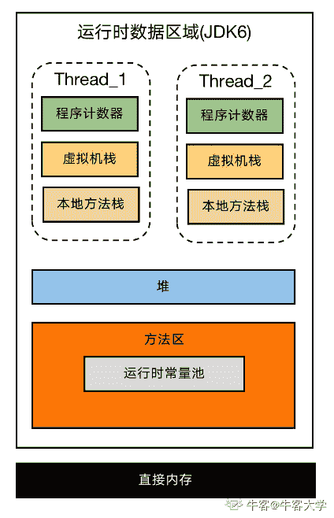
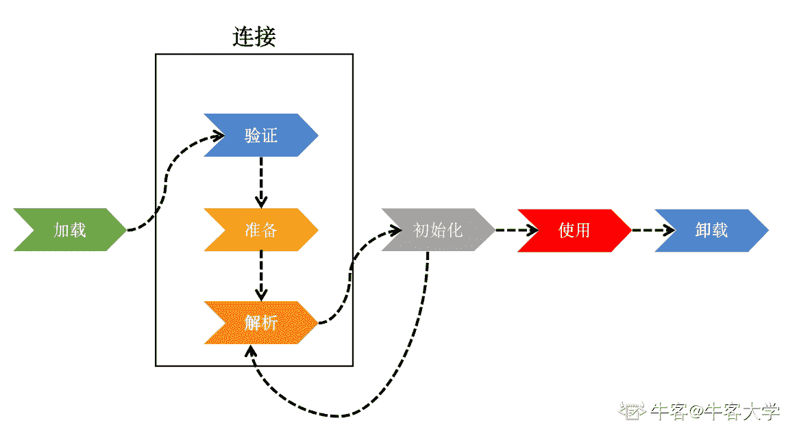

# 第一章 第 1 节 专刊简介

> 原文：[`www.nowcoder.com/tutorial/10077/5245d5da36a042ec9af2f9e3d14720ce`](https://www.nowcoder.com/tutorial/10077/5245d5da36a042ec9af2f9e3d14720ce)

JVM 系列文章共 5 篇，分别从以下方面展开介绍:

*   JVM 内存模型篇
*   JVM 类加载
*   JVM 对象实例化
*   JVM 工具及调优
*   JVM 垃圾回收算法及垃圾回收

JVM 系列文章的核心目的是帮助各位同学在面试中面对 JVM 问题时能有良好的表现，但是希望各位同学不要死记硬背，在反复的学习中形成自己的理解，这样才会获得面试官的青睐。

# 各章节概览

## 1 JVM 内存模型篇

本章内容较为重要且偏理论，需要同学们反复理解记忆。其中涉及的运行时数据区域部分具有相当多的细节点，因此在理解时建议大家自己多在纸上画画架构图辅助记忆，例如：



本章节内容在面试中有 90%的概率被提及，例如：

1.  请谈谈对 JVM 内存模型的理解
2.  堆内存和栈内存的区别
3.  直接内存如何使用
4.  哪些运行时内存是私有的，哪些是共有的

回答这些问题有一个万变不离其宗的模板，模板结构如下：

*   简述 JVM 为什么使用内存，使用内存都做什么？
*   内存被分为哪些区域？(直接内存，运行时区域)
    *   运行时区域由哪些部分组成？各自都有哪些特性？在 JVM 中起到什么作用？是否私有？会不会出现 OutOfMemory？
    *   对虚拟机栈理解深刻的同学可以额外回答下栈上分配以及逃逸分析等加分点
    *   对堆理解深刻的同学可以通过讲堆与 GC 关系，从而引导面试官问一些垃圾回收的问题
    *   方法区重点讲常量池以及 Java 版本变化对方法区的影响
    *   讲一讲自己在写代码时 new 的对象到底在哪个区域上存储

## 2 JVM 类加载

本节内容主要是理论，有少量源码需要掌握。在理解时同样要结合图片，在面试时脑海里只要浮现出图片，很容易就将理论内容讲出来。



这部分内容在面试中被提及的概率不高，不过一些喜欢深挖的面试官会问一些问题，例如：

*   类加载和对象实例化的区别
*   类加载器，尤其是双亲委派

双亲委派部分需要同学们必须掌握，甚至能自己手写伪代码。如果基础较深，可以讲讲双亲委派被破坏的场景，结合一些框架的设计思路讲效果更佳。

## 3 JVM 对象实例化

本节内容主要是理论，与 JVM 类加载有较大关联。

本节内容在面试中有 60%的概率会被提及，例如：

*   对象实例化时的内存分配策略及内容
*   对象实例化时是否有线程安全问题
*   是否了解对象本身的内存布局
*   对象有几种访问方式？各自的优缺点
*   一个对象到底占用多大内存空间

对象内存布局部分基础较深的同学可以讲讲对 TLAB 的理解，这块儿是家分点。美团面试官喜欢抠对象头的内存空间如何分配，如果能精确到具体字节数以及 32 位与 64 区别将会得到加分。此外，对象头部分也涉及轻重锁，可以适当引导面试官问一些多线程的问题。

## 4 JVM 工具及调优

本节内容理论较少，实战偏多。同学们需要跟着文章中的指引实操一遍，然后自己基于手头的 Java 项目进行调优。这部分内容面试中被问到的概率较高，一般有两种提问方式：

*   了解 JVM 工具么？(看你是否知道这些工具是干嘛的)
*   有调优经验么？(看你对这些工具的使用熟练度)

这部分内容需要同学们不断精进，要有自己调优的体验，在面试中通过罗列具体的数据使面试官信服。感兴趣的同学可以进一步深入学习垃圾回收，因为很多线上问题都是由于 FullGC 导致的，一些调优经验可以缓解线上频繁 GC 的问题。

## 5 JVM 垃圾回收算法及垃圾回收

本节内容偏理论，同学们切勿死记硬背。对于面试中垃圾回收相关的一切问题，均可以用下面这套模板，同学们根据自己的水平可以增减内容：

*   为什么要做垃圾回收？哪些内存区域执行垃圾回收？
*   怎么判断一片内存应该被执行垃圾回收？
    *   引用计数&可达性分析，内容及优缺点分析
    *   可达性分析的细节，哪些对象作为根对象开始分析？
    *   有些面试官可能会问循环计数是否有解决方案，这块是加分点
*   谈谈垃圾回收算法
    *   介绍四种垃圾回收算法
    *   垃圾回收算法与是否分代的关系
*   谈谈垃圾回收器
    *   常见垃圾回收器各自的特性，适用于哪个代？各自的优缺点
    *   基础好的同学可以着重对比 CMS 和 G1，最好有调优经验，这部分是加分点
    *   谈谈 GC 对内存分配的影响(优先 Eden、大对象及长期存活对象晋升以及空间担保分配)
    *   基础好的同学可以谈谈近几年衍生出的新垃圾回收器，例如 ZGC 的特性，这块是加分点
    *   基础好的同学可以跳出 JVM 的局限，谈谈其他语言的 GC，并和 JVM 对比，这块是加分点

# 总结

在总结里只需要一个问题就能对 JVM 系列文章的内容进行概括，大家自测下学习成果吧。

```cpp
public static void main(String[] args) {    
    System.out.println("Hello World!"); 
}
```

这是一段大家很熟悉的代码，你能把它执行背后发生什么讲清楚么?y 阿里的面试官比较喜欢问这些问题。本题没有标准答案，这里仅抛砖引玉给出一些个人见解。

*   .java 编译成.class 文件（通过 javac）

*   JVM 执行类加载
    *   根据命令行传入的参数找到.class 文件
        *   通过文件系统
        *   通过 zip/jar 压缩包
        *   通过网络 IO
    *   .class 文件校验
        *   文件格式校验：魔数、主副版本号、常量池、访问标志、类索引、父类索引、接口索引
        *   元数据校验
        *   字节码校验
        *   符号链接校验
    *   准备（初始化零值）、解析、初始化
    *   可以拓展讲下类加载器、双亲委派模型以及运行时的类加载
    *   可以拓展讲下 JVM 内存模型，类加载重点分析方法区，再结合不同版本中方法区的调整变化进行叙述

*   JVM 实例化对象
    *   分配内存
        *   指针碰撞、空闲列表
        *   线程安全问题、TLAB
    *   初始化，注意此处与类加载中初始化的区别
    *   设置对象头
        *   讲讲对象头中的内存如何分配
        *   拓展讲下与多线程和锁相关的字段
        *   拓展讲下开启/关闭指针压缩的区别

*   讲下 HelloWorld 中涉及到哪些变量和对象
    *   String[]在哪存放？
    *   "HelloWorld"在哪存放？初始化的时机，可以拓展讲讲方法区字符串常量池，以及其随 JDK 版本演化发生的变化，以及`String.intern()`

*   讲下`System.out.println("Hello World!")`涉及了哪些类的加载？方法调用时如何在类中进行搜索？讲下方法调用涉及的栈和栈帧，是否会出现爆栈的情况？

# 结语

JVM 系列文章到这里也要结束了，JVM 是 Java 面试中的常客，也是大家精进 Java 技术必不可少的一关。JVM 不仅涉及大量理论，还需要大家结合项目、源码加深理解。本系列文章主要面向 0 基础以及一些有经验的同学。下面给出一些后续学习的内容供大家参考：

*   类文件结构
*   字节码指令集
*   运行时栈帧结构与方法调用的实现
*   字节码的执行原理
*   字节码运行期优化理论
*   JVM 实现多线程的原理
*   GC 的高级理论
*   用其他语言写个简单的 JVM

鉴于作者入行不深以及写作水平有限，文章难免存在一些待改进的地方，欢迎各位同学批评指正，也欢迎积极交流技术。最后预祝大家在面试中取得好成绩！