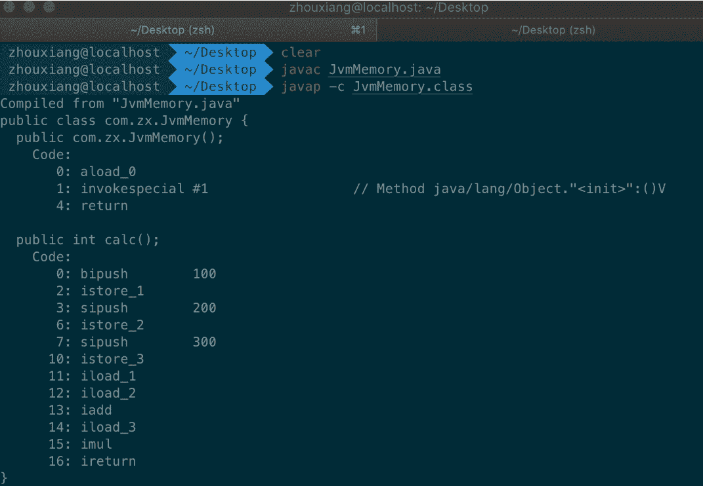

# 第二章 第 1 节 知识点精讲

> 原文：[`www.nowcoder.com/tutorial/10077/967968497693483a91870277bc5ce2ce`](https://www.nowcoder.com/tutorial/10077/967968497693483a91870277bc5ce2ce)

## 1.1 知识点入门理解

### 1.1.2 程序计数器

对了解计算机底层的同学来说，程序计数器是一个比较熟悉的概念。JVM 中的程序计数器与操作系统中的程序计数器类似，都是执行指令流转的空间。以加法为例，计算`a+b`从直观概念上是个简单的过程，但是底层执行层面上会依次执行若干条指令，通过程序计数器的调度完成计算。程序计数器是类比为当前线程**执行字节码的行号指示器**。程序计数器通过改变值来选取下一条需要执行的字节码指令，例如分支、循环、跳转、异常处理、线程恢复等功能都需要依赖这个计数器完成。从独立性的角度考察 JVM 中的程序计数器，每个线程的程序计数器独占一块儿内存空间，且线程 A 不能访问线程 B 的内存空间。JVM 中的程序计数器是唯一一个不会出现 OutOfMemoryError 的内存区域，它的生命周期随着线程的创建而创建，随着线程的结束而死亡。如果线程正在执行的是 Java 方法，则这个计数器记录的是正在执行的虚拟机字节码指令地址，这也意味着需要先根据指令地址查找，然后才能得到指令的具体内容；如果正在执行的是 Native 方法，则这个计数器值为空。
下面从一段简单的代码入手，看看代码、指令与计数器间的关系：

```cpp
public int calc(){
    int a = 100;
    int b = 200;
    int c = 300;
    return ( a + b ) * c;
}
```

先将.java 编译成 Class 文件，然后使用反汇编工具还原得到如下结果：



这里做简要解析，感兴趣的同学可以自行把整个反汇编结果的每个字段搞清楚。字节码指令的偏移地址对应途中 Code：下方的数字，而偏移地址对应的 bipush、sipush 等是 JVM 中的指令。

### 1.1.3 虚拟机栈

虚拟机栈是 JVM 中 Java 方法调用、执行的内存模型。为什么用栈这种结构而不是队列呢？我们先以自顶向下的角度出发进行考察。下面是一段代码：

```cpp
    // 计算 f(n) = f(n-1) + f(n-2)，当 n<=1 时返回 1
    public static void main(String[] args) {
        System.out.println(fib(5));
    }
    public static int fib(int number) {
        if (number<=1) {
            System.out.println("return by compute: + " + number);
            return 1;
        }
        System.out.println("compute: "+number + " + fib("+(number-1)+") + fib("+(number-2)+")");
        return fib(number - 1) + fib(number - 2);
    }
```

运行后我们查看结果：

```cpp
compute: 5 + fib(4) + fib(3)
compute: 4 + fib(3) + fib(2)
compute: 3 + fib(2) + fib(1)
compute: 2 + fib(1) + fib(0)
return by compute: + 1
return by compute: + 0
return by compute: + 1
compute: 2 + fib(1) + fib(0)
return by compute: + 1
return by compute: + 0
compute: 3 + fib(2) + fib(1)
compute: 2 + fib(1) + fib(0)
return by compute: + 1
return by compute: + 0
return by compute: + 1
8
```

这段代码很显然是采用了递归进行计算(会有很多重复计算，性能优化非本节要点)，计算 fib(5)时，需要调用 fib(4)和 fib(3)，直到 fib(1)和 fib(0)时返回，很显然先调用的方法却后返回结果，这与栈的先进后出特性不谋而合。实际上一个方法在运行时也需要内存区域对其描述，不考虑实现细节，这片内存区域应该记录一些相关信息：

*   调用方是谁(谁喊老子来干活)？
*   传了哪些参数(去工地搬砖还是和水泥)？
*   返回出口是谁(干完了跟哪个工头说)？
    以通俗的方式介绍完虚拟机栈，下面从严谨的角度再深入一些虚拟机栈的特性。虚拟机栈具有线程私有性，不同线程无法互相访问虚拟机栈这片内存空间。虚拟机栈的生命周期和线程相同，线程没了自然丧失了存在的必要性。虚拟机栈是 JVM 方法执行在内存中的过程描述，每次方法调用的数据都是通过栈传递的。虚拟机栈是由一个个栈帧组成，这些栈帧的进近出出则对应于一系列函数方法的执行。每个栈帧中都拥有如下几个重要的组成部分：
*   局部变量表
*   操作数栈
*   动态链接
*   方法出口信息

虚拟机栈会出现两种异常：

*   当线程请求的栈深度超过最大值，会抛出 StackOverflowError 异常。如果你尝试删除上面当 n<=1 时返回 1 的代码段，那么就会爆栈。
*   栈进行动态扩展时如果无法申请到足够内存，会抛出 OutOfMemoryError 异常。


**局部变量表**，相当于一个字典，当栈帧不断流转时需要查询一些信息，这个时候局部变量表将发挥其作用。局部变量表主要存放了编译期可知的各种数据类型（其实就是 Java 中的基本类型数据）以及对象引用。Java 层面不使用指针概念，而是以引用作为目标对象真实位置的指示器，通过这个引用可以找到所引用对象的内存起始地址。在基本类型中有两个值得注意的类型，分别是 long 和 double，这两个类型可表示的值范围远远大于其他类型，但是这却是通过额外空间实现的。long 和 double 会占用两个局部变量空间(slot)。

在类或接口编译后会得到一系列独立的 class 文件。他们之间通过**接口(harbor)符号**互相联系。符号是一种标识，当类 A 中的一个成员变量是类 B，通过对一个符号引用进行解析得到其定义，然后将符号引用替换为符号定义的直接引用，这个过程就被称为链接。有两类常见的链接，分别为静态链接和动态链接。静态链接正如其名，“静态”表明其自加载后不发生变化；而动态链接则存在一个不确定的时期，即编译期不发生加载而延迟到运行期进行加载，这种特性使得动态链接具有更好的灵活性。

**静态链接**在编译期将所有具有静态链接特性的所有类加载并进行符号引用转化直接引用的过程，这是一种典型的饿汉式加载，即不考虑加载的类是否真正会在运行时被使用且一旦加载无法修改其版本。对静态链接总结一下就是具有**编译期可知、运行期不可变**的特性。符合上述条件的方法主要包括**静态方法**和**私有方法**两大类。静态方法是类公有的方法，而私有方法无法被其他类调用，因此二者从不可变性上具有相同的地位，无法通过继承重写重载生成新版本。对于这种具有强不变性的方法，适合在类加载阶段就将其符号引用替换为直接引用。
JVM 中提供了 5 条方法调用字节码指令，其中 invokestatic 和 invokespecial 指令调用的方法，都可以在解析阶段中确定唯一的调用版本，符合这个条件的有：

*   静态方法
*   私有方法
*   构造器
*   父类方法

解析一定是个静态过程，在编译期间就完全确定，在类加载的解析阶段就会把涉及的符号引用转化为可确定的直接引用，不会延迟到运行期再去完成，这也就是 Java 中的静态链接。在 Class 文件中的常量持中存有大量的**符号引用**。字节码中的方法调用指令就以常量池中指向方法的符号引用作为参数。这些符号引用一部分在类的加载阶段（解析）或第一次使用的时候就转化为了直接引用（指向数据所存地址的指针或句柄等），这种转化称为**静态链接**。而相反的，另一部分在运行期间转化为直接引用，就称为动态链接。

Java 中类加载可能由符号链接触发，也可因需要创建类实例触发。此外还有一种动态加载的情况，这种动态加载对应的链接过程就是动态链接。实际上，JVM 规范要求在用于操作符号引用的字节码执行之前，完成符号引用完成解析即可。这使得符号解析或引用替换的时机可以大大延迟，从而具有主动加载或动态加载的特性。主动体现在可以通过参数指定要加载的类，而这个类并没有在静态链接阶段存在。甚至允许获取在编译时尚未存在的模块和符号，以支持程序的动态扩展和实现插件机制。Java 提供了 ClassLoader.loadClass 或 Class.forname 两种方式来完成 Class 文件的动态加载，即反射和类加载器的应用。动态加载提高了灵活性，但是运行中解析符号并替换引用本身具有一定性能开销，需要权衡使用。

下面给出一个 Java 程序的反编译结果，通过观察代码与指令探究程序执行过程中数据如何流动，加深对虚拟机栈的理解。先给出示例程序和编译命令：

```cpp
/**
 * 编译： javac StackFrame.java
 * 反编译：javap -p -v StackFrame.class
 */
public class StackFrame {
    public static void main(String[] args) {
        add(1, 2);
    }

    private static int add(int a, int b) {
        int c = 0;
        c = a + b;
        return c;
    }
}
```

下面给出反编译结果(省略常量池内容以及 JVM 版本号等无关信息)

```cpp
{
  public com.zx.StackFrame();
    descriptor: ()V
    flags: ACC_PUBLIC
    Code:
      stack=1, locals=1, args_size=1
         0: aload_0
         1: invokespecial #1                  // Method java/lang/Object."<init>":()V
         4: return
      LineNumberTable:
        line 3: 0

  public static void main(java.lang.String[]);
    descriptor: (Ljava/lang/String;)V
    flags: ACC_PUBLIC, ACC_STATIC
    Code:
      stack=2, locals=1, args_size=1
         0: iconst_1
         1: iconst_2
         2: invokestatic  #2                  // Method add:(II)I
         5: pop
         6: return
      LineNumberTable:
        line 6: 0
        line 7: 6

  private static int add(int, int);
    descriptor: (II)I           // 括号内表示两个 int 值入参，括号后表示返回 int 类型的结果
    flags: ACC_PRIVATE, ACC_STATIC
    Code:
      stack=2, locals=3, args_size=2
         0: iconst_0            // 常量 0 入栈
         1: istore_2            // 栈顶出栈
         2: iload_0             // 参数 a 的值入栈
         3: iload_1             // 参数 b 的值入栈
         4: iadd                // 弹出栈顶两个值求和后将结果入栈
         5: istore_2            // 栈顶元素出栈，此时栈为空
         6: iload_2             // 赋值给 c 并入栈
         7: ireturn             // 返回栈顶元素
      LineNumberTable:
        line 10: 0
        line 11: 2
        line 12: 6
}
```

下面给出 add(1,2)的执行过程，流程不复杂只要结合指令注释和代码自己在纸上走一遍即可理解本节内容：
![图片说明### 1.1.4 本地方法栈本地方法栈和虚拟机栈所发挥的作用非常相似，区别是： 虚拟机栈为虚拟机执行 Java 方法（也就是字节码）服务，而本地方法栈则为虚拟机使用到的**Native**方法服务。 在 HotSpot 虚拟机中和 Java 虚拟机栈合二为一。本地方法被执行的时候，在本地方法栈也会创建一个栈帧，用于存放该本地方法的局部变量表、操作数栈、动态链接、出口信息。方法执行完毕后相应的栈帧也会出栈并释放内存空间，也会出现 StackOverFlowError 和 OutOfMemoryError 两种错误。本地方法栈也具有线程私有性。### 1.1.5 堆堆是 Java 虚拟机所管理的内存中占比最大的部分。Java 堆为所有线程**共享**，任何线程都可以访问这篇内存空间。堆空间在虚拟机启动时创建。堆主要用于存放 Java 程序运行过程中对象实例，**几乎所有的对象实例**以及数组都在这里分配内存，请注意这里用了几乎这个限定词，感兴趣的同学可以在选读里继续了解为什么不是“所有对象实例”。堆空间由于承载了对象实例的存放任务，因此其中不可避免地存在一些过时且不被引用的对象实例，被称为“垃圾”。如果垃圾不被及时清理，则堆空间无法用于存放新对象实例，因此堆空间的重要功能就是垃圾回收，将内存空间清理并承担新对象实例的存放。堆空间还可以细分为：**新生代和老年代**：再细致一点有：**Eden 空间**、**From Survivor**、**To Survivor**空间等。对堆空间进一步划分的目的是为了更高效地执行垃圾回收，提高内存空间的利用率。在 Java 虚拟机规范中规定，堆空间可以不具有物理连续的特性，只需在逻辑上连续即可。在堆空间中还为各个线程设置了分配内存专用的缓冲区(Thread Local Allocation Buffer，TLAB)，当内存需要申请堆空间时优先从缓冲区分配，这样可以提高分配速度并带来性能上的提升。

堆最容易出现的就是 OutOfMemoryError 错误，并且出现这种错误之后的表现形式还会有几种，比如：

*   OutOfMemoryError: GC Overhead Limit Exceeded ： 当 JVM 执行垃圾回收耗时过长并且只能回收很少的堆空间时，就会发生此错误
*   java.lang.OutOfMemoryError: Java heap space :假如在创建新的对象时, 堆内存中的空间不足以存放新创建的对象, 就会引发 java.lang.OutOfMemoryError: Java heap space 错误

### 1.1.6 方法区

方法区用于存储已被 JVM 加载的**类信息**、**常量**、**静态变量**、**即时编译器**编译后的代码等数据。不难发现这些信息具有公共性，因此可以抽出来单独存储管理，降低系统设计的耦合度，因此方法区也是各个线程共享的内存区域。

JDK8 中，方法区（HotSpot 的永久代）被彻底移除了（JDK7 就已经开始了），取而代之是元空间，元空间使用的是直接内存。官方表示移除永久代是为融合 HotSpot JVM 与 JRockit VM 而做出的努力，因为 JRockit 没有永久代，不需要配置永久代。此外，在实际使用中经常会遇到**方法区内存不够用**或**内存泄露**，因此移除方法区从 JDK7 就逐渐开始。此外，对方法区的调优也较为困难，因为无法准确确定方法区究竟需要多大的内存空间，毕竟类可以通过动态加载的手段在运行期填充进方法区、字符串常量池也会随着程序的运行不断扩张规模。在方法区也会发生**FullGC**用于清理不再需要的类，而 GC 会导致内存空间上对象的移动。为了解决这些问题，在 JDK8 中将方法区彻底移动到元空间中。元空间使用本地内存，理论上空间上限取决于操作系统内存大小。元空间的大小可以通过配置参数修改。例如：

*   MetaspaceSize：Metaspace 初始容量，超过此阈值将发生 GC
*   MaxMetaspaceSize：Metaspace 容量上限，默认值为 4294967295B（大约 4096MB）。元空间的值不应该逼近物理内存最大值，否则其他程序将无法使用内存
*   MinMetaspaceFreeRatio：当进行过 Metaspace GC 之后，会计算当前 Metaspace 的空闲空间占比。如果比例小于该值，虚拟机将对 Metaspace 扩容。默认值 40%。设置该参数可以控制 Metaspace 的增长的速度，太小的值会导致 Metaspace 增长的缓慢，Metaspace 的使用逐渐趋于饱和，可能会影响之后类的加载。而太大的值会导致 Metaspace 增长的过快，浪费内存
*   MaxMetasaceFreeRatio：当进行过 Metaspace GC 之后， 会计算当前 Metaspace 的空闲空间比，如果空闲比大于这个参数，那么虚拟机会释放 Metaspace 的部分空间。默认值 70%。
*   MaxMetaspaceExpansion：Metaspace 增长时的最大幅度。默认值为 5452592B（大约为 5MB）。
*   MinMetaspaceExpansion：Metaspace 增长时的最小幅度。默认值为 340784B（大约 330KB 为）。

下面给出两个版本 JDK 中方法区改进的部分内容：
JDK7

*   每个类的运行时常量池（字段、方法、类、接口等符号引用）、编译后的代码
*   静态字段从 instanceKlass 末尾移动到了 java.lang.Class 对象（oop）的末尾（位于 Java Heap 内）
*   oop 与全局字符串常量池移到 Java Heap 上
*   符号引用被移动到 Native Heap 中

JDK8

*   移除永久代
*   每个类的运行时常量池、编译后的代码移到了另一块与堆不相连的本地内存，即元空间（Metaspace）

### 1.1.7* 运行时常量池

运行时常量池是方法区的一部分。Class 文件中除了有类的**版本**、**字段**、**方法**、**接口**等描述信息外，还有**常量池信息**（用于存放编译期生成的各种字面量和符号引用）。
**JDK7**及之后版本的 JVM 已经将运行时常量池从方法区中移了出来，在堆（Heap）中开辟了一块区域存放运行时常量池。运行时常量池和字符串常量池被移动到了堆中。但是逻辑上依旧属于方法区。为什么常量池要从方法区中迁移？下面以字符串常量池中的例子说明。
String 类有一个 intern()方法用于将字符串追加到字符串常量池，这个方法检查字符串常量池中是否有字符串引用，如果有则并返回该引用；若池中不存在，则将其加入池中，并返回其引用。之所以这么做是因为字符串是 Java 应用中使用最广泛的类型之一，因此 JVM 对字符串做了特殊优化，提高复用性的同时降低堆空间的冗余。虽然字符串常量池的这项优化大大提高了堆空间利用率，但是随着应用不断运行，不断调用 intern()使得字符串常量池的内存空间使用不断飙升，最后导致方法区内存空间爆炸。为了解决这个问题，在堆空间开辟内存空间并将运行时常量池转移至此存储，一定程度上缓解了由于动态扩展导致的内存空间不足问题。


下面简单介绍下**字面量**和**符号引用**。字面量可以理解为字面意义上的实际值，比如`int a = 8`或`String a = "hello"`。这种值没有复杂的意义，值用于直接计算或存储。**符号引用**通常是一个字符串，只要在代码中引用了一个非字面量。符号引用一般具有一定引申义，其值仅仅是指向最终目标的桥梁。符号引用是一个字符串定义的符号，这个字符串存在常量池里。**类加载**的时候第一次加载到这个符号时，就会将这个**符号引用**（字符串）解析成**直接引用**（指针）。例如某个方法的符号引用，“java/io/PrintStream.println:(Ljava/lang/String;)V”。仅从字面上看，它没有什么意义。但是这个字符串却传递了一些重要信息，这是个 io 包的方法，目的是要打印一些内容，而打印的具体内容由传入的 String 类型参数决定，这个方法最后返回为空。

### 1.1.8 直接内存

直接内存并不是虚拟机运行时数据区的一部分，也不是虚拟机规范中定义的内存区域，但是这部分内存也被频繁地使用。而且也可能导致 OutOfMemoryError 异常出现。

JDK4 中新加入的 NIO(New Input/Output)类，引入了一种基于通道（Channel） 与缓存区（Buffer）的 I/O 方式，它可以直接使用 Native 函数库直接分配堆外内存，然后通过一个存储在堆中的 DirectByteBuffer 对象作为这块内存的引用进行操作。这样就能在一些场景中显著提高性能。