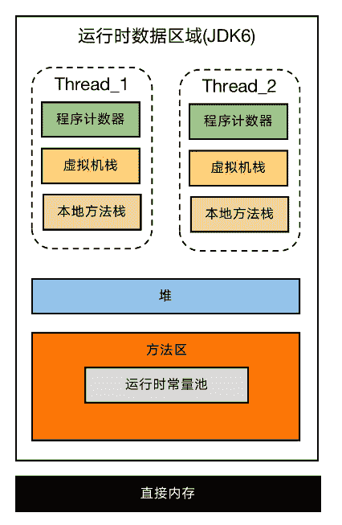
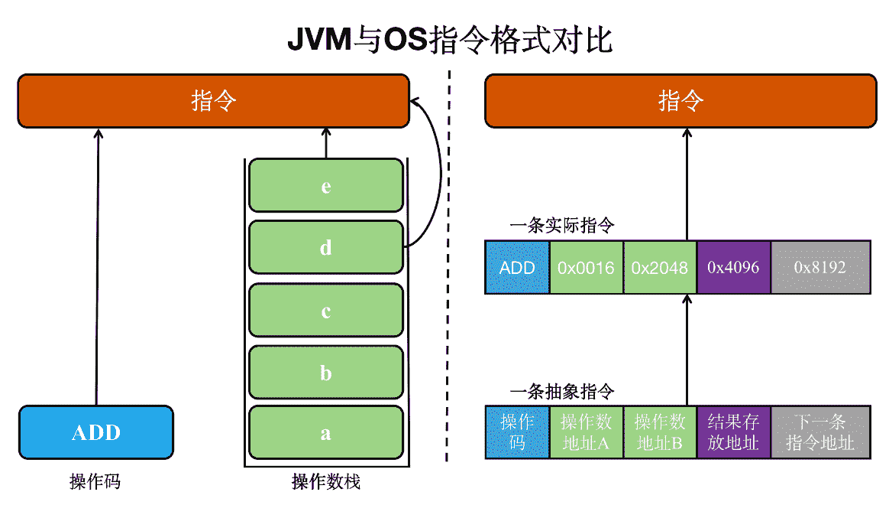

# 第二章 第 2 节 常见面试题及进阶知识点详解

> 原文：[`www.nowcoder.com/tutorial/10077/6e7ea15c51e741c1a1909ad93c1e314e`](https://www.nowcoder.com/tutorial/10077/6e7ea15c51e741c1a1909ad93c1e314e)

## 1.2 面试常见问题及解析

### 1.2.1 请谈谈你对 JVM 内存模型的理解

问题剖析：当面试官提出这个问题时，就是想考察你对 JVM 核心基础的理解。这个问题看似容易回答，但是准备不足则难以给出较为满意的答案。可能很多同学的答案回答仅仅是流水账式的列出相关知识点，而没有系统性地组织语言将各个知识点串起来。下面先给出回答这个问题相关的知识点，然后给出一个回答该问题的示例模板。


上图展示了 JVM 中内存模型，不难看出线程内驱动程序运行的程序计数器、虚拟机栈和本地方法栈都要占用内存；而堆和方法区则是独立于线程占用内存。从内存区域是否共享这个维度作为划分手段，线程内部占用的内存区域为私有，不同线程之间不可互相访问；而堆、方法区和直接内存则是公共且可以互相访问。

回答模板：首先介绍 JVM 内存模型是什么？随后介绍 JVM 内存模型存在的意义，与 JVM 中其他知识点（例如 GC）的关联；随后逐条介绍程序计数器、虚拟机栈、本地方法栈、堆、方法区、运行时常量池和直接内存；随后从私有和共享的角度对上述提及的内存区域进行区分。如果面试官中途对某一个点进行深入，可以结合 1.1 章中各节知识点进行介绍，重点谈谈自己的理解，而不是背诵。

### 1.2.2 请谈谈你对 JVM 堆的理解

问题剖析：当面试官提出这个问题时，就是想考察你对 JVM 中核心部分堆的理解，因为堆上经常发生 GC，在线上中出现 FullGC 是很常见的事情，因此不仅要会 Dump 堆的实际使用情况，还要堆的内存结构有较深的理解。除此之外，随着 Java 版本的发展，堆内存的结构也出现了不小的变化，因此回答不应仅仅局限于老版本的堆内存结构，还要与时俱进地分析版本之间的差异性。

在 JDK7 及其更老的版本中，堆通常被分为**新生代**、**老生代**以及**永生代**。JDK8 之后方法区（HotSpot 的永久代）被彻底移除了（JDK1.7 就已经开始了），取而代之是元空间，元空间使用的是直接内存。

回答模板：首先介绍堆是用来做什么的？都哪些内容存在堆上？堆与 JVM 中其他知识点（例如 GC）的关联；随后结合 JDK 版本对堆内存结构的差异性进行阐述；最后还要对 1.2.3 中的问题进行阐述。

### 1.2.3 JVM 堆内存大小一般如何分配

问题阐述：当面试官提出这个问题时，就是想考察你是否对堆有很深的理解。堆总体大小以及各个区域大小的分配在很大程度上会关联到 GC 效率。

回答模板：在 JDK8 中新生代约占整个堆 1/3 的空间(Eden:from:to = 8:1:1)，其他 2/3 的空间分配给老年代；随后结合 Eden，from 和 to 的比例谈谈新生代 GC 算法的运行过程；最后再结合 JVM 调优谈谈哪些关于堆的参数修改将有利于提高 JVM 性能。

### 1.2.4* 请谈谈方法区和永生代的区别

问题阐述：当面试官提出这个问题时，就是想考察你对方法区的认识，因为很多人认为方法区和永生代同一个东西，但是二者在狭义上还是有一些区别，不能简单地混为一谈。

方法区和永久代的关系很像 Java 中接口和类的关系，类实现了接口，而**永久代**就是 HotSpot 虚拟机对虚拟机规范中方法区的一种实现方式。也就是说，永久代是 HotSpot 的概念，方法区是 Java 虚拟机规范中的定义，是一种规范，而永久代是一种实现，一个是标准一个是实现，其他的虚拟机实现并没有永久代这一说法。此外，不同版本的 JVM 对永生代的支持程度也不同，例如将 JRockit 中的 Java Mission Control 迁移至 HotSpot 时就出现了因方法区差异导致的迁移困难问题。而以元数据空间这种使用本地内存的方式则有利于 JVM 间不同版本迁移的实现。这里如果读者对 JVM 的理解足够深，可以展开聊聊不同 JVM 间在方法区设计实现的异同。

## 1.3 进阶知识点与思考

### 1.3.1 区分 JVM 内存模型和 Java 内存模型

JVM 内存模型描述了 Java 虚拟机如何分配及使用内存；而 Java 内存模型(JMM)则定义了线程和主内存之间的抽象关系，即 JMM 定义了 JVM 在计算机内存(RAM)中的工作方式。Java 内存模型更多地就多线程场景下内存中的一致性问题进行探讨(重点是因为内存共享而产生的读写问题)，而不关心内存在使用上的设计与管理。限于篇幅与主题，这里不再详细展开介绍 Java 内存模型，感兴趣的同学可以自己阅读 Java 并发编程艺术学习。

### 1.3.2 区分 JVM 程序计数器在执行指令上与 OS 层面的区别

无论是操作系统层面还是 JVM 层面，机器在执行时都会将代码转化成指令(也可以理解为机器码)，这种指令一般不容易理解，但是执行效率极高。在 OS 中的指令一般带有操作数，而 JVM 的指令不带有操作数，下面以加法为例简要展示二者的差异(OS 指令仅参考一种指令设计模式，且操作码和操作数地址均为举例)。



执行一条加法操作时，对应的命令无论是 JVM 还是 OS 至少需要以下内容：

*   操作码
*   操作数 1
*   操作数 2

在 JVM 中，操作码与操作数逻辑上并不一起。操作码单独存放，所有操作数则存放于操作数栈中。操作数栈与数据结构中的“栈”一样，具有后进先出的特性。当构建一条指令时，根据操作码的要求从栈中弹出指定数量的操作数送进 CPU 寄存器中用于运算。以加法为例，从操作数栈中弹出 e 和 d，然后和操作码一起送入 CPU 进行运算。当运算完成后将结果压入操作数栈。而 OS 中的指令与操作数绑定在一起，还可能会附加运算结果存放的地址与下一条指令的地址。如果想详细了解 OS 中指令的种类和执行过程，可以参考一些计算机操作系统以及计算机组成原理的书籍，本文在这里不做赘述，感兴趣的同学可以自己扩展学习。

### 1.3.3 逃逸分析

逃逸分析是一项 JVM 优化技术，用于虚拟机分析对象的作用域。在面试中与这个知识点关联度最大的问题就是”所有对象都在堆空间上分配内存么？“。首先给出这个问题的答案，是否定的，并非所有对象都在堆空间分配内存。下面首先介绍一下逃逸分析，然后从理论上详细解答这个问题，最后给出逃逸分析中的其他几项技术。

Java 运行需要经过两个必要的阶段，首先基于 javac 命令将.java 文件编译为.class；然后 JVM 将字节码转化为机器可执行的指令，转化时逐条读入逐条翻译。这种转化过程一般执行效率较差，为了优化这个问题提出了即时编译技术(JIT)。引入 JIT 后，JVM 具有一定智能性，当 JVM 发现某一段方法或代码块执行的非常频繁时，就会认为出现了热点代码。为了避免频繁将这段代码转化为机器指令，JIT 会将这部分热点代码翻译后放到缓存里以供调用。JIT 在判定逃逸时也有较大作用。逃逸是指在方法 A 内被创建的对象不仅在本方法内被引用，对于其他方法而言也能获得其引用。如果对象发生了逃逸，会产生如下影响：

*   方法 A 创建的对象在方法结束时依旧存在引用，因此改对象无法被 GC 回收
*   方法 A 尚未结束时，方法 B 修改了共同引用的对象，导致一致性问题

为了解决逃逸的出现，我们一方面需要在代码中避免逃逸的发生，另一方面也要了解逃逸技术。下面先看几个逃逸的例子：

```cpp
    // 对全局/静态变量赋值导致的逃逸
    public static Object obj;
    public void setObj() {
        obj = new Object();
    }
```

```cpp
    // 返回引用导致方法逃逸
    public static StringBuilder getString() {
        StringBuilder stringBuilder = new StringBuilder();
        stringBuilder.append("hello");
        stringBuilder.append("world");
        return stringBuilder;
    }

```

这里重点说一下第二个逃逸，返回了 StringBuilder 的实例，导致 stringBuilder 可能被方法调用从而改变值。stringBuilder 的使命应该在 getString()内结束，但是却苟活到了调用方，这是我们不希望看到的。为了解决这一问题，我们将返回类型修改为 String，并 return stringBuilder.toString()。

逃逸分析的具体实现基于连通图构造对象间的引用可达性关系，并基于一套数据流分析方法实现。感兴趣的同学可以进一步学习<<escape analysis="" for="" java="">></escape>

回到”所有对象都在堆空间上分配内存么？“这个问题，逃逸分析基于 JIT 技术使用栈上分配避免一些对象在堆空间分配内存。我们都知道在堆空间上 GC 有一定时间开销，如果一个对象的作用域不会逃逸出方法调用，那么久没必要在堆上分配空间并产生潜在的 GC 时间。而在实际的项目开发中，大部分局部对象不会逃逸出方法调用，因此栈上分配存在的意义极大。然而栈上分配技术只能支持到方法维度，在线程维度上它无能为力。下面我们通过实践来对逃逸分析进行测试。首先在执行代码前先给出开启逃逸分析的方法(JDK8 中默认开启)：

*   -XX:+DoEscapeAnalysis ：表示开启逃逸分析
*   -XX:-DoEscapeAnalysis ：表示关闭逃逸分析
*   -XX:+PrintEliminateAllocations ：显示标量替换详情

```cpp
public class StackDispatch {

    private static final int num = 1000000;

    public static void main(String[] args) {
        for (int i = 0; i < num; i++) {
            alloc();
        }
        System.out.println("Please check status in command");
        // 避免程序提前结束
        try {
            Thread.sleep(num);
        } catch (InterruptedException e1) {
            e1.printStackTrace();
        }
    }

    private static void asignTeacher() {
        Teacher teacher = new Teacher();
    }
}

class Teacher {

    private int age;
    private String name;
    private String sex;
    private String slogan;

    Teacher() {
        age = 0;
        name = "";
        sex = "";
        slogan = "";
    }
}
```

首先验证不开启逃逸分析时的结果(记得运行前修改参数，-Xmx4G -Xms4G -XX:-DoEscapeAnalysis -XX:+PrintGCDetails -XX:+HeapDumpOnOutOfMemoryError )。运行 main 方法后，等控制台出现”Please check status in command“后打开终端，输入如下命令：

```cpp
# 查看所有现存的 Java 程序 id 号
jps
# 查询堆空间上所有对象实例的数量
jmap -histo id 号
```

不出意外 StackDispatch 将会有 100w 个实例，也就是说关闭逃逸分析时，虽然 teacher 没有逃逸出 asignTeacher()方法，但是被全量存储到堆空间。更改启动参数为：-Xmx4G -Xms4G -XX:+DoEscapeAnalysis -XX:+PrintGCDetails -XX:+HeapDumpOnOutOfMemoryError，再次执行上述操作。结果显示基于栈上分配后，堆中只有 112842 个对象，数量为 100w 的 11%，效果显著。感兴趣的读者还可以通过调整堆空间大小结合 GC 过程进行观测，这里不做多余赘述。

逃逸分析还有其他几种技术：

*   同步清除技术
*   标量替换技术

同步清除技术关注的要点是判断同步块中使用的对象是否逃逸出线程，对于不会发生逃逸和具有竞争状态的对象，强行使用 synchronized 同步没有意义且具有额外开销(关于 synchronized 的开销移步多线程模块学习)。然而 JVM 却不要求我们程序员手动消除这种同步，而是隐式地替我们完成这项工作。例如下面代码将会发生隐式替换：

```cpp
// 正常代码，程序员可见
public void visit() {
    Object obj = new Object();
    synchronized(obj) {
        System.out.println("this is visit");
    }
}
// 优化后代码，程序员不可见
public void visit() {
    Object obj = new Object();
    System.out.println("this is visit");
}

```

对于标量替换技术，首先对标量的意思进行解释。标量指粒度最小的数据，即就有不可分解性。Java 中的基本类型和引用类型都是标量。而那些可以由标量组成的数据被称为聚合量。一般一个具有多个成员的 Class 就是聚合量。标量替换看参考如下例子：

```cpp
// 正常代码，程序员可见
public class StackDispatch {

    private static final int num = 1000000;

    public static void main(String[] args) {
        asignTeacher();
    }

    private static void asignTeacher() {
        Teacher teacher = new Teacher();
        System.out.println("age = "+teacher.getAge());
    }
}

class Teacher {

    private int age;
    private String name;
    private String sex;
    private String slogan;

    Teacher() {
        age = 0;
        name = "";
        sex = "";
        slogan = "";
    }

    // 省略 getter 和 setter
}
```

```cpp
// 优化后代码，程序员不可见
public class StackDispatch {

    private static final int num = 1000000;

    public static void main(String[] args) {
        asignTeacher();
    }

    private static void asignTeacher() {
        int age;
        String name;
        String sex;
        String slogan;
        System.out.println("age = " + age);
    }
}
```

不难发现，teacher 的作用域没有逃逸出 asignTeacher()方法，因此标量替换技术将 Teacher 类中的字段转移到方法的栈上，而不是在堆中分配。因为不需要创建对象，因此避免了堆内存空间的使用。标量替换可以视作栈上分配的一种特例，实现更简单但对逃逸程度的要求更高，它不允许对象逃逸出方法范围内。

逃逸分析技术一定程度上提高了内存使用率，但是这种技术并非是上帝恩赐，它依旧存在一些问题：

*   执行分析的过程本身就很复杂，具有较大的计算成本，分析带来的收益如果无法弥补其开销，那将丧失分析的意义
*   对于对象是否逃逸的结果判定，目前无法实现 100%的准确率
*   如果分析结果表明，几乎所有对象都没有逃逸，那么在运行时所作的分析等同于无用功

尽管目前逃逸分析技术仍在发展之中，未完全成熟，但它是即时编译器优化技术的一个重要前进方向，在日后的 Java 虚拟机中，逃逸分析技术肯定会支撑起一系列更实用、有效的优化技术。