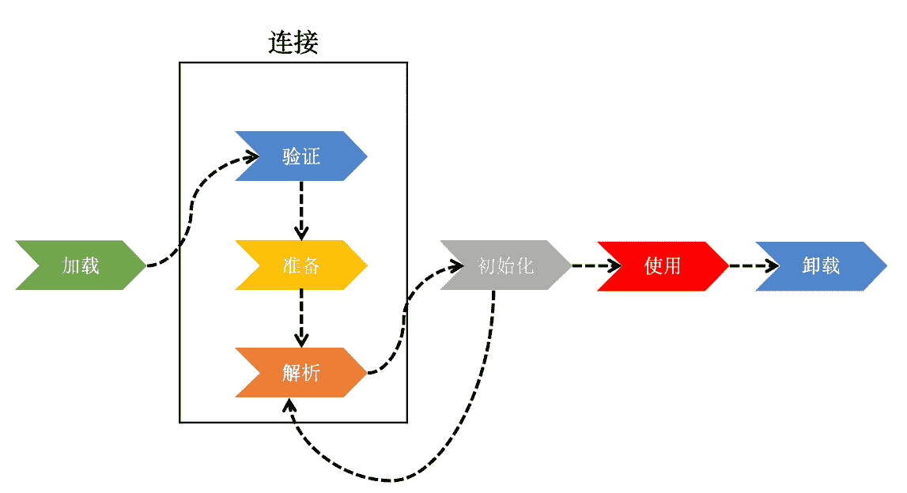
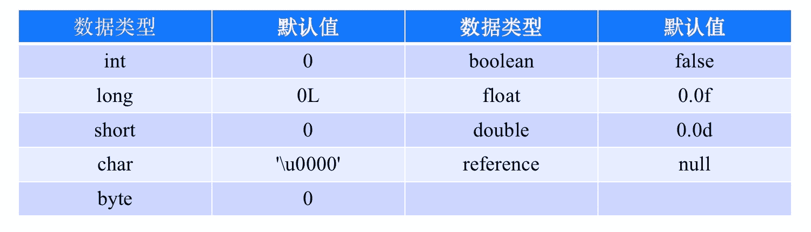
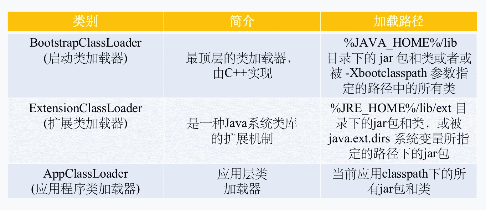
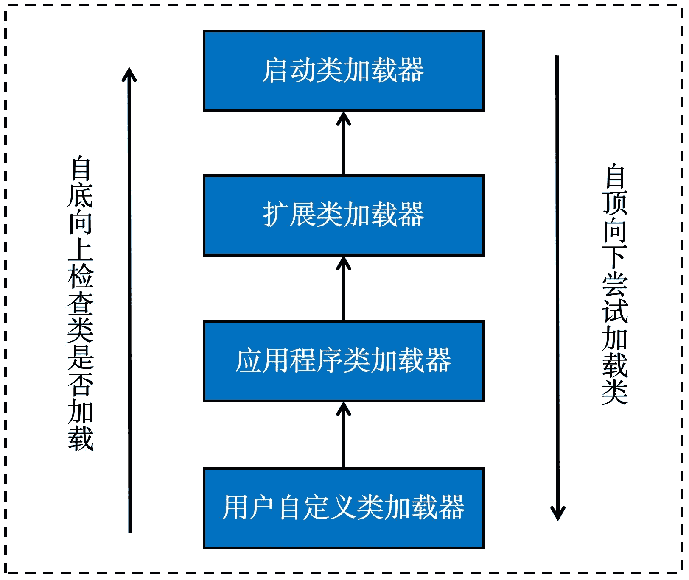

# 第三章 第 1 节 入门知识点详解

> 原文：[`www.nowcoder.com/tutorial/10077/16858712cb864c49938b37236669f139`](https://www.nowcoder.com/tutorial/10077/16858712cb864c49938b37236669f139)

类加载这部分内容比较偏理论，对初学者来说可能比较难理解。本文以较为通俗易懂的语言对类加载的过程进行阐述，相信大家看过几遍就能理解。在开始介绍本节内容前先给出相关内容的线索，脑海中有了线索不仅有利于学习理解，在面试中回答问题也会更加有条理。这些线索以若干问题的形式给出，大家学习完本章后可以自问自答，检测下学习效果：

1.  什么是类加载？类加载如何实现？
2.  类的生命周期，每一步都有哪些子操作？和内存模型有哪些交集？
3.  类加载器如何实现？能否结合一些源码介绍？
4.  双亲委派模型究竟如何被破坏了？都有哪些框架可以作为破坏的例子？
5.  有序列表内容

## 2.1 知识点入门理解

### 2.1.1 原理解释

#### 2.1.1.1 类和对象的区别

Java 是一种面向对象的语言，初识”面向对象“必然会接触到两个关键词，类和对象。类可以理解为具有相同性质实体的抽象表达，比如苹果手机、小米手机和锤子手机，它们都能打电话或上网冲浪，因此都具有手机这一概念。对象一般指一个具体的事物，它客观存在于这个世界上。一个对象必然是一个类在世界上的代理，苹果手机是手机概念的实体，一台 iPhone6 看得见摸得着，而你不能靠脑子中所有的“手机这一概念”与他人进行联系。

#### 2.1.1.2 什么是类加载？为什么需要类加载？

类加载是指 JVM 将类文件读入内存并生成一个 java.lang.Class 对象的过程。下面用一系列问答梳理下类加载相关动机与原因：

*   Q：这个过程加载了什么？A:加载的是.class 文件。
*   Q:.class 文件又是什么？A:.class 文件是我们平时写的.java 经过编译后的内容。这种格式的文件描述了类的特征与结构。Java 代码必须经过编译生成字节码文件，最终转换成机器码才能被执行。
*   Q:从哪里加载到哪里？A:可以从磁盘、网络以及数据库等媒介获取加载到内存中。
*   Q:加载后达成了什么目的？A:将类的结构性描述由字节描述转化内存中的结构信息，指导类实例化等操作。

类加载通常由 JVM 提供具体实现。类加载的目的是在于为真正的业务代码提供必要的运行环境，因此类加载通常在程序真正运行前执行，将一些程序需要的类提前加载进内存并生成 Class 对象。类加载可以类比为驾驶汽车，我们的目的是驾驶汽车抵达目的地，然而我们在执行这一过程中所需的第一件事则是启动该车，类加载等同于使用钥匙打火点燃发动机。试想，如果不点燃发动机(执行类加载)，你将如何驱动汽车运行(Java 程序执行)？

#### 2.1.1.3 类加载如何实现？

类加载是一个较为复杂的过程，为了降低我们开发的工作量，JVM 为我们提供了一些类加载器，我们一般不需要过度关心类是如何加载的，只需要知道类已加载完成的结果。同样以驱动汽车抵达目的地为例，对于非专业人士而言，是否知道发动机点火的原理和过程并不影响我们通过插入钥匙启动汽车这一结果。类加载器的具体实现可以参考后面的介绍。

### 2.1.2 类的生命周期

.class 文件需要加载到虚拟机中之后才能运行和使用，系统加载.class 文件大体上分为三个部分：

*   加载
*   连接
*   初始化

其中，连接又可细化为三个部分:

*   验证
*   准备
*   解析

加载完成后到生命周期结束大致分为如下部分：

*   使用
*   卸载



一般来说，类加载的整个流程具有线性特征，但是在解析阶段未必会遵守这一特性。解析可以在初始化开始后再执行，这种延迟解析的方式为动态绑定提供了大大的支持。下面将对图中涉及的过程一一介绍。

#### 2.1.2.1 加载

“加载”是类加载过程的第一步，完成后实现以下动作：

*   通过类的全限定名类文件存储的的二进制字节流；
*   将二进制字节流所存储的静态结构加载到方法区中作为运行时结构；
*   在内存中生成一个 Class 对象作为静态结构的代理。

其中二进制字节流不局限于通过本地 IO 进行加载，还可以通过其他方式获取：

*   从压缩包中读取，例如 JAR、EAR、WAR 等格式；
*   通过网络获取；
*   使用反射技术在运行时计算生成；
*   从 DB 中加载获取(场景较少)

一个非数组类的加载阶段（加载阶段获取类的二进制字节流的动作）是可控性最强的阶段。此类加载不仅可以使用 JVM 内置的类加载器还可以通过重写 loadClass()方法实现自定义加载。数组类的加载过程则稍显不同，应为数组本身不通过类加载器创建，但是数组元素类型的加载依旧依赖于类加载器。数组的加载过程感兴趣的同学可以自行查阅资料扩展学习，例如深入理解 Java 虚拟机 7.3.1 节。

#### 2.1.2.2 连接

连接阶段分为三个子阶段：

*   验证
*   准备
*   解析

* * *

###### 2.1.2.2.1 验证

加载实现了对.class 文件中二进制流的加载，但是.class 文件也可以由其他语言编译产生。此外，二进制流如果不满足 Java 规范，可能导致出现越界访问等异常。为了解决上述不安全性，JVM 在连接阶段假定二进制流不可信，通过一定规则验证二进制流是否满足约束性，避免出现运行期间影响虚拟机正常运行的不利因素。一般来说，验证阶段主要对.class 文件中二进制流的结构进行校验，判断其是否符合 Class 文件规范。主要检查方向包含**文件格式验证，元数据验证，字节码验证和符号引用验证。**

**文件格式验证：**验证字节流是否符合 Class 文件格式的规范，字节流版本是否与本机 JVM 版本冲突。下面列出一些主要校验的方向：

*   是否以 0xCAFEBABE 开头；
*   本地虚拟机是否可处理 Class 文件中的主次版本号；
*   常量池中是否有不可识别的常量类型；
*   指向常量的各种索引值中是否有指向不存在的常量或不符合类型的常量；

.class 文件的魔数是 0xCAFEBABE，通过在.class 文件头部使用该数标识文件类型。其他文件类型例如 pdf、png、jpg 等具有自己定义的魔数用于程序识别文件类型。

验证阶段结束后可保证二进制流代表的静态结构可被识别转化为方法区中的运行时结构。在该阶段后面的验证阶段都是基于方法区的存储结构进行的，不再与字节流打交道。

**元数据验证：**元数据可以理解为描述数据的数据，这一阶段主要对字节码的语义展开分析，如果一个类(除 java.lang.Object)没有父类，肯定无法通过验证。此外还有一些特殊情况需要验证：

*   在继承体系上的要求，比如不能继承被 final 修饰的类(String 类就不可被继承)；
*   在接口体系上的要求，比如实现接口的类是否全部实现接口中定义的方法；
*   在字段/方法和继承体系上的要求，比如子类是否存在非法访问父类字段或调用父类方法的情况

**字节码验证：**通过数据流和控制流分析，检查方法体中的语句是否合法。这部分验证聚焦于方法。方法中的语句在执行时一般依赖于保存数据的操作数栈和语句对应的指令。那么语句对应的指令是否全部合法？会不会存在在语句运行时产生危害的指令？比如，是否存在一条跳转指令使得执行逻辑跳出当前方法体或将类型 A 非法地转换为类型 B。此外字节码校验并非万能，因为即使字节码对应的语句没有语义上的错误，但是仍可能发生运行时危害虚拟机安全的情况，例如如下情况：

```cpp
int cnt = 0;
while(true) {
    cnt++;
    System.out.println(cnt);
}
```

上述代码将陷入死循环，是一个很明显的 bug，然而从语法上没有任何问题，仅仅在业务上具有问题。然而这种错误是无法通过字节码验证解决，一定程度上也需要程序员在编码时自行避免。此外数据流和控制流分析必然存在相当大的时间开销，因此 JDK6 以后这部分校验被转移到 Javac 编译期里进行，限于篇幅这里不再赘述，感兴趣的同学可以自己搜索资料学习，例如深入理解 Java 虚拟机第十章和第十一章。

**符号引用验证：**最后一个阶段对常量池中的各种符号引用校验，符号链接的含义在内存模型篇进行了简要介绍。这里只谈验证了哪些内容。比如是否可以通过类的全限定名找到这个类，如果找不到必然要终止加载流程。符号引用验证的目的是确保后续解析的正常执行，但是符号验证并非解析必要的前置操作。如果想略过这个过程，可以设置 JVM 参数-XVerify：none 来缩短虚拟机类加载时间。

###### 2.1.2.2.2 准备

准备阶段的目标是类变量，对这种变量分配内存并设置类变量初始值，类变量位于方法区中。准备阶段的初始化目标非常容易混淆，这里做如下阐述：

```cpp
public class Data {
    // static 表明静态，具有独一份的特性
    public static double version = 1.0;
    // 普通成员变量，每 new 一个都可以设置自己的值
    private String name;
}
```

version 字段使用 static 修饰，具有静态性，为所有类的实例共享，实例 A 改变后实例 B 也能同步到这一更新。而 name 字段为每个实例独享，具有隔离性，实例 A 改变自己的 name 并不会影响到实例 B 的值。为了实现上述效果，static 字段对应的 version 被称为类变量，类本身具有抽象性，是每个实例都应该遵守的特性，因此将其存储在方法区中供所有实例访问修改，具有中心化的特性。而 name 字段只是普通的成员变量，其存储在堆内存中互相隔离。

区分了类变量和实例变量后，再来看上述代码中 version 的赋值。version 在定义时被赋了 1.0，但是在初始化阶段并不执行这一赋值过程，而是赋一个默认的 0 作为初始值。赋默认值是为了保证即使后面构造器中没有显示赋值也能使用变量，下图给出相关类型的默认值。赋值 1.0 这一过程发生于类构造器<clinit>()中，即类初始化时执行。但是如果 version 被 final 修饰时(public static final double version = 1.0;)，情况就不一样了，字段在具有 ConstantValue(常量)属性且处于准备阶段时将会被执行赋值 1.0 的操作。</clinit>



###### 2.1.2.2.3 解析

解析阶段是虚拟机将常量池内的符号引用替换为直接引用的过程。这里再简单回顾下符号引用和字面量的含义。字面量可以理解为字面意义上的实际值，比如 int a = 8 或 String a = "hello"。这种值没有复杂的意义，值用于直接计算或存储。符号引用通常是一个字符串，只要在代码中引用了一个非字面量。符号引用一般具有一定引申义，其值仅仅是指向最终目标的桥梁。符号引用是一个字符串定义的符号，这个字符串存在常量池里。类加载的时候第一次加载到这个符号时，就会将这个符号引用（字符串）解析成直接引用（指针）。例如某个方法的符号引用，“java/io/PrintStream.println:(Ljava/lang/String;)V”。仅从字面上看，它没有什么意义。但是这个字符串却传递了一些重要信息，这是个 io 包的方法，目的是要打印一些内容，而打印的具体内容由传入的 String 类型参数决定，这个方法最后返回为空。

而直接引用是直接指向目标的指针，通过访问指针能找到我们真正需要的目标对象。直接引用有若干种实现：

*   直接指向目标的指针
*   相对偏移量
*   句柄或句柄池

* * *

##### 2.1.2.3 初始化

初始化是类加载的最后一步，也是真正执行类中定义的 Java 程序代码(字节码)，初始化阶段是执行类构造器<clinit>()方法的过程。对于<clinit>()方法的调用，虚拟机会自己确保其在多线程环境中的安全性(线程安全！)。</clinit></clinit>

<clinit>()并不是我们写在代码中的**块**或**构造器**，而是由 Javac 编译器自动生成的产物。我们在初始化“类”变量时可能会使用**静态块**，Javac 编译器会自动收集静态块中赋值语句合并为<clinit>()。而收集顺序则与定义顺序一致。这里有一种特殊情况需要注意：</clinit></clinit>

```cpp
public class Data {
    static {
        version = 0;
        // 编译提示：非法的前向引用
        System.out.println(version);
    }
    // 定义不能晚于使用
    public static int version = 1;
}
```

谈到静态块中的初始化，很容易与构造器<init>()初始化混淆，<init>()的执行需要满足父类的<init>()先执行，因此逐层向上递归后必然先执行 java.lang.Object 的<init>()。而<clinit>()的执行不需要这种显示调用父类构造器的方式。此外<clinit>()在初始化过程中并非必然存在，当没有静态块或需要初始化的类变量时可以不生成类的<clinit>()。</clinit></clinit></clinit></init></init></init></init>

对于初始化阶段，虚拟机严格规范了**有且只有**如下情况下，必须对类进行初始化：

*   当遇到 new、getstatic、putstatic 或 invokestatic 这 4 条直接码指令时，比如 使用 new 关键字构造一个实例，读取类的静态字段(未被 final 修饰)或调用一个类的静态方法时；
*   使用 java.lang.reflect 包的方法对类进行反射调用时，如果类没初始化，需要触发其初始化；
*   初始化一个类，如果其父类还未初始化，则先触发该父类的初始化；
*   当虚拟机启动时，用户需要定义一个要执行的主类(包含 main 方法的那个类)，虚拟机会先初始化这个类；
*   当一个接口中定义了 JDK8 新加入的默认方法（被 default 关键字修饰的接口方法）时，如果有这个接口的实现类发生了初始化，那该接口要在其之前被初始化

### 2.1.3 类加载器

如果说类加载过程描述了类加载动作的具体实现过程，那么类加载器则是类加载动作的实现者，二者关系与垃圾回收算法和垃圾回收器类似。

#### 2.1.3.1 类加载器种类

JVM 中自行提供了三个重要的 ClassLoader，除了 BootstrapClassLoader 其他类加载器均由 Java 实现且全部继承自 java.lang.ClassLoader：


从实现上来看，类加载器分为两类：

*   由 C++实现的启动类加载器；
*   由 Java 的其他所有类加载器。

#### 2.1.3.2 双亲委派模型

类加载器在设计上采用了双亲委派模型作为类加载器协作的解决方案。双亲委派模型的大致执行过程如下：尝试执行类加载时，会首先判断当前类是否被加载。已经被加载的类会直接返回。加载的时候，并不立刻由当前层级的类加载器开始加载，而是向把加载任务提交给父类加载器。这样经过层层向上的递归，由顶层启动类加载器尝试做真正的加载并层层向下返回加载结果。当父类反馈无法处理时，才会由本层的类加载器尝试加载并向下层反馈结果。


双亲委派模型可以避免类的重复加载（JVM 区分不同类的方式不仅仅根据类名，相同的类文件被不同的类加载器加载产生的是两个不同的类），也保证的核心 API 不被篡改。如果不用没有使用双亲委派模型，而是每个类加载器加载自己的话就会出现一些问题，比如我们编写一个名称为 java.lang.Object 类的话，那么程序运行的时候，系统就会出现多个不同的 Object 类。双亲委派模型的实现位于 java.lang.ClassLoader 的 loadClass()方法中。

对于任意一个类，都需要由加载它的类加载器和这个类本身一同确立其在 Java 虚拟机中的唯一性。每一个类加载器，都拥有一个独立的类名称空间。所以两个类是否相等，必须建立在它们是由同一个类加载器加载的基础上，否则即使是由同一个 VM 加载，来自同一个 Class 文件，也不相等。

补充说明：本文仅对 JDK8 版本以前的双亲委派模型进行介绍，8 之后版本的双亲委派模型出现了一些变化，感兴趣的同学可以自行查阅资料进行研究。例如：

*   **JSR-294：**Improved Modularity Support in the Java Programming Language（Java 编程语言中的改进模块性支持）
*   **JSR-277：**Java Module System（Java 模块系统）