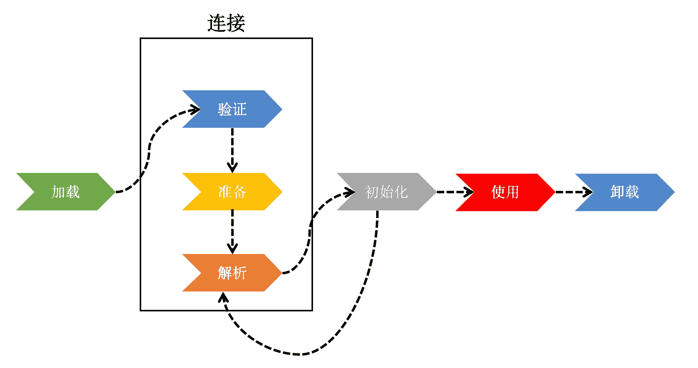
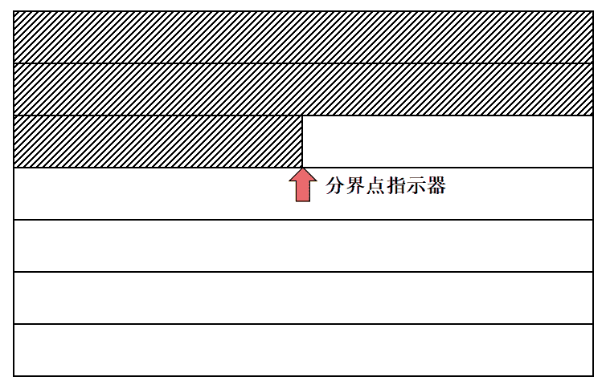
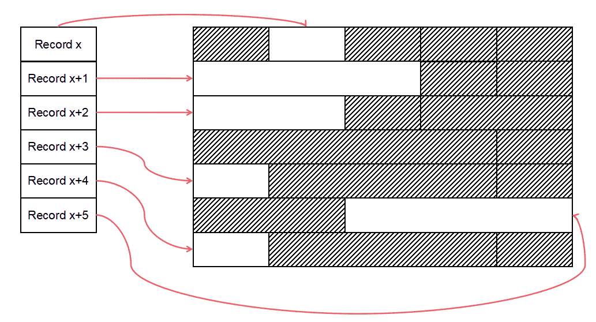
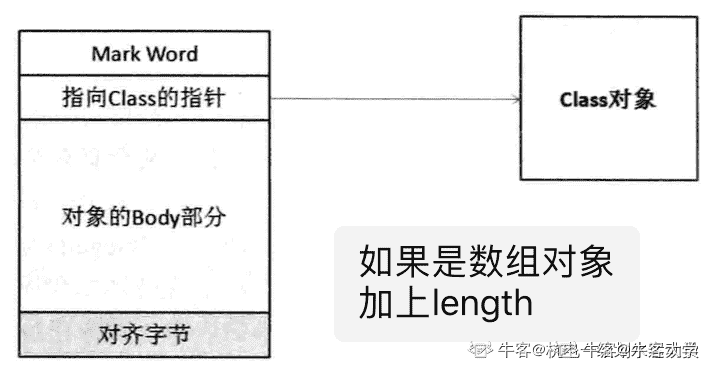
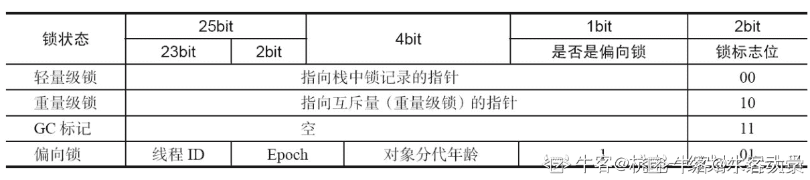
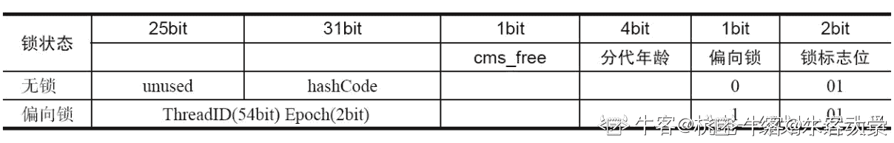
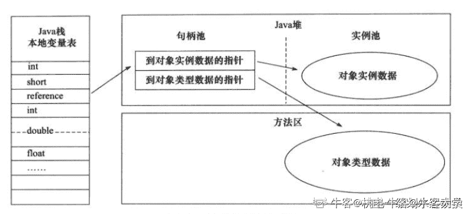
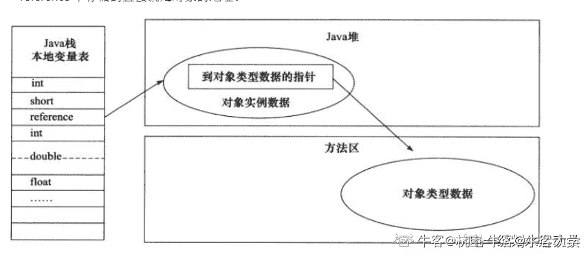

# 第四章 第 1 节 入门知识点详解

> 原文：[`www.nowcoder.com/tutorial/10077/0fc9f81831cd4bae81b0359065a920ea`](https://www.nowcoder.com/tutorial/10077/0fc9f81831cd4bae81b0359065a920ea)

对象实例化这部分理论和实践都很重要。虽然这部分内容不难理解，但是若想要彻底理解对象实例化的全过程仍需要对 JVM 有很深的理解。希望大家先把本章节涉及的基础部分吃透，然后根据自己能力自行深入挖掘，这样才能在面试中展现出自己的亮点。
下面先以问答的形式给出本节的线索，大家学习完本节后可以自问自答，检测下学习效果：

*   什么是对象实例化？
*   什么条件下才能执行对象实例化？
*   对象实例化大致分为哪些步骤？
*   对象的内存布局如何安排？
*   通过访问对象都能获取什么信息？
*   能讲讲 Java-HelloWorld 的全过程都发生了什么操作？

## 3.1 知识点入门理解

### 3.1.1 原理解释

#### 3.1.1.1 什么是对象实例化？

对象实例化有别与类加载。类具有抽象概念，加载了一个类的 class 文件将在内存的方法区中生成唯一的一个**Class**对象。而对象实例化**一般**将在堆中生成一个该类的实体，这个实体是我们实际接触和操作的目标。对象实例化最直观的体现如下：

```cpp
Apple apple = new Apple();
apple.setColor("Red");
```

显然，**new**关键字导致了 Apple 类产生了一个实例化的对象。

#### 3.1.1.2 对象实例化后保存在内存中的什么位置？

对象实例化后**一般**保存在堆中。堆的概念在 JVM 内存模型篇中已详细叙述，这里再举一个例子。堆可以理解为“垃圾”堆，从某种意义上来说，JVM 主要在堆中进行垃圾回收。然而，随着 JVM 的迭代优化，有一些特殊情况使得实例化后的对象并不保存在堆空间上，当涉及 JIT 与栈上分配时就不会发生对象在堆空间分配内存。JIT 相关内容在类加载章节中已有介绍，忘记的同学可以回顾下。

### 3.1.2 对象实例化过程

对象实例化大致过程如下：

*   类加载检查
*   分配内存
*   初始化零值
*   设置对象头
*   执行 init 方法

下面分阶段一一进行介绍。

#### 3.1.2.1 类加载检查

实例化目标类前需要完成类加载，这是执行实例化的必要前提。当虚拟机执行 new 指令时，必须通过下面全部检查：

*   指令涉及的参数是否可在常量池中定位到相关符号引用
*   该符号引用对应的类是否完成类加载

这里再简单回顾下类加载的过程。



*   加载
    *   通过类的全限定名搜索类文件，获取其存储的二进制字节流；
    *   将二进制字节流所存储的静态结构加载到方法区中作为运行时结构；
    *   在内存中生成一个 Class 对象作为静态结构的代理；
*   连接
    *   验证
        *   文件格式验证
        *   元数据验证
        *   字节码验证
        *   符号引用验证
    *   准备
        *   分配内存
        *   类变量初始化
    *   解析
        *   目标：类或接口、字段、类方法、接口方法、方法类型、方法句柄和调用限定符
*   初始化
    *   执行类构造器<clinit>()方法的过程
         </clinit>

#### 3.1.2.2 分配内存

对象实例化需要为对象在内存上的分配空间，这就引起了以下几个子问题：

*   Q1：在哪为对象分配内存？
*   Q2：为对象分配多少内存？
*   Q3：为对象分配内存时有哪些策略？

##### Q1 解答

对象一般在堆空间分配空间。根据不同的 GC 策略，刚创建的对象所处位置略有不同。

以 Serial、ParNew 和 ParallelScanage 为代表的新生代垃圾回收器，其新生代内存空间无论是物理层面还是逻辑层面都具有连续的特性。新创建的对象进入 Eden 区，大部分对象都具有朝生夕灭的特点，少部分对象在经过晋升移动到老年代。当新建对象过大或被判定为长期存活的对象可能直接进入老年代，因此对象未必直接进入新生代的 Eden 区。

而采用 G1 作为垃圾回收器时，新生代和老年代空间未必物理连续，但是仍旧有新生代和老年代的概念，普通对象仍旧在 E 区进行内存分配，而大对象和长期存活的对象在 O 区进行内存分配。这里如果有同学对 GC 部分的内容不理解，可以暂时跳过，等看完 GC 部分的章节再回来理解。

##### Q2 解答

为对象分配多少内存这个问题具有唯一确定的解。对象分配需要多大内存空间在类加载完成后就已经确定了。对象所需空间不会因为不同对象属性值的不同而发生改变。

##### Q3 解答

在执行内存分配时一般有两种策略：

*   指针碰撞
*   空闲列表

采用指针碰撞时，利用一个指针作为已划分内存和未划分内存的分界点，通过不断移动指针记录未划分内存的起始地址。如下图，虚线填充部分表示该部分内存已分配：



空闲列表则应用于堆内存空间不连续的场景。虚拟机只能通过维护可用内存的列表记录可用内存。如下图，虚线填充部分表示该部分内存已分配，通过访问列表的 record 项可知哪块内存可用。



两种策略的选择很大程度上依赖 Java 堆是否规整：

*   例如，serial 和 paraNew 自带标记整理，适用于指针碰撞。既然前面两种垃圾回收器保证对堆内存进行整理，那么堆空间必然可以分为已使用部分和未使用部分，分割点即为一个指针。
*   例如，CMS 基于标记清除，适用于空闲列表分配内存。因为 CMS 本身不能对堆空间进行整理，所以可能存在内存碎片化的情况，导致查找和分配内存的复杂度较高。为了在分配内存时提高效率，不对堆空间全局扫描查找可用的内存空间，而采用预分配的思想从本地列表中查找可用内存。

#### 3.1.2.3 初始化零值

内存分配完毕后，虚拟机将对该对象执行初始化。执行初始化是为了避免业务代码不显式赋值也能正常取值（通常是零值或 false）。这里需要和类加载中的初始化注意区分，关键在于类加载中的设置目标是静态变量，即所有对象公有的变量；而对象实例化中，初始化的设置目标为类的成员变量。若在 TLAB 内分配内存，则初始化时机在分配 TLAB 内存时。

TLAB，全称 Thread Local Allocation Buffer。JVM 利用该结构为每一个线程预先在 Eden 区分配小部分内存（默认为 Eden 区大小的 1%）。

当 JVM 执行内存分配时，优先在 TLAB 分配；当对象大于 TLAB 中的剩余内存或 TLAB 的内存已用尽时，再采用 CAS 进行内存分配。由于很多对象过小或存活时间过短，适合被快速被 GC 回收，所以小对象通常 JVM 会优先分配在 TLAB。此外，TLAB 上的分配由于是线程私有所以没有加锁解锁的开销，也避免锁竞争的发生。

下面简单看一下 TLAB 的实现源码：

```cpp
class ThreadLocalAllocBuffer: public CHeapObj<mtThread> {
  friend class VMStructs;
private:
  HeapWord* _start;                 // address of TLAB
  HeapWord* _top;                   // address after last allocation
  HeapWord* _pf_top;                // allocation prefetch watermark
  HeapWord* _end;                   // allocation end (excluding alignment_reserve)
  size_t    _desired_size;          // desired size   (including alignment_reserve)
  size_t    _refill_waste_limit;    // hold onto tlab if free() is larger than this

  // ......
}
```

TLAB 中最主要的三个指针是`_start`、`_top`和`_end`。下面结合一个例子来分析这三个指针的含义，加入某线程申请了 100KB 大小的内存给 TLAB，内存始址是 A，那么：

*   `_start`值为 A
*   `_end`值为 A+100KB
*   `_top`值在[A, A+100KB]内变化，初始位于`_start`，随着空间分配不断向`_end`移动。当`_top`与`_end`发生碰撞时触发 TLAB refill

`_desired_size`表示 TLAB 所占内存大小。`_refill_waste_limit`表示最大可用于浪费的空间大小。假设`_desired_size`值为 100KB，`_refill_waste_limit`值为 5KB，考虑如下情况：

*   若 TLAB 已使用 97KB，现在新对象需要申请 5KB 空间。然而当前 TLAB 已无法满足需求，因此触发 TLAB 的交换与申请，把当前 TLAB 移交 Eden 管理，并申请一个新的 TLAB。因为原 100KB 大小的 TLAB 产生了 3KB 的碎片空间，而 3KB 小于`_refill_waste_limit`所以允许碎片的产生
*   若 TLAB 已使用 80KB，现在新对象需要申请 21KB 空间。若按照上面方法将产生 20KB 的碎片空间且 20KB 大于`_refill_waste_limit`，因此不必申请新的 TLAB，这 21KB 将直接在 Eden 进行内存分配

TLAB 的起始分配时机在执行`new Thread()时`

```cpp
void JavaThread::run() {
    // initialize thread-local alloc buffer related fields
    this->initialize_tlab();

    this->record_base_of_stack_pointer();
    this->record_stack_base_and_size();
    this->initialize_thread_local_storage();
    this->create_stack_guard_pages();
    this->cache_global_variables();
}

void initialize_tlab() {
    if (UseTLAB) {
      tlab().initialize();
    }
}

void ThreadLocalAllocBuffer::initialize() {
    initialize(NULL, NULL, NULL);
    // 设置 TLAB 的 _desired_size
    set_desired_size(initial_desired_size());
    if (Universe::heap() != NULL) {
    size_t capacity   = Universe::heap()->tlab_capacity(myThread()) / HeapWordSize;
    double alloc_frac = desired_size() * target_refills() / (double) capacity;
    _allocation_fraction.sample(alloc_frac);
    }
    // 设置 TLAB 的 _refill_waste_limit
    set_refill_waste_limit(initial_refill_waste_limit());

    initialize_statistics();
}
```

#### 3.1.2.4 设置对象头

初始化零值完成之后，虚拟机设置对象的属性信息。最常见的几个属性信息如：

*   类元指针 Klass Pointer
*   对象的哈希码
*   对象的 GC 分代年龄
*   锁标志位

这些属性信息的细节可参考下面对象内存布局的介绍。如果想了解对象头实际存放的内容可参考 3.2.5 节内容。

#### 3.1.2.5 执行 init 方法

最后执行`<init>`方法，即构造方法。一般来说，执行 new 指令之后会接着执行`<init>`方法，对象按照业务逻辑进行初始化，这样一个真正可用的对象才算完全构造完毕。

### 3.1.3 对象的内存布局

在 Hotspot 虚拟机的实现中，对象在内存中的布局可以分为如下区域：

*   **对象头**
*   **实例数据**
*   **对齐填充**

结构如下图：


###### 对象头

对象头主要包括三部分信息：

*   存储对象自身运行时的元数据信息（MarkWord）
*   类型指针，即对象指向它的类元数据的指针，虚拟机通过这个指针来确定这个对象是那个类的实例。如果对象是一个数组，那么对象头中还应该有字段用于记录数组长度
*   如果是数组将记录数组长度

元数据信息包括：


其中 4bit 的 GC 分代年龄与晋升息息相关，对象每熬过一轮 GC，其年龄自增一，当其年龄达到 16 或满足其他晋升规则后将晋升至老年代。2bit 的锁标志位用于判定锁的类型。在 JDK6 以后为了优化 synchronized 的性能，提出了锁粗化用于优化不同竞争程度下锁的性能。在 32 位的 HotSpot 虚拟机中，MarkWord 在不同锁下的内容如下所示：


然而 64 位 JVM 下且开启指针压缩时，头部存放 Class 指针的空间大小仍是 4 字节。但 Mark Word 区域会变大，变成 8 字节，也就是头部最少为 12 字节。



对象头在内存中的具体信息可以参考 3.2.5 节中的实操辅助理解，感兴趣的同学可以自行构造更复杂的例子进行分析。

###### 实例数据

实例数据部分是对象真正存储的有效信息，也是在程序中所定义的各种类型的字段内容。考虑带有继承关系的场景，子类会带有父类中定义的字段，且这些字段的存储顺序会有 JVM 分配策略和定义顺序的影响。一般来说 HotSpot 虚拟机默认按照如下顺序进行分配：

*   long/double
*   int
*   short/char
*   byte
*   oops

排序的目的在于尽量减少内存补齐，一般规则如下：

*   先基本类型，后引用类型
*   字宽大的在前
*   字宽相同按声明顺序

下面给出一些常见类型占用内存大小的总结：

| 类型 | 占用空间 |
| --- | --- |
| byte | 1 byte |
| boolean | 数组时每个元素占 1 byte，单变量占 4 byte |
| short、char | 2 byte |
| int、float | 4 byte |
| long、double | 8 byte |
| Boolean、Byte | 16 byte |
| Short、Char | 16 byte |
| Integer、Float | 16 byte |
| Long、Double | 16 byte |

在 JVM 层，一些类型存在理论大小和实际大小的区别。Java 字节码中大部分指令并不支持处理 byte、char 和 short，几乎不支持 boolean 类型。编译时会将上述类型转化为 int 类型。所以，为了追求性能而根据值的范围降低精度未必会取得优化效果。不过数组例外，有些 JVM 在实现 byte[]时，每个元素所占空间为 1byte。这里着重提下 boolean 类型。

从理论上讲，boolean 的取值具有二元性，因此只用 1 个 bit 即可存储。Java 规定 boolean 类型应占 1byte 大小，对于 1byte 中的其他位来说，使用 0 进行填充即可。而 Java 虚拟机规范中则使用 int 代替了 boolean，一方面在于没有直接支持 boolean 的指令；另一方面对于 32 位 CPU 而言，一次处理 32 位数据具有高效存取的优点。

对于引用类型的大小，一般与宿主操作系统位数一致。Java 提供启动参数用于设置引用类型大小，即内存地址压缩，默认开启这个选项用于优化内存使用。参数如下：

```cpp
// 开启
-XX:+UseCompressedOops
// 关闭
-XX:-UseCompressedOops
```

###### 对齐填充

对齐填充起占位作用，与 TCP 中的填充字段类似都是为了确保某个单一对象大小具有某种数学规律。Hotspot 虚拟机的自动内存管理系统要求对象起始地址必须是**8 字节的整数倍**，也即对象的大小必须是 8 字节的整数倍。对齐内存的实现方向有：类型对齐、缓存行对齐以及内存页大小对齐。

填充的目的是为了实现对齐内存。对齐内存让字段只出现在同一 CPU 的缓存行中。先考虑内存规整的情况：


每次取数据时只需要加载一块内存或缓存，比较符合常规思维。padding（填充）实现内存对齐是为了计算机高效寻址效率。而内存不规整或未对齐时，那么就有可能出现跨缓存行的字段，例如下面的情况：


一方面取数据时可能会加载多块内存或缓存，降低了读取/写入的性能；另一方面，在涉及并发操作与锁时，可能会锁住非操作相关的数据导致并发性能降低。

#### 3.1.2.3 对象的访问定位

对象的创建与存储根本目的在于后续访问与修改。不同虚拟机对于对象的访问定位有不同的实现，主流的访问方式以下两种：

*   **句柄**
*   **直接指针**

使用句柄访问对象时，堆空间中将会专门划分出一块内存来作为句柄池。reference(可以理解为指针或引用)中存储的就是对象的句柄地址。句柄中包含了**对象实例数据**与**类型数据**各自的具体地址信息。对于一个类的多个实例对象，这些实例对象具有不同的地址信息，但是他们的类型数据即 Class 对象有且仅有一个。使用句柄定位对象的过程如下图所示：



使用句柄来访问的好处在于 reference 中存储的是稳定的句柄地址，在对象被移动时只会改变句柄中的实例数据指针，而 reference 本身不需要修改。

使用直接指针访问对象时，堆空间中的布局中就必须考虑放置访问类型数据的相关信息。而 reference(可以理解为指针或引用)中存储的直接就是对象的地址。使用直接指针定位对象的过程如下图所示：



使用直接指针访问方式的好处在于节省了一次指针定位的时间开销。