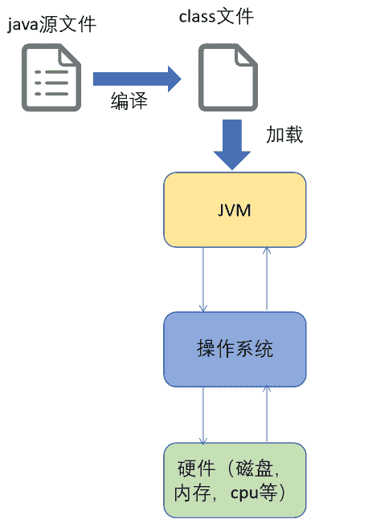
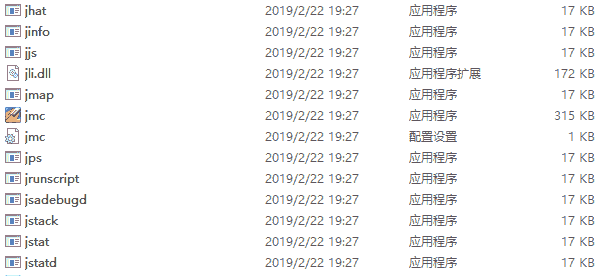

# 第五章 第 1 节 背景知识

> 原文：[`www.nowcoder.com/tutorial/10077/8b8984c792f14860a127ad87ad6fbc9a`](https://www.nowcoder.com/tutorial/10077/8b8984c792f14860a127ad87ad6fbc9a)

本章内容安排如下：

*   part1：以通俗易懂的语言介绍本文涉及的背景知识。建议跨专业，不具有 Java 基础的同学从这部分开始阅读
*   part2：详细介绍本文的主体内容，以生动的例子讲述 JVM 的相关工具。建议有一定 Java 基础和想提高面试经验的同学从这部分开始阅读
*   part3：介绍一些常见的面试题。

# 一 背景知识

## 1.1 JVM 是什么

接触过 Java 的同学都知道，Java 语言最大的好处就是“一次编写，到处运行”，即同一份代码可以在多个系统（window，linux 等）下运行。Java 语言能够提供这个特性的原因就是 Java 提供了 JVM（Java Virtual Machine，Java 虚拟机）。

JVM 能够识别并执行 Java 文件编译后的 class 文件，使得程序的执行屏蔽了底层操作系统，做到系统的无感知。如下图所示，JVM 加载 Java 源文件编译后的 class 文件，并根据 class 文件中的指令调用操作系统相关的指令来完成程序的功能，这样程序的执行就不需要直接和操作系统打交道了，实现“一次编写，多次运行”。

## 1.2 JVM 工具是什么

所谓工具，肯定是提供某些功能，为我们的工作提供便利，下面就来说说 JVM 工具能解决什么问题。

Java 程序运行时我们一般通过在程序中嵌入日志观察业务执行是否正常。但是这种通过日志的手段只能在业务层做到感知，但有时候我们的业务逻辑明明没有问题，程序还是崩溃了，这可能是 JVM 层出现问题了。为了帮助程序员更快更好的发现并解决 JVM 出现的问题，Java 开发者们为我们提供了一些便捷的小工具用来感知 JVM 层的各种状态。

例如，jps 观察虚拟机进程状态；jstat 观察虚拟机信息统计；jinfo 观察虚拟机配置信息；jmap 观察虚拟机内存映像；jhat 用于转储堆快照。这些工具位于 JDK 安装的 bin 目录下，且体积较小。

