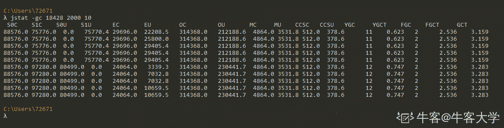
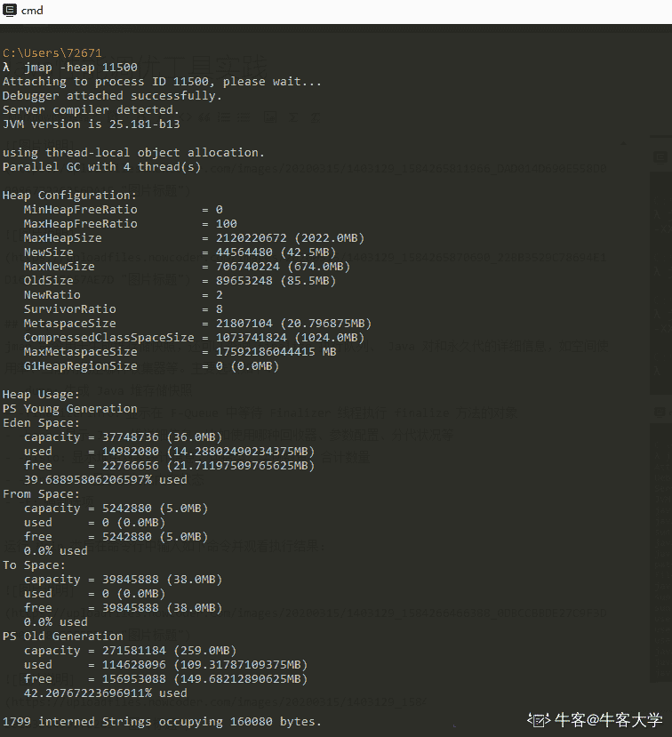
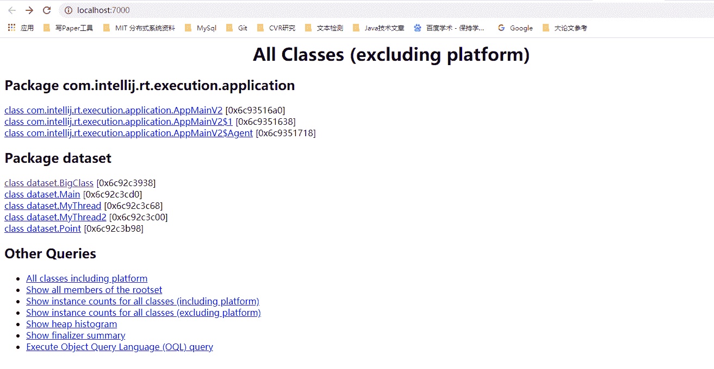
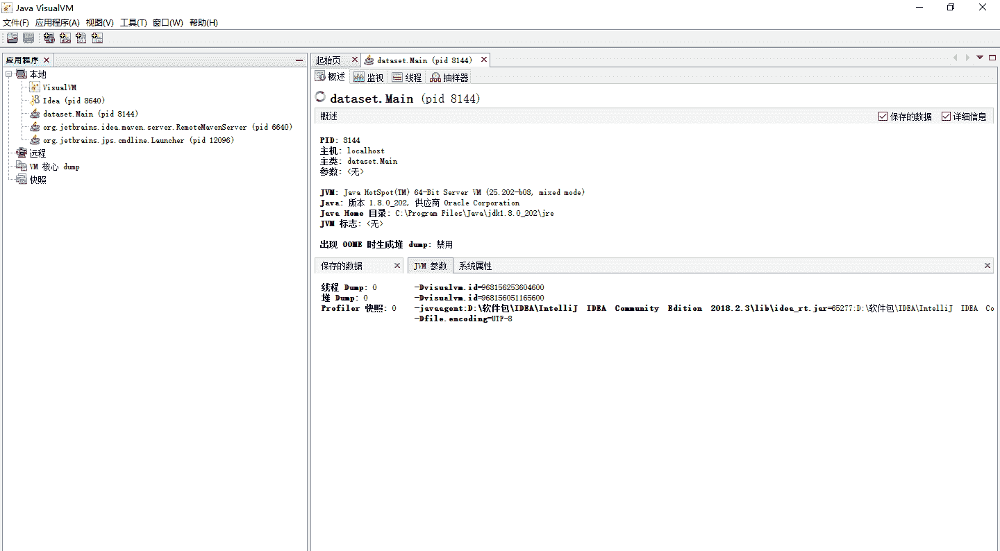

# 第五章 第 2 节 常见工具有哪些

> 原文：[`www.nowcoder.com/tutorial/10077/f616a26ce570497885fc3f696442a40f`](https://www.nowcoder.com/tutorial/10077/f616a26ce570497885fc3f696442a40f)

在使用这些工具前，需要建立若干程序，在程序运行时观测虚拟机状态。

下面给出一些代码，大家请自行在 IDEA 中建立工程，并保证如下代码可正常运行。代码几乎没有什么难度，只是有些地方刻意使用了耗时的操作模拟实际业务场景。

```cpp
public class Main {
    static List<BigClass> l1 = new ArrayList<>();
    static List<BigClass> l2 = new ArrayList<>();
    public static void main(String[] args) throws RuntimeException {
        Thread t1 = new Thread(new MyThread());
        t1.start();
        Thread t2 = new Thread(new MyThread2());
        t2.start();
    }
}
```

```cpp
import java.util.ArrayList;
import java.util.List;
import java.util.Random;

//一个占用空间很大的类，模拟实际业务
class BigClass{
    List<Double> list;
    BigClass() {
        list = new ArrayList<>();
        for (int i=0; i<100000; i++) {
            list.add(i*1.0);
        }
    }
}

class MyThread implements Runnable{
    @Override
    public void run() {
        Point p = new Point(0, 0, "Thread-1");
        Random rt = new Random();
        int cnt = 0;
        while (true) {
            int dx = rt.nextInt(10);
            int dy = rt.nextInt(10);
            if ((dx&1)==1) {
                p.add(dx, dy);
            }
            else {
                p.minus(dx, dy);
            }
            if (cnt%3==0) {
                Main.l1.add(new BigClass());
                System.out.println("Generated by 1");
            }
            p.print();
            try {
                Thread.sleep(2000);
            } catch (InterruptedException e) {
                e.printStackTrace();
            }
            cnt++;
        }
    }
}
class MyThread2 implements Runnable{
    @Override
    public void run() {
        Point p = new Point(0, 0, "Thread-2");
        Random rt = new Random();
        int cnt = 0;
        while (true) {
            int dx = rt.nextInt(10);
            int dy = rt.nextInt(10);
            if ((dx&1)==1) {
                p.add(dx, dy);
            }
            else {
                p.minus(dx, dy);
            }
            if (cnt%3 == 0) {
                Main.l2.add(new BigClass());
                System.out.println("Generated by 2");
            }
            p.print();
            try {
                Thread.sleep(3000);
            } catch (InterruptedException e) {
                e.printStackTrace();
            }
            cnt++;
        }
    }
}
```

```cpp
class Point {
    private int x;
    private int y;
    private String name;
    Point(int x, int y, String name) {
        this.x = x;
        this.y = y;
        this.name = name;
    }
    public void add(int dx, int dy) {
        x += dx;
        y += dy;
    }
    public void minus(int dx, int dy) {
        x -= dx;
        y -= dy;
    }
    public void print() {
        System.out.println(x+ "  "+y+"  "+"   "+name);
    }
}
```

## 2.1 JPS

jps 命令类似于 linux 的 ps 命令，但是它只列出系统中所有的 Java 应用程序(显示虚拟机执行主类，即 main 函数所在的类)。 通过 jps 命令可以方便地查看 Java 进程的启动类、传入参数和 Java 虚拟机参数等信息。

| 选项 | 作用 |
| --- | --- |
| -q | 只输出 LVMID，省略主类的名称 |
| -m | 输出虚拟机进程启动时传递给主类 main() 函数的参数 |
| -l | 输出主类的全名，如果进程执行的是 jar 包，输出 jar 路径 |
| -v | 输出虚拟机进程启动时 JVM 参数 |

运行 Main 类的 main 方法后，在命令行中输入如下命令并观看执行结果：


## 2.2 JSTAT

jstat 全称为 JVM Statistics Monitoring Tool，中文译名为 JVM 统计监控工具。jstat 通过执行 JVM 内建的指令，对 JVM 各种运行状态信息进行监控，如 jstat 可以对类加载、java 堆、垃圾回收情况进行监控。
jstat 主要工具选项如下：

*   -class：监视类装载、卸载数量、总空间以及类装载所耗费的时间
*   -gc：监视 java 堆状态，包括 Eden, Survivor, 老年代, 永久代的容量、已用空间、GC 时间等信息
*   -gccapacity：同 -gc ，但是更关注堆空间使用的最大最小空间
*   -gcutil：同 -gc ，但是更关注已使用空间占总空间的百分比
*   -gccause：同 -gcutil ，但是更关注上一次 GC 产生的原因
*   -gcnew：监视新生代 GC 情况
*   -gcnewcapacity：同 -gcnew ，但是更关注使用到的最大、最小空间
*   -gcold：监视老年代 GC 情况
*   -gcoldcapacity：同 -gcold，但是更关注使用到的最大、最小空间
*   -gcpermcapacity：监视永久代使用的最大、最小空间

运行 Main 类后在命令行中输入如下命令(jstat -参数 pid 时间间隔 采样次数)并观看执行结果：




信息统计中各列含义说明如下：

*   S0C：年轻代中第一个 survivor（幸存区）的容量 (字节)
*   S1C：年轻代中第二个 survivor（幸存区）的容量 (字节)
*   S0U：年轻代中第一个 survivor（幸存区）目前已使用空间 (字节)
*   S1U：年轻代中第二个 survivor（幸存区）目前已使用空间 (字节)
*   EC：年轻代中 Eden（伊甸园）的容量 (字节)
*   EU：年轻代中 Eden（伊甸园）目前已使用空间 (字节)
*   OC：Old 代的容量 (字节)
*   OU：Old 代目前已使用空间 (字节)
*   PC：Perm(持久代)的容量 (字节)
*   PU：Perm(持久代)目前已使用空间 (字节)
*   CCSC：压缩类空间大小
*   CCSU：压缩类空间使用大小
*   YGC：从应用程序启动到采样时年轻代中 gc 次数
*   YGCT：从应用程序启动到采样时年轻代中 gc 所用时间(s)
*   FGC：从应用程序启动到采样时 old 代(全 gc)gc 次数
*   FGCT：从应用程序启动到采样时 old 代(全 gc)gc 所用时间(s)
*   GCT：从应用程序启动到采样时 gc 用的总时间(s)
*   NGCMN：年轻代(young)中初始化(最小)的大小 (字节)
*   NGCMX：年轻代(young)的最大容量 (字节)
*   NGC：年轻代(young)中当前的容量 (字节)
*   OGCMN：old 代中初始化(最小)的大小 (字节)
*   OGCMX：old 代的最大容量 (字节)
*   OGC：old 代当前新生成的容量 (字节)
*   PGCMN：perm 代中初始化(最小)的大小 (字节)
*   PGCMX：perm 代的最大容量 (字节)
*   PGC：perm 代当前新生成的容量 (字节)
*   S0：年轻代中第一个 survivor（幸存区）已使用的占当前容量百分比
*   S1：年轻代中第二个 survivor（幸存区）已使用的占当前容量百分比
*   E：年轻代中 Eden（伊甸园）已使用的占当前容量百分比
*   O：old 代已使用的占当前容量百分比
*   P：perm 代已使用的占当前容量百分比
*   S0CMX：年轻代中第一个 survivor（幸存区）的最大容量 (字节)
*   S1CMX ：年轻代中第二个 survivor（幸存区）的最大容量 (字节)
*   ECMX：年轻代中 Eden（伊甸园）的最大容量 (字节)
*   DSS：当前需要 survivor（幸存区）的容量 (字节)（Eden 区已满）
*   TT： 持有次数限制
*   MTT ： 最大持有次数限制

## 2.3 JINFO

jinfo 的作用是**实时查看**和**调整虚拟机各项参数**。当系统崩溃时，jinfo 可以从 core 文件里面知道崩溃的 Java 应用程序的配置信息。选项说明如下：

*   no option 输出全部的参数和系统属性
*   -flag name 输出对应名称的参数
*   -flag [+|-]name 开启或者关闭对应名称的参数
*   -flag name=value 设定对应名称的参数
*   -flags 输出全部的参数
*   -sysprops 输出系统属性

运行 Main 类后在命令行中输入如下命令并观看执行结果：


## 2.4 JMAP

jmap 命令用于生成堆存储快照，还可以查询 finalize 执行队列、 Java 堆和永久代的详细信息，如空间使用率、当前用的是哪种收集器等。主要选项如下：

*   -dump：生成 Java 堆存储快照
*   -finalizerinfo：显示在 F-Queue 中等待 Finalizer 线程执行 finalize 方法的对象
*   -heap：显示 Java 堆详细信息，比如使用哪种回收器、参数配置、分代状况等
*   -histo：显示堆中对象统计信息，包括类、实例数量、合计数量
*   -permstat：显示永久代内存状态
*   -F：强制选项

运行 Main 类后在命令行中输入如下命令并观看执行结果：





## 2.5 JHAT

jhat 是 JDK 内置的工具之一。主要是用来分析 Java 堆的命令，可以将堆中的对象以 Html 的形式显示出来，包括对象的数量，大小等等，并支持对象查询语言。下面进行演示。

运行 Main 类，并查看进程号。


手动为 PID 为 12008 的进程生成堆快照文件。


然后利用 jhat 工具读取并分析堆快照文件。


随后在浏览器中访问 [`localhost:7000/`](http://localhost:7000/) 即可。



点击具体的某个类可以进入类的详情页面，具体介绍了类的具体情况，如点击 Point 类。


## 2.6 JSTACK

jstack 命令用于生成虚拟机当前时刻的线程快照。线程快照就是当前虚拟机内每一条线程正在执行的方法堆栈集合，生成线程快照的主要目的在于定位线程长时间停顿的原因，比如线程死锁、死循环、请求外部资源导致的长时间等待等都是导致线程长时间停顿的原因。主要选项如下：

*   -F：强制
*   -l：除堆栈外，显示关于锁的附加信息
*   -m：如果调用本地方法，可以显示 C/C++的堆栈

运行 Main 类后在命令行中输入如下命令并观看执行结果：


下面给出一个检测死锁的例子，代码如下：

```cpp
public class DeadLock {
    private static Lock lock1 = new ReentrantLock();
    private static Lock lock2 = new ReentrantLock();
    public static void deathLock() {
        Thread t1 = new Thread() {
            @Override
            public void run() {
                try {
                    lock1.lock();
                    TimeUnit.SECONDS.sleep(1);
                    lock2.lock();
                } catch (InterruptedException e) {
                    e.printStackTrace();
                }
            }
        };
        Thread t2 = new Thread() {
            @Override
            public void run() {
                try {
                    lock2.lock();
                    TimeUnit.SECONDS.sleep(1);
                    lock1.lock();
                } catch (InterruptedException e) {
                    e.printStackTrace();
                }
            }
        };
        t1.setName("mythread1");
        t2.setName("mythread2");
        t1.start();
        t2.start();
    }
    public static void main(String[] args) {
        deathLock();
    }
```

运行这个类后，我们在命令行中观看其输出如下：


首先，使用 -l 参数输出了关于死锁的信息。接下来定位到两个线程的信息输出位置：


## 2.7 VisualVM

VisualVM 是 jdk 自带的监控工具，提供可视化界面，可以更加方便程序员查看程序运行时的各种状态信息。下面我们以在 IDEA 中使用 VisualVM。

首先安装 VisualVM 插件。点击 File->Setting->Plugins 输入 VisualVM 并点击安装。


点击 Run, 可以看到多出现 Run with VisualVM 选项，点击这个，就可以运行程序并打开 VisualVM。我们执行上面的 Main 类。VisualVM 的可视化界面如下图所示。



左边是列举出 VisualVM 监控的几个 JVM 进程，我们运行的就是 Pid 为 8144 的进程。右边有如下页标签：

*   概述页。概述页显示了程序的基本信息和启动参数。
*   监视页。监视页显示了程序利用 CPU、内存、类、线程的使用情况。
*   线程页。线程页显示每个线程的运行时间及状态。
*   抽样器页。对 cpu、内存性能数据进行抽样收集，便于程序的分析。


## 2.8 JProfiler

在 IDEA 的 Settings–plugins 界面直接输入 JProfiler，点击安装插件。到 JProfiler[官方下载地址](https://www.ej-technologies.com/download/jprofiler/version_92)下载 JProfiler。


下载，一路 next 安装，配置 IDEA 运行环境。在 Settings–Tools–JProflier–JProflier 界面选择安装好的 JProfile 可执行文件。


点击图标运行 Main 类，JProfile 的界面如下所示。


可以看到随着程序的运行，内存使用量越来越多。点击 Live memory 下的 All Objects，显示如下图所示。可以发现，占用内存最大的类型为 Double，这点通过查看我们的程序代码不难发现。


利用 JProfiler 工具，我们可以很清楚的看到程序的内存、cpu、线程、GC 等情况，给我们分析问题提供了很好的帮助，关于 JProfiler 的进一步使用希望大家好好挖掘。