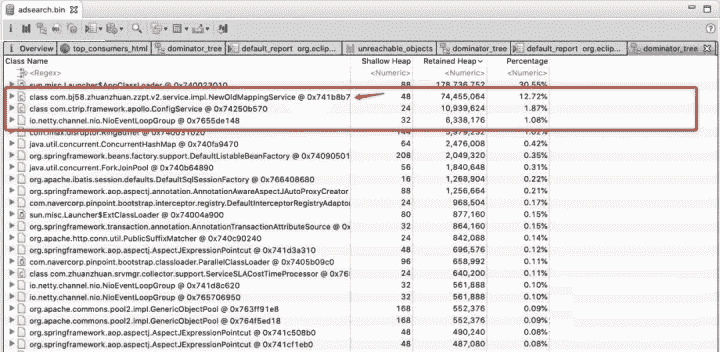
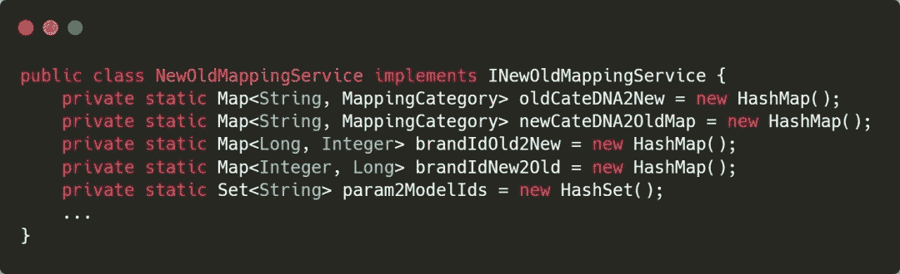
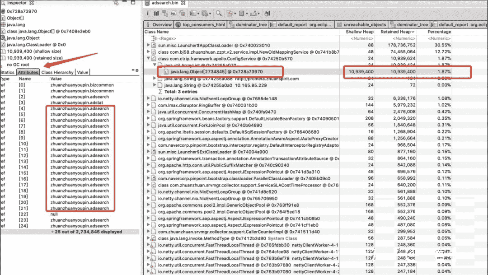
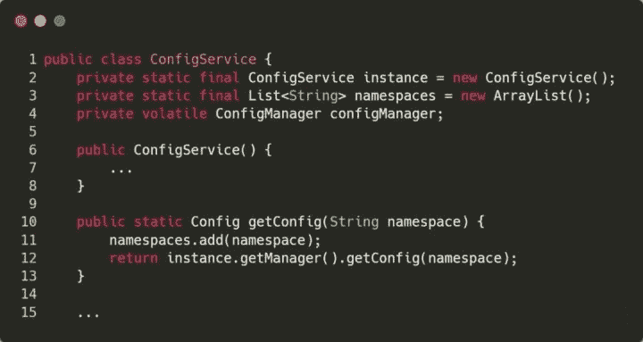

# 第五章 第 3 节 工具使用实例及面试题解析

> 原文：[`www.nowcoder.com/tutorial/10077/1af1f479bef649c2ba077c03af85ac2b`](https://www.nowcoder.com/tutorial/10077/1af1f479bef649c2ba077c03af85ac2b)

# 三 一次线上问题排查过程

在实践中使用工具是熟悉工具最好的途径，本节将讲述一个线上问题的完整排查过程，希望加深对 JVM 工具的认识和掌握。

## 3.1 问题

有一次，新上线的服务系统在运行了一段时间后出现大量的服务超时警告。根据监控显示，在 1 分钟内出现了上千次的服务请求超时。

通过查看监控系统中的性能指标，发现 YoungGC 明显出现异常，较比于旧版本，新版本的 YoungGC 用时明显增加。当进行 YoungGC 时，程序会暂停，即出现 stop the world 现象，而我们规定的服务超时时间是几百毫秒，由于 YoungGC 时间过长，导致整个服务超时。为此，我们推断服务超时的原因为出现了大量的耗时过多的 YoungGC。

为了排查问题，我们下线了一个线上节点，并对线上服务进行回滚处理，接下来就针对线下节点进行分析。

## 3.2 排查过程

YoungGC 主要做如下两件事情：

*   利用可达性分析算法，标注存活对象；
*   将存活对象移动到 Survivor 区或者老年代区。

正常情况下，Survivor 区的利用率保持较低的水平，并且比较平稳，新版本上线后，Survivor 区的空间利用率迅速上升，并且 YoungGC 的异常情况和 Survivor 区的空间利用率异常情况保持一致性。从 YoungGC 的工作机制来看，我们猜测是程序中长周期的对象越来越多导致 YoungGC 时间过长。

为此，我们在机器上执行 jmap -dump:format=b,file=heap pid 来保存堆内存文件，并利用 MAT 工具查看堆中的大对象。

可以看到 NewOldMappingService 占用空间很大，NewOldMappingService 类的代码如下：

这个类有很多的静态变量，在类机制的时候就进行数据初始化，但是通过排查，这些变量在后面不会增加新的数据，所以经过多次 GC 后，这些对象会进入老年代，因此 NewOldMappingService 类不是 YoungGC 异常的原因。

通过再次查看堆内存，我们发现 ConfigService 类，该类的一个 List 有 270W 的对象，而且大部分元素是相同的。

ConfigService 类的代码如下，功能主要是通过名称获得配置信息，因此该类的 getConfig 方法会被大量调用。每一次调用都会将名称存储到一个 List 中，但由于 List 没有做去重添加，导致同一个名称的配置获取添加了多次，最终导致 list 数据过多。

## 3.3 解决

我们发现问题就是 List 没有做去重添加，因此解决的办法也简单，就是做去重添加。修改完，我们在一台服务器上重新部署系统，通过一段时间的运行，发现 YoungGC 异常的问题没有出现。

# 四 面试高频问题及扩展

## 4.1 请问你常用到哪些 JVM 工具？

问题剖析：当面试官提出这个问题时，就是想考察你是否在实际业务场景下具有 JVM 工具的使用经验。光靠背诵知识点并不具有说服力，必须结合实践加深对 JVM 工具的理解。大家可以在我实例代码的基础上改进或在自己的 JavaWeb 项目上进行实践。这个问题没有标准答案，必须结合自己的实际经历来回答，项目越复杂越能体现出你的实践能力。而且可以将 jstat 与垃圾回收，jstack 与多线程并发作为一个模块一起回答，例如结合死锁的例子讲讲你是如何排查问题的，或者讲讲 fullGC 你是怎么观测的，是不是自己的业务代码可能存在隐患。

## 4.2 请问你还知道其他一些关于 JVM 监测的工具么？

问题剖析：当面试官提出这个问题时，就是想看看你是否在较大的业务场景下做过监控的需求。据笔者所知，有些公司专门由基础架构部门开发监控工具，并提供监控大盘实时提供监控数据并提供报警响应。感兴趣的同学可以从 JConsole 和 VisualVM 入手，进阶可以了解下 grafana。建议大家可以搭建一个关于 JVM 的监控系统作为本节的最终实践。