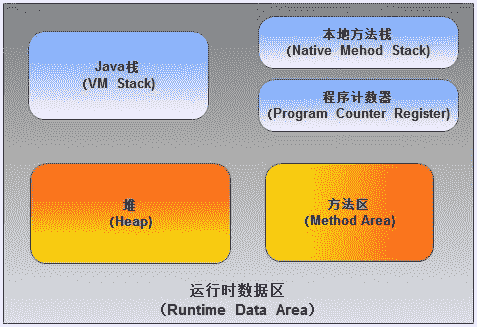
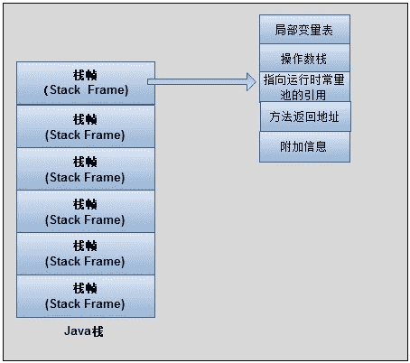

# 第六章 第 1 节 背景知识

> 原文：[`www.nowcoder.com/tutorial/10077/7ddc32650b234c8ca2386de0bf3988f6`](https://www.nowcoder.com/tutorial/10077/7ddc32650b234c8ca2386de0bf3988f6)

# 一 背景知识

在讲解垃圾回收具体技术之前，本节将介绍 Java 运行时内存划分和垃圾回收的背景知识。

## 1.1 什么是垃圾回收？

计算机程序运行时的数据和代码都是存储在内存中，cpu 到内存中取出相应的指令和数据完成计算，并将结果写入内存。但内存不是无限大的，虽然有扩大实际使用内存的技术，如虚拟内存，但内存总是有限的，并不能存放无限多的数据和代码。内存是宝贵的，因此我们希望内存上存放的数据都是有用的，不需要没用的数据占据着内存。占据着内存的没用数据就是垃圾，将这些没用的数据从内存中移除就是垃圾回收。

C 语言中使用 malloc 来申请内存，当数据没用时，需要使用 free 来人为地释放内存，这种方式需要程序员自己进行垃圾回收。使用这种方式进行垃圾回收的一个很明显问题就是繁琐，程序员要在每次使用完数据时主动释放，如果忘记释放了，这就导致了内存泄漏的问题。手动进行垃圾回收还有其他问题，如 Double free 问题，当你第一次 free 之后，就将这块内存归还给系统了，系统有可能马上就将它分配给了其它程序，你再 free 就发生了非法内存读写。

由于手动进行垃圾回收存在各种问题，将垃圾回收自动化是一个很有意义的事情。垃圾回收自动化之后，程序员只注重数据的使用，不再担心无用数据浪费内存。天下没有免费的午餐，实现垃圾回收自动化肯定需要消耗计算机资源，有时候会大幅度影响程序的性能。为了尽量降低垃圾回收自动化带来的不利影响，我们就需要知道垃圾回收自动化具体实现技术，并尽可能消除垃圾回收自动化带来的不利影响。

## 1.2 Java 运行时内存区域划分

垃圾就是占据着内存空间但程序不再需要的数据，但在 java 虚拟机管理的内存中，哪些内存区域是产生垃圾的主要地方，本节介绍 Java 运行时内存区域划分。

java 运行时内存主要划分如下图所示，主要分为虚拟机栈、本地方法栈、程序计数器以及堆和方法区，下面一一介绍。

**程序计数器**：是线程独有的，用于记录线程当前需要执行指令的地址。由于程序计数器使用的内存空间大小是恒定的，因此这部分区域不是产生垃圾的主要场所。

**虚拟机栈**：是线程独有的，Java 方法执行的内存模型。虚拟机栈中存放的是一个个的栈帧，每个栈帧对应一个被调用的方法，当方法调用时压栈，方法返回时弹出。由于栈帧的生命周期和方法的生命周期一致，这部分空间的分配和释放都是由系统自动实施的，故虚拟机栈也不是垃圾产生的主要场所。

**本地方法栈**：和虚拟机栈作用类似，是本地方法（Native Method）执行的内存模型。

**堆**：线程共享的，用于存储对象本身以及数组。由于对象和数组在使用完后可能不再被程序需要，因此暂时未被回收的对象和数组就是垃圾，所以堆是产生垃圾的主要场所。

**方法区**：线程共享，用于存储每个类的信息（包括类的名称、方法信息、字段信息）、静态变量、常量以及编译器编译后的代码等。方法区也会产生垃圾，但不是产生垃圾的主要场所。