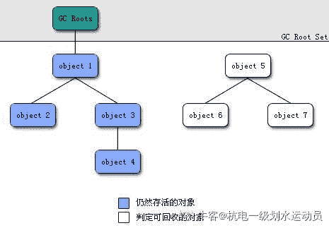
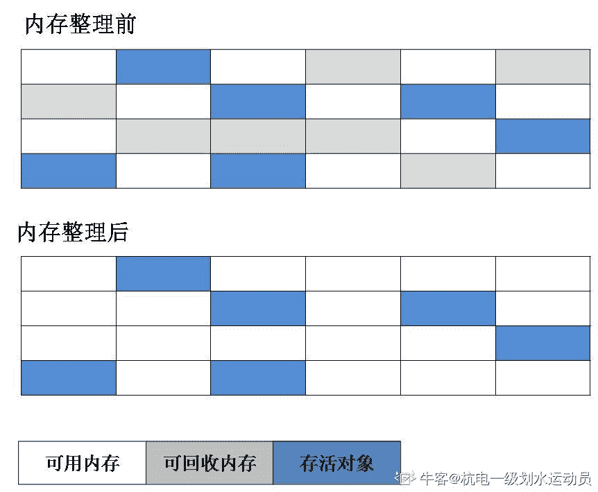
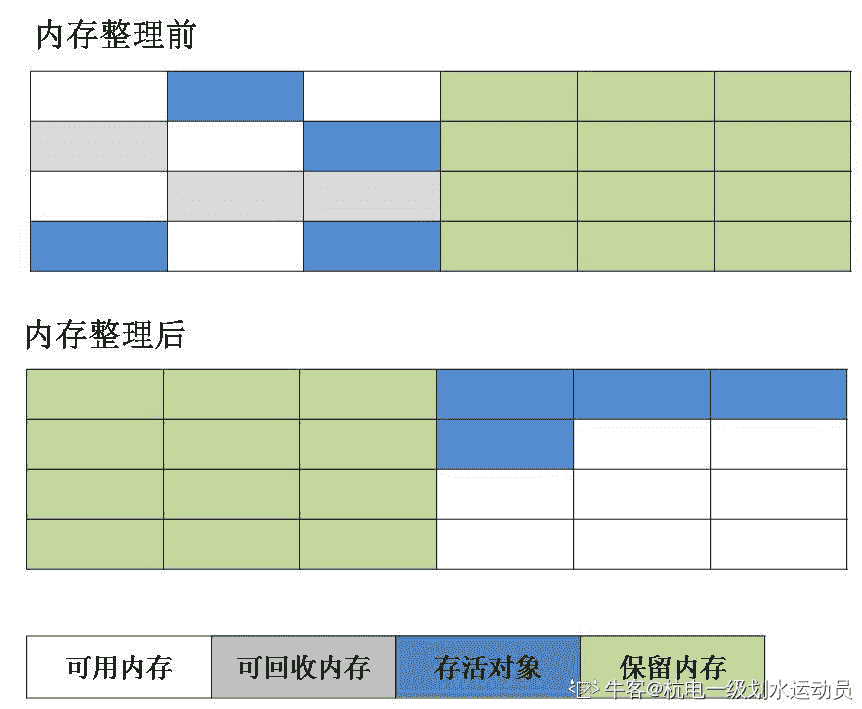
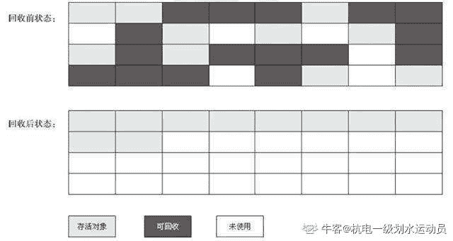
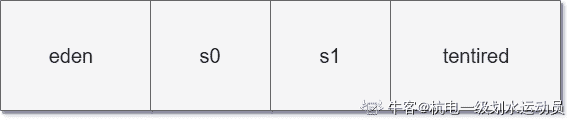
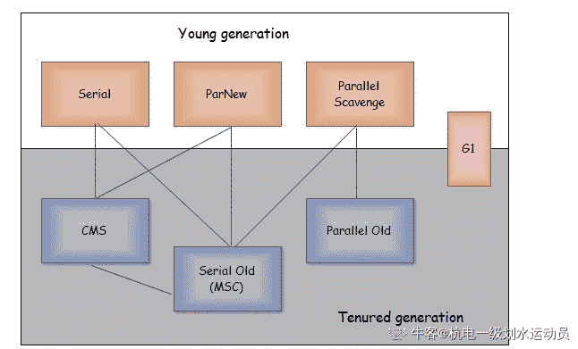
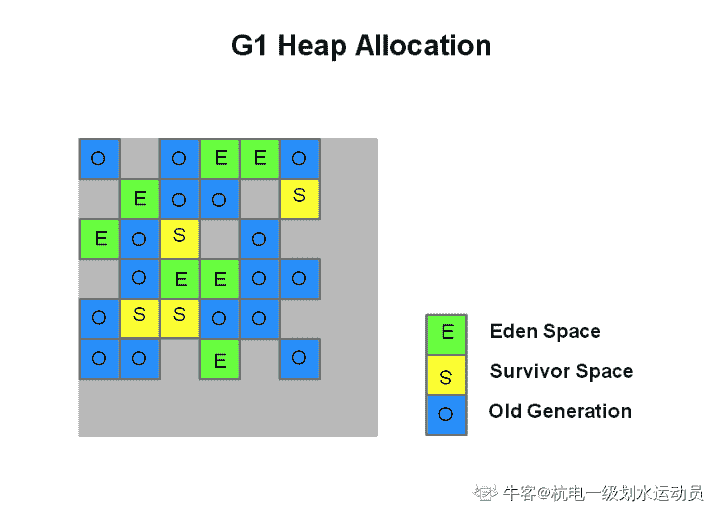
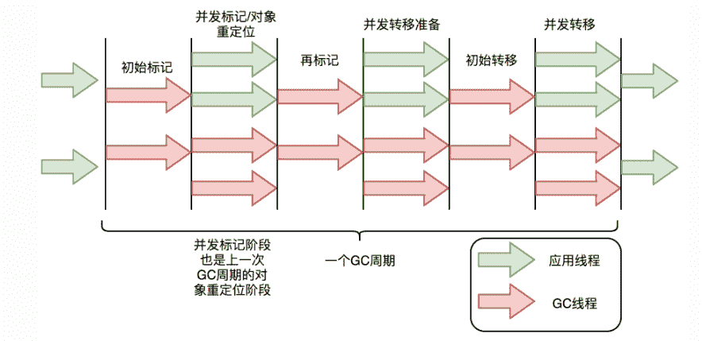

# 第六章 第 2 节 垃圾回收具体技术

> 原文：[`www.nowcoder.com/tutorial/10077/b215f45a8dee4fe8a880529ec78f163f`](https://www.nowcoder.com/tutorial/10077/b215f45a8dee4fe8a880529ec78f163f)

本节将对 JVM 中的垃圾回收技术进行具体的介绍。

## 2.1 垃圾识别

垃圾回收的第一步就是识别哪些是垃圾，本节就来介绍垃圾识别有哪些技术。

### 2.1.1 引用计数法

引用计数法给对象添加一个引用计数器，每当有一个地方引用该对象，对象的计数器就加 1，当引用失效，计数器就减 1，任何时候计数器为 0 的对象就是不可能再被使用的。这个方法实现简单，效率高，但是目前主流的虚拟机中并没有选择这个算法来进行垃圾识别，其最主要的原因是它很难解决对象之间相互循环引用的问题。所谓对象之间的相互引用问题，如下面代码所示：除了对象 objA 和 objB 相互引用着对方之外，再没有其他地方引用它们。但是他们因为互相引用对方，导致它们的引用计数器都不为 0，于是引用计数算法无法通知 GC 回收器回收他们。

```cpp
public class ReferenceCountingGc {
    Object instance = null;
    public static void main(String[] args) {
        ReferenceCountingGc objA = new ReferenceCountingGc();
        ReferenceCountingGc objB = new ReferenceCountingGc();
        objA.instance = objB;
        objB.instance = objA;
        objA = null;
        objB = null;

    }
}
```

### 2.1.2 可达性分析法

可达性分析算法通过一系列的称为 “GC Roots” 的对象作为起点，从这些节点开始向下搜索，节点所走过的路径称为引用链，当一个对象到 GC Roots 没有任何引用链相连的话，则证明此对象是不可用的。



在 Java 中，可作为 GC Root 的对象通常包括下面几种：

*   虚拟机栈中(栈帧中的本地变量表)中引用的对象
*   方法区中类静态属性引用的对象
*   方法区中常量引用的对象
*   本地方法中栈中 JNI 引用的对象
*   所有被同步锁 synchronized 持有的对象
*   jvm 内部的引用对象，如基本数据类型对应的 Class 对象，一些常驻的异常对象（如： NullPointerException、OutOfMemoryError）
*   反映 jvm 内部情况的 JMXBean、JVMTI 中注册的回调、本地代码缓存等
*   根据用户所选用的垃圾收集器和当前回收的内存区域不同，其他临时性对象

即使在可达性分析法中不可达的对象，也并非是“非死不可”的，这时候它们暂时处于“缓刑阶段”，要真正宣告一个对象死亡，至少要经历两次标记过程；可达性分析法中不可达的对象被第一次标记并且进行一次筛选，筛选的条件是此对象是否有必要执行 **finalize**方法。当对象没有覆盖 finalize 方法，或 finalize 方法已经被虚拟机调用过时，虚拟机将这两种情况视为没有必要执行。被判定为需要执行的对象将会被放在一个队列 **F-Queue** 中,稍后由一个虚拟机自动建立的、低优先级的 Finalizer 线程去执行它。如果在 **finalize**方法中出现死循环，则可能导致内存回收系统崩溃。**finalize**方法使得对象有一次逃离死亡的机会，只要这个对象与引用链上的任何一个对象建立关联即可，否则就会被真的回收。任何对象的**finalize**方法都只会被系统自动调用一次。

可达性分析法就是从 GC Root 开始进行扫描的，并且知道栈帧中的引用类型是 GC Roots 集合中的一个重要部分，因此如何获取到这些引用类型数据就是 GC 的重要一步了。根据如何获取，GC 可分为如下三种类型：

1.  保守式 GC。如果 JVM 不记录数据的类型，那么它就无法区分内存里某个位置上的数据到底应该解读为引用类型还是其他类型，这种 GC 就是“保守式 GC（conservative GC）”。因此只能靠一些条件来猜测数据是否是指向 GC 堆中的指针。比如在栈上扫描的时候根据所在地址是否在 GC 堆的上下界之内，是否字节对齐等手段来判断这个是不是指向 GC 堆中的指针。
2.  半保守式 GC。JVM 不在栈上记录类型信息，而在对象上记录类型信息，这种 GC 方式就是半保守式 GC。这种方式从根扫描的话还是一样，得靠猜测，但是得到堆内对象了之后，就能准确知晓对象所包含的信息了，因此之后扫描 都是准确的。
3.  准确式 GC。JVM 能够判断出所有位置上的数据是不是指向 GC 堆里的引用，这种方式就是准确式 GC。

## 2.2 JVM 中的引用

无论是在引用计数法还是可达性分析法中都有一个很重要的概念“引用”，为了加深理解，本节对 JVM 中的引用进行详细的介绍。

引用分为强引用、软引用、弱引用、虚引用四种（引用强度逐渐减弱）：

*   强引用，常见的引用，垃圾回收器绝不会回收它。强引用就是我们平常用的类似于“Object obj = new Object()”的引用。当内存空间不足，Java 虚拟机宁愿抛出 OutOfMemoryError 错误，使程序异常终止，也不会靠随意回收具有强引用的对象来解决内存不足问题

*   软引用。Java 提供了 SoftReference 类来实现软引用。如果内存空间足够，垃圾回收器就不会回收它，如果内存空间不足了，就会回收这些对象的内存。只要垃圾回收器没有回收它，该对象就可以被程序使用。软引用可用来实现内存敏感的高速缓存。软引用可以加速 JVM 对垃圾内存的回收速度，可以维护系统的运行安全，防止内存溢出（OutOfMemory）等问题的产生。软引用适合缓存的场景。Guava Cache 是 Google 开源的本地缓存实现库，该类库支持基于引用的回收，CacheBuilder.softValues()使用软引用存储值，目的就是在内存不够是进行回收，防止内存溢出。

*   弱引用。Java 提供了 WeakReference 类来实现软引用。只具有弱引用的对象拥有更短暂的生命周期。在垃圾回收器线程扫描它所管辖的内存区域的过程中，一旦发现了只具有弱引用的对象，不管当前内存空间足够与否，都会回收它的内存。ThreadLocalMap 类中的 Entry 的 Key 即 ThreadLocal 对象是采用弱引用的，源码如下。假如使用强引用，当 ThreadLocal 不再使用需要回收时，发现某个线程中 ThreadLocalMap 存在该 ThreadLocal 的强引用，无法回收，造成内存泄漏。因此，使用弱引用可以防止长期存在的线程（通常使用了线程池）导致 ThreadLocal 无法回收造成内存泄漏。

    ```cpp
    static class ThreadLocalMap {

          /**
           * The entries in this hash map extend WeakReference, using
           * its main ref field as the key (which is always a
           * ThreadLocal object).  Note that null keys (i.e. entry.get()
           * == null) mean that the key is no longer referenced, so the
           * entry can be expunged from table.  Such entries are referred to
           * as "stale entries" in the code that follows.
           */
          static class Entry extends WeakReference<ThreadLocal<?>> {
              /** The value associated with this ThreadLocal. */
              Object value;

              Entry(ThreadLocal<?> k, Object v) {
                  super(k);
                  value = v;
              }
          }
    ```

*   虚引用。虚引用并不会决定对象的生命周期。如果一个对象仅持有虚引用，那么它就和没有任何引用一样，在任何时候都可能被垃圾回收。虚引用唯一的用处在于对象被回收器回收时收到一个系统通知。FileCleaningTracker 是一个文件清理的跟踪器，它的实现不是简单的通过定时器来定时清理文件，而是使用跟踪 GC 来清理文件。FileCleaningTracker 就是利用了虚引用，当虚引用的对象被清理时执行相应的业务动作。

## 2.3 垃圾回收算法

本小节将介绍具体的垃圾回收算法。

### 2.3.1 标记清除算法

该算法分为“标记”和“清除”阶段：首先标记出所有存活的对象，在标记完成后统一回收所有未被标记的对象。它是最基础的收集算法，后续的算法都是对其不足进行改进得到。这种垃圾收集算带来两个明显的问题：

*   效率问题。当在执行标记和清除两个动作时，用户程序是停止运行的，这会导致用户体验非常差，尤其对于交互式的应用程序来说简直是无法接受。试想一下，如果你正在和一个网站进行交互，这个网站十几分钟就需要停机几分钟，这能忍受吗？
*   空间问题（标记清除后会产生大量不连续的碎片）。如下图所示，垃圾对象无规律的分布在内存的各个地方，回收后内存的布局自然会乱七八糟。碎片太多会导致如果以后程序运行过程中需要分配大对象，将无法找到足够大的连续空间，所以会被迫再次进行垃圾回收。



### 2.3.2 复制算法

为了解决内存碎片化的问题，“复制”收集算法出现了。它将内存分为大小相同的两块，每次使用其中的一块。当这一块的内存使用完后，就将还存活的对象复制到另一块去，然后再把使用的空间一次清理掉。这样每次回收后得到的内存都是连续的，但复制算法使得可用内存是实际内存的一半。



### 2.3.3 标记-整理算法

标记-整理算法和标记清除算法类似，标记过程仍然与“标记-清除”算法一样，但后续步骤不是直接对可回收对象回收，而是让所有存活的对象向一端移动，然后直接清理掉端边界以外的内存，这样回收后得到的内存也是连续的。



以上三种垃圾回收算法对比如下。

| | 标记清除算法 | 复制算法 | 标记整理算法
---|--- |--- |--- |---
时间开销 | 中等 | 最快 | 最慢 |
空间浪费 | 不存在 | 存在 | 不存在 |
内存碎片化 | 存在 | 不存在 | 不存在 |
是否移动对象 | 不存在 | 存在 | 存在 |

### 2.3.4 分代收集算法

当前虚拟机的垃圾收集大都采用分代收集算法，可以根据各个代的特点选择合适的垃圾收集算法。根据分代收集算法，堆内存可以细分为：新生代和老年代，新生代又分为 Eden 空间、From Survivor、To Survivor 空间等。各区所占的比例如下，老年代占 2/3，剩下的 1/3 Eden 占 80%，两个 survivor 各占 10% 。



对象常见的分配策略如下：

*   对象优先在 eden 区分配
*   大对象直接进入老年代(需要大量连续内存空间的对象，比如：字符串、数组)
*   长期存活的对象将进入老年代

由于在新生代中，每次收集都会有大量对象死去，所以可以选择复制算法，只需要付出少量对象的复制成本就可以完成每次垃圾收集。而老年代的对象存活几率是比较高的，而且没有额外的空间对它进行分配担保，所以我们必须选择“标记-清除”或“标记-整理”算法进行垃圾收集。

大多数情况下，对象在新生代中 eden 区分配。当 eden 区没有足够空间进行分配时，虚拟机将发起一次 Minor GC（后面会介绍 Minor GC 和其他 GC 的区别），回收垃圾对象。如果对象还存活，则会进入 s0 或者 s1，并且对象的年龄还会加 1(Eden 区->Survivor 区后对象的初始年龄变为 1)，当它的年龄增加到一定程度（默认为 15 岁），就会被晋升到老年代中。为了更好的适应不同程序的内存情况，虚拟机不是永远要求对象年龄必须达到了某个值才能进入老年代，如果 Survivor 空间中相同年龄所有对象大小的总和大于 Survivor 空间的一半，年龄大于或等于该年龄的对象就可以直接进入老年代，无需达到要求的年龄。

## 2.4 垃圾收集器

本节介绍目前主流的垃圾收集器。



### 2.4.1 Serial 收集器

Serial（串行）收集器是最基本、历史最悠久的垃圾收集器了。大家看名字就知道这个收集器是一个单线程收集器了。它的 “单线程” 的意义不仅仅意味着它只会使用一条垃圾收集线程去完成垃圾收集工作，更重要的是它在进行垃圾收集工作的时候必须暂停其他所有的工作线程（ "Stop The World" ），直到它收集结束。新生代采用复制算法，老年代采用标记-整理算法。

### 2.4.2 ParNew 收集器

ParNew 收集器其实就是 Serial 收集器的多线程版本，除了使用多线程进行垃圾收集外，其余行为（控制参数、收集算法、回收策略等等）和 Serial 收集器完全一样。新生代采用复制算法，老年代采用标记-整理算法。它是许多运行在 Server 模式下的虚拟机的首要选择，除了 Serial 收集器外，只有它能与 CMS 收集器（真正意义上的并发收集器，后面会介绍到）配合工作。

### 2.4.3 Parallel Scavenge 收集器

Parallel Scavenge 收集器关注点是吞吐量（高效率的利用 CPU）。CMS 等垃圾收集器的关注点更多的是用户线程的停顿时间（提高用户体验）。所谓吞吐量就是 CPU 中用于运行用户代码的时间与 CPU 总消耗时间的比值。新生代采用复制算法，老年代采用标记-整理算法。

### 2.4.4 Serial Old 收集器

Serial 收集器的老年代版本，它同样是一个单线程收集器。它主要有两大用途：一种用途是在 JDK1.5 以及以前的版本中与 Parallel Scavenge 收集器搭配使用，另一种用途是作为 CMS 收集器的后备方案。

### 2.4.5 Parallel Old 收集器

Parallel Scavenge 收集器的老年代版本。使用多线程和“标记-整理”算法。在注重吞吐量以及 CPU 资源的场合，都可以优先考虑 Parallel Scavenge 收集器和 Parallel Old 收集器。

### 2.4.6 CMS 收集器

CMS 收集器是一种 “标记-清除”算法实现的，它的运作过程相比于前面几种垃圾收集器来说更加复杂一些。整个过程分为四个步骤：

*   初始标记： 暂停所有的其他线程，并记录下直接与 root 相连的对象，速度很快
*   并发标记： 同时开启 GC 和用户线程，用一个闭包结构（整个内存中的所有 GCRoots 及递归可达的对象）去记录可达对象。但在这个阶段结束，这个闭包结构并不能保证包含当前所有的可达对象。因为用户线程可能会不断的更新引用域，所以 GC 线程无法保证可达性分析的实时性。为此 CMS 会跟踪记录这些发生引用更新的地方,,就是将对象的 Card 标识为 Dirty。
*   重新标记： 重新标记阶段就是为了修正并发标记期间因为用户程序继续运行而导致标记产生变动的那一部分对象的标记记录，这个阶段的停顿时间一般会比初始标记阶段的时间稍长，远远比并发标记阶段时间短
*   并发清除： 开启用户线程，同时 GC 线程开始对为标记的区域做清扫

CMS 的缺点：

*   对 CPU 资源敏感(CMS 默认启动的回收线程数是(cpu 数量+3/4))
*   无法处理浮动垃圾
*   它使用标记清除算导致收集结束时会有大量空间碎片产生。内存碎片会导致即使剩余空间是足够的，但是却不能分配出连续的内存，导致分配失败

CMS 收集器无法处理浮动垃圾，可能出现 “Concurrent Mode Failure” 失败而导致另一次 Full GC 的产生。由于 CMS 并发清理阶段用户线程还在运行着，伴随程序运行自然就还会有新的垃圾不断产生，这一部分垃圾出现在标记过程之后， CMS 无法在当次收集中处理掉它们，只好留待下一次 GC 时再清理掉。这一部分垃圾就称为“浮动垃圾”。也是由于在垃圾收集阶段用户线程还需要运行，那也就还需要预留有足够的内存空间给用户线程使用，因此 CMS 收集器不能像其他收集器那样等到老年代几乎完全被填满了再进行收集，需要预留一部分空间提供并发收集时的程序运作使用。要是 CMS 运行期间预留的内存无法满足程序需要，就会出现一次“Concurrent Mode Failure”失败，这时虚拟机将启动后备预案：临时启用 Serial Old 收集器来重新进行老年代的垃圾收集，这样停顿时间就很长了。

### 2.4.7 G1 收集器

G1 (Garbage-First) 是一款面向服务器的垃圾收集器，主要针对配备多颗处理器及大容量内存的机器。以极高概率满足 GC 停顿时间要求的同时，还具备高吞吐量性能特征。它具备以下特定：

*   并行与并发：G1 能充分利用 CPU、多核环境下的硬件优势，使用多个 CPU（CPU 或者 CPU 核心）来缩短 Stop-The-World 停顿时间。部分其他收集器原本需要停顿 Java 线程执行的 GC 动作，G1 收集器仍然可以通过并发的方式让 java 程序继续执行
*   分代收集：虽然 G1 可以不需要其他收集器配合就能独立管理整个 GC 堆，但是还是保留了分代的概念
*   空间整合：与 CMS 的“标记--清理”算法不同，G1 从整体来看是基于“标记整理”算法实现的收集器；从局部上来看是基于“复制”算法实现的
*   可预测的停顿：这是 G1 相对于 CMS 的另一个大优势，降低停顿时间是 G1 和 CMS 共同的关注点，但 G1 除了追求低停顿外，还能建立可预测的停顿时间模型，能让使用者明确指定在一个长度为 M 毫秒的时间片段内

G1 收集器的运作大致分为以下几个步骤：

*   初始标记
*   并发标记
*   最终标记
*   筛选回收

G1 收集器在后台维护了一个优先列表，每次根据允许的收集时间，优先选择回收价值最大的 Region(这也就是它的名字 Garbage-First 的由来)。这种使用 Region 划分内存空间以及有优先级的区域回收方式，保证了 GF 收集器在有限时间内可以尽可能高的收集效率（把内存化整为零）。

G1 的内存结构和传统的内存空间划分有比较的不同。G1 将内存划分成了多个大小相等的 Region（默认是 512K），Region 逻辑上连续，物理内存地址不连续。同时每个 Region 被标记成 E、S、O、H，分别表示 Eden、Survivor、Old、Humongous。其中 E、S 属于年轻代，O 与 H 属于老年代。示意图如下：

H 表示 Humongous。从字面上就可以理解表示大的对象（下面简称 H 对象）。当分配的对象大于等于 Region 大小的一半的时候就会被认为是巨型对象。H 对象默认分配在老年代，可以防止 GC 的时候大对象的内存拷贝。通过如果发现堆内存容不下 H 对象的时候，会触发一次 GC 操作。

通过引入 Region 的概念，从而将原来的一整块内存空间划分成多个的小空间，使得每个小空间可以单独进行垃圾回收。这种划分方法带来了很大的灵活性，使得可预测的停顿时间模型成为可能。通过记录每个 Region 垃圾回收时间以及回收所获得的空间（这两个值是通过过去回收的经验获得），并维护一个优先列表，每次根据允许的收集时间，优先回收价值最大的 Region。每个 Region 都有一个 Remembered Set，用来记录该 Region 对象的引用对象所在的 Region。通过使用 Remembered Set，在做可达性分析的时候就可以避免全堆扫描。

在进行 Young GC 的时候，Young 区的对象可能还存在 Old 区的引用， 这就是跨代引用的问题。为了解决 Young GC 的时候，扫描整个老年代，G1 引入了 Card Table 和 Remembered Set 的概念，基本思想就是用空间换时间。这两个数据结构是专门用来处理 Old 区到 Young 区的引用。Young 区到 Old 区的引用则不需要单独处理，因为 Young 区中的对象本身变化比较大，没必要浪费空间去记录下来：

*   RSet：全称 Remembered Sets, 用来记录外部指向本 Region 的所有引用，每个 Region 维护一个 RSet。
*   Card: JVM 将内存划分成了固定大小的 Card。这里可以类比物理内存上 page 的概念。

SATB 的全称（Snapshot At The Beginning）字面意思是开始 GC 前存活对象的一个快照。SATB 的作用是保证在并发标记阶段的正确性。当并发标记阶段，应用线程改变了引用关系，则会破坏快照的准确性。G1 采用的是 pre-write barrier 解决这个问题。简单说就是在并发标记阶段，当引用关系发生变化的时候，通过 pre-write barrier 函数会把这种这种变化记录并保存在一个队列里，在 JVM 源码中这个队列叫 satb_mark_queue 。在 remark 阶段会扫描这个队列，通过这种方式，旧的引用所指向的对象就会被标记上，其子孙也会被递归标记上，这样就不会漏标记任何对象， snapshot 的完整性也就得到了保证。SATB 的方式记录活对象，也就是那一时刻对象 snapshot, 但是在之后这里面的对象可能会变成垃圾, 叫做浮动垃圾（floating garbage），这种对象只能等到下一次收集回收掉。在 GC 过程中新分配的对象都当做是活的，其他不可达的对象就是死的。

### 2.4.8 ZGC

ZGC（The Z Garbage Collector）是 JDK11 中推出的一款低延迟垃圾回收器，它的设计目标包括：

*   停顿时间不超过 10ms；
*   停顿时间不会随着堆的大小，或者活跃对象的大小而增加；
*   支持 8MB~4TB 级别的堆（未来支持 16TB）。
    从设计目标来看，我们知道 ZGC 适用于大内存低延迟服务的内存管理和回收。

与 CMS 中的 ParNew 和 G1 类似，ZGC 也采用标记-复制算法，不过 ZGC 对该算法做了重大改进：ZGC 在标记、转移和重定位阶段几乎都是并发的，这是 ZGC 实现停顿时间小于 10ms 目标的最关键原因。

ZGC 垃圾回收周期如下图所示：



ZGC 只有三个阶段需要停顿：**初始标记，再标记，初始转移**。初始标记和初始转移都只需要扫描所有 GC Roots，因此停顿时间和 GC Roots 的数量成正比，但一般情况下用时非常短。再标记阶段耗时时间很短，规定最多耗时 1ms，超过 1ms 则再次进入并发标记阶段。ZGC 几乎所有暂停都只依赖于 GC Roots 集合大小，停顿时间不会随着堆的大小或者活跃对象的大小而增加。

以上几种垃圾收集器对比如下。

| 名称 | 收集算法 | 工作区域 | 可配合对象 | 线程 | 并发 | 适合场景 | 缺点 |
| --- | --- | --- | --- | --- | --- | --- | --- |
| Serial | 复制算法 | 新生代 | CMS; Serial Old | 单 | 否 | 单 CPU;Client 模式下 | 缺点：stop the world; 优点：简单高效,没有线程交互开销,专注于 GC; |
| ParNew | 复制算法 | 新生代 | CMS; Serial Old | 多 | 是 | 多 CPU; Server 模式下 | 缺点：stop the world; 优点：并行并发 GC |
| Parallel Scavenge | 复制算法 | 新生代 | Serial Old;Parallel Scavenge | 多 | 是 | 吞吐量控制,Client,server 均可以 | 主要关注吞吐量,通过吞吐量的设置控制停顿时间,适应不同的场景 |
| Serial Old | 标记整理算法 | 老年代 | Serial,ParNew,Parallel Scavenge | 单 | 否 | 主要 Client 模式下 | 缺点：stop the world |
| Parallel Old | 复制算法（Parallel Scavenge 老年代版本） | 老年代 | Parallel Scavenge | 多 | 是 | 吞吐量控制,Client,server 均可以 | 主要关注吞吐量,通过吞吐量的设置控制停顿时间,适应不同的场景 |
| CMS(Concurretn Mark Sweep) | 标记清除算法 | 老年代 | Serial,ParNew | 多 | 是 | 互联网站;B/S 系统服务端 | 缺点：CPU 资源敏感,无法处理浮动垃圾,产生大量内存碎片；优点：并发收集,低停顿 |
| G1 | 标记整理算法 | 新生代&老年代 |  | 多 | 是 | 面向服务端应用 | 优点：并行与并发，分代收集,空间整合(标记整理算法),可预测停顿 |