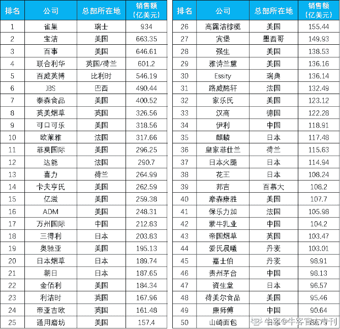

# 第一章 第 2 节 快消公司介绍

> 原文：[`www.nowcoder.com/tutorial/10093/0487199405cd48b5b3d1f78a8ec34104`](https://www.nowcoder.com/tutorial/10093/0487199405cd48b5b3d1f78a8ec34104)

## 快消公司介绍

快消品行业包容面非常广，按照各家产品类型不同，大致分为四个子行业：

个人护理

家庭护理

食品饮料

烟酒

其余，像化妆品、奢侈品、服装等，因为工作性质把他们列为宽泛意义得快消行业，下面为大家介绍下各大快消公司。

关于快消公司的排名情况，各家都说各家的好，莫衷一是。我们能够看到的就是客观的数据和经营状况。2019 年《财富》世界 500 强排行榜中，雀巢全球排名 76 名，强生 109 名（强生的医疗产品和医疗器械份额占比较大），宝洁 146 名，百事 154 名，联合利华 167 名，百威英博 192 名，可口可乐 395 名，欧莱雅 396 名，达能 432 名，卡夫亨氏 472 名，亿滋 480 名。

欧晰析企业管理咨询公司(OC&C)发布了 2019 全球 50 强快速消费品公司排行，该榜单主要根据各企业 2018 财政年度的业绩进行排名，其中上榜的品牌都是人们耳熟能详的，譬如雀巢、宝洁、百事、联合利华等等都在列内。下面这个全球 50 强快消公司榜单，供大家参考：

2019 全球 50 大快速消费品公司排行名单

关于快消公司市面上流传的不成文的 tier 划分，根据薪资、企业实力、未来发展等等分成 3 个 tier，大家在求职的时候也可以参考：

**Tier1: 宝洁、可口可乐；**

**Tier2: 强生、联合利华、百威英博、玛氏、雀巢、欧莱雅、雅诗兰黛、利洁时、汉高、高露洁、达能、益海嘉里（金龙鱼）、中粮、金佰利、蓝月亮、立白、费列罗、阿迪达斯、红珏高级时装、如新（中国）、路易威登 LVMH、迪奥 Dior、卡地亚 Cartier、爱马仕、Calvin Klein、Tiffany & Co.、古驰 coach、百事、伊利集团、Mattel；**

**Tier 3: 星巴克、国美、李锦记、蒙牛、迪卡侬、农夫山泉、苹果、郎酒、沃尔玛、永旺、红星美凯龙；**

在消费品行业日益发展的今天，虽然大部分市场份额依然由宝洁、联合利华等巨头占据主要地位。但是国内品牌的发展势头也很迅猛，大家在求职快消行业时，也可以多考虑考虑国内的快消公司。比较知名的国内公司有：

**个人&家庭洗护：纳爱斯、立白、隆力奇、重庆奥妮、上海家化、北京三露等。**

**食品饮料：娃哈哈、光明、蒙牛、伊利、五粮液、青岛啤酒、汇源果汁、康师傅、统一、雅士利、冠生园等。**