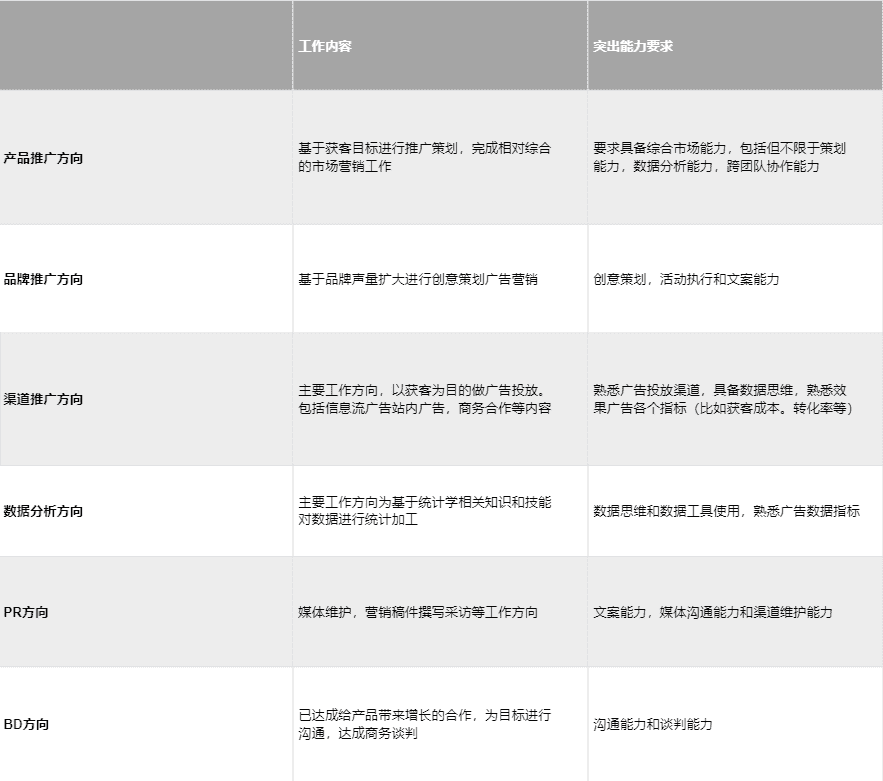
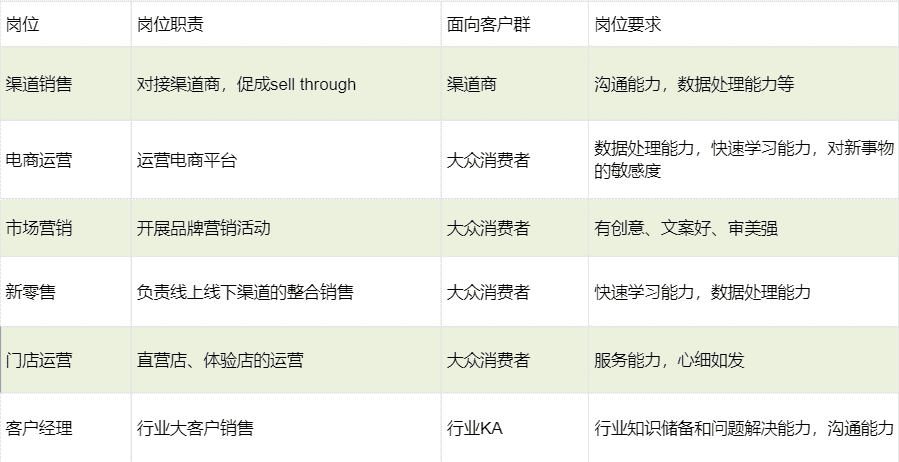

# 第二章 第 1 节 岗位全解

> 原文：[`www.nowcoder.com/tutorial/10093/33c7d871131849f6adce2e4b8f720471`](https://www.nowcoder.com/tutorial/10093/33c7d871131849f6adce2e4b8f720471)

## 市场部

首先市场部是快消公司最为核心的部门，首先，快消最重要的事情就是营销。创新的产品概念、必要的广告投入、长期的品牌维护，这些都是由市场部做的事情，由此可见市场部在快速消费品行业的重要作用。

比如香皂有一百多年的历史，主要成分还是那样，只不过增添更多的新价值，或滋润、或清爽、或花香、或感受。舒肤佳香皂在中国市场很多年，主要的成分没有变化多少，但每年会变换新包装，投放新广告，实行新促销，进行新活动，形式上的新意和主张上的新意胜过一切，可口可乐和百事可乐的方法如出一辙。快消品之间的差异很小，当功能无法差异化时，那不同公司的主要战场就是看谁家的营销做的更到位，更能打到消费者，让消费者买单——这正是市场部工作的核心所在。

快消行业的市场部与其他行业不同之处在于，行业变化日新月异，需要你能快速适应。消费者今天需要的不一定是他们明天需要的，因此市场部需要洞悉消费者偏爱和行为的变更。快消行业的市场部经常需要管理产品的整个生命周期，从研发到产品发布，以及正在进行的市场推广成果。

市场部与其他部门名义上是平级部门，实际上是个牵头组织（比如宝洁的管培生，其他部门 entry level 是 band1，但是市场部 BRM 的 entry level 就是 band2）。在快消行业，我们习惯称为 leading function。市场部通过深入了解消费者的需求和心理，结合品牌定位与公司发展，将创造性的概念转化为优质的产品，并制定实施品牌传播与沟通策略。市场部需要与研发部门、市场调研部门和全球品牌小组共同合作，从事新产品开发；同时积极与客户发展部配合，参与到店内活动以及一切与消费者直接接触的活动中。

市场部还将与最优秀的市场调研公司、广告创意公司、媒体公司紧密合作，利用他们的专业知识和经验，不断提高品牌的知名度和美誉度，扩大市场份额。从 BB 那里接受产品，到这个产品有包装、有价格、质量合格、在中国有产品线，到这个产品为中国消费者所熟知。市场部门制定一定的市场战略，销售部门、供应链、财务支持等，都遵照市场部门的指令与要求。概括来说市场部对外要跟广告商打交道，对内跟生产部门，物流部门，CBD 打交道。

市场部由市场总监负责，市场总监下面通常有 2-3 个品牌经理，每个品牌经理基本专注于一个品牌，全面管理与该品牌及相关产品有关的所有业务。以品牌为核心的多部门协同小组，每个品牌管理小组都像一个微型事业部，居于核心的就是品牌经理。

在宝洁等快消公司的市场部里，一个品牌总监/经理的工作大致可分为以下三个环节：挖掘用户需求（消费者需要什么）、打造产品（我们要卖什么）、上市推广（具体怎么卖出去，广告传播+销售渠道），每一个环节，都需要与其他部门进行协同，这也是为什么市场部居于中枢地位的原因。

与市场研究部和调研公司（比如尼尔森）合作挖掘用户需求。我们得知道消费者想要什么，有什么新需求，对现有的产品有什么需要改进的地方。我们会通过做调查问卷、消费者面对面访谈等形式来获得信息。把我们从消费者那里获取的信息分享出来，与研发部门和供应链部门协同打造产品。

产品有了之后，我们需要为它找代言人，制作广告片，与媒介和公关部门以及广告公司（比如奥美等）合作，然后在各种媒体上传播，完成上市推广的传播工作；为了让消费者能在家附近的便利、商场等场所购买到我们的产品，我们需要与销售部门及外部的分销商公司合作，制定价格、销售奖励和促销活动，合作完成上市推广的的渠道工作。

事实上，不同公司的市场部是不尽相同的。联合利华会把市场部分得更细致，marketing 又被分为 BD-Brand Development 品牌发展和 BB-Brand Building 品牌建设。雀巢的市场部也是这样分的。BD 就对照上面的 1、2 两项工作，类似把孩子生出来的过程。把产品从无到有开发出来。具体一点就是产品包装、广告、定价、质检卫检、甚至到生产线制定，总的产品毛利率等确定后，才能确保“这个孩子在这个市场能生”。

而 BB 对应上面的 3、4 两项工作，相当于养孩子的过程，为产品打广告搞促销活动。根据 CMI 的报告分析市场，不断想新的促销方案，然后落实下去。比如夏天的促销结束了，要想冬天怎么促销，什么主题，什么形式，做什么样的广告，做多大做多少量做多少城市多少卖场。用什么样的促销方案：赠品，打折，返券，捆绑销售，抽奖还是冠名活动。这个流程中具体的工作包括广告投放（TVC）、店内货架占比（instore share of shelf）、户外广告牌（OOH）、推头促销装（promotion pack）、电影电视广告植入、杂志广告等等，都是 BD 来完成。

需要注意的是，宝洁的市场部现在叫品牌管理部，对 marketing 感兴趣的同学记得选择品牌管理部，而不是市场研究部，市场研究部更多的是以消费者为中心，进行数据的挖掘和消费者洞察，两个部门是配合关系，品牌管理部会基于市场研究部的数据和结论展开工作。宝洁的 BRM、CMK、CBD 的具体区别在公司的部门会专门介绍。

总之我们可以说，市场部占有领导地位，是快消市场部区别于其他任何公司市场部的典型特征。

那么对于校招岗位里的市场岗位，一般指的是市场营销，而大部分公司招聘市场营销时并没有确定具体工作内容，市场工作很多很细，包括广告投放，品牌管理，营销策划等等。这里列出来各个岗位和方向的工作内容和能力要求。岗位之间薪资差异并不大，薪资差异更多体现在行业和公司。比如今年 oppo 招市场运营策划，进去的时候都是年薪 23.5W，具体方向轮岗之后才确定。

## 销售部

销售部门同样是快消企业的核心部门之一，不同企业的销售部门往往有不同的名称，如联合利华的客户发展部（Customer Development），宝洁的客户业务发展部(CBD，Customer Business Development)。

工作内容上看，销售部需要与客户保持紧密的合作伙伴关系，与消费者和购物者保持有效的沟通；通过对渠道的不断拓展来寻找业务机会；发展与执行客户业务发展计划，建立促销活动，并有效执行新产品的上市活动。负责具体执行实施，为产品争取促销机会，执行批准的促销计划和既定的营销策略，实现预定的销售目标。譬如跟通路的零售商，超市卖场打交道就是销售部门的事。

具体来说，包括对接与开发现代零售渠道商、分销商、大卖场、标超与便利店等销售渠道，开发公司大客户，发展战略合作关系进行产品销售，当然也包括电商的渠道和生意，很有可能会和阿里巴巴、京东、苏宁这样的电商 marketing 部门一起工作负责提升他们的生意。例如，负责北上广深等大城市一部分大卖场，或是前往二三级城市、中西部省份全面负责一定区域的业务，真枪实战地和竞争对手在线下竞争。同时，建设并管理近年内出现且迅速发展的新兴购物渠道如：网上购物，母婴店，药店，美妆店等。

**以联合利华为例，销售部门的团队和职责分工是这样的：**

**区域销售团队：**负责区域市场渠道管理与拓展、经销商/现代通路门店管理、第三方销售代表团队管理、确保经销商客户/现代通路客户生意计划在区域销售终端执行。

**重点客户管理团队：**负责重点客户的销售和利润目标实现：管理客户全国及区域总部、发展并执行联合客户生意计划、管理贸易条款及费用。

**客户营销团队：**通过对不同渠道/客户的研究了解，以及不同渠道/客户的购物者的洞察，建立专业的品类和渠道的管理。根据品类和渠道的综合特点，制定针对性的渠道/客户品类活动计划。与销售团队沟通并推进品类活动计划的执行，并着力于建立专业的店内活动执行管理计划。

**全国销售运作团队：**制定渠道分销策略和覆盖模式，通过提高权重分销持续获得市场份额；制定全国分销商和分销商销售代表管理策略和模式；销售目标设定与追踪管理，制定渠道门店投资策略，制定全国销售营运规则

**店内活动/店内生动化陈列/能力发展团队：**负责品类店内活动执行管理，第三方管理与促销员管理，以及品类助销工具设计、开发、制作及执行管理和销售专业技能培训管理与发展。

作为快消行业的销售人员，要具有过硬的销售技巧与统筹眼光，充分开发各级销售渠道。尤其是具有较强的沟通能力与协作能力，极佳的人际沟通技巧，能够和不同层次、年龄段的客户进行沟通和互动，因为销售部门需要比较多的参与商务谈判的工作，有的时候需要到二三线城市甚至是山区和生意伙伴洽谈生意，没有一颗热爱销售行业的心是坚持不下来的。

销售是一个比较大的业务方向，在其之下可以细分为不同的岗位：对 C 端（customer）的电商、市场营销、新零售、门店运营等；对 B 端（Business）的渠道销售、客户经理等。

**1. 渠道销售**

渠道销售的主要职责是管理各个分销渠道，主要工作内容包括促成公司 Sell Through 侧的销售业绩达成，管理合作伙伴关系，管理市场秩序等。因此这个岗位需要有很强的沟通能力和数据处理能力。这个岗位属于传统型销售，制造业公司都依赖于各种渠道出货，因此很多公司都会招募这个岗位的人。

**2. 电商运营**

电商主要管理的是公司直营的各大电商平台的旗舰店。电商这个岗位比较偏互联网运营，工作内容主要包括商品运营、内容运营、用户运营、营销运营等等。这个岗位是随着这些年互联网兴起而出现的岗位，但一般只有在电商平台开设了旗舰店并十分倚重线上渠道的公司才会招募这个岗位的人。

**3. 市场营销**

市场营销负责的是各项品牌营销活动，包括线上和线下两种。这个岗位对从业人员的创意性、文字表达能力和审美能力要求较高。品质、渠道、营销、服务是一款产品能够打爆市场最重要的几个因素。但随着现在产品同质化日趋严重，渠道铺设基本饱和，营销和服务越来越成为各大公司排兵布阵的重中之重。互联网+时代的到来更加强化了这个趋势。因此这个岗位的发展前景还是较好的。在目前的行业现状中，快消和互联网行业更重营销，科技类和其他传统行业更注重渠道和行业大客户。

**4. 新零售**

新零售是近几年新出的一种岗位，负责公司线下渠道和线上渠道的整合工作。但一般来讲，很少有公司能同时重点布局线下和线上渠道，因此招募这个岗位的公司比较少，我在 2020 年招聘季只看到欧莱雅、小米、美团招募这个岗位的求职者。

**5. 门店运营**

这个岗位也是近些年新出的一种岗位。现在各大品牌厂商越来越注重对终端零售的管控，他们期待能够更加直接地接触大众消费者，提高自身的服务水平和营销能力。越来越多的公司，比如耐克、华为、大疆等开设了直营店、体验店等等。这些直营店、体验店是各大品牌方的营销重地、服务高地，同时也是重要的销售渠道。区别于渠道销售着重提高 sell through，门店销售重在提高 sell out。门店运营直接面向大众消费者，着眼于品牌营销和服务，因此需要更多从消费者的角度去思考业务。不过需要指出的是，各大厂招聘门店运营这个岗位的人，不是让他们去门店做店员，而是做某一个区域所有门店的管理者的角色。门店的运营工作通常包括：门店选址建设、陈列、服务、营销活动、人员管理、销售等

**6. 客户经理**

客户经理也就是大客户销售，负责对接行业大客户。客户经理这个岗位偏向于项目经理，负责一个大的项目。客户经理偏爱于理工科的同学。

以上是几种常见的销售岗位。在各行业、各公司，这些岗位的工作内容可能各不相同，甚至还设有其他类型的销售岗位，需要大家对心仪的行业和公司亲自去作更深一步的了解，从而明确自己的就业方向。下面我们用一张表格来总结上述这几种销售岗位的情况。

## 研发部

产品都是有生命周期的，所以储备和研发新品在快消行业尤为重要。研发部的工作主要是通过市场部反馈的市场调研、消费者数据等，对产品进行升级迭代以及研发新品、研发部不同于其他快消部门，对专业要求比较高，一般以生物医学、免疫学、食品、化学、包装设计、医药学等为主。

## 管培生

快消的管理培训生（Management Trainee）是“以培养公司未来领导者”为主要目标的项目，是专为渴望成为“综合型、国际化、高级职业经理的毕业生设计的领导力发展项目”（来自玛氏管培生项目介绍）。这一句话就足够吸引 90%的应届生。

管培生项目的培养方式，是按照所谓的 70/20/10 的法则来进行：70%的工作实践+20%的同事学习+10%的课堂培训。以玛氏为例，玛氏从暑期实习生项目（MLEP）开始，在 8 周的实习期内，就会被安排到 mentor 和优秀管培生的辅导，而且将作为项目负责人被给予最大的机会和挑战。

同时，参加快消管培生能给你带来快速的晋升机会。据统计，市场上职场人平均晋升为经理的年龄为 33.2 岁，而通过参加快消巨头的管培生项目晋升为经理的年龄为 26.5 岁。那要怎样才能成为“高起点、高薪资、高逼格”的快消管培生呢？

一般来说，管培生分为两种 Management trainee 和 graduation trainee。管理培训生的全称叫做 Management Trainee，就是一个公司为了从应届毕业生中选拔一批高潜力的人才制订的一个 program。选拔这一批人才进来主要是为了把资源更好地应用到这一批应届毕业生身上，同时也为公司未来培养管理层储备资源。一般来说，在快消行业的整个管培项目会持续两年到三年的时间。

那么具体是一个什么样的机制呢？以百威英博的 GMT program 为例来给大家介绍一下。第 1 周在美国进行入职培训，紧接着会有 1 个月在亚太区总部进行培训，为了让你了解公司的各个基本情况，了解各个职能之间的合作、配合和特点，以及一些基本的工作技能培训；接下来 5 周就是去销售一线培训，了解公司的运作模式；接下来的 5 周就是在供应链或者其他的一些部门进行实地培训；紧接着是 1 个月的市场部培训；然后是 1 周的 IBS 实地培训，IBS 百威英博公司内部专业的简称；最后 5 个月就是在你自己感兴趣的部门进行培训。

综合来讲，百威英博的管培生培训就是 10 个月的带薪轮岗，让你对公司的各个部门有一个基本的了解，了解之后根据你的兴趣来选择你未来的定岗部门。定岗之后就是在这个部门进行深入的了解部门的日常工作。

百威英博 GMT 很好的一个特点就是在面试过程中不会先让你去选择你要确定的部门，因为确实应届毕业生之前没有很多机会去接触社会，可能也不是很确定未来自己在哪个部门工作。正好通过前期短暂但完整的轮岗对各个部门都有了解之后再去选择，会更基于自己的能力和兴趣去选择自己未来的发展方向。

不同于百威英博，达能的管培在面试之前就会让应聘者去选择未来感兴趣的职能，选择部门之后，参与这个部门对于人员的招聘流程，通过面试之后直接就定岗在这个部门。

## 供应链部

首先我们要明确快消品得特点：消耗快、体量大、保质期短、周转周期短，市场生动化，所以将这些需求有效的统筹供应链是快消行业中非常重要的一个环节

以宝洁为例，宝洁的供应链部门有哪些工作内容那？

**供应链运营部：**

这是整个供应链部门的中枢，主要工作是设计供应链流程的运营策略，优化供应链中的现金、信息、物流，满足消费者线上线下所有消费场景的供货率。

**新产品项目管理部：**

整合团队进行跨部门的合作，包含设计新产品、消费者人群画像分析、上市营销计划、上市检测与调整等。

**采购部：**

主要内容为在全球范围内寻找优质、合适的原材料供应商，评估并进行管理、关系维护、规划年度合作等

供应链部招聘门槛与其他部门一致，对学历和专业几乎无限制，不过理工科背景的同学在供应链求职方向上求职会有一定加分~部分公司的供应链招聘专业要求偏好供应链，机械，物流，工业工程等专业。部门众多，专业性较高，入职会有内部轮岗，包括物流，计划，工程，生产等较多部门。

## 其余部门

产品供应部主要负责供应链的整合与搭配，招聘时喜欢理工科思维背景的同学，需要 Excel 能力、数据分析能力、ERP 能力以及领导力。IT 部门、人力资源部、财务部、公关部这些则与其他行业同部门招聘的要求基本一致。