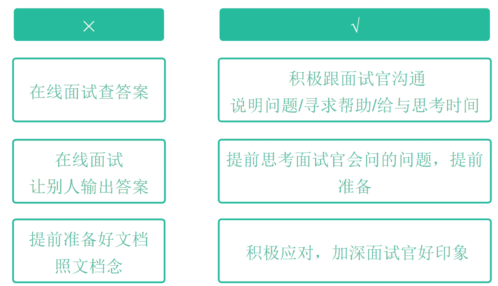
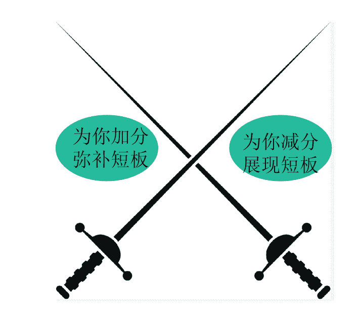
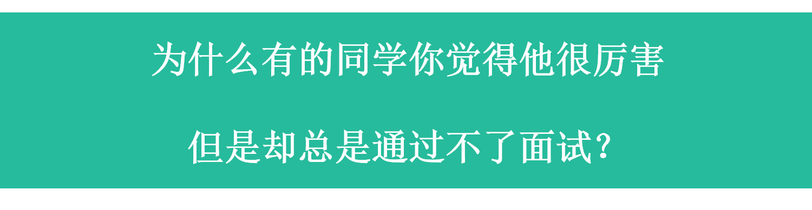
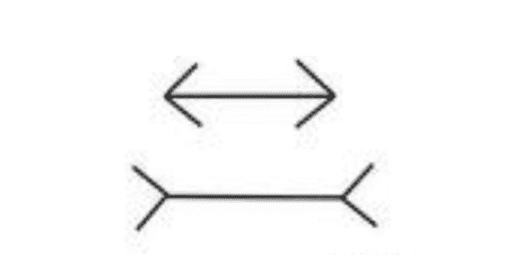
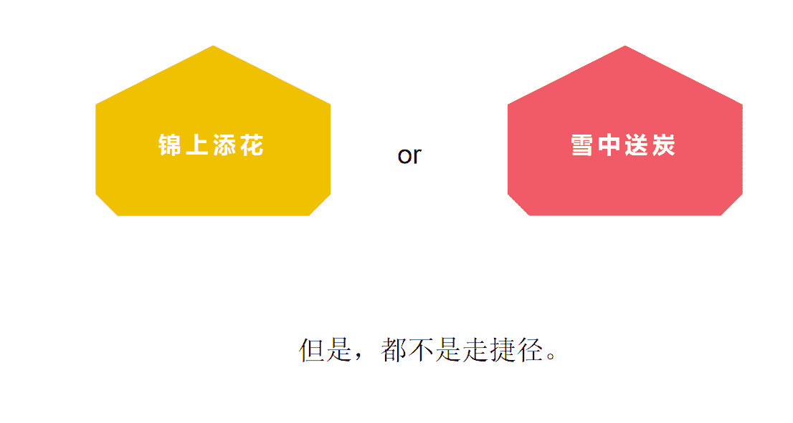
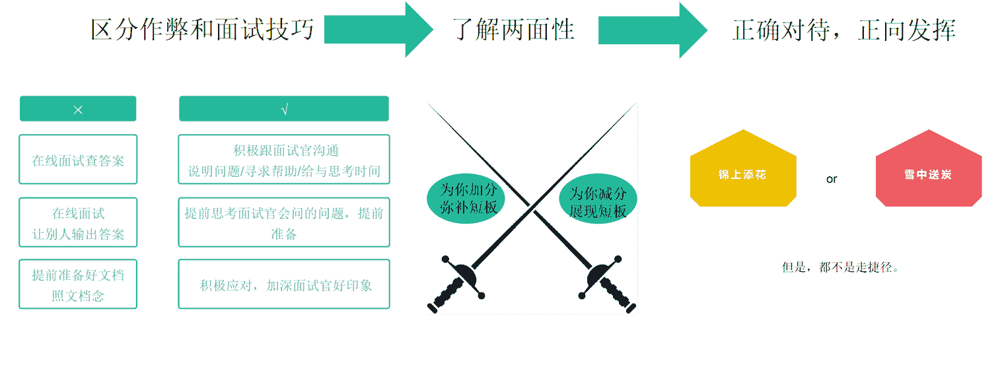

# 第二章 第 1 节 什么是面试技巧

> 原文：[`www.nowcoder.com/tutorial/10081/3347473d47794dafbdf5cecdd2ec062c`](https://www.nowcoder.com/tutorial/10081/3347473d47794dafbdf5cecdd2ec062c)

# 1\. 什么是面试技巧

 ## **1.1** **带你初识面试技巧**

什么是面试技巧？

我们这里说的面试技巧是技巧，是能让你加分的，而不是让你可以作弊。具体什么叫作弊，什么叫技巧，这一点你是要清楚的。

### **一、什么叫作弊？**

**①****在线面试的时候查答案。**

很多同学可能不知道在线面试系统的强大，比如随意切换页面，或者去手机上查答案等等，这些都是能被面试官发现的，当然，少部分的企业可能用微信进行面试，这种不太能通过系统看出来，但是面试官也是能通过你的状态发现出来，一旦被发现或者被怀疑，你的印象分都会大打折扣，甚至这一轮会直接被挂掉。

**②****在线面试的时候让别人输出答案**

还有的同学会在在线面试的时候让别人输出答案。比如同寝室的帮忙查答案，或者干脆请个学霸，让他在旁边支招，然后快速传递给面试官这个回答。这个性质就更恶劣了。而且被发现的可能性有 99%以上。

**③****提前准备好 word，照着 word 说**

这种大概率是非常多的同学会用的方式，具体要看你怎么去用。直接照着说肯定是属于作弊的，而且也是极容易被发现的。最低的底线是怎样呢，你可以准备相关的文档，但是千万不要照着说，要积极和面试官沟通并同步信息，比如你可以告诉面试官，“我这里有个文档或简历，有相关要点的记录，为防止要点遗漏，我可能会偶尔看一下，如果您不希望我这样，我可以不看。”这样才是进可攻退可守。

### **二、什么叫技巧？**

**①****积极跟面试官沟通**

你需要积极说明问题，前面提到，你可以看文档，可以看简历，但是非正常行为，需要跟面试官说明一下，这样你可以光明正大的看。

必要的时候也可以寻求帮助，比如在没听懂面试官的问题或者需要一些背景的话，都可以积极沟通，因为面试官很可能也会埋雷，看你会分析好题意，还是上来就答（当然，不是每个问题都是这样的埋雷，但是分析题意是你必做的，倒不用想着埋不埋雷这回事，你只需要好好回答问题就可以了）

如果你觉得你真的需要思考一下，也可以主动跟面试官说，“这个问题可能有点大，我想要申请思考一下再回答可以嘛”，然后根据面试官的示意再作回答即可。当然，这个前提也是这个问题真的比较大，或者你真的需要思考，而不是你的能力不够，因为如果是能力的原因，你再思考也是不会的，反而还可能起反作用了。

**②****提前思考，提前准备**

提前思考面试官会问的问题，提前准备，有的同学可能会说这是属于实力啊，是属于实力，但是如何押题以及去准备，这是技巧。

**③****积极应对，加深好印象**

在面试中积极应对，加深面试官的好印象，这也是技巧。你不会可以说不会，你想有个思考时间，可以跟面试官申请，但是不要直接就被难哭或者表现出一些极端的举措，积极应对，才能加深好印象，要知道，你和面试官是双向沟通的关系，不是他高你一等。

 **所以，面试技巧不是作弊，而是能让你加分，更可能的通过面试的利器。

当然，面试技巧，是一把双刃剑。

*   用好了可以为你加分，甚至弥补了你的所有短板的工具；
*   没用好，那可能会是将你所有的短板都展现出来的害群之马。

 我们经常会有这样的困惑：为什么有的同学你觉得他很厉害，但是却总是通过不了面试？
无非是以下 2 点原因：

*   有比他实力更好的同学
*   如果是实力真的很好，那可能是他不会用面试技巧让自己变得看起来更厉害。

这个事情有点类似我们说的视觉错觉图，比如非常经典的，下面两个横线哪个更长？

如果只是简单一看的话，大多数人都会觉得下面的更长，很少有人会去真正测量，当然，这个例子是因为大家都知道，类比其他我们不知道的非经典的或者更复杂一些的例子，如果没有精细的测量，光通过观看的话，怕是很难发现是一样长的了。

面试也一样，我们可以适当用一些这样的技巧，让我们看起来是比实际更强的，也能适度弥补一些我们的缺点。 正确对待面试技巧该有的心态： 

把它想象成是锦上添花或雪中送炭都可以，但是，都不是走捷径。

## 总结

1、首先你需要区分作弊和面试技巧
作弊的事情我们千万不要做，对自己非常不利。2、了解面试技巧的两面性
因为是双刃剑，有好有坏，所以要尽量避免有害空间的发挥。

3、合理心态，正向发挥
不要过度消费，正确的心态对待，正向发挥，发挥出你的空间内最大的价值。

下一节会详细说一下面试技巧的分类，以及具体如何实操，因为说的再多都没用，得真正运用到面试中，且无形中帮助到你，给你的面试加分。**