# 第二章 第 2 节 面试技巧的分类

> 原文：[`www.nowcoder.com/tutorial/10081/1e24bb921664427e9c403bb8990ba3af`](https://www.nowcoder.com/tutorial/10081/1e24bb921664427e9c403bb8990ba3af)

## **1.2** **面试技巧的分类**

面试技巧主要就是包括面试前和面试中，因为这两个是决定你本次面试的分数权重占比比较大的因素，但是面试后也要复盘和总结，因为需要为下次面试分数做准备。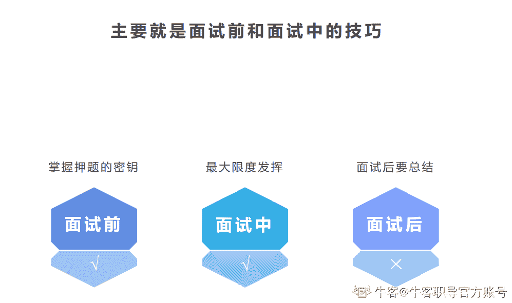

### **1.2.1** **面试前的准备技巧**

面试前的技巧就好比我们考试前期的押题，在上高中的时候，高考中老师都有帮我们押过题，老师不可能专门挑考试不考或者小众的考点去重点讲课的。

因为大家在考试前最宝贵的就是时间，大家都想用最短的时间最高效的去准备。所以无非就是正中靶心去准备，通俗点说，大家在考试的时候肯定是遵循这样的原则：

*   考什么我就准备什么
*   最可能考什么我就优先准备什么
*   什么考的最多我就重点准备什么

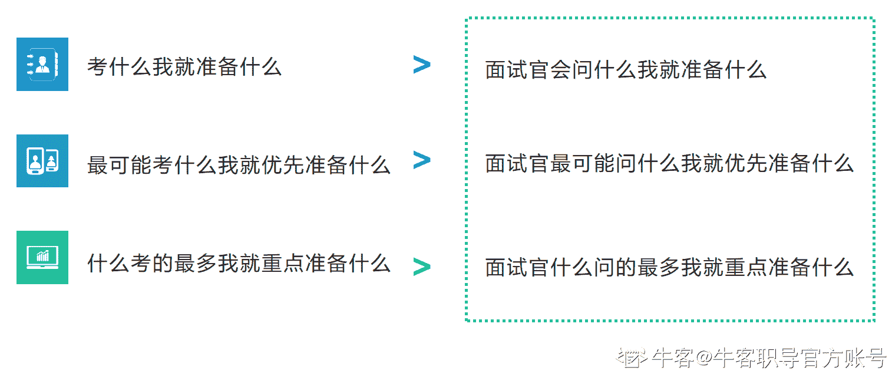

有的同学可能会说，这谁不知道呢。但是在实操中，大家往往是知道这个道理，但是不知道怎么用。本章节也会详细给大家讲到如何知道上面这几点，因为最重要的其实就是知道面试官会问什么，面试官最可能问什么，面试官什么问的最多。

在这之前，先给大家聊明白一个事情，那就是为什么高中的时候我们知道这些，而现在不知道了。因为你需要知道底层的原理，才能更好的准备和理解。

为什么高中的我们知道这些考点呢？

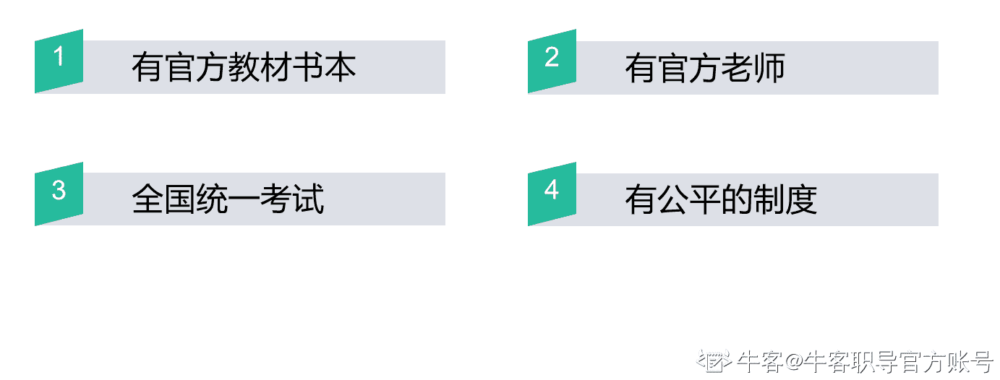

高中的时候我们上课有教材书本，讲课有官方老师，还有各种总结考点的练习册。而高考就是针对这些进行考察的，且全国统一，还有公平的制度，比如时间段统一，难度统一，规则统一，甚至国家立法保障大家的公平，总之是非常公平，而且有利于大家去针对性的准备的，更多的是选拔有志于服务国家重大战略需求且综合素质优秀或基础学科拔尖的学生。

但是上面这些，回归到求职中，目前广大应届生占几样呢？

答案是无。

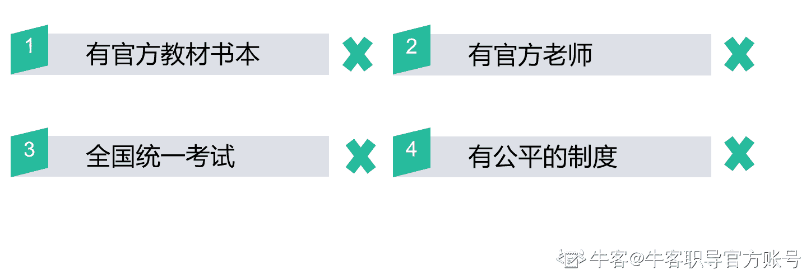

首先因为校招不是全国统一的制度和考试，就导致没有所谓的官方教材和官方老师这一说。每个企业都是自己的官方，而非其他家的官方，每家企业都是在为自己的公司招聘，选择适合自己公司的优秀人才，而这个标准并不是每家都一致的。

有的同学可能会觉得这些没有用，因为表面上看起来这个信息大家都知道，但是我还是想讲是因为这个角度可能不是每个人都了解，想给你们揉碎讲清楚这回事，到底底层是怎样的逻辑，这样才能让你真正的应对校招，拿到 offer，不然你的努力可能就都白费了。

我们现在求职和高考最大的区别就是信息差的问题，你不能按照高考那套标准来要求企业，企业不是做慈善的，**他们的目的很明确，就是想招到合适的优秀的人**，所以你不能要求他们的完全公平性，也不能要求每家公司都一样的标准。

所以，给大家总结一下，如果想要求职，我们需要：

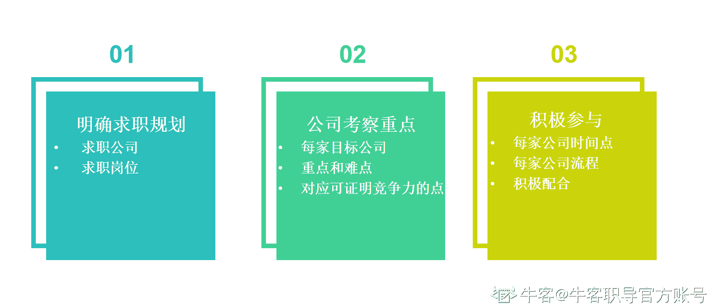

这个是整个求职中的关键点，这种思维是可以应用到整体求职，以及以后工作，甚至所有的想要达成目标的思维逻辑，我叫它目标节点思维。

其中比较关键的就是要知道每家公司的考察重点，目前大家主要就是在这个信息差上，因为网上各种信息参差不齐，很难讲全，你可能看到某个点，就把它当成全部，但是你不知道它背后是有条件或者背景的，或者和某些事情是有关联的。

**什么是目标节点思维？**

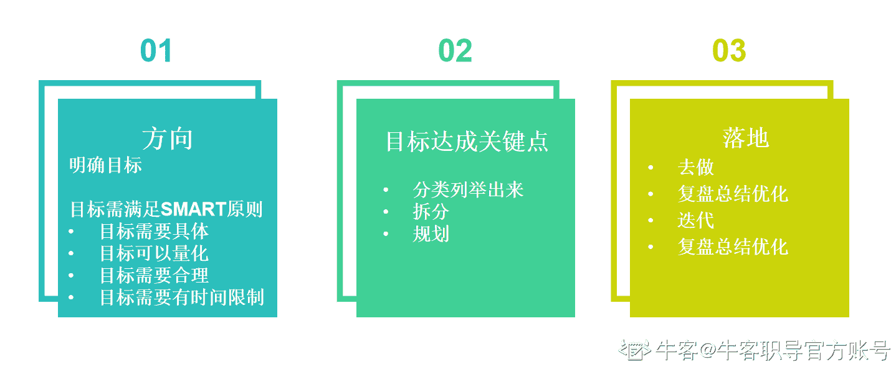

**01** **关于方向**

不管做什么事情，你都需要有个目标或者方向，方向定错了，再多的努力也是白搭，比如你可能适合做运营，但是你一直在求职产品，比如你可能适合进美团，但是你一直在按照腾讯的标准准备，这都会导致你的挫败感，因为不太可能达到对应的目标，你的目标本身就有问题。当然，这个目标是需要满足 SMART 原则的，比如你可以确定，你的求职目标是在秋招阶段拿到 BAT/TMD 的运营相关岗位 offer。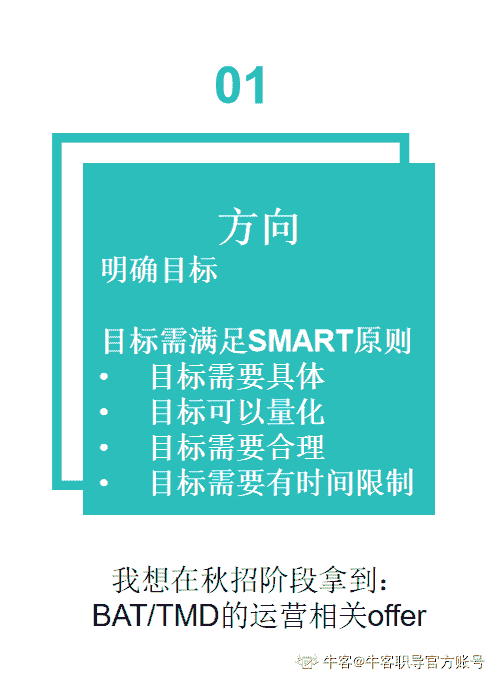

给大家附上 smart 原则，可以自行查看，有不懂的地方可以在集训营的群里提问。

S：(Specific)明确的、具体的，指标要清晰、明确，让考核者与被考核者能够准确的理解目标；

M：(Measurable)可量化的。一家企业要量化老板、量化企业、量化组织架构。目标、考核指标更要量化，比较好、还不错这种词都不具备可量化性，将导致标准的模糊，一定是要数字化的。没有数字化的指标，是不能随意考核的，一考核就容易出现误差；

A：(Attainable）可实现的，目标、考核指标，都必须是付出努力能够实现的，既不过高也不偏低。指标的目标值设定应是结合个人的情况、岗位的情况、过往历史的情况来设定的；

R：(Relevant)实际性的、现实性的，而不是假设性的。现实性的定义是具备现有的资源，且存在客观性、实实在在的；

T：(Time bound)有时限性的，目标、指标都是要有时限性，要在规定的时间内完成，时间一到就要看结果。

**02** **目标达成关键点**

设定完目标之后可能总觉得这个完成起来非常困难，也从没有仔细去思考过，这就是我们直播公开课中太多同学问这样的问题，“我怎么进大厂”，你需要的是去列关键点或者拆解你的目标，而不是问这么大的问题，你拆解的很细，问很细的问题，这样别人能更好的给你帮助，你也能更好的通过自己的方式去攻克每个关键点了。

比如你定的是秋招阶段拿到 bat、tmd 的运营岗，关键点是：

*   知道这几家公司的时间点和流程
*   知道这几家公司的考察点与重点以及高频考点
*   如何比应聘这几家公司的同学更有求职竞争力

然后再去拆解，再规划。

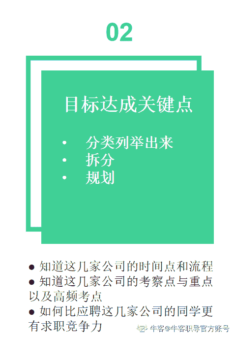

**03** **落地**

这一步是最后一步，但是我不能把他叫最重要的一步，因为每一步都是重要的，每一步都要重视，但是至少完成这一步，你就能拿到 offer 实现目标了。

所有影响目标的最后一步都是落地，太多人有想法了，但是可能都卡在落地这一步，想法谁都可以有，但是不是每个人都能把这个事落实完成。所以有些必须要做的还是要做的，且重要的是真正去做而不是空想。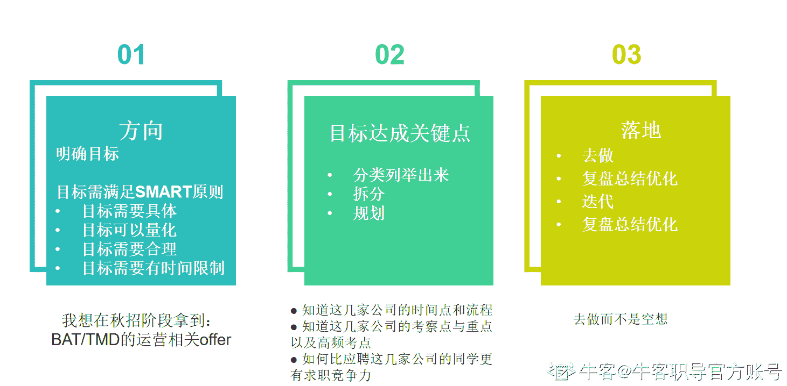

如果这些道理你都懂，如果你知道怎么定目标，知道罗列关键点，也有想去落地真正去做的心，那剩下的在求职过程当中，目前最关键的就在于信息差的问题。

你可以发现，那些拿到大厂的人无非是以下 2 种：

*   本身就非常优秀的同学。这种同学往往学校学历很好，学校里的知识也学的好，软性素质也好，相关经历也丰富。

*   擅于发现和利用资源并积极解决问题的同学。资源包括人脉资源、学习资源、信息资源等求职需要的资源，或者说非常有目标节点思维。

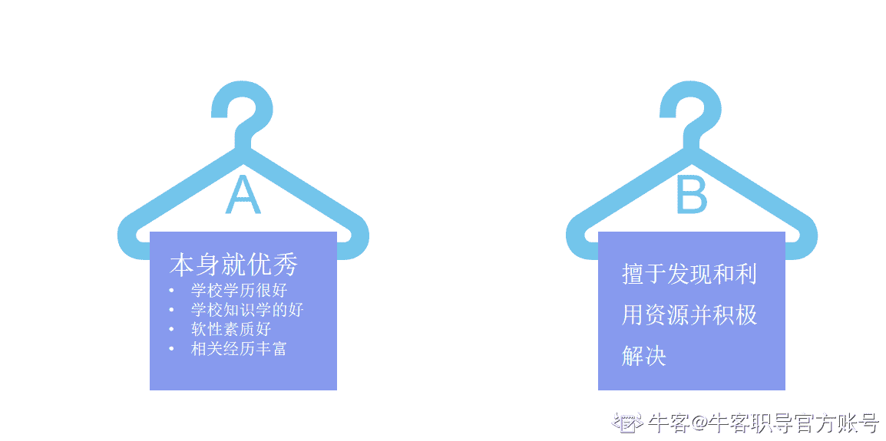

本身就非常优秀的同学，这种同学比较少，但是不得不承认，这种同学企业真的非常喜欢要。作为校招生，大家都是没有太多企业工作经历的，或者即使有一些实习经历，也基本不会做很多在面试官看来非常有重量的工作，所以这个时候考察的主要就是基本能力和潜力，那就不得不承认，这些同学普遍会比相对弱一些的学校和学历的同学潜力更大，基础能力更优秀。

有的同学可能会问，不好学校一定比好学校的差么，答案当然是否定。但是普遍来说的话，确实是好学校的同学潜力和能力更强，企业是不会想付出更大的成本去一个可能招到合适的人的学校去招聘的，你把自己设想成企业，相信你就能理解了，同样能达到目标的前提下，为什么不用更小成本达成目标呢？

而每年毕业 800 万应届生，其实大多数同学都是非第一种，那你要是想进大厂，就只能做第二种了。

这种同学非常明确自己想要什么，且知道为了这个目标应该去做什么努力，以及更重要的一点，会真的去做。

所以如果你想要进大厂，我希望你能更多的去想想自己想要什么，以及需要做什么，以及，去做。而不是一味的问，“我怎么才能去大厂”，“我现在准备还来不来得及”。

当然，这两种同学是不冲突的，第一种同学也可以是第二种，只不过由于硬性条件的限制，很多第二种的同学是没办法成为第一种的，但是凭借第二种我们也是可以达到目标的。

所以说到底，还是这个信息差的问题。

哪里获得这些信息差？

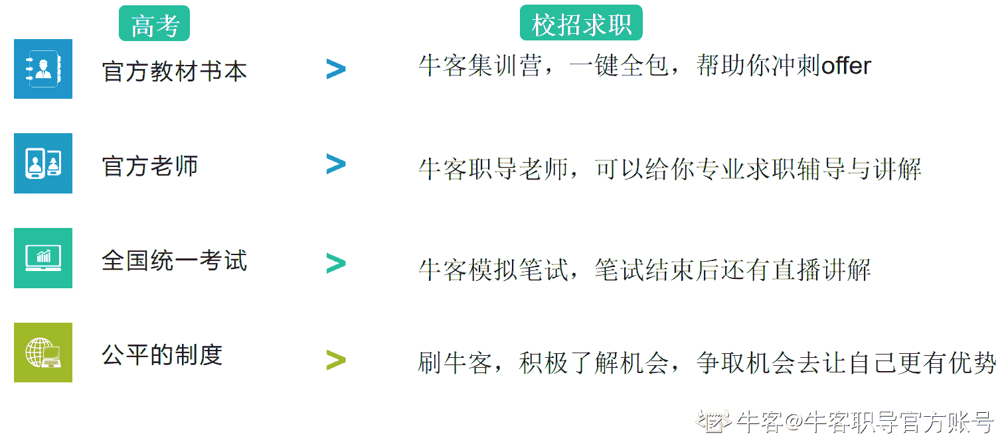

好在的是我们现在有所谓的“练习册”，有所谓的官方教材以及官方老师的替代品，我们有牛客，有牛客职导，有集训营，能够帮助大家总结这些内容。

*   牛客集训营包含了校招的所有高频考点以及讲解，还有对应的纸质教材，方便你不同场景下的准备和学习，校招必考的内容集训营里都有讲到，比如笔试题、面试题、项目制作以及面试回答，而且全程有导师答疑，有额外新增的考点，我们还会给大家加课进行讲解，为的就是在相对短的时间内用非常高效的方式备战校招。

*   牛客职导的老师也都是非常专业的求职辅导老师，非常了解每个岗位的考点，以及能非常专业的讲解，找出你的真实问题所在，并逐一击破。

*   同时牛客网也有全国统一模拟笔试，为的是让大家更好的体验笔试系统、了解校招考察形式和考察内容、了解自己在应届生中的求职竞争力，了解自己的短板，更针对性的查缺补漏。

*   所谓的公平的制度这点，虽然不是完全的公平，但我们把这点转为自己的优势，让杠杆为我们倾斜。牛客网上有非常全面的资源，一站式帮你解决求职问题，多到很多同学甚至可能都找不到对应的位置，有需要对应帮助的都可以加到我们的牛客职导群，给与相关解答。

牛客是业界非常良心的平台了，有非常全非常多的免费资源，付费资源当然也有，但也不是高价，也不是成本价，而是比成本价还低很多倍的价格，因为牛客给了大量的补贴。所以希望你们真的好好珍惜，并利用好。

最后，再总结一下这一小节的重点：

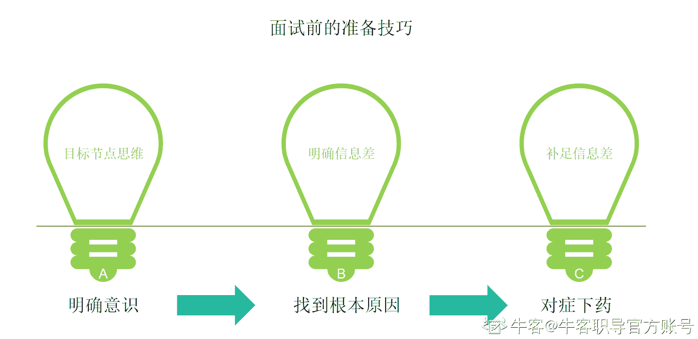

*   首先明确这样的意识：知道自己的目标方向、找出关键要点并规划、需要自己真正去做。
*   和别人对比，找出根本原因：因为求职是看你比别人有多优秀，而不是看你自己有多优秀，所以找到根本原因，打败别人自己需要靠什么，自己有什么。
*   对症下药：不管基本能力好与坏，都希望大家能打这个信息差，太多留学生其实就是吃了这个亏，不知道自己需要在什么时间节点求职，往往开始准备的时候已经错过了最佳时机。

所以，我们之所以想进大厂而这么没有方向感，是因为我们有信息差。

最重要的是，补足这份信息差，并积极去做。

### **1.2.2** **面试过程中的技巧**

有的同学可能觉得面试过程中哪有什么技巧，面试官问什么我们就答什么，不会就是不会，为什么会有技巧呢？

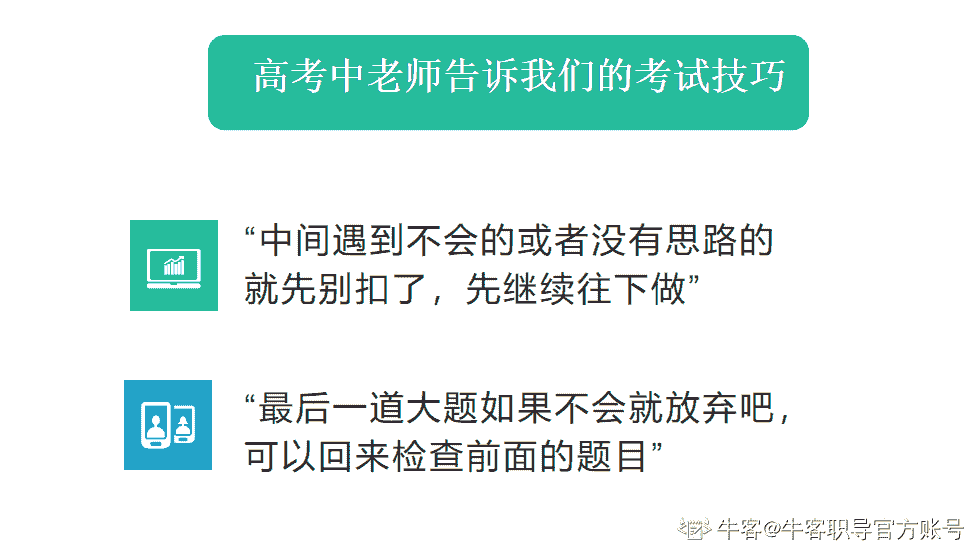

还是类比回我们的高考，老师当时都会告诉我们：

*   中间遇到不会的或者没有思路的就先别扣了，先继续往下做
*   最后一道大题如果不会就放弃吧，可以回来检查前面的题目

这些就是我们高考考试的技巧，面试也是一样的，只是形式变了，所以原来类比高考的技巧我们可以用，形式变了引发的又新增了很多技巧的机会。

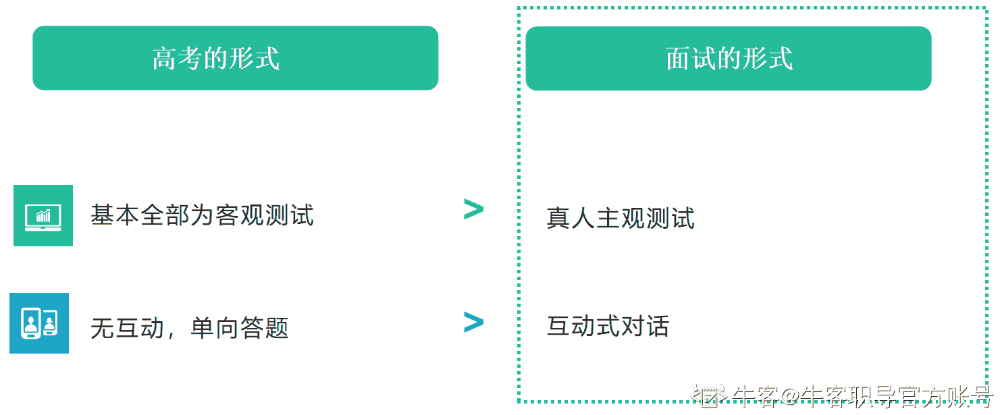

形式变化：

*   真人主观测试
*   互动式对话

既然是这样的形式，所以我们是可以有这样的技巧的：

*   尽量增加印象分，展现你的优点
*   做谈话的主导，引导到你会的问题

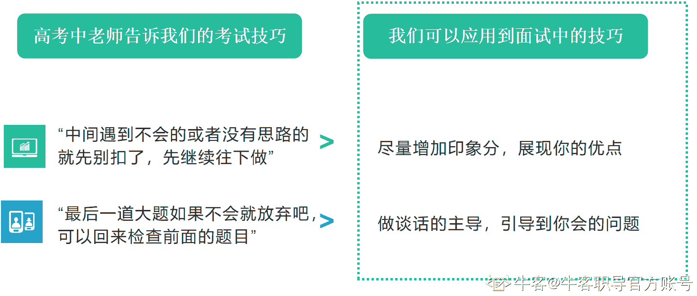

因为是真人主观的测试，不管你会与不会，都是可以尽量展现你的优点的，比如你不会，你就诚恳以及清楚的表明你不会并说明原因，还能体现出你比较诚恳的品质，而不是通过作弊（以为在线面试发现不了）或者其他激进的方式，比如哭，这些都反而会更增加你的不好的印象的，甚至可能直接挂掉。

因为是互动式对话，你可以做谈话的主导，尽量引导到你擅长的问题，而不是面试官做主导地位，你会被气场压的越来越没有发挥的空间的。

这些都是指的面试过程中的技巧，面试后主要是需要复盘和总结，这样是可以为你下次的面试赋能的。

最后，我们总结一下这节的重点：

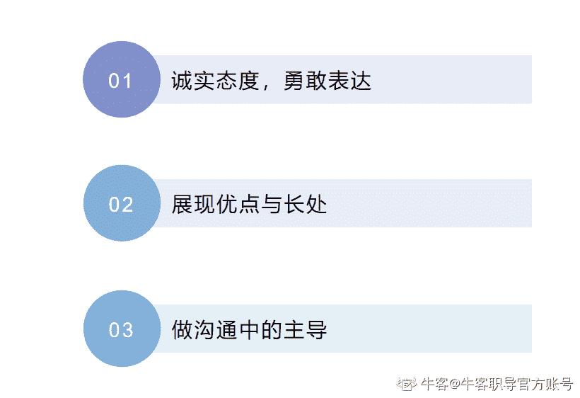

我们在面试中，需要：

*   不会的就诚实的说不会，需要想的就勇敢的说出来需要思考
*   尽量增加印象分，展现你的优点
*   做谈话的主导，引导到你会的问题