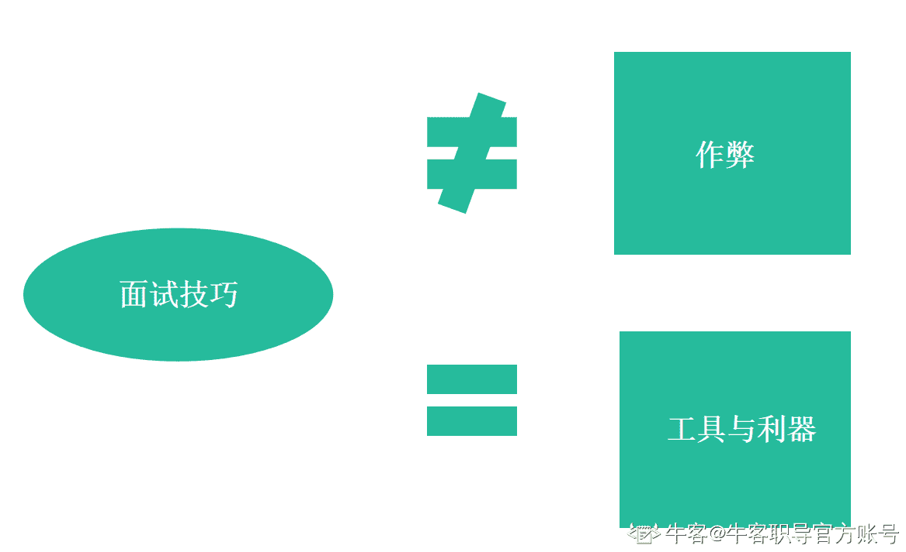
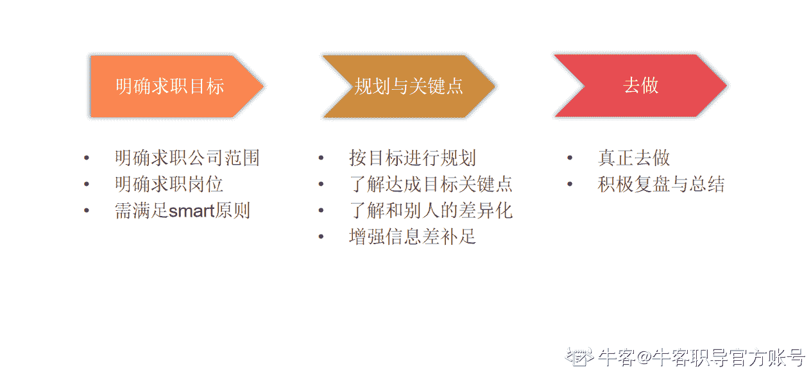
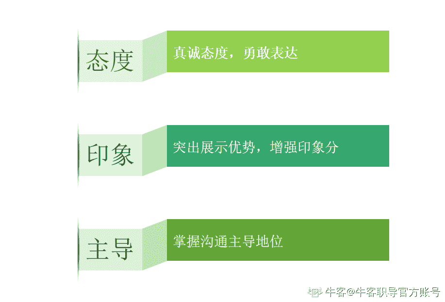
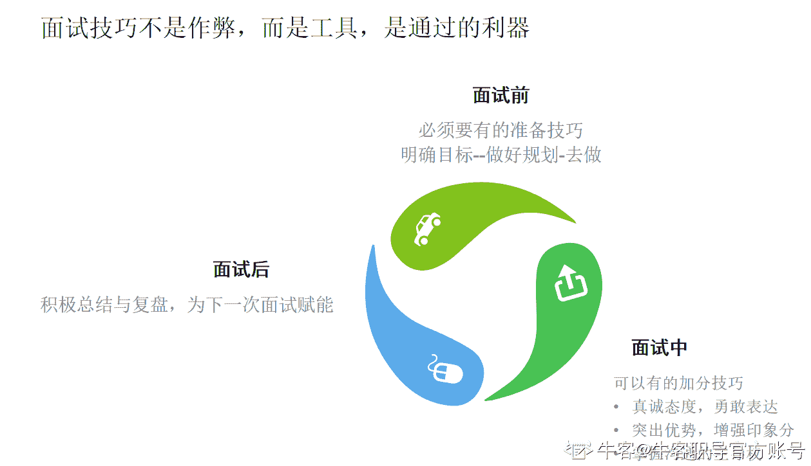

# 第二章 第 3 节 章节总结

> 原文：[`www.nowcoder.com/tutorial/10081/4a16bc59bca34d29934ba54836163ceb`](https://www.nowcoder.com/tutorial/10081/4a16bc59bca34d29934ba54836163ceb)

## **1.3** **总结**

给大家总结一下这一大节的重点。

**需要明确的基本原则：**

*   面试技巧不是作弊，而是能让你加分，更可能的通过面试的利器
*   面试技巧是工具，但不是捷径，请正确使用它。

面试前：

*   最重要的是明确自己的求职目标
*   了解目标对应的信息差
*   并积极的去做。

面试中：

*   不会的就诚实的说不会，需要想的就勇敢的说出来需要思考
*   尽量增加印象分，展现你的优点
*   做谈话的主导，引导到你会的问题

面试后：

积极复盘和总结，为下一次面试赋能。

总结：

