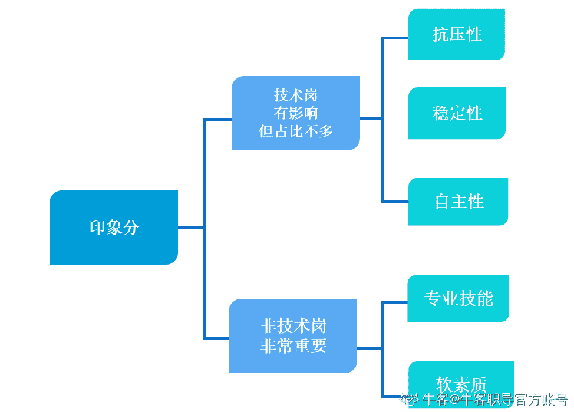
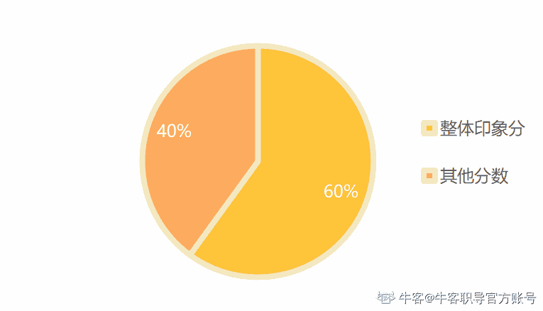
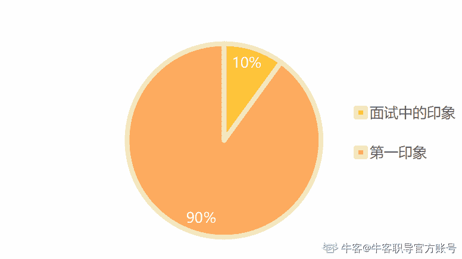
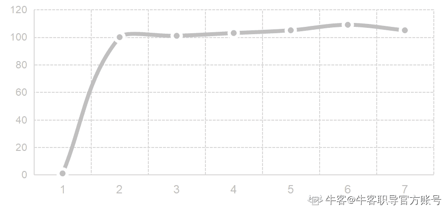
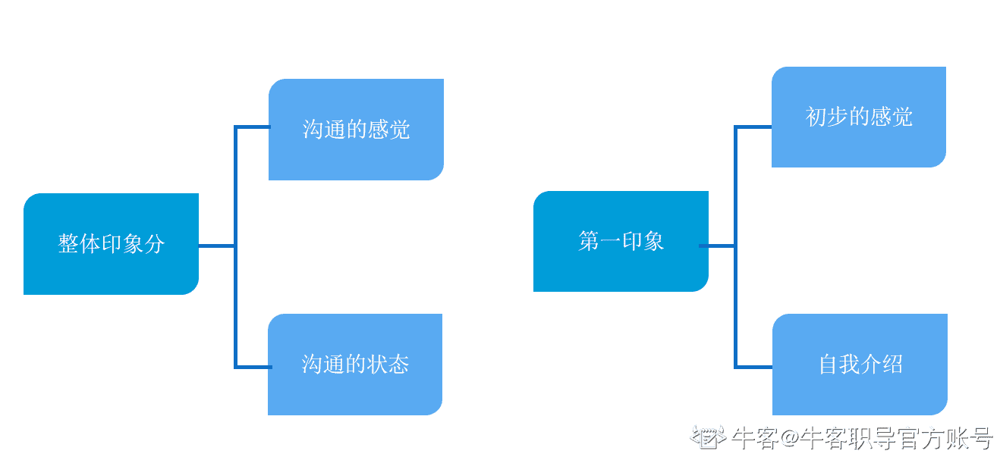
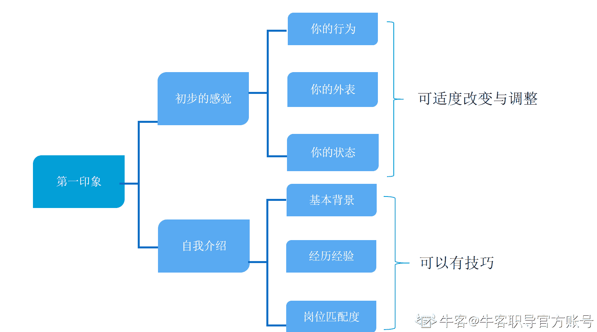
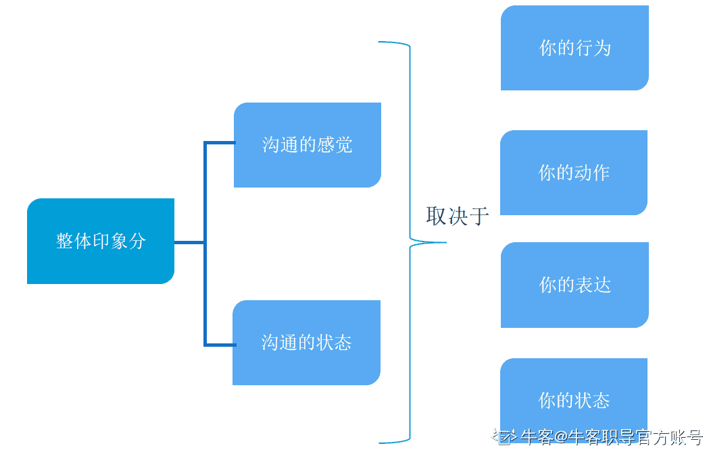
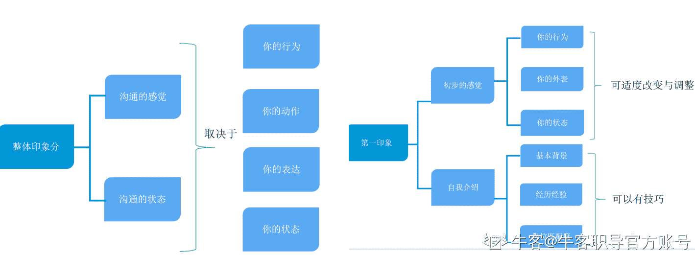

# 第三章 第 1 节 加深印象，提升分数

> 原文：[`www.nowcoder.com/tutorial/10081/74af824306b7439c85040f2fdd77fcde`](https://www.nowcoder.com/tutorial/10081/74af824306b7439c85040f2fdd77fcde)

本节主要是通过讲解面试技巧的作用，让你更加深刻的了解如何让自己更好的应用面试技巧，在面试中加分。以及哪些面试技巧不需要下太多功夫的，防止踩坑。

### **2.1** **加深面试官好印象，提升你的整体面试分数**

面试技巧的第一个作用，就是可以加深面试官的好印象，从而提升你的整体面试分数。不过不同岗位会有一些区分度。

**技术类岗位：**

比如说技术岗位，面试技巧对于印象分是有影响的，但是不多。因为技术岗更多的就是考察你的实力，实力也就是那些问你 1+1=？的问题，这些问题占据你整体面试分数的大部分，但是其他部分会有影响，比如除了考察你 1+1=？的问题之外，他还需要知道你的一些软素质，比如稳定性、你的抗压性、你的自主性。

抗压性代表了你能否胜任一些高强度或者有压力的工作，确保你不会因为一些压力而选择放弃或者离职，甚至做出一些极端的举措，或者说尽量的确保这样的风险是相对低的。

稳定性代表了你在这里工作的周期，会不会给你培养的非常好之后你选择离职了，或者是接这个公司的 offer 的可能性都很小。

自主性代表了你能不能有自主解决问题的能力，是否有自我驱动去让业务变的更好等等。

这些都是可以体现在印象分的，可以应用面试技巧。

**非技术岗位：**

非技术岗由于很多没有固定的答案，所以印象分数中会受专业技能以及软素质的综合影响，印象分也就更重要一些，而这些也是可以应用面试技巧的，是面试技巧可以起到作用的地方。

如何增强印象分？

上一节我们大概讲了，因为求职是面试官主观的互动式给你打分，决定你是否通过面试。

所以印象分是个很大的发挥空间。

在技术类岗位的面试中，也就是更考察“真本事”的岗位，印象分可能在整个面试中占比 20%，而且更多的渗透在面试前的准备技巧中，这里不过多讲解了，会在后面的章节中去详细讲解面试前的准备技巧。接下来会着重说一说非技术岗位。

在非技术岗的面试中，也就是更考察软素质能力的岗位，印象分可能在整个面试中占比 60%，而第一印象往往就占比整体印象中的 90%。（因为既然很多都是软素质的考察，所以非技术岗位中实力分也有一部分是属于印象分中的）

面试整体得分占比图

面试的印象分占比图

**先入为主的印象：**

第一印象会决定面试官对你的初评价，不过其实你在面试官那里更早的第一印象是简历，但是能进入到面试环节，简历肯定都不会差。

我们在生活中也能感受到，第一次接触一个人，会对 ta 有个初步的感觉，如果第一面就比较反感这个人，那 ta 后面需要做的比普通人好 10 倍，可能才能让你感受到你对 ta 的喜欢。如果第一面就比较喜欢，那 ta 后面可能不需要做什么，你就会对 ta 赞赏有加。

整个面试沟通过程中的印象分数浮动情况

面试也是一样，第一印象+后面的印象=总印象，所以你需要在第一印象和全程中都下功夫。我们需要把握住面试中制造第一印象加分的好机会。

给大家拆解来看看，如何制造优秀的第一印象。

第一印象=初步的感觉+自我介绍

全程印象=沟通的感觉+状态

当然，有的公司面试评分是根据不同维度打分的，最后有个加成，但是是一样的道理，因为你的这些会影响他每个维度的打分。

我们在面试环节中的第一印象主要是初步的感觉和自我介绍。

初步的感觉是由你的行为、你的外表、你的状态决定的。能大致看出来你这个人的性格特征关键词，比如阳光、积极或者是文静、内敛，如果是阳光的积极的，进而推断出你的抗压性是比较好的，如果是文静、内敛的，推断你是比较认真耐心细致的。这些都在加深面试官对你的印象框架，而这些框架都会体现在他对你的打分和评价中。

这些在面试中都是可以适度改变与调整的。

对于自我介绍，面试官会着重关注这几点：基本背景、经历经验、岗位匹配度，这部分也是可以有技巧的。

整体印象主要体现在你们的沟通和交互过程中，不管是远程还是现场面试，你的行为、你的动作、你的表达、你的状态都会影响到面试官对你的印象，从而体现在他对你的打分和评价中。

面试官没有一个特别细致颗粒度的打分体系，没办法给你拆分开来你的面试环节考察的每一点，都是整体的直接打分，（当然，少部分公司可能有对应的维度打分哦，但是也会受到主观影响），所以都是在他的脑海中整体的评分。再次强调，因为这章讲的就是技巧层面的东西，专业层面肯定是影响更深的，我们只是锦上添花，会作为你所谓运气层面的一部分。

比如我在面试的时候就会更喜欢看起来比较开朗、乐观、积极的，这是印象分，当然，不是绝对，只是说在我这，这样的同学会加分。

至于每个公司每个岗位到底应该是怎样去加深印象分，提升面试技巧，在这章技巧当中也会详细讲解。

**总结：**

****

**这一小节大家需要知道相关面试技巧的作用，以及哪些角度能有面试技巧，知道了原理才更好的去准备。**