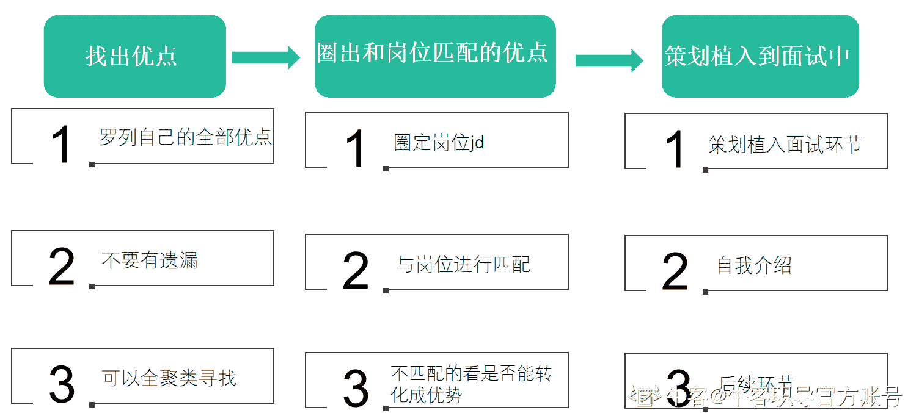

# 第三章 第 2 节 增强曝光你的优点，减少踩坑

> 原文：[`www.nowcoder.com/tutorial/10081/08fed8f6e8154949982e8a5784d55337`](https://www.nowcoder.com/tutorial/10081/08fed8f6e8154949982e8a5784d55337)

### **2.2** **增强曝光你的优点**

面试技巧中有一点至关重要，那就是增强曝光你的优点，这个角度是非常多同学容易忽略的点。

大家基本上都会想着去掩盖自己的缺点，而忽视了你其实是有优点的。这好比最近特别火的有效化妆和无效化妆的概念，其中一个角度就是有的小姐姐就觉得自己该化的地方都化了，但是为什么看起来还是不好看呢？

那是因为没有掌握有效化妆的精髓，很多同学可能会觉得自己鼻子比较榻，过多的去追求怎么让鼻子更立体，你做了 99%的努力，最终也只是看起来提升了 1%，但是你可能眼睛非常好看，如果你过多的去修饰你的眼睛，无限放大这个优点，别人也会第一时间注意到你的这个优点而忽视了缺点。
来自微博@小春日青

所以大家在努力的时候一定要找对方向，用对技巧，这样才能事半功倍，那当然，如果你有额外的时间，再去修饰修饰你的鼻子，那肯定是万全之策。

有的同学，擅于表达，那就多表达，且可以表达出来自己的这个优点，让面试官注意到它。

有的同学，擅于数据分析，那就多表达出自己擅于数据分析，让面试官去出考题。

有的同学，擅于写策划，那就多表达出自己擅于策划，让面试官给你出策划题。
当然，也有一些注意事项：

**关于你真的擅长：**

面试通俗来讲就是在造人设，你要让面试官知道你是个怎样的人，或者说你拥有什么能力，那肯定不能翻车，所以前提是你要真的擅长。举个极端的例子，就好比我们去相亲，一个非常丑的人跟你说，他的优点是长得帅，就很翻车现场。

**关于需要和岗位的匹配：**

你罗列的优点是需要和岗位匹配的，还是举个极端的例子，方便大家理解，还是你去相亲，你的诉求是对方非常有钱，但是对方一直在强调他很帅，你可能心里会有触动，但是不太会因为这个而选择跟他在一起，如果真的完全触动了，那就是目标定的不合理，同样的我们的面试也是，如果面试官因为你的其他优点被打动了，那可能是他们目标定的不是很合理，或者有变动但是没来得及改 jd。

我之前就遇到过一个情况，这个情况比较特殊，这个岗位是社招，不过可以分享给大家这事例让大家对求职有个更全面的认识和了解。我们发布了 A 岗位，有个候选人是来面 B 岗位，但是和他沟通的过程中，他表明了自己的诉求是想面试 C 岗位，然后我当场脑海中过了一下，A 岗位是打算招 2 个人的，可以把 A 岗位拆分来再出来一个 C 岗位，也比较适合这个候选人，我就跟他表明了我们是有这个岗位的，可以按照这个岗位来给你面试，以及结束的时候也作为业务方跟 hr 同步了这个信息。

不过这种情况非常少见，尤其在校招这种过程当中。所以我们还是要尽可能的去罗列和岗位匹配的优点，已免无效面试。

**关于沟通中随时调整：**

前面一节也讲到了，沟通是双向的过程，并非单向的，你可以尽量放大你的优势，但是面试官未必感兴趣，也未必喜欢听，所以我们是需要及时的做一些调整的。

这里也分享一个我的真实面试案例吧，我在面试候选人的时候，我能感觉到这个候选人可能是知道这个突出自己优势的面试技巧，一直在沟通中引导我去问他的一些业绩，但是其实对于一些业绩我真的不感兴趣，因为对应的能力和后续的岗位要求能力不太匹配，所以我就没有去按照他主导的想法去问，当然，这个候选人我是总体觉得还不错，问了别的问题，他意识到我可能并不想问他业绩相关的，他也就不再去往那方面引导，避免适得其反。后面的问题他就还是能够回答的很好并且掌握了沟通的主动权。

所以一定要优点优先匹配岗位，而后也要学会随机应变，随时调整。

### **总结**

### ****

大家在面试的时候，要先找出自己的优点，然后在面试中无限放大它。

具体如下的步骤：

1.  **找出优点**

先罗列自己的全部优点，可以用全聚类去罗列，这样能确保是没有遗漏的，比如按照性格、专业度、基本素质能力去划分。

1.  **圈出和岗位匹配的优点**

*   可以先圈定出自己对应的目标岗位的 jd，当然，这一步可以在面试前或者预测要面试之前再去准备对应的也可以，因为每家公司可能都不太一样。
*   然后需要去和自己的优点匹配，标记出来。
*   最后，不匹配的看看是否能转化成优势，比如通过换一种表述方式，可能体现出来的能力和优势就会有所改变。

这种方式可能会相对较慢，但是好处是你可以把一些其他优点也一起融合进来。如果是为了快的话，还可以以岗位为终点，直接看岗位 jd，通过 jd 看自己有哪方面的优势，这种的劣势是可能没法把自己其他的优势也展现出来，但是也是能达到效果的，如果你有精力，两者结合会更好，但是现实中不建议大家这样做，没必要。

1.  **策划植入到面试中**

你确定了和岗位相匹配的优势，接下来就可以策划整个面试环节流程了，让自己的优势更好的在面试环节中被放大，那具体的就是可以从自我介绍开始，以及融会贯通到整个面试环节中。

当然，这里还是要不漏痕迹，不要过多的去引导和植入，还是要自然或者诚恳，如果你的技巧被看出来，可能就不太妙了，可以自己平时多模拟练习一下，也可以和同学互相模拟角色练习一下，然后自己听一听回放，从面试官的角度去感受一下，也可以选择真实的邀请大厂的模拟面试官帮你面试，牛客职导有非常多的大厂导师，这样可能更能发现问题并及时纠正。