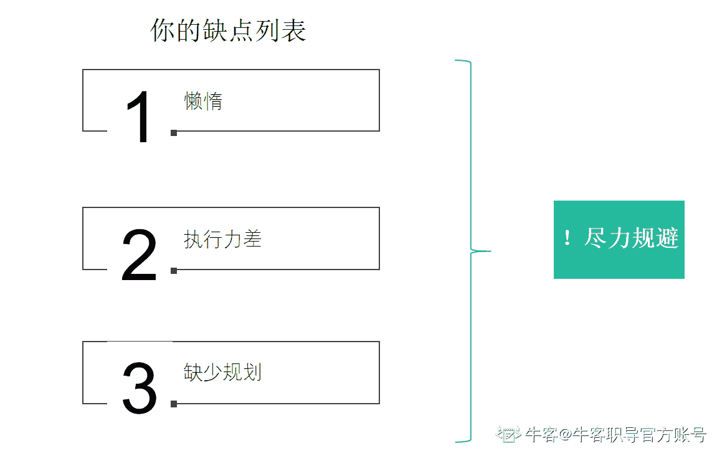
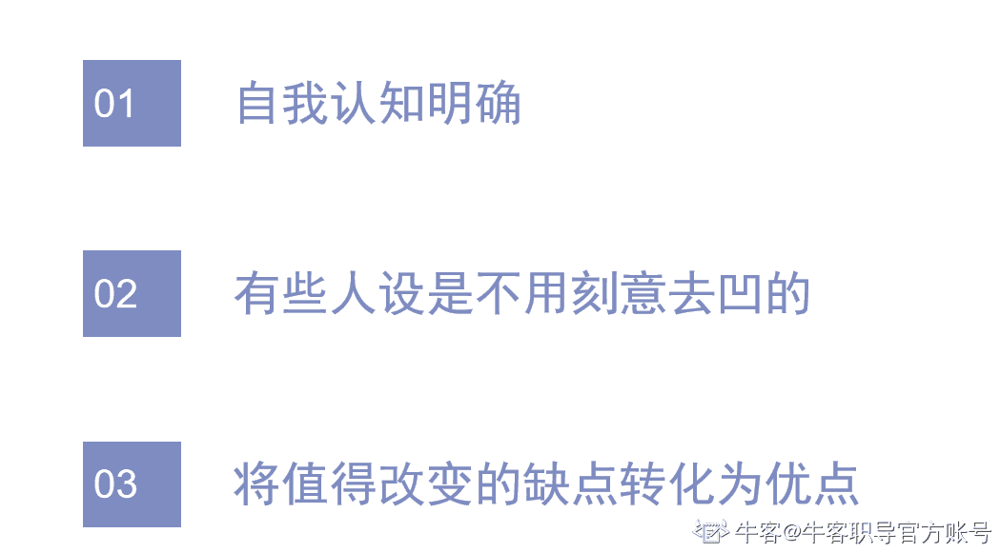
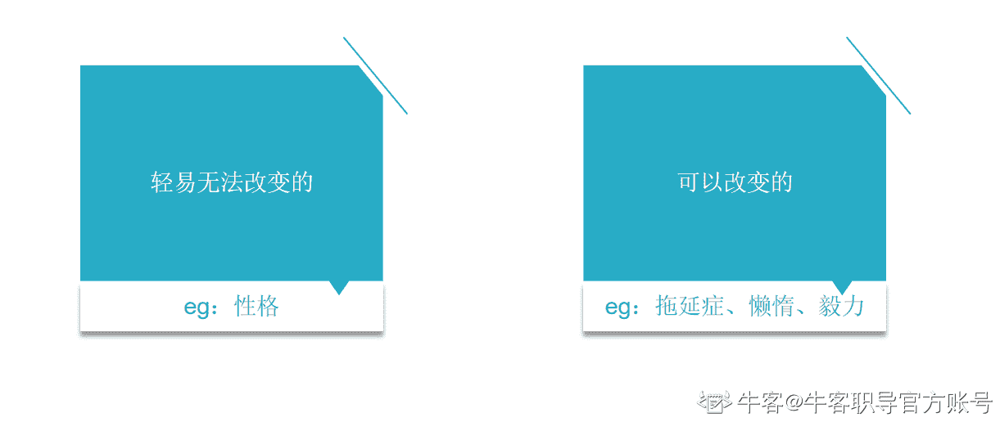
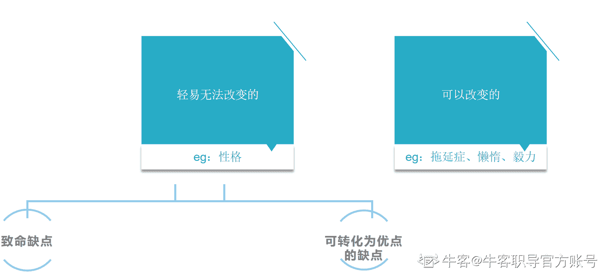
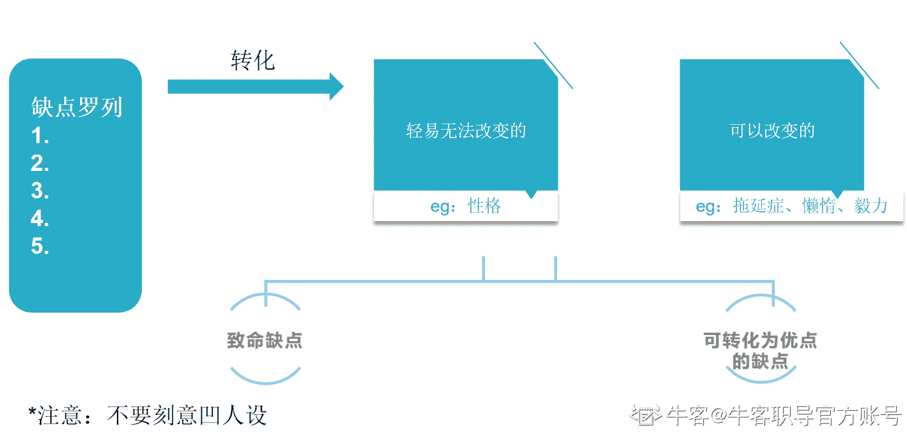
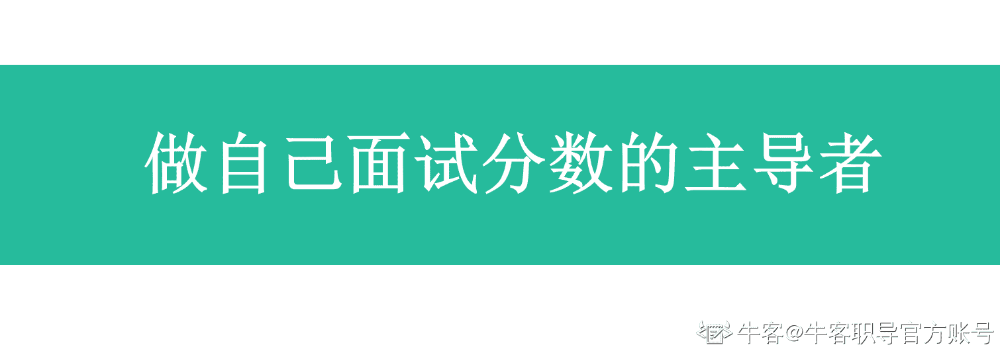
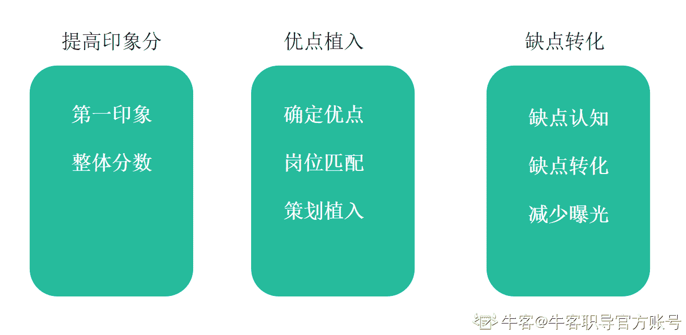

# 第三章 第 3 节 减少曝光你的缺点，化缺为优

> 原文：[`www.nowcoder.com/tutorial/10081/d654fb61bb294ee5934c0fb79d173033`](https://www.nowcoder.com/tutorial/10081/d654fb61bb294ee5934c0fb79d173033)

### **2.3 ****减少曝光你的缺点，并转缺点为优点**

上一节我们讲了增强曝光优点，那难道缺点就不管了嘛，也不是，我们需要减少曝光缺点，以及如果可以的话，要把它转化成优点。

这里教大家几步来规避，并转化为优点。

1.  **你需要找出你的缺点**

首先，你需要罗列出你的缺点列表，然后尽力去规避他们。

有的同学可能会说，我不想罗列我的缺点，我也不想暴露我的缺点。你要正视这个问题，这也是自我认知能力的一环，千万不要对自己说我没有缺点，这样你是永远不会进步的，而且其实也不会完全对你的求职有多大帮助 ，因为你认识不到自己的问题，更何况现在是你自己问自己，有什么可担心的，你可以完全坦诚布公。

这也是在面试中被问到太多的问题，也是太多人想知道如何回答的通用类问题：“请你说说你的缺点”。

面试官能问出这话，一般原因如下：

*   本身的面试流程就包括这点，因为这个可以考察你的自我认知能力以及自我审视能力
*   要么是在面试环节中面试官觉得你的自我认知方面可能有待考察，所以会着重问你这个问题。

所以，在准备的时候，有一些注意事项需要注意：

你了解这些原理，才更好的去回答。因为大多数同学会去看某个公司的面经，看这个公司的面试问题，但是你可能永远也不知道，为什么问了这个问题，以及问这个问题的目的是什么，只会想知道，“你有什么缺点”这个问题应该如何回答，然后网络上有太多的所谓的毒鸡汤，或者网上一些不太正规的课程，会教大家，不要回答什么致命的缺点，比如可以回答那种：

“我的缺点是追求完美”

“我的缺点是效率过高，可能考虑的就少”

“我的缺点是认准一件事情一定要自己实操之后才能接受别人的意见”

......

这种回答是属于面试官一听就很模板化的回答，很不个性化，不是面试官想真正听到的好的回答。

所以，你需要知道一些问题的原理，面试官问这个问题的出发点，这样才更好的准备，而不是通过片面之词，就盲目的跟风。视角很重要，就像我前面讲到的，信息差很重要，我认为不只是求职，甚至你的认知，你对各种事物的看法，都跟你的视角和了解到的信息关联很大。2. **将你的缺点进行分类**可以先分成这样两类：轻易无法改变的缺点+可以改变的缺点

什么叫轻易无法改变的缺点呢？

比如性格，性格这个东西真的是很难改变的，不是说你为了求职就把自己凹成什么样的人设的，这不太现实，而且每个公司每个岗位可能要求的不一样，你不可能面一个岗位就变一下吧。

什么叫可以改变的缺点呢，比如拖延症，比如懒惰，比如毅力等等。这些是可以改变，也是值得改变的。

当然，与此同时，你就需要罗列一下相关的计划，去为改变这些缺点做一些努力，并结合到后续真正的面试中。非常详细的我们还是要结合具体的求职岗位去讲，在后续的章节中也会讲到。**3\. 减少曝光和转缺点为优点**接下来，你把目光转换到轻易无法改变的缺点，再进行划分：分成可以转换成优点的缺点，致命缺点

针对某个岗位，缺点分为可以转换成优点的缺点和致命缺点，可以转化为优点的缺点就是你可以不去暴露这个缺点，或者即使暴露了也不用担心，可以把它转换成另一个优点去让面试官注意到。

比如你现在很迷茫，就是没有做好求职规划，就是在产品和运营岗都投递，如果问到你，你就可以说：

“我目前还没有特别明确自己想求职产品还是运营，但是现在有在进行如下的准备：分别看产品和运营岗的要求、笔试考题、面经，结合我自己的相关经历和能力做了画像，目前进度纠结于 xxxx。”

甚至还可以就此问一下面试官的建议。

这样的话，面试官不会过多觉得说这个候选人毫无规划，没有方向感，反而会觉得这个候选人比较真诚，且也有在为了求职而做准备，对自己也比较负责。就从一个缺点变成了优点。

这种例子还是要具体问题具体分析，大家一定注意这些信息的全面性，不要只听一部分就去采取相关行动，一切事情的发展都是有一定的逻辑的。

**总结：****** 

这节主要是需要大家去正确审视自己，罗列好自己的缺点，然后再去给缺点进行分类：轻易无法改变的和可以改变的，以及轻易无法改变的可以看看有哪些是致命缺点，哪些是可转化为优点的缺点。

尤其需要注意的是，不要刻意去凹人设，以及针对性的具体问题具体分析，不要盲目的想着套用相关模板，而是用自己的方式去表达和呈现出来。

### **2.4** **回顾总结**

### ****

通过这节你会发现，哪有什么所谓的运气不同，只是足够努力了才看起来毫不费力。

给你们讲的技巧，也是要去准备和努力的，并不是有了技巧的方法就可以高枕无忧了，也是要真正去做的，谁真正的去做了，才会成功。

面试技巧可以遵循这样一个原则：

**无限放大曝光你的优点，尽量少曝光缺点，或将缺点转化为优点。**

以及也展开给大家讲解了几个通用问题的原理：

“请你做一下自我介绍”

“你的优点是什么”

“你的缺点是什么”

这几个问题的面试官的出发点是什么。

这里也给大家留个作业，可以选择一个自己的意向岗位，去准备一下如果是自己面试这家公司这个岗位，这几个问题应该如何回答，而不是简单的套用模板。