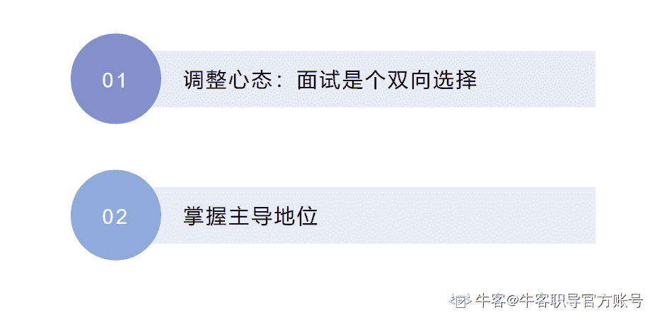
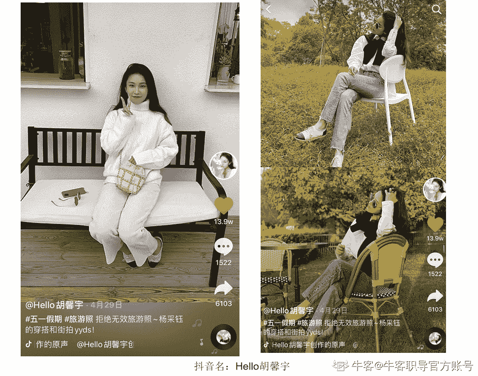
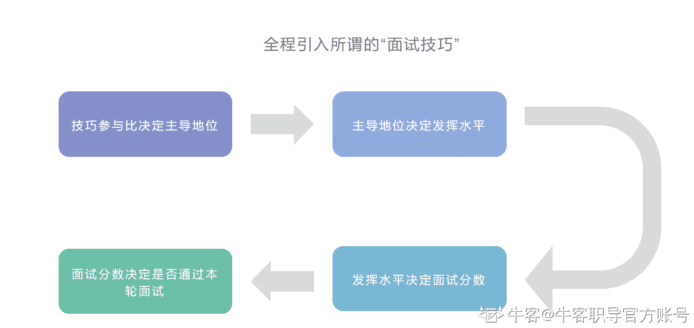
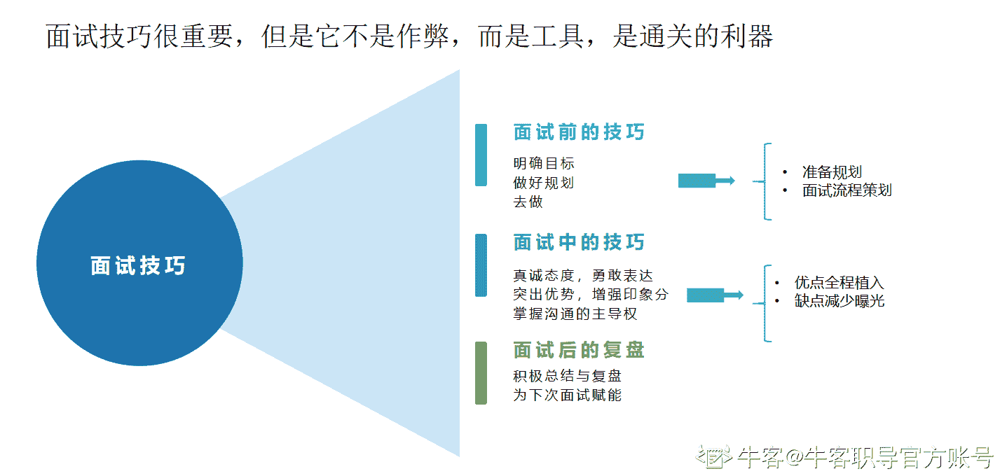

# 第三章 第 4 节 章节总结

> 原文：[`www.nowcoder.com/tutorial/10081/d94a8fe7b74e4a3bbf61b57d3053d73e`](https://www.nowcoder.com/tutorial/10081/d94a8fe7b74e4a3bbf61b57d3053d73e)

### **你的技巧参与占比数决定了你的主导地位**

**1****、先调整好心态-面试是个双向选择的过程**

你需要清楚：面试环节是个双向选择的过程，并不是面试官在审问你。

很多同学可能会有误区或者心理上就觉得面试官是什么吓人的生物，也能理解，毕竟他决定着你这一轮的面试是否通过嘛，但是通过与否是你的表现来看的，并不是说你要被动。

**2****、掌握主导地位**

既然是沟通以及双向选择的过程，那你是可以掌握主导地位的。

具体的技巧参与占比多少就决定了你能主导多少。

这个事情也跟我们拍照一样，看起来的慵懒和漫不经心感觉，和真·慵懒·漫不经心的状态还是不一样的，都是有一定的“小心机”在里面的。

如何让自己技巧参与占比多？

其实很简单，根据我们上面说的一些原则技巧，你只需要全程引导到自己擅长的点即可。

**我们把面试环节拆解，那就是：**

你的技巧参与占比数决定了你的主导地位---你的主导地位决定了你的发挥水平---你的发挥水平决定了你的面试分数--你的面试分数决定了你是否能进入下一轮/拿到 offer/拿到的 offer 档位。

## 本章总结

本章主要是拆解了整个面试环节，聊透了面试技巧的概念和作用，希望大家能有个良好健康的心态看待面试技巧，然后最重要的是，去做，太多人懂这个道理但是就是迈不出这一步，才导致没有拿到大厂 offer 的

任何事情都是有努力的方向的，所有看起来的漫不经心都是因为背后的努力的支撑。

首先需要明确的基本原则：面试技巧不是作弊，而是工具，是通关的利器。

面试技巧分为面试前的技巧，面试中的技巧和面试后的复盘，更多的我们集中在面试前和面试中，面试后主要为复盘，这里不去过多展开讲解如何复盘，不过你也是可以用这一套技巧去融会贯通到你的复盘流程中。

面试前，我们需要明确我们的目标，做好规划，然后最重要的就是去做。在准备的过程中，除了规划我们的准备，还可以去策划自己的面试流程，一般是从自我介绍开始，当然，需要注意要和岗位匹配。

面试中，我们需要真诚态度，勇敢表达，全程突出自己的优势，增强印象分，减少曝光自己的缺点，或者将缺点转化为优点，并在沟通的一定范围内掌握主导权。

下一章我们会更多的讲实操，具体就如何准备这些面试技巧展开详细讲解。