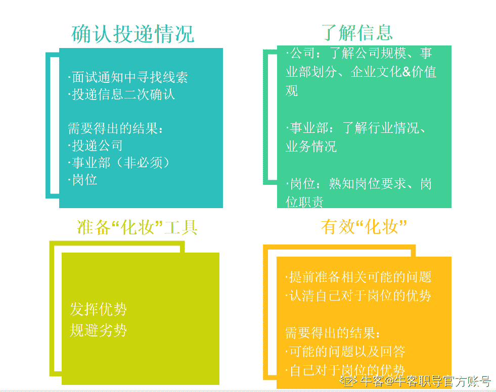

# 第四章 第 1 节 做好求职准备

> 原文：[`www.nowcoder.com/tutorial/10081/e117191a9fab4f6b9c0e10ac702666ee`](https://www.nowcoder.com/tutorial/10081/e117191a9fab4f6b9c0e10ac702666ee)

## 0、求职准备工作

面试前，我们要做的主要是准备工作，漫长的准备这里我们不具体去说了，大家根据目标岗位技能树去准备即可，这个也存在技巧，但是说起来就会比较多了，我们前面的课程中都覆盖的比较全了。

通知你本周面试，那本周时间内，你如何去准备？

给大家总结了以下步骤：**1\. 确认自己投递情况**

①面试通知中寻找线索

②投递信息二次确认

需要得出结果：投递公司、事业部、岗位

求职是个双向选择的过程，你要求职公司，公司要录用你，那你肯定要明确的知道自己要求职的是什么公司，什么岗位，就好比相亲，你至少要知道对方是谁吧，又不是拆盲盒。

因为我们在实际的求职中会投递非常多的公司和岗位，全国都没有几个同学敢说我自信到想去哪家就投这一家。所以都会海投，以及我们的面试往往是在投递之后的至少 1 个月或 2 个月甚至更久的时间才通知。

所以，大家都很可能忘记自己投递的什么岗位了，但是知己知彼百战百胜，你连对方是谁都不知道，还怎么谈知彼。

这里额外说明一种情况，我们在面试季的时候，有的公司往往是直接打电话过来面试的，所以你也需要去关注一下每个公司的状态，一般都是集中在一段时间去进行某个流程的，所以如果在面试环节中的话，牛客网上的讨论区一定是有讨论的，大家可以去时刻关注一下这些，求职季的时候刷牛客会比刷其他 app 的意义大的多。如果是在面试季了，那你就也需要对应的准备了。

**2\.** **了解信息**

①公司：了解公司规模、事业部划分、企业文化&价值观

②事业部：了解行业情况、业务情况

③岗位：熟知岗位要求、岗位职责

需要得出结果：以上全部

当然，我这里说的不是简单的说，你知道你要求职的公司是腾讯，岗位是产品策划。

**3\.** **准备“化妆”工具**

①提前准备相关可能的问题

②认清自己对于岗位的优势

需要得出的结果：可能的问题以及回答，自己对于岗位的优势

**4\. “****有效化妆”**

①发挥优势

②规避劣势

这就是一个完整的步骤，希望你们一定要去实操，当然，实际做的过程中可能会有一些特定的问题，或者可以针对你的情况进行优化，都是可以去调整，不违背相关原则就行，这样方向是不跑偏的。