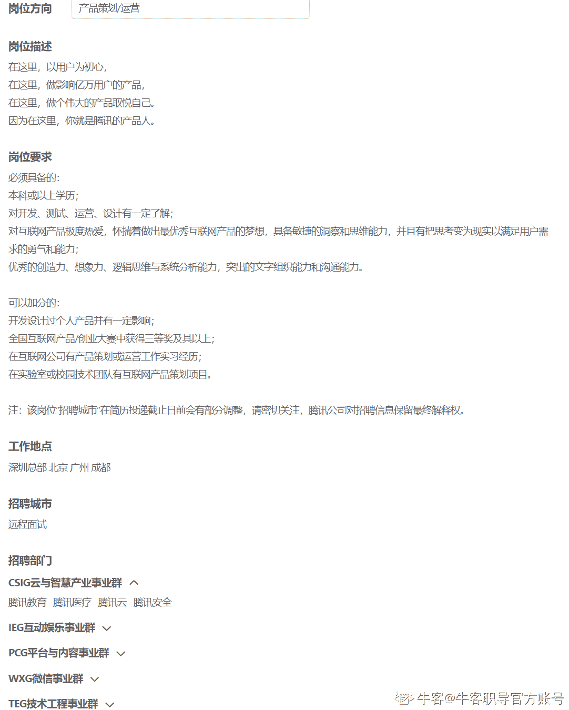
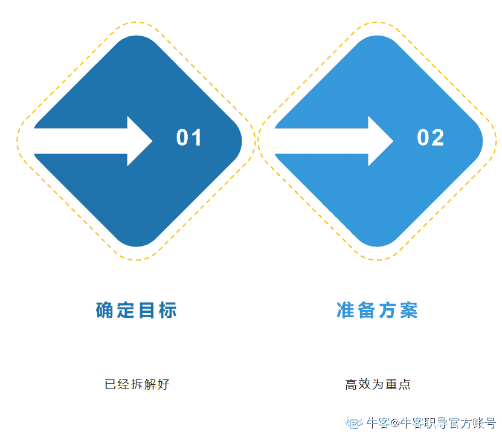

# 第四章 第 2 节 确定岗位并拆解目标

> 原文：[`www.nowcoder.com/tutorial/10081/ae04e2077df844d6b347234bbbb4b66e`](https://www.nowcoder.com/tutorial/10081/ae04e2077df844d6b347234bbbb4b66e)

## **1.1** **岗位的准备**

针对应聘岗位，提前应该准备什么？

*   确定方向：岗位的基础准备，你至少需要对应求职岗位的岗位职责与岗位要求
*   拆解目标：岗位的深入准备，你需要对岗位的要求进行拆解，看看他要求的能力点
*   特定准备：岗位的特定准备，你需要结合自己的情况进行聚合，看看自己哪些能力是可以匹配，哪些能力是可以优化靠近基准线的等等。

接下来用具体的实例详细的讲解一下。

### **1.1.1** **确定方向：岗位的基础准备**

你至少需要知道岗位职责和岗位要求是什么，以及对应的业务是什么。

因为即使是同一类岗位，不同公司甚至同一个公司不同事业部的要求都是不一样的，所以一定要锁死对应的 jd。

比如下面的腾讯的产品策划/运营的 jd：

### 1.1.2 拆解目标：岗位的深入准备

这一步比较重要，拆解岗位 jd，这样才能更好的去针对性的准备。

### **如何拆解岗位 jd？**

**1\. 对岗位要求进行拆解分类**

可以按照硬性要求和软性要求、可准备和不可准备、必须和加分项进行拆解。

*   什么是硬性要求：可以直接通过简历体现出来的。如果有明确写，要求 211 学校，或者要求男生等等，这就属于硬性要求，你没有满足这个硬性条件的话基本就是 0 可能性了。

*   什么是软性要求：有一些不太容易通过简历上直接体现出来的，比如创造力、热情、认真、耐心等等。

*   什么是可准备的：短期内可以准备的，或者可以临阵磨枪的。比如对互联网极度热爱，是可以靠短期的一天两天培养和包装的。

*   什么是不可准备的：短期内无法准备的，也无法通过包装或者临阵磨枪去准备的。比如 xxx 比赛一等奖，这种只有一两天的时间你如何准备。

比如，我们就拿腾讯的这个岗位来举例。

**硬性要求：**

本科或以上学历

**软性要求：**

对开发、测试、运营、设计有一定了解；

对互联网产品极度热爱，怀揣着做出最优秀互联网产品的梦想，具备敏捷的洞察和思维能力，并且把思考变为现实以满足用户需求的勇气和能力。

优秀的创造力、想象力、逻辑思维与系统分析能力，突出的文字组织能力和沟通能力。

**可准备的：**

对开发、测试、运营、设计有一定了解；

对互联网产品极度热爱，怀揣着做出最优秀互联网产品的梦想，具备敏捷的洞察和思维能力，并且把思考变为现实以满足用户需求的勇气和能力。

优秀的创造力、想象力、逻辑思维与系统分析能力，突出的文字组织能力和沟通能力。

**不可准备的：**

本科或以上学历

开发设计过个人产品并有一定影响

全国互联网产品/创业大赛中获得三等奖及其以上

在互联网公司有产品策划或运营工作实习经历

在实验室或校园技术团队有互联网产品策划项目

**必须的：**

本科或以上学历

对开发、测试、运营、设计有一定了解；

对互联网产品极度热爱，怀揣着做出最优秀互联网产品的梦想，具备敏捷的洞察和思维能力，并且把思考变为现实以满足用户需求的勇气和能力。

优秀的创造力、想象力、逻辑思维与系统分析能力，突出的文字组织能力和沟通能力。

**加分项：**

开发设计过个人产品并有一定影响

全国互联网产品/创业大赛中获得三等奖及其以上

在互联网公司有产品策划或运营工作实习经历

在实验室或校园技术团队有互联网产品策划项目**2\. 翻译拆解岗位要求**有的岗位在 jd 里其实说的比较模糊，是需要你去翻译一下的，把具体的能力提炼出来，当然，如果岗位本身说的就比较清楚了，那就不需要去额外提炼翻译了。
那什么样的 jd 是需要翻译与提炼的呢？

教大家一个方法，你如果读着这个 jd，里面的要求如果你可以直接和面试官面对面说出来你有这个能力，那就证明这个能力不需要翻译和提炼。

如果读着这个 jd，里面的要求你觉得直接跟面试官面对面说出来会有点尴尬或者有点中二，那就说明这个能力是需要翻译和提炼的。

比如创造力、逻辑思维与系统分析能力等等，这些都是可以通过事例去证明你有这个能力的。

你可以说我的优势是有创造力，比如我在 xxx 活动中，创造出了一种新的模式，提升了 xxx。

你也可以说我有较强的逻辑思维，比如我在 xxx 活动中，提前捋顺了 xxx 比较复杂的线路，合理安排了现场的调度，保证了现场活动中没有出现任何问题。

再比如怀揣着做出最优秀互联网产品的梦想，把思考变为现实以满足用户需求的勇气和能力。这些有没有觉得读出来是比较尴尬或者中二的，那就需要翻译和提炼了。**如何翻译和提炼****jd****呢？**
每个岗位需要的技能树都是基本固定的，如果你不够熟悉这个岗位的技能树的话，可以去一一去比对，选出那个最合适的，如果你比较熟悉这个岗位的技能树，你是能直接看出来的。大家可以看集训营的前面的技能树部分去一一核对，也可以去群里和我们交流。

那比如怀揣着做出最优秀互联网产品的梦想，就是互联网意识+互联网思维+产品热情

把思考变为现实以满足用户需求的勇气和能力，就是了解用户+思考与想法+抗压能力+落地能力

这样一拆解是不是就清晰多了。

最后，把他们合并在一起。**3\. 准备方案**这个时候已经拆解好了，目标很明确，就该确定方案了，因为发现要准备的还是比较多的，但是时间有限，如何更高效才是重点。

那么如何制定准备方案呢？

用三步评估一步聚合法：评估用时、评估难度、评估重要性，从其中的交集处开始，根据实际评估出的时间来确定最终的方案。

我们还是拿腾讯的这个岗位来举例子。

假设我们最终评估出来要准备的有：

*   对开发、测试、运营、设计有一定了解；
*   互联网意识
*   互联网思维
*   产品热情
*   敏捷的洞察
*   思维能力
*   了解用户
*   思考与想法
*   抗压能力
*   落地能力
*   优秀的创造力
*   想象力
*   逻辑思维与系统分析能力
*   突出的文字组织能力和沟通能力

这里给大家一个参考方式，难度小用时短的就是优先级最高的，其次是用时短难度大，然后是难度小用时长，难度大用时长的就是优先级最低的。

最终到这步，我们得出的方案为：

由上到下的重要性去准备，且 xxx 为必须。