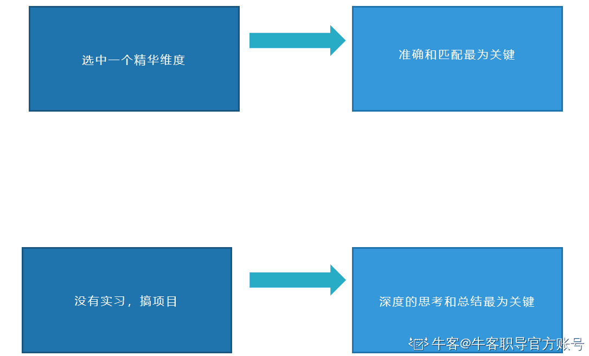

# 第四章 第 3 节 投递岗位前的准备

> 原文：[`www.nowcoder.com/tutorial/10081/3d226839097340b78c6c563e38c1cf7e`](https://www.nowcoder.com/tutorial/10081/3d226839097340b78c6c563e38c1cf7e)

## **1.1.3** **特定准备：投递岗位的特定准备**

目前已经到最后一步了，该结合自己的情况进行聚合了。

也就是接着上面的一步，该进行押题和埋点了。

**1\. 押题与埋点**
结合上面的能力点，你需要梳理出你的能力情况， 也就是根据这些，你的优点是什么，注意，一定要在这个范围内去选，这样整体方向是不会偏的。

当然，你可以先记录你的非这个范围内的优点，但是一定要标注出来，比如有的优点可能在这个岗位上并不关注，这样就属于偏了，但是会增加一些印象分，所以至少不属于减分，也是加分，只是加的比较少。

也可以列出这个范围内你的缺点或不擅长的地方，去尽量规避或者转化成优点。

接下来你就可以模拟整场面试的情况了。

**如何模拟呢？**

一般面试都是从介绍开始，这也是可以埋点的地方。根据上述的方案，你就在自我介绍中去疯狂输出以及放大你的优点，因为是互动式交流的面试形式，所以你无限放大你的优点的过程中，面试官也会对这些感兴趣，会继续提问的，你再继续去埋点即可。

我们还是拿腾讯的这个岗位来举例子。

假设我们最终得出的结论是自己的优势以及要重点准备的是这些：

*   对开发、测试、运营、设计有一定了解；
*   互联网思维
*   产品热情
*   逻辑思维与系统分析能力
*   突出的文字组织能力和沟通能力

**自我介绍可以类似这样的模板：**

*面试官您好，我叫**xxx**，我来自**xxx**学校的**xx**专业的研究生，本科是**xx**（比如是清华大学或**top**学校，可以额外说一下本科），我非常喜欢**xx**公司，并想要从事**xxx**岗位，我有三大优势：*

*第一点，有丰富的经历：在**xxx**公司做过**xxx**实习经历，对互联网整体运作模式有一定了解，有优秀的沟通能力，可以和不同部门的同学用适合他们的方式去交流，以及推动产品项目的落地。*

*第二点，有较强的逻辑思维能力：曾经做过**xxxx**，在众多复杂的线路中进行协调，保证现场的调度，最终活动现场没有出现任何问题。*

*第三点，有非常高的产品热情，也有较强的互联网思维：曾经研究过**xxx**款**xx**产品，对**xx**产品有**xxxx**的了解，同时还做了**xxx**，最终**xxxx**。*

一定要用 star 法则去说明，证明自己有相关的能力，而且这些比较漂亮的结果也会吸引面试官的兴趣，他也会继续追问，当然，你也需要有足够的深度了解，只要后面也不会被问倒，这轮面试基本就成功了。

有的同学可能会有疑问，就是我没有那么多优秀的经历可以让我去说的怎么办，因为我上面举的例子可能还是有过相关经历的同学，比如研究 100 款产品，或研究 5 款旅游类 app，以及这些是可能有一定的积累，需要很长的准备时间，首先先告诉大家一下，准备时间是一定要有的，同样的效率下的话，准备一天和一周肯定效果不一样，准备一周和一个月效果肯定不一样，其次假如真的就是到临阵磨枪了，有的同学可能说我现在就是没有时间去准备了，那怎么办。

这里也告诉大家一个临阵磨枪的方法，一件事不怕小，但是贵在精。

很多候选人即使写了非常丰富的经历，最终可能面试官也是挑其中一个深度的去聊，当然，并不是说多的经历不好。

你可以没有研究过 100 款，也可以没研究过 5 款，但是你至少要研究 1 款吧，把这 1 款说的比较透彻，也是非常优秀的，具体方式的话可以去网上搜对应的产品的详细分析，如果没有，去搜同类型的也是可以的，然后写一个属于自己的理解和想法的内容。

你可以没有实习经历，但是可以说你平时会接触各种项目，尝试自己做一些企业级别的项目，并深入去思考，没去实习是因为学校不让出去实习等等理由，然后就是你需要说出一些门道和自己的思考，而不是停留在表面的那种，这样是一样可以加分通过面试的。

这就是很多同学所谓说的走运了，他准备了一下就通过了，或者看某个课就通过了， 只能说他看对课了且真正理解然后去做了，或者他押对了。这就是聪明的人会方法有技巧，而不是死命的去准备。

还是要强调，如果你时间比较充足还是按照正常的方式去准备，这里只是告诉大家临阵磨枪的方法，每个阶段都会有适合你的技巧和方法，但是不管什么时候，高效都是比较重要的，除非你真的有足够的时间且对准备的过程乐在其中。

**总结****** 

**第一步是确定方向，对于岗位的基础准备：**

*   明确岗位职责，了解这个岗位到底是做什么的，有没有没有体现到对应的要求上的
*   明确岗位要求，了解这个岗位的要求，更好的准备。
*   岗位对应业务，了解这个岗位是什么业务，去准备一些思考点。

**第二步是拆解目标，对于岗位的深入准备：**

*   拆解岗位，把对应的能力点都拆出来
*   翻译与拆解，对于拆解不出来的，翻译出来，尽量量化出来，所谓的量化就是能够用一些数据来表现你有这个能力的。
*   准备方案，针对自己的时间情况，确定相关准备方案，如何让自己的时间最大化。

**第三步是特定准备，对于岗位的特定准备：**

*   结合自身，结合之前的一些经历点，项目点，实习点，优势劣势，一起都融合到方案中
*   方案落实，想法落地是最接近成功的一步啦，无论我们的想法有多好，最终落实才是关键。

**所有的技巧都是基于你有相关的能力和经历，是属于锦上添花。**