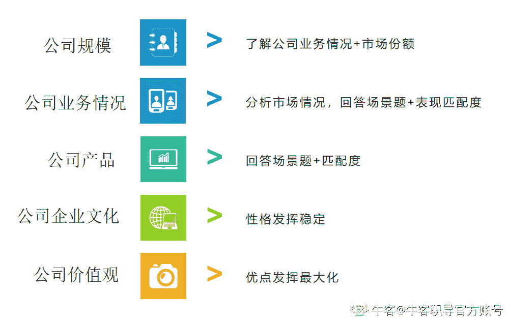
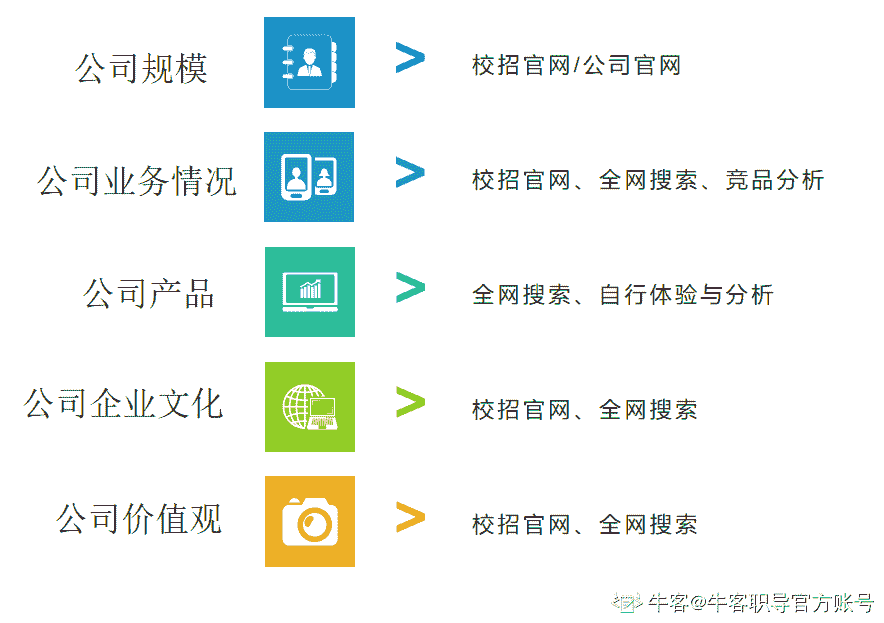
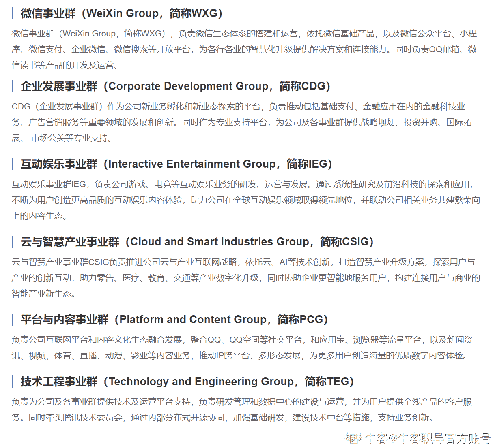
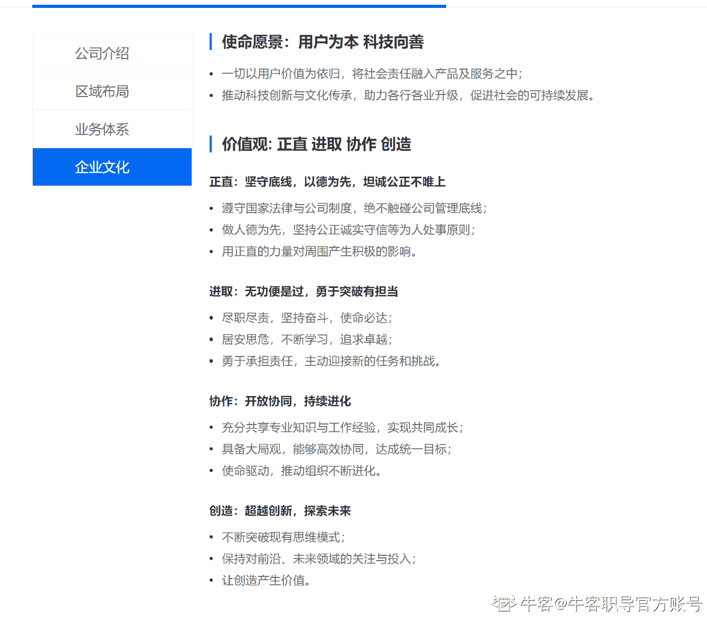
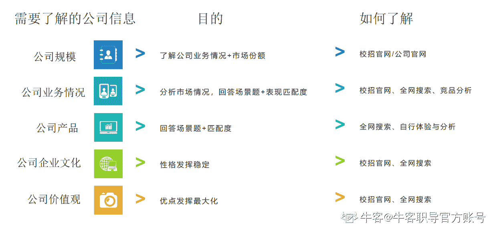

# 第四章 第 4 节 熟悉投递公司及业务

> 原文：[`www.nowcoder.com/tutorial/10081/7bb51be4b1324038a943d70b4a4fe8a7`](https://www.nowcoder.com/tutorial/10081/7bb51be4b1324038a943d70b4a4fe8a7)

## **2.1** **公司&公司产品&业务的准备**

如果你要应聘一家公司，你是非常有必要了解一下这家公司的相关情况的，包括但不限于：

*   公司规模
*   公司业务情况
*   公司产品
*   公司企业文化
*   公司价值观

为什么需要了解？

这些都是会在考核中有占比的，会对应的反馈一些结果：

公司规模-----》能让你更好的了解公司的业务情况以及市场份额。

公司业务情况----》能让你更好的分析相关市场情况，更好的回答场景题，还能体现出你对这个公司的渴求度。

公司产品---》能让你更好的回答场景题，也能体现出你对这个公司的渴求度。

公司企业文化----》能让你的性格优势得到绽放，劣势得以收敛。

公司价值观---》能让你的优点得以发挥，缺点转化优点。

**怎么了解？****** 

公司规模-----》去校招官网以及本身的官网。

公司业务情况----》校招官网、对应的网上搜索、竞品分析。

公司产品---》对应的网上搜索、自行体验与分析

公司企业文化----》校招官网、对应的网上搜索

公司价值观---》校招官网、对应的网上搜索

**真正实操的时候如何操作？**

总的来说是结合自身的经历、简历、加上岗位 jd 一起融合去押题。

关于前面这些操作我们还是以腾讯的岗位为例子。

公司规模：去了校招官网没有查到，是可以去百度上再搜索的，不过其实没太大必要，因为腾讯作为国内互联网 top 级别大厂，规模这回事还是心里有数的。

公司业务情况：这个在公司官网就有的

**公司产品：**

腾讯我们是知道他的很多产品的情况的，甚至自己基本日常就是他们的用户，但是如果你知道你是什么事业部的就对应的去研究，如果说不知道，那就至少研究一下对应的 2 个产品，其中 1 个产品是比较大众的，用户量级比较大的，比如微信、QQ 这种，还可以有个产品是相对小众，目前还没那么的 top 的产品，还有很多可替代的产品，比如腾讯文档、微视等等。

如果你是产品，就从市场定位、目标用户、产品基础架构、核心功能等维度去分析

如果你是运营，就从用户新增、用户留存、用户转化等维度去分析

如果是数据分析，可以上面两种都分析一下

至于怎么去分析，这些在集训营里都有详细讲解到，这里不多讲啦。

**公司企业文化&公司价值观：**

这个就一起说了，一般公司都会一起放在官网上，另一个是可以通过网上或者内部如果认识人也可以去沟通了解一下。

这些你也都是可以结合到你的相关优势中的，一般在 hr 面中会考察的更多一些。

## **总结**

在面试一家公司之前，你最好需要了解这家公司的一些信息，即公司规模、业务情况、公司的产品、企业文化、价值观，这样才能更好的去准备对应要问的问题，更多的去发挥自己的优势。