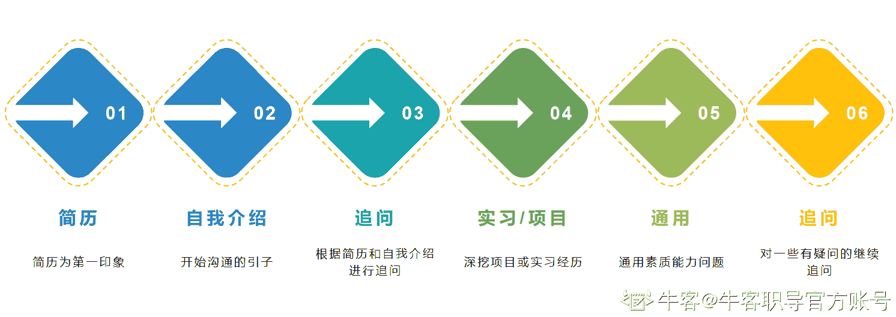
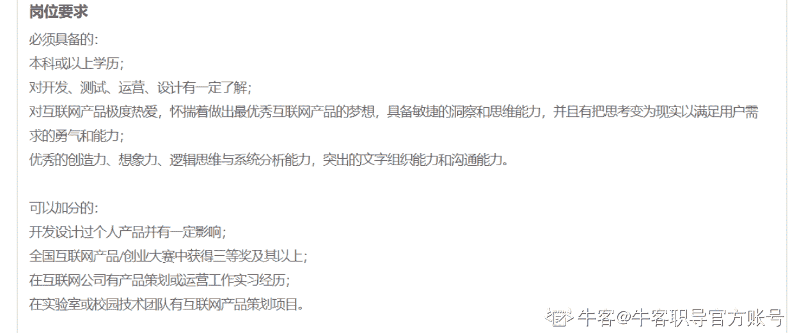

# 第四章 第 5 节 押题及整体准备清单

> 原文：[`www.nowcoder.com/tutorial/10081/3928bdf38a7649debd8716daecfbfaa8`](https://www.nowcoder.com/tutorial/10081/3928bdf38a7649debd8716daecfbfaa8)

## **2.2** **押题**

求职基本会围绕你的简历来问，其他的问的话基本会是问比较通用的问题。

所以你是可以在围绕简历处做一些押题处理的。具体如何押题？

那就看面试问题是怎么来的，拆解一下这个路径：

简历-自我介绍-追问-实习/项目-通用-追问
所以，押题的话你需要经过如下步骤：**1\. 根据公司&岗位信息进行简历埋点**

①包装和修改实习/项目

②包装和修改自我评价

依然拿腾讯的这个岗位举例子：

实习：网易有道产品策划

原来的简历中的描述：

*   负责网易有道搜索功能优化，配合算法搭建模型，搜索量提高了 10%
*   跟踪并分析用户操作记录，提出产品优化建议及调整产品运营策略

根据腾讯的这个岗位 jd，我们在事实基础上，包装成：

*   沟通协作：负责网易有道搜索功能优化，配合算法工程师搭建模型，搜索量提高 10%
*   产品设计：设计 xxx 产品，方案得到 leader 认可
*   数据分析：跟踪并对用户操作数据进行分析，搭建产品运营策略

*当然，这里是我完全虚拟的例子，如果大家有感兴趣贡献自己的真实案例，我们给与对应的 1v1 求职指导，具体的报名方式我会在最后详细说。

**2\. 根据公司&岗位信息进行自我介绍埋点** 

**3\. 追问问题押题**

**4\. 实习/项目深入沟通**

**5\. 通用问题押题**

**6\. 追问押题**

自我介绍相关模板上一节中有讲到，大家可以结合这次的公司信息，再次来更新自己的自我介绍以及相关埋点。

同样，欢迎大家提出具体的真实案例，我们会给大家进行 1v1 求职指导，价值 2w 元+

如何参与投稿真实案例，同时获得价值 2w 元+的 1v1 求职指导呢？

有如下几种方式都可以有机会参与进来：

*   报名集训营，我们会从报名集训营的同学中抽取 1 位进行全程的 1v1 求职指导
*   加到牛客职导相关群，我们会不定期进行抽取（因为这个课是长久的，每年都会抽取至少 2 次，毕竟成本真的好高，真的有 2 万元以上，所以大家见谅哦）

## 3、必须准备的清单

前面讲了很多准备技巧和面试技巧，大家也都了解到了非技术岗位的一些特定性，但是有一些是必备的清单，不管准备什么工作，都是正向加成的，那就是：

*   妆容衣着
*   表达能力
*   输出能力
*   专有名词的准备
*   自信乐观的态度

这几点是不管你求职什么岗位都必须要注意的点，影响范围或多或少都有，需要具体问题具体分析，但是肯定是正向的加成就是啦。

**妆容衣着：**

如果你是求职互联网公司，打扮干净得体即可，但是其实互联网公司的包容性是非常强的，即使穿“奇装异服”或者打扮的比较“时尚”，其实都无所谓的，具体表现为：穿拖鞋、染非常亮丽的颜色等等，其实基本也不追究，不过在面试期间，尽量还是稍微“得体”一些。

如果你是求职国企类公司或外企，可以打扮的更正式一些。

**表达能力：**

这是一项基本能力，是任何岗位都需要的，甚至即使是求职技术工程师，但是也还是需要和人有一些交流的，除非你的专业技术能力真的好到不行。

**输出能力：**

面试中可以有一定的输出能力，什么意思呢，比如面试官问你一个问题，不要只回答一个肯定句：

面试官：“你的优点是什么”

你的回答：“有毅力”

这就属于输出的不好，你可以多说一些，让面试官对你有更立体的形象，不然你的这个有毅力在她看来一个是没法证明，一个是面试官没法更全面的了解你。

**专有名词的准备：**

每个岗位都有一些专业名词，首先你需要懂这些专业名词的意思，别面试官说到什么你根本都听不懂，再有就是可以主动输出一些专业名词，体现你的专业性，但是也别过于“专业”了，就显得有点刻意了，就类似一些在国外留学的比较久的留学生说话喜欢用中英文夹杂着说一样，有的人听着可能就比较刻意，虽然他们是真的就是用英语表达的很顺畅，这里完全没有说讽刺他们的意思，只是想表达大家不要在面试环节中刻意的去表现，就不好了，当然，如果你刻意的不被发现，那也是没问题的。

**自信乐观的态度：**

自信乐观的态度本身就是一个积极的生活态度，任何一个岗位都不会想招一个特别丧的人，所以还是要尽量有个自信乐观的态度，不过度自信，也不盲目自卑，且微笑礼貌待人，总是没错的。