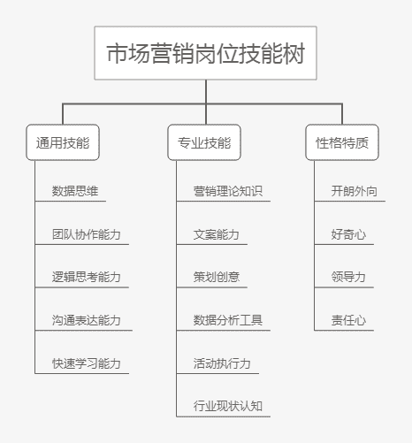

# 第二章 第 2 节 学习规划

> 原文：[`www.nowcoder.com/tutorial/10051/10eae5a6c0de4984938e1ad9ba431090`](https://www.nowcoder.com/tutorial/10051/10eae5a6c0de4984938e1ad9ba431090)

## 

1.  校招岗位技能树

拿到一个 offer 的真正实力，不在于秋招时的精美简历和面试技巧，而在于本人具备岗位需要的能力。所以在秋招之前，需要有目的地学习、锻炼相关技能。综合多个 JD，可以总结出市场营销岗位较为全面的能力模型。其中通用技能和性格特质是必须有的，起码不能暴露出短板。而专业技能能精通两到三个，已经可以让你脱颖而出了。比如精通创意，可以做广告策划；精通数据分析，可以做效果广告投放；有社群运营经验，可以做用户运营；有线下活动执行经验，可以做营销活动执行；有文案能力，可以做新媒体运营。市场岗位招聘时没有特定方向，但是面试时面试官会看你有哪些能力特长，在心里评估你能做哪些岗位。比如我之前有微信微博运营经验，在面试时会表现自己的文案能力和对于新媒体平台的了解，oppo 终面时面试官会说“我们对你的定位是做新媒体运营”，说明他们在这一点上是认可的。面试时注意扬长避短，不要给自己挖坑，比如面试美团时讲到我负责的视频项目，我对写脚本更熟悉，但是多说了两句投放，面试官不断追问“你们在抖音和 B 站上是如何投放的？用哪些指标来衡量投放效果？最终的投放效果怎么样？”，但实际上我们并没有监测投放效果，所以很难回答这些问题。

# 2. 如何掌握这些技能

## **2****.1** **通用能力**

#### **数据思维：**

数据思维指的是在面临工作问题时，用数据分析作为决策依据，用数据逻辑作为思考路径的方法。在实际工作中，很多时候需要从数据层面挖掘问题所在，并对应具体情况进行解决。在面试中也会提问工作中出现的场景，来考察候选人的数据思维。在业务单面中，可能是问到相关的工作情景问题，比如问“销售量下降，请分析原因”“运营粉丝数减少，如何分析原因”“如何确定广告投放渠道”等问题，可以考虑这个问题有哪些影响因素，从而拆解指标，从各个环节发现问题。参考以下思路：

*   销售量下滑→具体问题：看看产品成本、价格数据有啥变动？

*   运营粉丝下跌→具体问题：看看促活率、转化率，哪个环节用户流失了？

*   广告投放哪个渠道→具体问题：我们的目标受众是谁？以往的数据表明，哪些渠道带来的销量上升最为直接？各个渠道的投入产出比是多少？

在群面中，也可能涉及业务问题，需要候选人从数据维度进行分析。比如猿辅导群面题目“一款社交 APP 九月份 MAU 明显下降，请找出原因和解决办法”，具备数据思维的人会知道 DAU 下降的意义，怎样梳理出影响 MAU 的指标，如何通过数据确定问题原因及解决办法。对于数据思维的培养，从我自身经历来看，看书学课程都不如实习有用，在实习中接触一个项目，可以全方位地了解问题解决过程：

*   在这个项目中，我们一般会监测哪些数据指标，这些数据指标代表什么意义？（比如产品经理会关注用户活跃度，内容运营会关注点赞、评论、转发等互动指标）

*   在出现一个问题时，我们一般会如何梳理流程环节？如何从数据指标中发现问题所在？

*   如何用数据指标做决策？哪些指标权重更重，哪些指标是无关紧要的？

这里只是列举一些工作中经常出现的情况，在实际实习中，你会和同事、leader 一起解决问题，从他们身上这些知识都可以学到。

#### 逻辑思考能力：

在面试中很多地方都涉及到对逻辑思维能力的考察，总结来说有以下几种考察角度。

*   语言表述的逻辑性。比如在表达工作经历能 12345 分条说出来，并能自圆其说；叙述工作按照一定的顺序和逻辑，并归纳出一定的结论。

*   解决问题的逻辑性。面试时会问到一些具体的问题，要求候选人推理原因或者归纳结论，其实都涉及到对逻辑性的考察。比如“一个广告投放，男性和女性分别统计点击率都比较高，但是一起统计点击率比较低，请问为什么”或者面试官问“你有什么自己总结的运营方法论？”。

培养逻辑思考能力，我想推荐一本书，《金字塔原理》，这本书介绍了一种能清晰地展现思路的有效方法。掌握了金字塔原理，就能做到重点突出，逻辑清晰。我觉得这本书对我最大的帮助就是理清讲话的逻辑，怎样讲话就是怎样思考，要遵循这样的顺序：先重要后次要，先总结后具体，先框架后细节，先结论后原因，先结果后过程，先论点后论据。增强逻辑思考能力，同时也会提升表述能力，在面试中是相当加分的。团队协作、沟通表达和快速学习能力就不赘述了。在面试时，面试官会问有针对性地进行提问。团队协作能力：“请描述一个你在团队中与他人协作的例子”沟通表达能力：“请描述一个你和他人产生分歧的事例，你是如何解决的？”快速学习能力：“请描述一个你快速学习某个领域的新知识，并应用新知识的例子”我认为，这些通用能力一般不是通过学习某种方法掌握，而是需要在实践中锻炼。每个人和他人协作、表达都有不同的方式，每个人也有不同的学习方法，最重要的是，你去做这件事，比如参与学生活动、实习项目或者自学 python，然后把它做好，在面试时自然就有事例可说。

## **2.2** **专业技能**

#### 书籍推荐：

*   **对于非市场营销专业的同学来说，可以首先通过《市场营销原理》（科特勒 著）营销课程教材补充专业知识。**

**怎么读：**重点看里面的基本原理，建立出对市场营销的框架性认识（可以用思维导图做笔记），再结合自己的实习或者最新的市场案例一起思考。**有什么作用：**这一部分可以帮助我们熟悉市场营销基础知识，和市场从业者建立起对话平台，由“外行”逐渐走向“内行”。这些知识虽然基础，但是在面试中却非常实用，例如问到“你最欣赏的品牌是什么”，“XXX 企业的市场营销成功在哪里”，就可以用一些基本原理来思考，比如用 4p 营销理论（product，price，place，promotion）去回答。

*   **《定位》《长尾理论》《蓝海战略》《影响力》经典营销书籍。**

**怎么读：**可以略读，要知道书中介绍了一个什么理论，这些理论让你联想到了哪些公司和营销案例，在当下的市场中如何应用这些理论。**有什么作用：**在面试中这些书会帮助我们拓展思路，比如《长尾理论》可以帮助回答“如何寻找新的目标市场”，《定位》可以帮助回答“应该如何推销一个产品”。书中提供的是一些洞察，有了这些洞察，不仅可以在面试中举一反三地回答问题，也有助于解决实际工作问题。

*   **相关领域的新书。**

有一段时间我在做内容运营，虽然做了很多具体工作，但是感觉只是接触了一些片段，而不了解运营领域的全貌，比如运营在整个公司里是什么样的，作用是怎样的，除了内容运营还有哪些运营工作，这些工作的区别和联系是什么，做运营工作未来的发展路径是怎样的。然后就找了一些书来看，构建起了对于运营工作的框架性认识，书目如下：《从零开始做运营》，张亮《谁说菜鸟不会数据分析》，张文霖/刘夏璐/狄松《参与感》，黎万强《我的互联网方法论》，周鸿祎我想往营销策划方向发展，又找了华与华的《超级符号就是超级创意》，还有叶茂中的《广告人手记》等书来看。不同垂直领域的书目是不一样的，还是要看自己对哪个方向感兴趣。

#### 资讯平台：

[广告门](https://www.adquan.com/)（很新很全的创意广告案例库，面试时被问到“你印象最深刻的广告/品牌”，我基本都用的是在广告门上看到的案例）[梅花网](https://www.meihua.info/shots!0!0!41!0!0)  （营销作品案例库，包括平面、视频、插画、包装等）[36 氪](https://36kr.com/) （商业科技资讯，了解行业动态。在面试在线教育公司时，我几乎把每个公司都搜了一遍，看公司的最新资讯，看别人对公司和行业的分析。）[虎嗅](https://www.huxiu.com/) （商业科技资讯，行业洞察和观点）

#### 公众号推荐：

策略人藏峰（产品、品牌、渠道、传播策略非常多干货，尤其是这一篇《策划人 2020 年必备的 33 个营销模型（2.0 版）》 ，没时间看营销类书籍的话，可以直接看文章学习营销理论）寻空的营销启示录（会分析一些营销案例）鸟哥笔记（学习运营推广）

## 2.3 性格特质

HR 面一般会问“请用三个词概括你的性格特征”，这时他们想听到的就是符合市场工作的性格特征。性格是一个人更深层的特征，短期很难改变。所以尽量不要掩饰或者伪装自己的性格，最好想清楚自己的性格优势，准备好相关的支持事例。比如说这样总结自己的个性特征：**“创造力”**举例：在工作中提出了某个创新性的方案，用创造性方法解决问题。**“执行力强“**举例：独立做公众号，或者进行创业项目。**“责任心”**举例：自己在学校和实习的项目中承担一定的责任，面临困难依然保质保量完成。