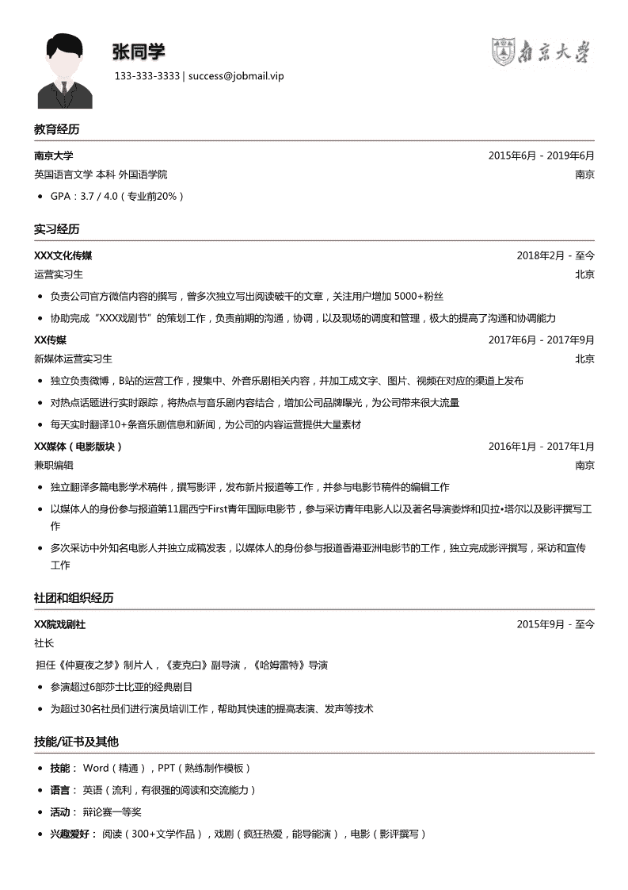
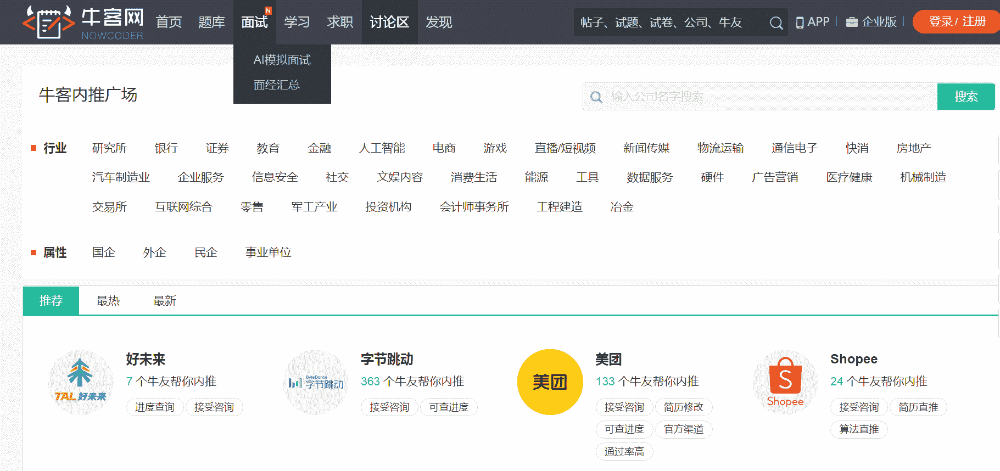
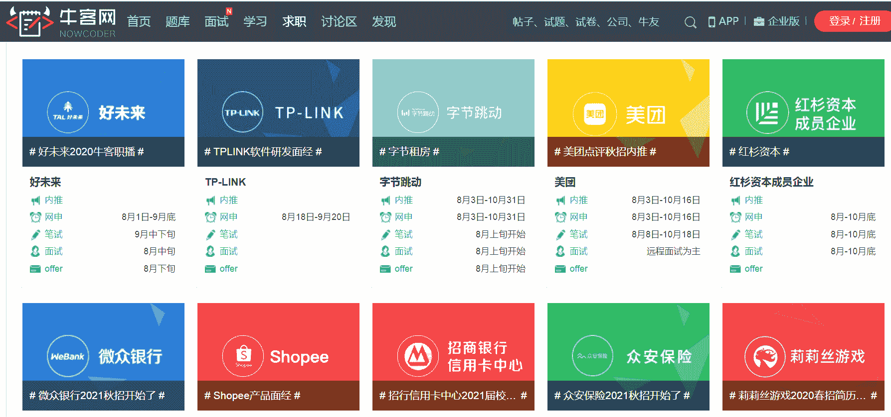
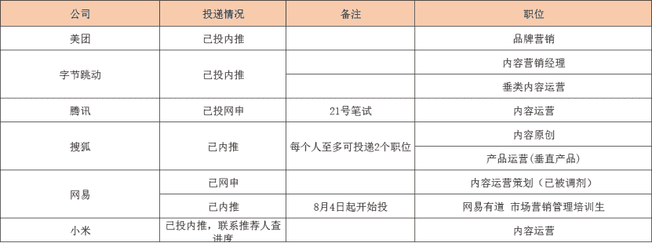

# 第三章 第 1 节 简历撰写及投递

> 原文：[`www.nowcoder.com/tutorial/10051/2fe23fe2c81846afb7545970798a6359`](https://www.nowcoder.com/tutorial/10051/2fe23fe2c81846afb7545970798a6359)

# 1 如何准备一份简历

## 1.1 简历作用

简历既是进入面试的敲门砖，也是面试时面试官的重要参考和提问资料，所以一定要仔细打磨。我在秋招前期接到的面试不多，心情比较丧，觉得自己的经历还可以，怎么会连面试都没有呢，后来做市场的师姐帮我改了简历，果然效果不一样。所以不管经历如何，包装真的很重要。

## 1.2 如何准备简历

简历是筛选的第一关，因为数量庞大，所以 HR 看简历的时间很短，基本就是抓关键词。针对公司需要准备不同简历，或者投了不同职位的话，针对不同类型职位准备不同简历。切忌同一个简历海投。我准备简历的流程一般是这样的：

*   形成自己的经历库。比如在一份简历里涵盖所有实习、科研、学生组织经历，以后每个公司的简历都在这个基础上进行删改。推荐[牛客简历助手](https://www.nowcoder.com/quick-fill/show-introduce)。

*   划重点，把 JD 里的要求一条一条地在简历里反映出来，照搬关键词即可。比如 JD 里有“具备较强数据分析能力”，如果自己有相关经历，就把这句话原封不动地写在经历中。简历中的 JD 关键词越多越好，这样 HR 可以最快抓住关键词，认为你是高度匹配的。

*   职位归类，同一类职位共用一份简历。比如我主要会投“市场营销管培生”“品牌管理”“内容运营”这几种岗位，同一种岗位的简历只需要结合公司具体要求改一改即可。

*   行业归类。比如我在在线教育行业投了作业帮，猿辅导，跟谁学，新东方等公司，会制作一份偏教育方向的简历重复使用。

## 1.3 各个模块写作要点

*   在模块顺序上，把 HR 最想看到的内容放前面，教育经历和实习经历是最重要的，有厉害的学校经历或者创业经历也可以放前面。学生会的话，部长以下的经历价值不大，与职位无关可以不写。下面从不同模块来分享一下简历写作经验。

#### （1）**个人信息**

这里的个人信息包含基础信息+教育信息。

*   基础信息包含你的:姓名、出生日期、联系电话、联系邮箱、学位、目标岗位、个人照片等主要信息即可，家庭住址，身高体重之类的，都是不太需要的。

*   教育信息需要说明一下你的受教育的时间，院校，专业。例如：XX 年 X 月-XX 年 x 月 XX 大学 XX 专业。可以简单列举一下主要课程。如果你的成绩不错，可以把成绩放在教育信息下面，例如：GPA3.7/4（院校前 5%），如果你学习成绩比较一般，但是有一些不错的在校获奖信息，也是可以写上去的。因为不是所有的 HR 都认识这些奖项，所以你可以像写成绩一样，注明一下获奖人数或者奖项等级，例如：XX 优秀干部（院校 3 人）、XX 省 XX 奖。

#### **（2）个人经历**

个人经历主要包括实习经历、校园经历、项目经历，这几部分在简历中的重要性时递减的。优先实习经历，因为这和未来的工作相关度最高，其次才是校园和项目经历。个人经历的撰写有以下注意事项。

*   经历一定要和职位相关，不相关的实习或者学校经历务必不要堆砌，那样只会让相关经历被淹没。比如当过学生会外联部负责人，这个要写吗？可以写，以此证明沟通能力和团队协作能力，这在市场工作中是必要的能力。但是大二的时候参加了一个创业项目，大三的时候参与了导师的论文撰写，这些要写吗？我的建议是，如果没有非常牛逼的成果，比如创业盈利或者发表 SSCI，这些经历就不要写上去了，因为和市场营销工作相关性不强。

*   经历撰写注意结果导向。在写作内容上，许多人写自己的实习都是写做什么，没有写怎么做，达成了什么成果。例如说“在某公司实习期间，了解了什么工作“、”于某单位实习，负责某项目”，这样你的简历内容就会很单薄，显得很空洞。正确的格式是【你做什么】+【你怎么做】+【做的结果】，例如：“在某单位负责什么工作，通过采取什么样的方法，获得怎样的结果，掌握什么样的技能”。结果最好有数据展示。比如运营新媒体平台，而且效果还不错，那么就可以把这些软文写成项目经验。比如：运营微信公众号，一个月内增长了 1000 个粉丝，单篇文章阅读量最高 10 万+。

*   实习经历是学生简历的主体，一般写 2-3 段实习最好。需要注意的是实习经历的时间不要太短，如果每段实习都只有 1 个月会让 HR 认为你的工作稳定性不足，至少有一段实习 2-3 个月以上则比较有竞争力。

*   如果企业名称辨识度低，可以在公司名称后括号加上更为人知的产品名称。如果是不知名企业，建议可以加一句公司行业和业务的描述（不要超过一句），让招聘方能更清楚的了解你下面将要描述的实习经验。比如我曾经在一个很不知名的小型创业公司实习过，但是里面的工作经历让我受益匪浅，很想写进简历里，就在公司名称后加了一句介绍“汇聚年轻人新奇想法的内容社交平台”。

*   实习经历中要有一些体现综合能力的关键词，比如“独到见解”、“精准捕捉需求”、“细致沟通”，我以前觉得这些是无效信息，在之前的简历中几乎没有这类词，但是市场部师姐告诉我，她们筛选简历时确实会看这些内容的。

#### （3）爱好和技能特长

*   学校的荣誉证书建议放在教育经历那里，挑 2-3 个有含金量的写就可以了；这里的技能证书你就写一些相关的技能特长，比如英语证书、PS 技能、Python 技能。除了语言和软件特长，也可以写一些跟你应聘岗位相关的技能，例如要做新媒体运营的工作，可以填充一些文案、新媒体相关的技能描述，例如“熟练运营微信公众平台，熟练使用秀米、135 编辑器等排版工具”。

*   爱好需要体现一定的个人特征，最好在爱好方面也有一定成就。例如篮球爱好队长可以体现一个人爱运动、有团队协作精神，如果是篮球队长，也可以体现领导力。如果是热爱写作，可以体现一个人的文案能力，最好有一定数量的发表作品，或者运营自己的新媒体账号，这可以体现你在这方面的积累和水平。

#### （4）排版注意事项

*   如果简历内容比较多，可以调整行间距和页边距，不要为了塞太多内容把字调得太小，美观、容易读即可。

*   从近到远写，如果你有多份实习，先写最近的，再写远一些的；

*   把工作单位用粗的字体，工作内容用细一点的字体。可以在工作内容描述时，用一句话加粗总结，后面展开描述，例如：**负责 XX 广告投放：**将 XX 广告投放在 XX 渠道，转化率 XX，新增用户规模 XXX 人次。

*   工作内容比较多，要分段，用项目符号隔开，不要写一大段，看起来没有层次感。

下面是一份优秀简历展示，它的排版、模块、话术都可以借鉴，但是结果导向不够明晰，“很大流量”“大量素材”过于笼统，最好附上数字，比如阅读和分享的数量，涨粉数，带来怎样的效果等。

# 2 投递简历

## 2.1 内推

内推是公司内部员工通过内部推荐系统帮你投递简历，一般来说简历会被优先筛选，但是筛选标准和网申是一样的。而且内推人可以给你介绍公司岗位情况，并且帮你及时查询反馈结果。找内推的话可以找自己的学长学姐，如果身边没有熟人，可以在牛客找内推渠道，牛客内推广场链接 https://www.nowcoder.com/discuss/referral/all/index。因为内推成功的话员工也会有奖励，所以很多员工会主动发帖帮内推。几乎所有的公司都可以在牛客内推广场找到内推渠道。（牛客内推广场截图）内推有一般有以下不同方法：

*   内推员工给你发内推码，在投递简历时直接填写内推码即可。

*   直接把简历给内推人，内推人通过内部系统直接投递。

*   内推人分享内推链接，自己通过内推链接投递。

需要注意的是，部分公司网申后还可以补填内推码，但是部分公司一旦自己网申就无法走内推渠道了。不同公司内推规则不同，一定在公司招聘官网上看清楚再投。

## 2.2 网申

从公司官网或者公司公众号上，可以找到网申链接，如果找不到公司官网的话，可以在牛客求职板块，[校招版](https://www.nowcoder.com/recommend/campus)的校招日程页面进行查找，这里汇总了各行业各公司的招聘官。网申投递有以下注意事项：

*   最最最重要的，在截止日期前投递。可以把自己心仪的公司的投递时间整理出一个 Excel 表格，按时提醒自己，千万不要错过投递日期。投递过后及时更新投递状态，并跟进面试流程，观察自己投递的职位够不够、投递成功率怎么样，以便及时调整应聘策略。

*   重要信息核实。网申的时候一般需要把信息在招聘平台上再写一遍，有的平台会自动解析简历，务必核准一下重要信息，比如手机号，身份证号，毕业时间。

*   确认投递。有些同学填好了简历忘记点击”申请职位“了，千万不要犯这种错。