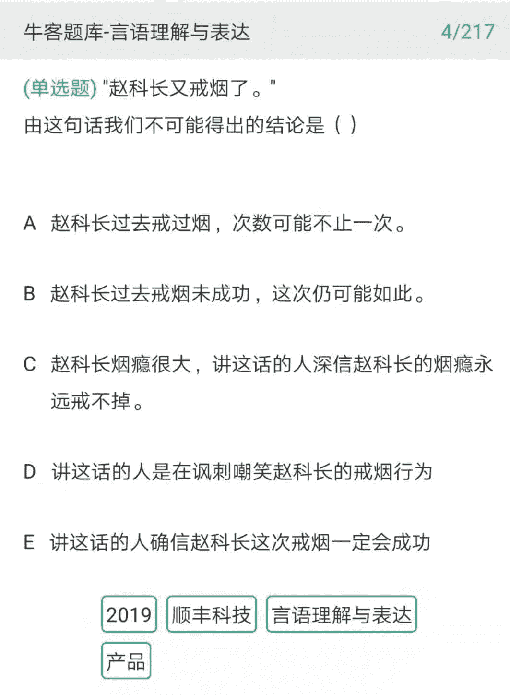
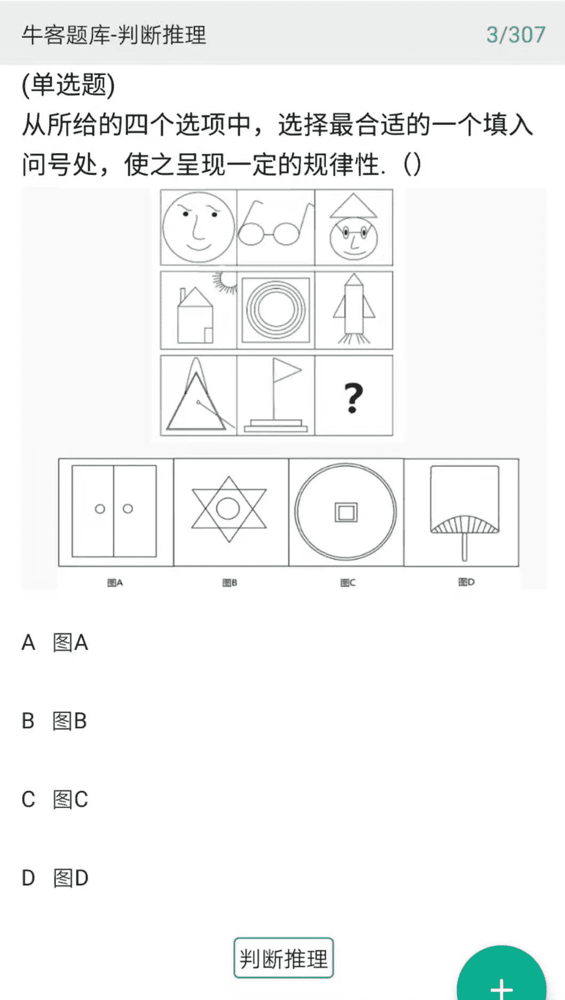
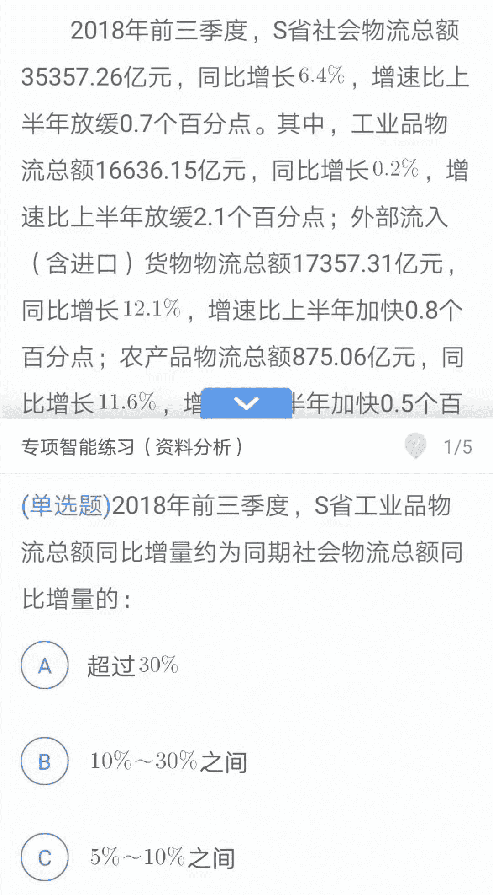
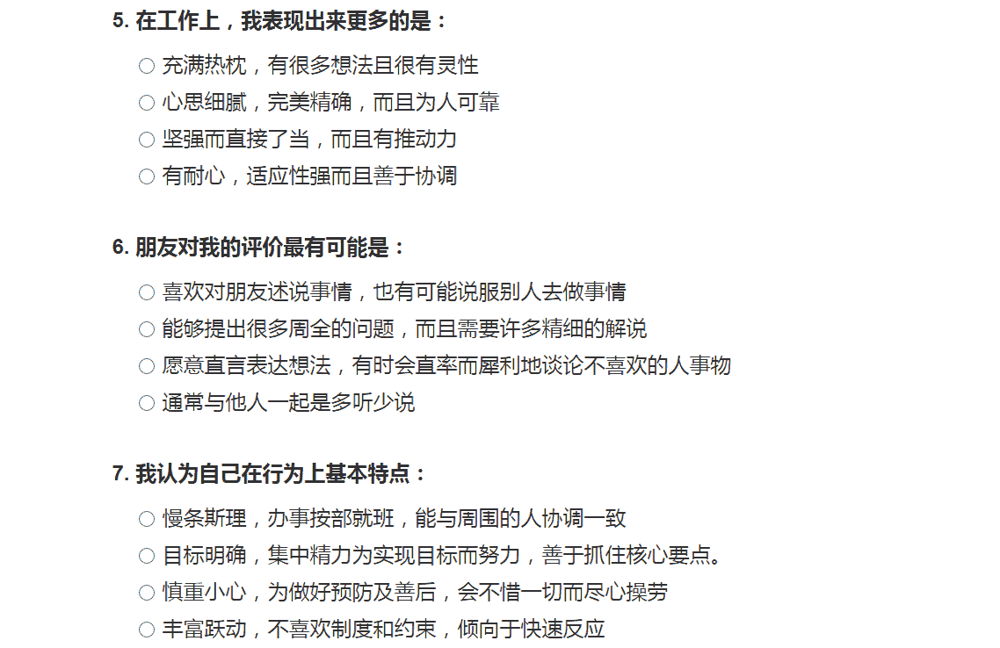
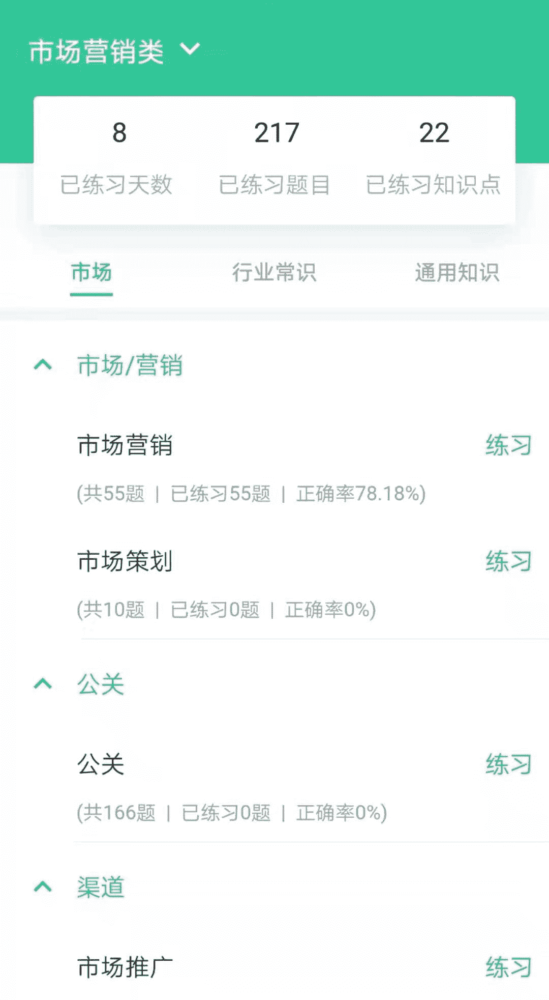
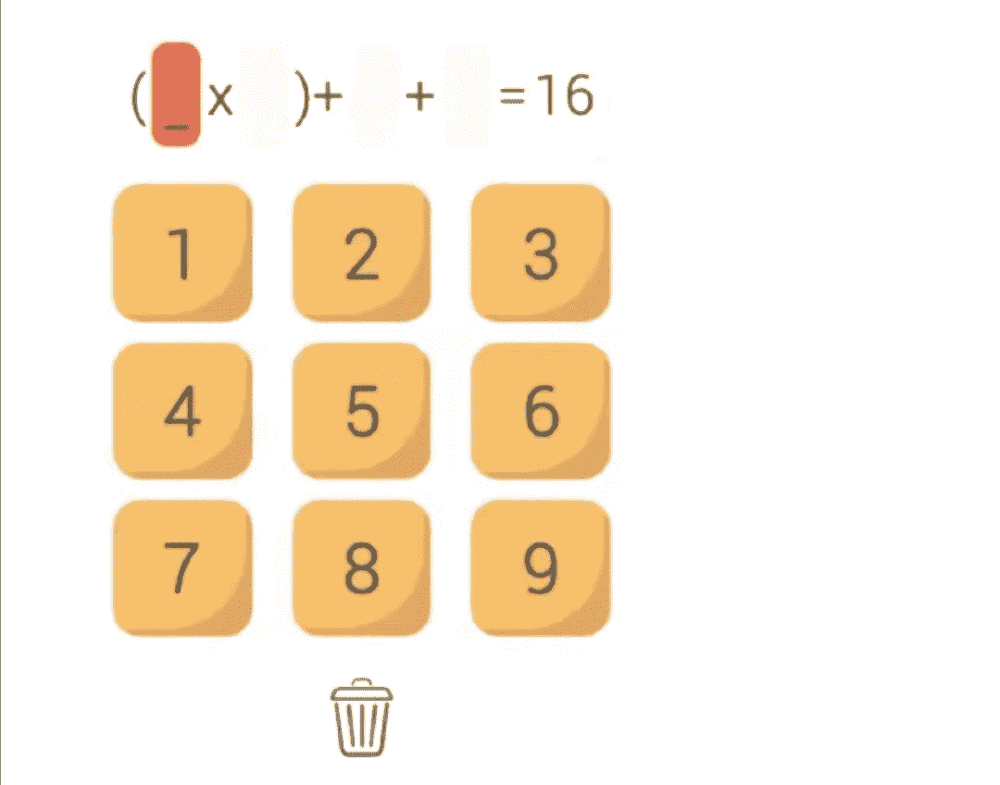
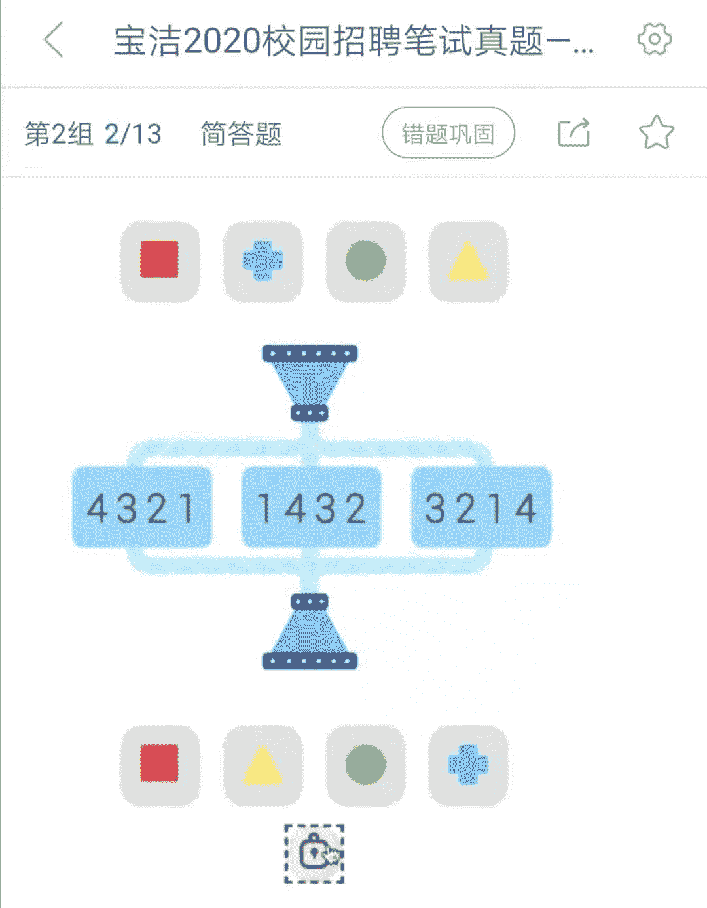

# 第三章 第 2 节 如何通过笔试

> 原文：[`www.nowcoder.com/tutorial/10051/7831d4087cb0470c809ff973bbbdbe58`](https://www.nowcoder.com/tutorial/10051/7831d4087cb0470c809ff973bbbdbe58)

因为公司收到了太多的简历，所以首先要通过笔试先筛掉一部分候选人。市场营销属于非技术岗位，一般会进行一到两轮非技术笔试。**第一轮叫做在线测评，常见题型是行测+性格测试。**行测类似于公务员考试的题型，主要包括言语理解、数字推理、逻辑推理、资料分析。简单来说，不涉及专业知识，就是单纯的考你的智力、逻辑能力、言语表达能力，通过就表示你的基本知识能力达标，有资格进入面试。以互联网公司为例，京东 2021 校园招聘笔试第一轮就是在线测评。试卷名称：综合能力试卷测试时长：60 分钟笔试题型：分为 4 个 part，选择题，每部分单独计时。言语理解题 10 题 10 分钟数字推理题 10 题 10 分钟逻辑推理题 10 题 10 分钟材料分析题 28 题 40 分钟**第二类是专业岗位笔试，这个主要考察跟行业、岗位、职位相关的专业知识与技能，主要题型有主观题和客观题。**下面分别分享一下这几类笔试题的准备经验。

## 1 行测

阿里、美团、腾讯等大厂的非技术岗位笔试题大概分为**“语言理解”、“判断推理”、“资料分析”和“性格测试”**等部分，其中前三部分都和公务员考试中的行测题是同样的题型，一些企业甚至会使用公务员考试原题。这部分的准备推荐[牛客网的行测题库](https://www.nowcoder.com/intelligentTest)，有免费的练习题库。下面介绍一下常见的题型和准备经验。

#### （1）语言理解

包括成语，病句，主题概括等类型，考察的是语言理解、文学积淀以及逻辑思考能力。例如下面这道题。答案解析： A/B 是必然能得到的结论，因为 A 中本来就有“可能”，是一种不确定陈述，在这种不确定下 A 就成了必然成立的了。 C/D 是一种合理推测，C 比较正常一点，D 比较偏激一点，但这都是有可能的。 E 是不可能的，没有证据表明讲话人的确信态度。 所以选 E。大部分同学都有基本的语文功底和常识，这部分一般不需要特别准备，可以了解一下，不需要刷题。

#### （2）判断推理

包括数字判断和图形判断，图形判断题目出现频率较高，考察的是空间思维和逻辑推理能力。例如下面这道题。**答案解析：**第一行都有圆形； 第二行都有矩形； 第三行都有三角形。所以应该选 B。这一部分可以靠短期刷题快速提升，建议先在牛客网做一下不同类型的题目，比如“点”，“线”，“面”不同题型，对于不太擅长的题型突击一下。很多题目都是有套路的，掌握了套路起码可以搞定基础的题型。对于更难的题就需要个人的逻辑思维能力了，但是非常难的也不用纠结，笔试只要通过就可以，在后面筛选中参考概率较低。

#### （3）资料分析

一般会给出一大段有各种数据的文字内容，比如各个市区的食品价格和同比环比增长率这样的材料，要求分析计算，考察的是抓取有效信息的能力和数据计算的能力。例如下面这样的题（因为篇幅限制，材料太长，在这里就不展开分析这道题了。）资料分析不需要大量刷题，但是适当练习可以提升手感。这里有一些个人的心得：

*   不需要通读材料，直接看题目，去题中找数据，而且大多数时候，题目顺序和文本顺序是一致的。

*   增强时间把控能力，这种题目时间会比较紧张，不要对一个数字反复校对，快点往下算，按计算器手要快。

*   通过适当练习熟悉常见的数据和计算方式，比如”同比“”环比“的计算和比较，“放缓 0.7 个百分点”如何解读，可以练习之后自己总结一下。

## 2 性格测试

性格测试主要考察的是个人性格特征，一般会让你在几个选项中选出“最符合自己的词”和“最不符合自己的词”。性格测试题目有以下特征：

*   题量大，题量一般在 60-150 道，但是题目比较简单，时间比较宽裕。

*   同一道题目中可能会有多个你想选的答案，或者一个都不想选，只能尽量选出最符合的词。

*   同类型问题反复出现，目的是考察你的前后回答一致性，这也是该题型的测谎机制。

不同公司的职业性格测试虽然形式不同，但很多都共享题库，基本的性格模型都是基于一些共同的性格测试展开。大多数公司，在笔试过程中加入性格测评，只是想进一步了解、判断你的特点或优势，并非是用统一标准来刷人。每个人都是不同的，每个岗位也对人的具体要求也是不同的。做性格测试题要想清楚两件事：

*   公司想要什么性格的人。比如面试市场管培生，它就会想要“擅长担任团队负责人”“决策果断”“擅长社交”这样的性格形象。而对于创意策划人员，新媒体运营，文案专员，性格要求又会有所不同。有些岗位要求灵活沟通，有些岗位要求踏实执行。

*   自己的性格是怎样的。可以做一下 MBTI 职业性格测试和霍兰德性格测验，这都是非常专业的测试，可以测出自己的性格特征和适合的职业发展方向。[APESK 瑞士荣格理论职业性格测试](https://www.apesk.com/mbti/dati.asp)，有兴趣的同学可以自我测试一下。

如果你的性格和公司需求是契合的，那么在性格测试中如实选择就好。如果你的性格和公司需求不一致，那就要想想，是如实展现自己的性格，还是把自己包装成公司想要的模样。我的建议是，如实展现自己是最好的选择。因为性格很难短期改变，如果你是内向安静的性格，而公司需要一个外向 social 的人，那么即使你拿到这个职位，以后工作也会非常不适应。应聘也是互相选择的过程，最好选择一个适合自己性格的工作。而且如果在测评过程中并不是根据自己的真实想法进行作答的话，从最终的测试报告上是可以看出来的。如果你因为性格测评被加上了“不诚实”的标签，那反而是得不偿失。

## 3 专业测试

部分公司会针对市场营销岗位进行专业测试，测试的内容就是市场工作内容，考察个人市场敏感度，创意策划能力，数据分析能力等。以 2019 年网易有道市场管培生笔试为例，部分内容包括：

*   名词解释：柠檬精，乔碧萝，大触，废青....

*   简答题: 估算面向 7-18 岁学生的编程课程市场规模

*   推广题：有道词典扫描翻译硬件校园推广

*   文案题：母校 15s 短视频文案

*   数据题：根据信息流广告和应用商店广告信息，进行广告投放选择。

**或者像这样考察市场常识：**1.以下哪些 APP 属于同一个公司：A. 钉钉、抖音、今日头条 B. 梦幻西游、阴阳师、网易考拉 C. 王者荣耀、B612 咔叽、大众点评 D. 飞猪、闲鱼、驴妈妈 2.互联网常说的“TMD”不包含以下哪家公司：A. 摩拜单车 B. 美团点评 C. 滴滴出行 D. 今日头条这种市场营销专业的笔试题，也可以在牛客题库中进行练习。**对于专业测试的准备有以下建议：**（1）因为考察的内容有一定难度和深度，所以很难短期速成，能在自己擅长领域的题目发挥好已经很不错了，其他的题目安排好时间，尽力即可。大部分题目都没有固定的答案，重在展现自己独特的想法。（2）名词解释：关注近期市场热点，多看一看微博热榜，百度热词，公众号热点，了解市场动态。比如逆行者、秋天的第一杯奶茶、带货、云监工、光盘行动、奥利给、好家伙、夺冠、尾款人、集美，这些热词背后都反映了一定的社会现象和市场动态。（3）推广活动：针对该公司的产品，提前想一下营销方案，用于回答营销活动创意策划题目，比如“开学季，有道词典笔在大学校园的推广活动”。活动方案策划的思路会在后文“业务面试”部分展开分享。（4）文案撰写：一般会让你写新闻标题、微博文案、slogan、广告视频文案等等，难度不大，可以提前看一看大公司的相关文案，熟悉一下常见的格式、如何提炼和突出卖点、如何展现文案创意等等。**笔试中经常会出题让你写一段微博文案，因为微博文案在市场营销中是最经常写的文案类型之一，这里也分享一些微博文案经验：**

*   语句短小精悍。我们在编写微博文案时，应避免使用大量的文字来写，最好做到短小精悍、言简意赅，编写字数不要超过 140 字，在 100~120 字之间为最佳。

*   不管是什么类型的文案，都要求有明确的主题，这就要求我们在文案写作之前就做好软文定位，包括文案的读者群体、写作目的，以及文案的诱惑点，可以加上一个话题做引导。

*   蹭热点。可以考虑近期的微博话题、社会热点和一些关键词布局，让我们的流量更多一些，以达到大规模传播的目的。

（5）广告数据分析：熟悉市场常见数据，尤其是广告投放方面，会对数据分析有一定要求，可以提前了解“如何看分析不同广告位的价格、点击率、转化率”，“如何选择合适的渠道进行广告投放”，“监测广告投放效果应该看那些数据”，这些都是效果广告工作中常见的问题。**笔试中也经常会有这样的题目，给你一个产品，让你选择广告投放渠道。怎样选择广告投放渠道呢？可以从以下角度思考：**

*   明确目标群体的特征，用户群体画像是什么，性别、年龄、职业、城市、媒体浏览习惯都要考虑进去，考虑他们经常接触的媒介是什么。

*   找寻产品的特点。考虑产品的调性是怎样的，和哪些平台的内容最契合。

*   了解市场的投放渠道。目前市场上的投放渠道有很多，线上广告渠道包括官方广告位（淘宝、微博、微信的广告位）、营销号（微博、知乎的大 V）、搜索引擎广告等等。需要分析不同广告投放渠道的用户人群、内容特点、投放方式、投放成本，以及预期的转化率。

*   确定广告投放渠道和投放方式。虽然我们可能没有在目标公司工作过，但是我们可以回想在哪些渠道经常看到他们的广告，作为思考的依据。

## 4 游戏化测评

很多外企会在测试中用到游戏化测评，比如宝洁和联合利华等公司。这里列出来一些测评的类型和规则，大家可以在网上找到往年的题目进行练习。

*   第一种类型的题目是 digitchallenge，如下图所示，从 9 个数字中选出合适的数字使得等式成立，并且每个数字只能用一次，限时 5 分钟，在这 5 分钟中完成的题数越多越好。越到后面会越难，空格会变多，数字也会变大。

*   第二种类型的题目是 switchChallenge，这部分限时 7 分钟，也是在有限的时间里做越多的题目越好。上方的四个色块依次代表 1、2、3、4，经过一定的顺序调整成为下方的色块，请选择中间经过了怎样的顺序调整。比如下题，红、蓝、绿、黄分别代表 1、2、3、4，下方色块顺序是红、黄、绿、蓝，则数字顺序是 1、4、3、2。

*   屏幕上会依次闪现几个实心圆点，请凭借记忆，依次点击刚才闪现了实心圆点的位置。

#### 
游戏化测评建议：

*   这种题目会随着你答题的正确率调整题目的难度，所以题目越来越难说明你前面正确率较高，而一直很容易说明你前面有错题。

*   有一些“投机取巧”的小方法，可以在知乎或者论坛上找一找，悄悄分享一个，比如在回答实心圆点题目时，可以用口红在屏幕上点一下，更方便记住。