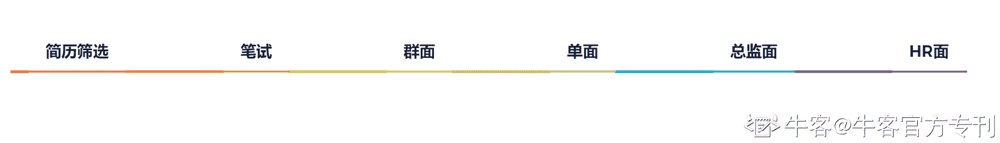

# 第二章 第 1 节 校招求职规划

> 原文：[`www.nowcoder.com/tutorial/10055/8ca20e1d5d9f45b3a8028b4f5aa0a647`](https://www.nowcoder.com/tutorial/10055/8ca20e1d5d9f45b3a8028b4f5aa0a647)

# （一）求职规划

## 1.校招简介

### 校招构成：

每年的校招主要由秋招和春招组成，主要面向应届毕业生，各自都有提前批和补录的环节。

### **校招时间：**

不同公司开启校招的节点不一，但大致遵守每年 7 月前后开始秋招提前批、正式秋招、秋招补录，每年 3 月开始春招提前批、正式春招、春招补录的节奏。不过现在每年的秋招都有时间提前的趋势，而且不同公司在时间和环节设置上可能有差异，例如某些头部公司为了提前抢定优秀的候选人，会提前开始秋招；或是某公司在秋招招满了人，就不再开启春招。这些信息可以通过牛客网网站或 app、牛客网相关公众号、学校就业网等途径进行信息收集，避免错过好机会。

### **offer 发放：**

从发放 offer 数量上来说，大多公司都会在秋招发放绝大多数的 offer，春招一般会作为秋招招聘缺口的补录。所谓的金九银十，说的就是不能错过拿 offer 概率较高的秋招。

### 校招流程

**校招主要由简历筛选-笔试-群面-单面-总监面-HR 面 6 个环节组成**。不同公司的具体情况不一样，例如当年我在字节面试的时候是进行了三轮单面，没有群面的环节。但在秋招前期需要对每个环节有详细的准备，才能临危不乱，毕竟大多数人都没有提前预知公司今年面试规划的能力。需要说明的是，校招的很多岗位是招满即关闭，建议大家提前准备简历尽早投递。理论上来讲，投递时间越早被选中的概率越大，投递的时间过晚，可能面临能力完全符合岗位要求，但是没有 HC 也就拿不到 offer 的困境。

## 2.岗位简介

### 什么是互联网运营？

我秋招的目标岗位是产品运营，归属于互联网运营的大类目。互联网运营类目下面其实有很多细分的方向，用户运营、产品运营、社群运营、新媒体运营、内容运营等等。虽然工作的基础模块有所不同，但总的来说，运营就是产品和用户/客户之间的桥梁，需要使用一切手段达成业务的短期/长期目标，需要面试者有一定的产品思维、同理心、沟通能力、文案能力、数据分析能力、复盘能力。与产品的区别是，产品只能规划产品的长期价值并在短期落地产品，运营实现产品的短期价值并维系产品的长期价值。下面我将会针对互联网常见的运营类目进行简述，但需要注意的是，每个岗位都衍生于公司与业务，相同的岗位在不同的公司，工作的内容可能非常不一样，这里只针对行业常见情况进行阐述。

#### 1.用户运营

用户运营通常需要通过 push 推送、组织活动、搭建用户成长路径等方式提升用户数量、活跃度、提升优质用户占比，对 DAU、MAU、用户 arpu 等指标负责。需要拥有同理心，能站在受众的角度思考问题，同时需要有一定的文案能力、活动策划能力和数据分析能力、复盘能力。能通过数据分析定位用户群体的问题和需求，并针对性地满足用户需求以拉升指标，并能在活动后复盘大型活动筹备前、中、后三个阶段的问题，并在下一场活动中进行迭代。

#### 2.产品运营

产品运营定位于常规运营和产品的纽带，通常诞生于新产品上市初期，需要一个既懂一点产品也懂一点运营的人来链接用户需求和产品开发。或者产品本身偏向技术，需要一个产品运营作为中间人进行业务推进。产品运营的工作内容分为两个方向，面向运营：收集运营反馈上来的需求并对需求进行优先级排序、解决运营反馈的异常 case、并通过培训等方式完成新产品导入市场；面向产品：推进收集到的重要需求，并跟进开发、定期 review 产品各项指标并针对性地推进优化。作为一个产品运营，需要有产品思维，能面对海量需求按照优先级进行推进；需要有沟通能力、执行能力，把高优需求在产品、研发侧进行推进，并能把重要产品和功能在用户/客户运营的协同下完成业务目标；有数据分析能力，能通过数据监控分析业务现状。

#### 3.社群运营

社群运营的工作内容通常是围绕社区中的讨论区、多业务的微信群进行展开，需要对社群用户数、用户活跃度、甚至是用户付费率等指标进行负责。在现阶段的互联网行业，对社群运营强需求的多是在线教育公司，该类公司的社群运营，通常需要以微信社群为载体，以发布每日早晚课程、作业盘点、引导打卡等方式提升微信群用户活跃度，引导社群内用户进行高价课程购买。通过工作内容我们可以发现，社群运营需要有一定的文案能力、沟通能力、数据分析能力。

#### 4.新媒体运营

新媒体运营通常以一个或多个媒体渠道账号（如微信公众号、抖音号、微博账号）为载体，通过发布多样化的媒体内容，提升公司/客户在某一渠道账号的粉丝数、曝光度等指标。该类职位常规工作内容一般为图文、视频内容的产出，对应聘者的文案能力、视频拍摄和剪辑能力有较高的要求。同时该岗位工作者需要熟知每一媒体渠道的流量分发逻辑，在个性化推荐时代，如果能熟知各渠道流量分发逻辑，有流量思维，做起事来会事半功倍。

#### **5.内容运营**

内容运营工作内容和新媒体运营有部分重叠，但不同的是，内容运营产出的内容不局限于某一媒体渠道，而是对业务的整体内容产出负责。如，cici 负责百度贴吧的内容运营，cici 需要考虑的是，如何通过多维的手段，提升贴吧内用户整体的内容产出量、优质内容量。所以内容运营虽然也会参与甚至主动产出内容，但是更关注如何带动用户一起产出内容、提升内容产出的质和量。