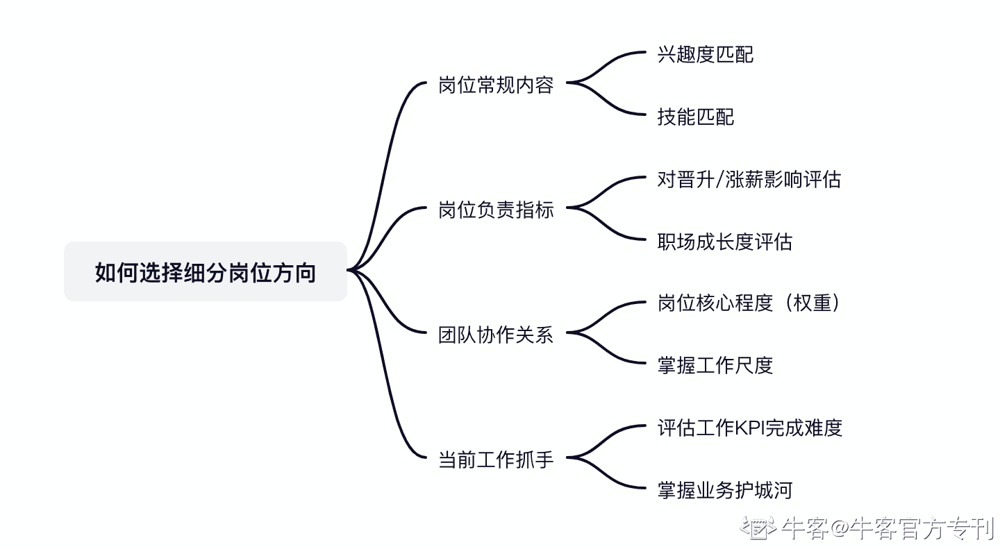

# 第二章 第 2 节 如何择岗以及校招中的心态建设

> 原文：[`www.nowcoder.com/tutorial/10055/39e9a996a596457ea01782dee2efa595`](https://www.nowcoder.com/tutorial/10055/39e9a996a596457ea01782dee2efa595)

# 如何选择细分岗位方向？

面对庞大的运营细分类目，很多同学会发现自己并不知道如何进行细分方向选择，这里我有一套高效的方法论分享给你。了解一个岗位可以从岗位的常规工作内容、岗位负责指标、同其他团队的协作关系、当前工作抓手这几个方向来判断是不是适配自己。

1.  **岗位的常规内容：**通过了解岗位的常规工作内容，我们可以初步判断自己是否对岗位感兴趣，并通过分析常规工作内容，拆分岗位所需技能，看自身技能和岗位的匹配度，有侧重地完善相关的能力项。
2.  **岗位负责的指标****：**岗位负责的指标是否清晰明确，是影响职业晋升/涨薪和职业成长的重要因素。负责指标清晰，能有效降低领导等人的个人偏好对晋升的影响，公司内的人员更容易依靠专业能力获得晋升，职场环境会越来越 nice。作为新人，也方便个人在职业初期 all in 在业务提升上，在职场中快速得到成长。
3.  **团队的协作关系****：**任职岗位在团队内和其他团队的协作关系，能透露出岗位在公司/部门的权重。可以结合组织架构来考量该岗位天花板。同时也有利于新人快速上手业务，把握工作推进的尺度。
4.  **当前工作抓手：**一个有明确抓手的工作岗位，在完成岗位业绩上会更有优势，这样的岗位所在业务一般已经建立了一定的内部/外部护城河，新人站在这样的岗位上更容易乘上业务的红利。

以商业产品运营这一岗位为例，1.该岗位常规工作内容为：新产品导入市场、常见问题排查、客户需求收集、产品说明等文档输出、新产品培训等；通过常规工作内容我判断我能 cover 当前工作并对产品需求收集部分非常感兴趣，我更享受推进需求产品化落地的过程；2.该岗位对所负责业务的售卖销售额负责；对业绩的衡量指标非常清晰，有利于快速衡量员工的工作能力。3.和产品团队、一线运营团队共同协作，向产品反馈产品需求和产品问题、向运营输出运营指南、新产品培训；能直接对产品沟通，并参与产品侧的需求评审会，说明这个岗位在产品侧有一定的主动权，在一个强产品的公司更是有明显优势。同时能收到一手的业务反馈，说明在需求把控上，产品运营岗位上更有主动权。4.工作的主要抓手是，比传统的运营更懂产品逻辑能拿到大盘数据、产品信息对全局进行分析，一线运营需要根据产品运营的信息进行业务推进，双方 OKR 双月维度对齐，目标一致；当前工作业务比较强势能快速召集资源推进业务。综上，当时的我选择了商业产品运营的岗位。大家可以复制我这套方法论，快速对岗位有一个基础认知，后面我会讲如何在 offer 中进行选择，深入阐述职业选择这个事情.

# 心态建设

说到心态建设，我有太多想要告诉大家了，我一度也像很多学弟学妹一样，群面的时候会紧张到不敢说话、没 offer 的时候焦虑到睡不着觉、拿到不喜欢的 offer 会觉得委屈耽误了自己的人生。但其实回过头看，校招只是你人生中的一小段，人生是一场马拉松，起点跑得慢或跑得快不重要，谁能坚持到终点跑的更远更稳才最重要。永远不要因为焦虑放弃自己的成长，有时间焦虑不如出去找上几个朋友大吃一顿，回来再对自己的失误做一次全面的复盘，把焦虑的时间用来弥补曾经的失误。而且校招面试是一个充满意外与惊喜的过程，优秀的人也可能因为面试官或 HR 的看走眼错失 offer，没那么优秀的人可能也会因为面试准备充足拿到了 sp。不要以一次校招来判定自己的成败，每一次面试都全力以赴就好。就好像，考上清北的人，大概率人生顺遂，但没考上清北的人就要放弃人生吗？我觉得不是的，没考上清北的人也不代表着失败，一样有自己闪闪发亮的人生，最重要的是不要在焦虑中放纵自己的懒惰。**如果现在还做不到绝对理性下的不焦虑，可以尝试从下面的视角来理解秋招****：**

### 

*   面试首先是一次了解并评估未来公司&岗位的机会，而后才是展现自己获取 offer。

许多朋友在面试中，一味地希望面试官能满意自己的表现，反而错失了很好的真实感受公司氛围、了解目标岗位的机会，面试中最好的状态是拿到更多信息，做更理性的判断。我自己是互联网公司的，身边有的朋友会在面试中表现出能接受长时间加班，但入职后因为加班时间太长太累几度想辞职，而且互联网公司大多要求新人快速成长，很少有人能如自己预期那么抗压。如果在面试前觉得自己对公司的某些方面了解的不够，其实是可以在面试中感受或侧面打听了解，而不是慌乱中编造出自己适配岗位的样子。每个人的评价尺度都是略有不同的，别人的不太加班，也许在你这就是每天熬夜上班。可以在面试的时候直接问面试官上班的时长情况，获取更多关于公司的信息。

### 

*   面试是一个认识自己的过程

秋招的很多面试，会把你以前的经历拆分的很细来问你。通过面试能对以前的经历多次复盘，引导你对从前的经历有一个新的评价和认知。而且回答的不好的时候，不妨大胆问问面试官，您听了我从前的经历对我有什么建议吗？经常会有意想不到的收获。比起同龄人的建议，从业多年的面试官或许会提供给我们一个新的认识世界与自己的角度。

### 

*   面试是个认识新朋友的机会

能和你一起参加面试的，多数都是和你有共同喜好的人。群面的时候一次就能见到十几个同样规划的人，分享一下面试经验和秋招感想，甚至是吐槽一下不喜欢的公司，都挺有趣的。我还遇见了参加过奇葩说海选的朋友，对我来说都是美妙的相遇。

### 

*   关于紧张

我是面试前会疯狂紧张，但是进面试场地后不出三分钟就能冷静下来的一类。分享一下我的不正经经验，面试前紧张是因为我总觉得自己还没有准备的很好，大多数人应该也是这样的心态。但面试中，从我进入面试场地的一刻，我会给自己建立认知：

1.  从这一刻起，所有因为没有准备完备的不安都不能为我面试表现加分，我要基于现有储备做最好的展示，过分紧张反而会影响我的面试发挥。

1.  我在面试官面前一定是青涩的（面试官那么多年工作经验了，我没必要强撑老成，比起装逼不如拿出我青涩但有冲劲的样子），甚至在同组的群面同学面前也是不够专业的，但我可以做全场迭代能力最快的，扬长避短即可。

1.  就算我最菜，我在这面试一场能和优秀的人交流我也赚到了，以一个积极的学习者心态而不是一个渴望被选择的菜鸟的心态面对。