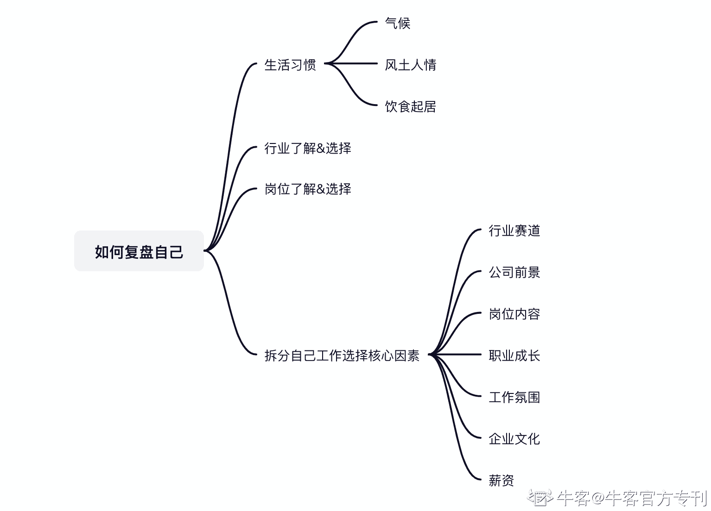
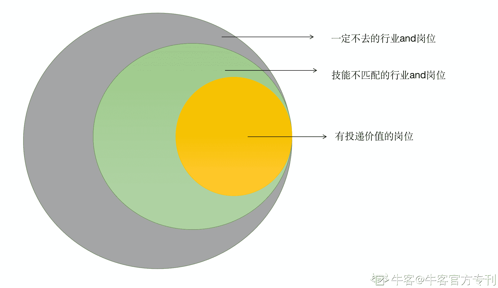
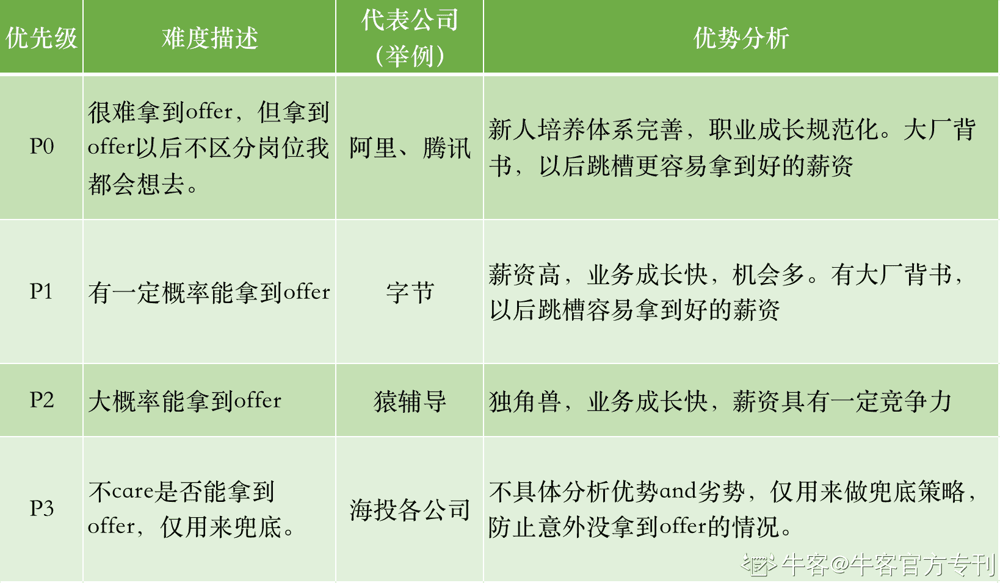

# 第二章 第 3 节 如何快速做好校招规划

> 原文：[`www.nowcoder.com/tutorial/10055/a17ccbbaec3d4ab4895d2cb1854b5c38`](https://www.nowcoder.com/tutorial/10055/a17ccbbaec3d4ab4895d2cb1854b5c38)

# 1.为什么要做个人职业规划

校招的第一步，其实并不是从大众认知的投简历开始的，而是从对自己做一个清晰盘点，依据个人特点和偏好，制定职业规划开始的。如果不做职业规划，大家很可能会在秋招中不分行业和岗位的海投，导致精力分散，拿到的 offer 不符合预期。比如当时的我，把能看见的招聘信息全都投了，那时候，电脑文件夹里漫山遍野都是我的简历。后来发现经常两家公司笔试面试时间撞车，记得我是前一天携程面试后一天整夜没睡去面试的腾讯，结果哪个都没准备好。后来京东终面等 offer 的时候，我尴尬地发现自己其实对京东另一个岗位更感兴趣，但是已经被录取的人是没办法换岗位、也没办法重新参加春招的，这时候 offer 反而变成了我职业发展的阻碍。所以，校招投简历之前，一定要对自己做一个全面的复盘和规划，制定属于自己的校招优先级。

# 2.如何制定职业规划？

关于自我复盘，我建议大家从以下 4 个方面对自己进行剖析。

*   行业了解&选择：互联网/快消/地产/国家公职人员等等，需要对行业有清晰的了解结合自己的情况做判断。可以结合行业研报、垂直类目的网站、业内人士的访谈、学长学姐的反馈去获取了解行业的信息。再通过这些信息去分析行业的发展阶段、业务成长性和天花板、了解工作节奏和氛围，再根据自己的偏好进行选择。

*   岗位了解&选择：产品/运营/研发，针对性地调研岗位背景，拆分岗位所需技能，确定哪一个岗位技能适配，同时自己也能喜欢。

*   生活习惯：能不能适应在未来城市的气候、风土人情、饮食起居。

*   拆分工作选择核心因素进行决定：结合前面对各行业和岗位的了解认知，拆分自己找工作核心关注的因素，如行业/岗位是否核心/工作氛围/企业文化/加班强度等等。

以我为例，在行业选择上，互联网当前仍旧处于高速发展期，整体员工的薪资更高，高管的年龄也偏小，但同时，996 的工作节奏也是互联网普遍出现的情况。所以虽然加入互联网意味着在职业前期能快速获得独自 cover 业务的机会，得到更高的薪资更快速的成长，也有更广阔的晋升空间，但同时要接受个人生活时间被工作时间的严重挤压，放弃一定的个人空间，甚至部分同事在工作初期非常 all in，会加班到凌晨。因为我个人不太喜欢国企一成不变的生活和相对不太顺畅的晋升机制，所以在当时毅然决然地选择了互联网。在岗位选择上，互联网新人能选择的岗位大致有研发、产品、运营三个大方向。因为技术背景的限制，我无法选择研发岗位。产品和运营之间，我更喜欢运营职能，因为运营更靠近真实的用户需求，能拿到未经处理的第一手信息，而在业务推进中，谁靠近需求谁就更有主动权。当然可能很多人也会说，运营只是个打杂的，但其实就我看来运营每一步工作都有自己的主线，为了完成主线的任务是需要做很多支持性的工作，不过这不能抹杀本身的核心价值，也正是因为运营中打杂的人不在少数，所以有清晰规划并能持续驱动自己的运营，未来会越来越值钱。我是一个非常看重公司氛围的人，对我来说能不能自由地工作很重要，让我固定时间上下班打卡，我会觉得很难受产出也偏低。互联网的弹性上班时间，免费零食，坦诚清晰的文化，对我来说非常友好。我是土生土长的北方人，去南方的话湿冷的气候会让我非常难受，冬天没暖气常常冻得睡不着觉，而在陕西的时候，我又会因为气候太过干燥总是流鼻血。要知道人是无法一直在身体不 ok 的情况下持续工作的，所以在地域上，我更倾向城市偏北方一些。结合以上这些分析，当时我求职目标就是北方的互联网公司运营岗位，在秋招的筹备期我都有清晰的侧重点。大家可以根据自己的情况对自己做一次完整的复盘，谋定而后动。

# 3.不知道自己喜欢做什么怎么办？

当然我理解很多朋友其实对自己喜欢什么没有一个清晰的认知，长时间按部就班的读书，让我们对外界多种多样的岗位知之甚少，如果无法在当下拿出确定的答案，这里有拆分自己喜欢的行业&喜欢的岗位的方法：

1.  可以把各行各业列出来，划掉一定不去(不喜欢、身体不适等）的行业。
2.  列出剩余行业的岗位&岗位基本要求：划掉不能做的岗位。

ps.文学系肯定不能做医生的，这种跨专业就不要想了，喜欢和医生哥哥一起工作也白搭。但是文科生想做产品，这种跨度我认为是没必要给自己设限的，能半年不间断学习入门同时自己很喜欢的岗位是可以适当考虑的。    3\. 剩下的行业&岗位就是你喜欢并且可以做的工作了，理论上是有投递价值的。    大家可以像我下面这样，列一个表格帮助自己筛选。

| 阶段 | 行业 | 选择情况 | 原因 |
| 1-行业选择 | 快消 | 可选 | 个人原因对快消类公司氛围更喜欢，培养体系健全，成长路径清晰 |
| 教育 | 不可选 | 太操心，成长速度慢 |
| 互联网 | 可选 | 工作氛围自由、天花板高 |
| 公务员 | 不可选 | 天花板较低、成长速度慢 |
| 2-行业 and 岗位选择 | 行业 | 岗位 | 选择情况 | 原因 |
| 互联网 | 运营 | 可选 | 可选 |
|  | 产品 | 可选 | 有一定技术门槛，但通过半年不断学习能入门，可以在校招尝试 |
|  | 研发 | 不可选 | 技术门槛非常高，需要长期学习，无法在校招阶段快速补足能力；过于技术，怕脱发； |
| 快消 | 市场营销-marketing | 可选 | 可选，和我的专业匹配，校招有一定优势 |
|  | 商务 | 不可选 | 需要非常有抗压能力，有一定 social 能力，我的短板， |
|  | 销售 | 不可选 |  |
|  | ... |  |  |

在整个过程中，可以通过看招聘网站的岗位描述，同有类似职业经历的学长学姐聊天，求助于家人和朋友来完成对行业和岗位的初步认知；如果这一步都懒得做的话，最粗放的方式是，去看看那些你身边的你想成为的人，通过观察或聊天去了解对方在做什么，对方承担着什么样的压力，综合评估下你是否也想走一样的道路。两边结合起来，在未来的职业选择上，你会清晰许多。就我的经历而言，我认为以上几步筛选出来的公司&岗位，控制在 50 个以内都是非常合理的，大家可以根据自己的精力投入度进行数量调整。如果数量过多，再重复一下以上三个步骤进行筛选就好了，一定不要把目标范围定的过于宽泛，横跨多个行业的多个职能，因为秋招阶段你的时间和精力都很有限，秋招流程上也比较长，目标范围太大反而会让你难以有所斩获。

# 4.制定校招推进优先级

在确定了有投递价值的 list 以后，可以建立一个属于自己的《秋招推进表》，标注目标岗位优先级、岗位 JD、笔试时间、面试时间、当前阶段，并有序推进就 ok 了。在优先级的制定上，我会把各大公司按照优先级分为四类：
这里要说的是，我不排斥海投的方案，甚至建议大多数人去海投，只是要在海投中保持自己的节奏和侧重，把 80%的精力花在最有价值的岗位上，1-2 的岗位建议针对性地修改简历并投递，3-4 的就可以梳理一个岗位通用的简历模板，直接海投。而不是精力均分到各个岗位上没有侧重，导致哪个岗位都准备的不充分。我认为不海投可能更适合目标非常清晰、能力也非常出众的 top 名校的朋友，不然大多数人还是会多多少少面对简历筛选挂掉、笔试挂掉，面试官风格不 match 等意外情况，给自己留有充足的备选非常重要。