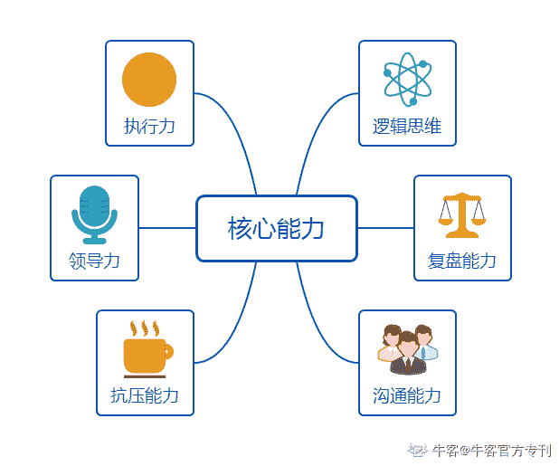

# 第三章 第 1 节 校招岗位技能树

> 原文：[`www.nowcoder.com/tutorial/10055/3716d10fafcc4b3d8fd9a260ec5bc93d`](https://www.nowcoder.com/tutorial/10055/3716d10fafcc4b3d8fd9a260ec5bc93d)

# 校招岗位技能点

区别于社招对招聘者垂直领域专业能力的考核，校招其实并不会强考核大众认知上的专业能力，而是关注处理工作的底层逻辑。互联网的高层管理者发现工作 3-5 年的人基础打的并不好，底层逻辑不完整、拆解问题的思路混乱，导致配合起来非常吃力，所以更愿意用重金从 0 培养一批底层能力更好、更有潜力的人，以期未来这些人能成为公司的中流砥柱。所以在校招考核上，其实在各岗位上有高度的相似性。总的来说分为以下几个方向

## 逻辑思维

逻辑思维是互联网大厂在校招中考核的核心能力。大家普遍认为，工作的专业技能可以在业务中培养，但是底层的逻辑能力其实很难被改变。这部分的考核会贯穿笔试到面试的全过程。一方面在笔试中，可以结合试题按照推进逻辑对试题答案进行阐述，我一般是按照【背景】、【目标】、【动作】、【结果】、【风险点】的模块做阐述的，结合试题类型会做适当增减。并善用序号、分点、加粗等方式突出我的核心信息；在面试中，我会选择结合金字塔原理（可以找下《金字塔原理》这本书看哦）的内容去回答问题，对我的答案进行前后链路的推导，想好后按照模块结构化输出。举例说明：面试中如果要我阐述自己的项目我会选择如下阐述→我在 XX 时间段内做了 A 行业消耗提升的项目。【背景】背景是通过数据分析我们发现，A 行业无论在消耗量级还是客户数上和竞媒都存在较大差距，【目标】预期在双月内提升 A 行业消耗 30%。【动作】我通过以下三个动作完成了项目目标：1-通过客户调研，发现 A 行业客户 XX 需求在我方并未满足，当 XX 在竞媒支持现状为....2-通过开发 B 产品，我们对 A 行业客户强需求进行满足，双月内覆盖客户数 XX，引入预算 XX 万；3-通过公众号、内部信等方式，完成 B 产品面世后的宣推，覆盖 XX 客户，触达率 X%。【结果】双月结束时，销售额提升 x%，客户数增长 xx 位，超预期 X%。

## 复盘能力

复盘能力是工作中实现快速成长的核心能力。在面试前，需要整体 review 一下呈现在简历上的内容，一方面要保证对简历上的每一个细节都了如指掌，避免因为紧张遗漏细节，被面试官质疑经历&项目的真实性；另一方面，可以从以下角度重新思考项目，并给出答案以备面试回答，

*   当初的项目为什么存在？背景是什么？价值点在哪里？

*   项目考核指标是什么？结果是否符合预期？

*   如果符合预期，我们哪里做的好？

*   不符合预期，我们哪里做的不好？

*   项目推进中遇到的问题下次能否以更优解去优化？

*   如果再让自己重新负责一个类似的项目，有什么经验和教训是你总结出可以被复用的？避免在聊项目的时候被面试官问倒。

## 沟通能力

大家对沟通能力的理解可能是“把事情说清楚”，但我理解的沟通能力是“把事情说清楚，并能拿到想要的结果”。想要有拿到结果的能力，核心需要面试者能够快速抓住对方的利益点，并利用自己的资源进行置换，最终实现双赢。举个例子，去火车站的时候，有个抱着孩子的奶奶堵在路上，别人劝她让一让也不听。如果让你劝她离开，你会怎么说呢？或许大家会说，你这样有碍别人走路不好？你这样是不道德的？我会选择说，奶奶，您站在路中间，火车站都是赶路的人，万一不小心撞坏小孙子就不好了，去旁边一点的位置安全些。

## 抗压能力

抗压能力在面试中。可能会通过压力面的方式来考核。例如当年我在京东的面试中，一直在不停被打断。我一般会选择按照下面的思维路径去解决。拆分我感到压力的来源是什么：如果对方是气场让你感到压力，你可以放低对自己的过分要求，你就是个来面试的应届毕业生，其实不需要在专业度等方面超过你的面试官，不然面试官都白白工作那么多年了。如果是对方不断质疑的态度让你感到压力，不要因为对方的质疑就自乱阵脚，认真思考对方质疑的点是不是合理的；若是合理就承认当初在思考的时候缺少了这方面的考虑，如果再来一次我会选择 xxx 的思维去解决问题，总结出了 xxx 经验或方法论，展现自己的快速迭代能力。若是认为对方不合理，就阐述自己坚持原有观点的原因，以讨论的态度和对方沟通，不卑不亢即可。例如在腾讯的面试中，我曾被问到 X 产品上线有考虑过对用户的负向影响吗？用什么指标去界定这个影响？当时的我确实没有思考过这个问题，我是这么回答的：在当时确实忽略了这个方向的思考，在后续其他业务上我也会记得把用户负向反馈指标加入考核，就当前这次的 case 来说，当时是通过对 dau、用户使用时长进行粗放定义的，如果再来一次我会选择在小范围内定义用户体验指标去精准衡量。这也告诉我在做业务的时候要做到商业利益和用户利益的平衡，并建立参考指标去衡量事情的影响程度。同时也想听听您的建议，您认为怎么做比较合理呢？

## 执行力

执行力其实在面试中考核的频次并不是特别高，更多会结合项目对你进行考核。例如会考核简历中的项目是否有严重的延期，你是怎么把控项目的推进的，以及如何做项目推进过程中的风险控制。这部分在面试中只要展现自己的积极态度、准备项目的时候对细节进行仔细推敲即可。

## 领导力

这部分其实更多在群面的时候做考核，看面试者除了自身素质以外，能否带动团队活跃前进。这部分我倒是有一些小心机。在群面前寻求同伴，可以进场前就和同伴中看起来气场合的多说说话混个脸熟，记住每个人名字。这样对方也会快速熟悉你，在群面中大家都倾向和熟悉的人交流。照顾其他同学的感受：群面的时候可以说，我认同 xx 的观点；阐述观点的时候说 xx 的思维我很喜欢，一会我说完很想听听 xx 的意见。被夸奖的人，下意识是向你靠近的。保持冷静，按照逻辑分模块拆解任务，带全组节奏：群面大家都紧张，经常出现各说各话的情况，每个人都急着只表现自己，可能根本不会仔细听别人说什么，最后对项目的进展毫无益处，甚至可能出现整组跑偏的情况。你可以在最初带领大家划分问题拆解的模块和推进节奏（例如，5 分钟个人单独拆解问题，10 分钟小组讨论，10 分钟根据大家的内容建立汇报的框架内容），关注大家在说什么抓住主线总结并适当纠偏，这几样做好足够你脱颖而出了。