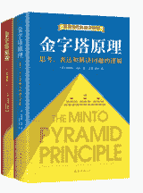

# 第三章 第 2 节 如何快速成长为一名优秀的运营

> 原文：[`www.nowcoder.com/tutorial/10055/ab4409567b5241da923b14d01aa13bf6`](https://www.nowcoder.com/tutorial/10055/ab4409567b5241da923b14d01aa13bf6)

# 成长路径

虽说在校招面试中不强考核专业能力，但仍需对运营成长的路径有一个大致的了解，以下为我总结出的运营成长路径上所需掌握的专业运营技能，仅供参考。

| 阶段 | 专业能力模块 |
| 新人运营 | 1.复盘能力：能针对日常工作定期 review 进展及问题，并快速迭代。2.文案能力：覆盖日常文档输出需求，文字清晰有脉络。3.数据分析：能完成业务现状分析，并能获得分析所需数据指标，掌握基本的取数手段。4.沟通能力：能讲清楚事情的【背景】【todo】【预期】等信息，结构化表达。5.执行能力：能理解任务的核心要求，并在遇到重要问题时主动同步，做好风险控制，推进任务按时交付。 |
| 1-2 岁运营 | 1.结构化思维：能在遇到问题的时候，能站在产品/客户运营/销售等多个团队视角思考问题，并结合各方利益进行推进。2.数据分析：掌握 sql 基础能力，能通过数据分析发现业务的机会点和风险点。3.复盘能力：能复盘大型项目的效果、问题点、做的好的地方、盘后续 todo。4.业务理解能力：了解业务的产品、运营现状，了解商业逻辑。5.执行能力：面对业务需求，能撬动协作团队协力完成，保证结果准时交付。 |
| 3-5 年运营 | 1.领导力：能赋能给对接团队 and 下属，带领团队取得成果。2.商业资源：了解业内信息，懂产品商业逻辑，能撬动更多资源给项目支持。3.判断力&执行力：能准确判断业务走向，并协同下属推进，拿到预期效果。 |

# 学习资源推荐

| 类别 | 书名 | 详述 |
| 运营入门 | 《运营之光》 | 重点看第 3-5 章。 
*   3-4 章会详细介绍，运营的核心技能和工作方法，运营的宏观规律和逻辑。书内有很多可实操的技能，可以结合这两部分的内容去 review 自己简历中的项目经历，试着重新整合复盘项目经历，方便在面试中聊项目思考。

*   5 章会详细介绍运营的职业思考 and 发展路径，可以结合内里内容去回答面试中“职业规划”类问题。

*   1-2 章主要是帮助你建立对运营的初步认知 and 职业信仰，有所了解即可。

 |
| 《我在阿里做运营》 |  
*   主要看**内容运营**相关部分，会颠覆大众对内容运营的传统认知。可以当做开拓思路的读物来看，针对自己的求职目标思考，未来互联网数据和技术实力越来越强的背景下，各类运营的未来在哪里。

 |
| 职场沟通 | 《金字塔原理》 |  
*   结合书中的金字塔结构，尝试练习在面试官面前讲述自己的项目 and 实习经历，让同学或朋友站在面试官的视角，去 check 是否能做到以下几点

1.  面试官是否清楚 get 到了我的工作内容？

1.  面试官是否清晰 get 到了我的工作价值点，哪方面是面试官更关注的？这是我想引导面试官关注的嘛？

1.  面试官会下意识关注哪些内容？针对这类问题，我是否有逻辑地阐述了解决办法？

 |
| 《非暴力沟通》 |  
*   非暴力沟通的某些方法并不完全适用于职场环境，但以下几点可以着重阅读并复用到职场/面试中：

1.  **使用观察而不是评论：**举例，阐述项目的时候可以说“当时的解决方案并没有从用户需求出发，所以我认为并不合理。”而不是“当时的解决方案很糟糕”，能体现出面试者“对事不对人”的专业性。

1.  **提出具体请求：**举例，遇到群面同组的人忽略你的观点的时候，你要表达“希望能综合考虑下我的观点，合理性在于...”而不是“怎么都没有人听我说话呢，我的意思是...”，直接提出具体的请求，虽然简单但能直接引导对方按照你的思路推进。

1.  **理解行为动机：**当面试 and 工作沟通中遇到问题的时候，不要只是站在自己的视角，思考对方很奇怪这都不配合。而是站在对方视角，思考对方不同意的点是什么？如何解决？

 |
| 职业规划 | 《远见》 |  
*   主要阅读 part2，拆解职业生涯三大阶段，自己需要提升什么方面。如何前期补足短板，第二阶段打造长板。

*   学着站在人生的视角去思考工作，在职业规划上能帮助你想清楚很多事情，在多个 offer 中更好抉择。

*   结合书里的内容，拆解自己职业规划的逻辑，可以用来回答职业规划类面试问题。

 |

面试中仅仅是人生中的一个小阶段事件，想要走好运营这条道路，还是需要在日常生活中不断补足能力短板，持续不断地深入学习。上面的学习资源也只是能帮助大家快速建立对运营和工作的基础认知，至于每个细分方向的独门秘籍，需要大家保持对外界信息的关注、持续不断地复盘迭代、拓宽自己的知识广度和深度，多去和业内的大佬们交流，多去思考如果自己独立解决问题要怎么办，才能更快更扎实地成长起来。