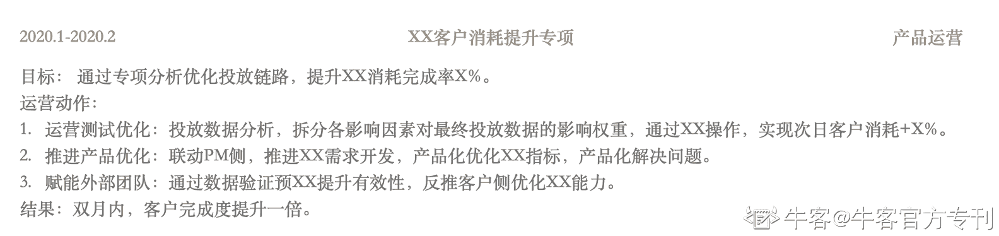
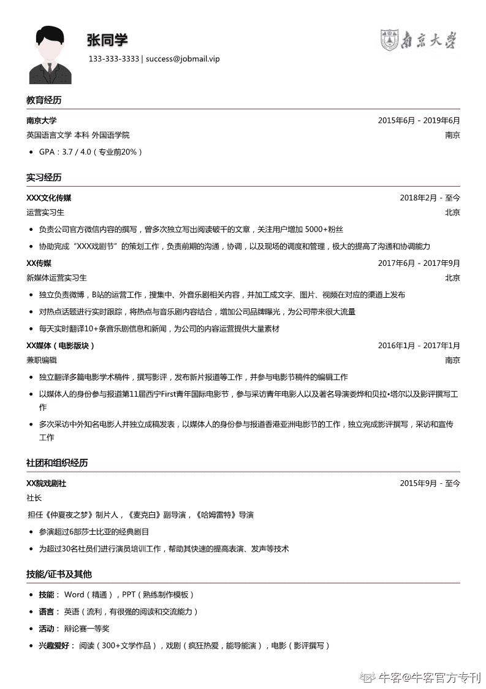

# 第四章 第 1 节 如何撰写一份好的简历

> 原文：[`www.nowcoder.com/tutorial/10055/685ae4c388e84e3b97258ecf8758f2b2`](https://www.nowcoder.com/tutorial/10055/685ae4c388e84e3b97258ecf8758f2b2)

# 1.如何制作简历

## （1）简历结构制定

常见的简历通常由**个人信息、教育背景、校园经历、实习经历、项目经历、荣誉情况、技能特长**7 个模块组成。其中，个人信息、教育背景为必有项，其余模块同学们可以根据自己的历史经历、岗位诉求匹配度进行增减。在简历梳理的时候，大家可以先复盘一下历史经历，决定要把重点内容放在哪里。复盘的时候，可以站在 HR 视角审视自己，评估自己作为候选人最出众契合岗位的点在哪里，并把这部分内容着重展示。举例说明，我当时面试的是字节跳动商业产品运营的岗位，我最契合该岗位的点有“广告系的教育背景”“两段互联网的实习经历”“校内某项目有拆解执行的经历”，不契合的点是“技能特长都是创意制作方面”所以在简历内容上我对实习经历和项目经历进行了着重展示，没有展示技能特长。

## （2）简历内容搭建

### **1）个人信息和教育背景**：

这两个模块没有过多的优化空间，文字阐述也比较简洁，网上找个整洁的模板进行填写即可。其中需要注意的一点是，不用因为“QQ 邮箱显得不够专业”这种话，单独申请一个新邮箱写在简历上，互联网 HR 其实不会很关注你的邮箱地址，只关注联系邮箱是否能联系到人。单独申请一个不常用的邮箱，反而有因为不常打开邮箱错过笔试通知等消息的风险。

### **2）校园经历、实习经历、项目经历：**

如上图例证所示，：我通常会选择使用

*   第一行「时间」+「部门」+「岗位」

*   第二行「内容详情」的结构进行展示。

内容详情部分，我通常会采用**递进**或**排列**的逻辑进行展现，结构上会通过「目标」+「运营动作」+「结果」的结构进行组合。在运营动作的细节描述上，要注意以下几点。

1.  为了方便 HR 理解效果有效性，需要提供参考的**数据指标**。
2.  需要对关键动作进行关键词提炼，并在内容首位展示，方便 HR 快速明白我们的工作内容和技能点。
3.  需要事先梳理岗位 JD，提炼岗位所需技能点，并在简历中进行体现。
4.  善用序号、加粗等方式，结构化展示信息并提示核心部分。

### **3）荣誉情况、技能特长**

荣誉情况：在内容展示上可以包含校内任职情况、奖学金情况、参赛获奖情况等内容，需要提前复盘能获得荣誉的核心因素，以应对面试官可能的提问。技能特长：在内容展示上需要包含职场通用能力（如，office）、岗位专业能力（如数据分析、Photoshop 等）这两个方面的内容。

# 2.优秀简历案例

# 3.如何投递简历

校招的时候其实有很多 hr 同时筛选简历，很可能一个 HR 没给通过的简历，在另一个 HR 手里就会给机会，所以我们要尽量提高我们简历出现在不同的 HR 面前的频率，最大化提升简历通过的概率。

## **简历投递渠道：**

##### 

*   内推：

*   内推码内推：可以在官网/公众号等渠道上传简历的时候，填写目标公司员工的内推码。内推码可以在牛客讨论区搜索“内推码”获取，站内有很多用户分享自己的内推码。

*   内推链接内推：可以通过目标公司员工分享的内推链接进入简历投递页面，上传完成简历投递，视为内推。

##### 

*   网申：

*   网申的主要渠道有：牛客、公司官网、公众号。

## **为什么推荐内推？**

对比所有的投递渠道，内推是我个人蛮推荐的简历投递方式。因为内推人能在内部系统实时看到应聘进展，有时候内部系统信息更新会比外部快一些，方便我们快速获取信息；同时，部分公司会推出免笔试内推码，能跨过笔试环节直达面试。投递简历的同时可以联系下身边的小伙伴，大家可以在群里共享投递的进度和进展，一方面能互相提醒不要错过简历投递的时机和渠道，另一方面也能实时看到各个岗位的推进进展。