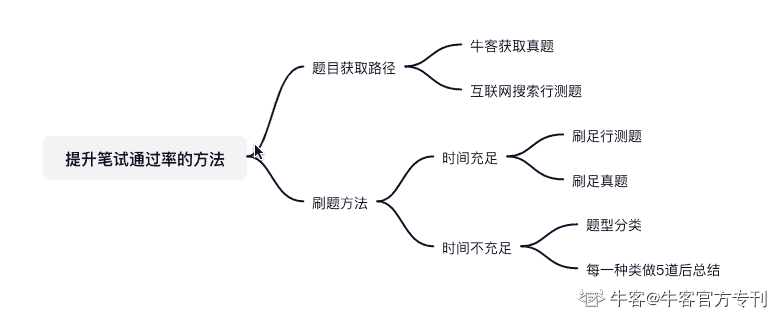
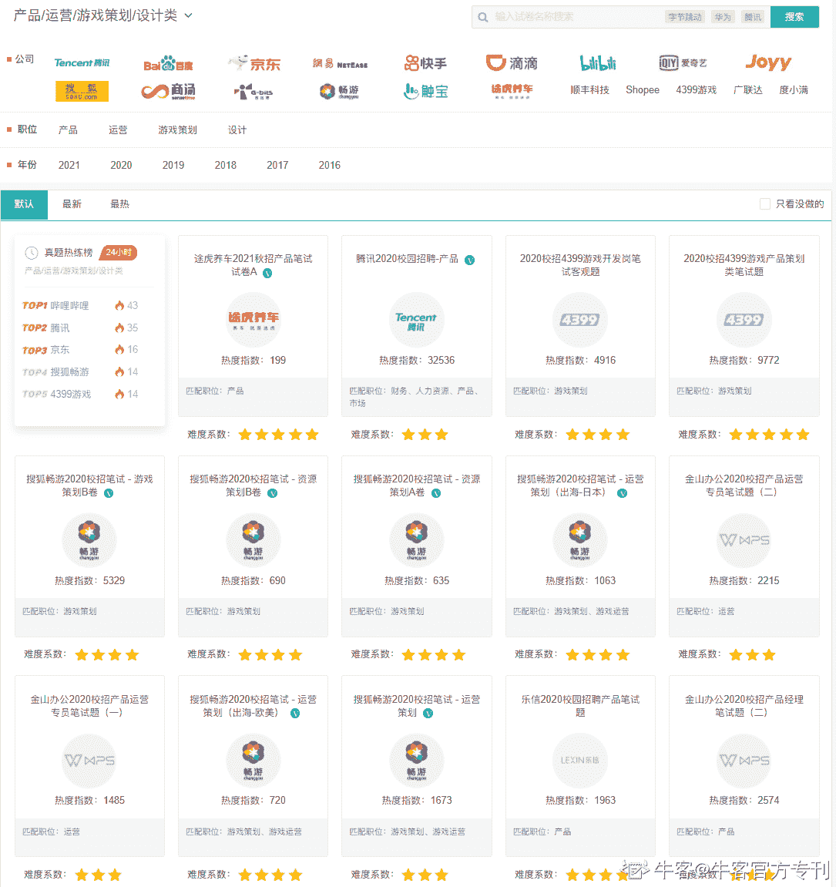

# 第四章 第 2 节 笔试通关攻略

> 原文：[`www.nowcoder.com/tutorial/10055/9c0d5ab42ff24677975dc45dfad17a69`](https://www.nowcoder.com/tutorial/10055/9c0d5ab42ff24677975dc45dfad17a69)

# （一）笔试

## 1.如何提升笔试通过率？

### 行测题：

行测题是笔试中最常见的题型，在这方面的提升主要靠刷题，并没有很好的速成方法。但我猜测看这篇专刊的同学中，很多都是在时间比较紧张、没有太多秋招准备时间的情况下进入的。在时间紧张的情况下，更建议通过题型分类后、分类做题总结的方式进行快速学习。在笔试这块，总结下来一共有以下几个提升的方法。

### **获取笔试题路径：**

1.  在牛客网找到对应公司的真题

1.  善用互联网搜索找行测题刷题

1.  通过部分求职公众号，寻找【已根据题型分类】的笔试真题

### **笔试题刷题方法：**

1.  时间充足：刷足公务员行测题、各公司笔试真题。

1.  时间不充足：对题型进行分类，每类题刷 5 道后总结。

牛客网也为大家总结了行测题笔试题型以及公司真题，大家可以去[牛客网](https://www.nowcoder.com/intelligentTest?categories=3)刷题。

### 主观题：

主观题其实并不能很好地深度考察应聘者的专业能力，通过简单的几道题，简单的几百字展示，很难完整地呈现应聘者的专业能力，所以专业能力的差异在笔试中并不能帮助我们脱颖而出。主观题中如何快速脱颖而出？答案是，需要我们在笔试中展示出，当遇到一个业务问题的时候，我们能有逻辑性拆解问题、创造性地回答问题、有节奏地推进业务。

### **具体方法论如下：**

*   拆解问题本身——拆分问题的背景/场景

*   提供解决思路——拆分场景，针对场景内的核心痛点提供解决方案

*   整理观点输出——按照总-分的结构输出观点

下面我将用一个简短的举例来说明如何使用上述方法论解答笔试题。

> 「笔试题：如果一个盲人问你，如何认识红色，你会怎么办？」

**答案思路：**

*   拆解问题本身：当一个盲人提出认识红色的需求，首先我们要还原场景，思考盲人为什么要认识红色，有以下几种情况：1-盲人需要认识红绿灯，红色代表着危险，有识别红色的灯的需求。2-盲人对红色有单纯的好奇
*   提供解决思路：根据之前拆解的几种情况，提供不同场景下的解决方案，如 1-制作有声红绿灯。2-通过联想的方式描述红色，如红色是阳光照在身上那种暖洋洋的感觉
*   输出观点：当盲人提出认识红色的需求，需要根据场景还原用户的核心诉求。通过简单的用户需求拆分，我推算盲人可能有以下需求
*   1-盲人需要认识红绿灯，红色代表着危险，有识别红色的灯的需求。
*   2-盲人对红色有单纯的好奇
*   根据不同场景下的需求，提供分场景解决方案
*   1-制作有声红绿灯。
*   2-通过联想的方式描述红色，如红色是阳光照在身上那种暖洋洋的感觉

## 2.万一笔试挂掉怎么办

如果笔试不幸挂掉，也可以通过“霸面”的方式，尝试跨过笔试拿到面试机会。霸面即为，在简历筛选或笔试挂掉的同学，可以通过牛客讨论区、微信社群收集各大公司群面和单面的时间地点信息。到面试时间，带着简历直接找到面试官沟通一同参与面试。据我所知，部分公司是会为了霸面设置专门的通道的，会去霸面也是展示个人对公司强意愿的一种渠道，互联网也更倾向招聘具有主动性的人才，如果你恰好是沧海遗珠，公司也会很欢迎你能加入。